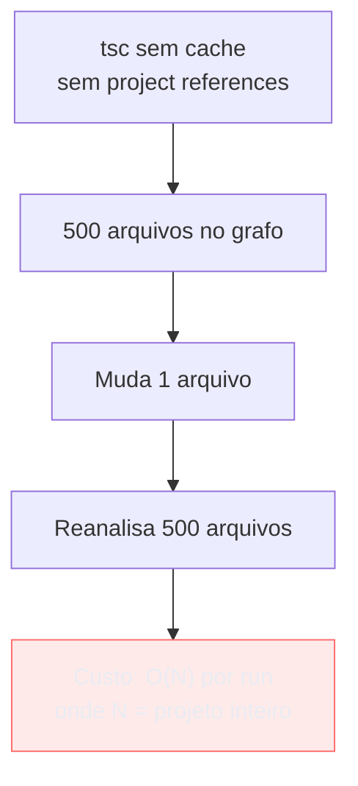
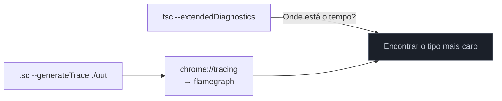
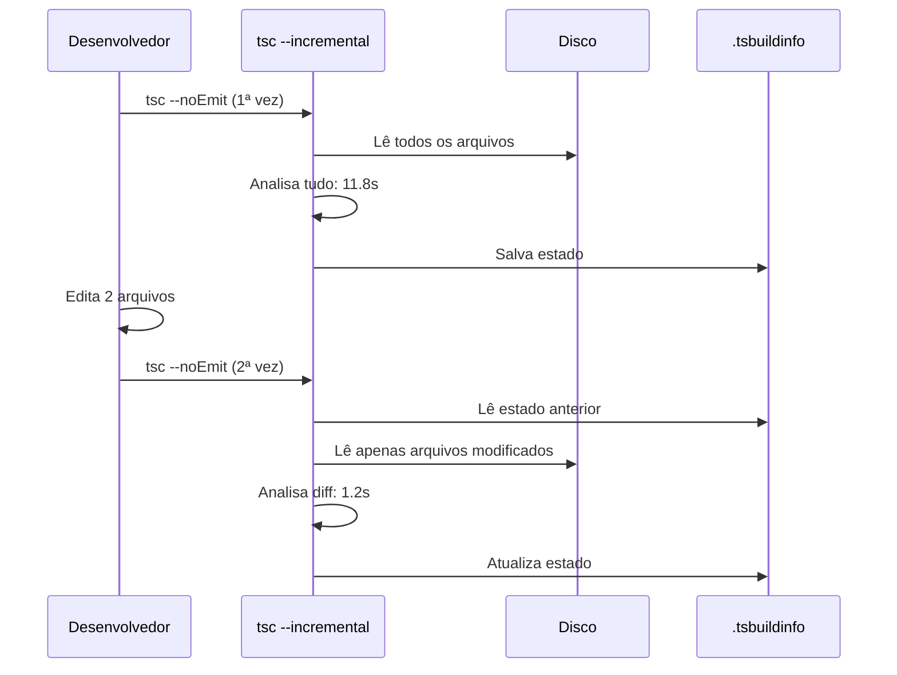
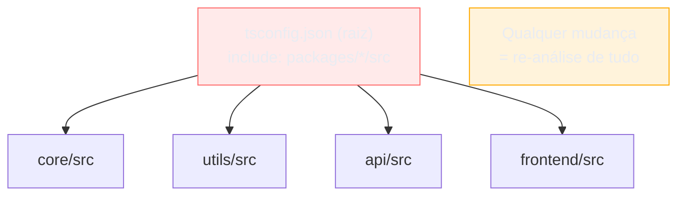
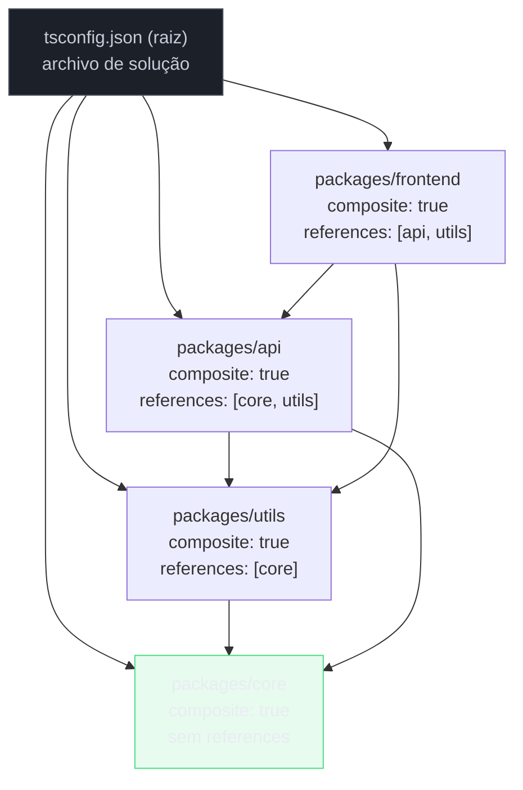
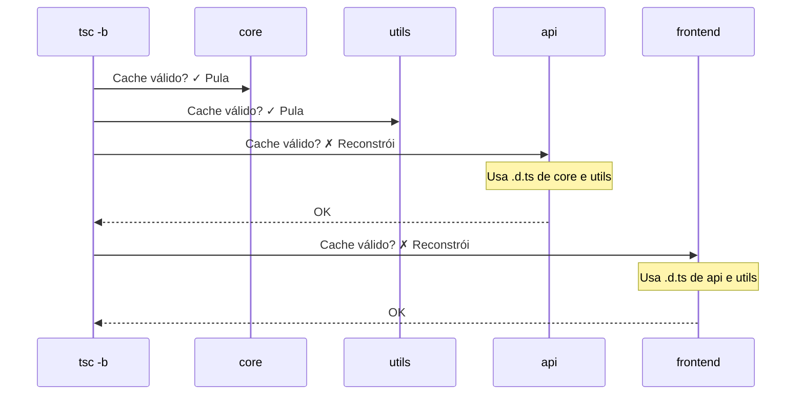
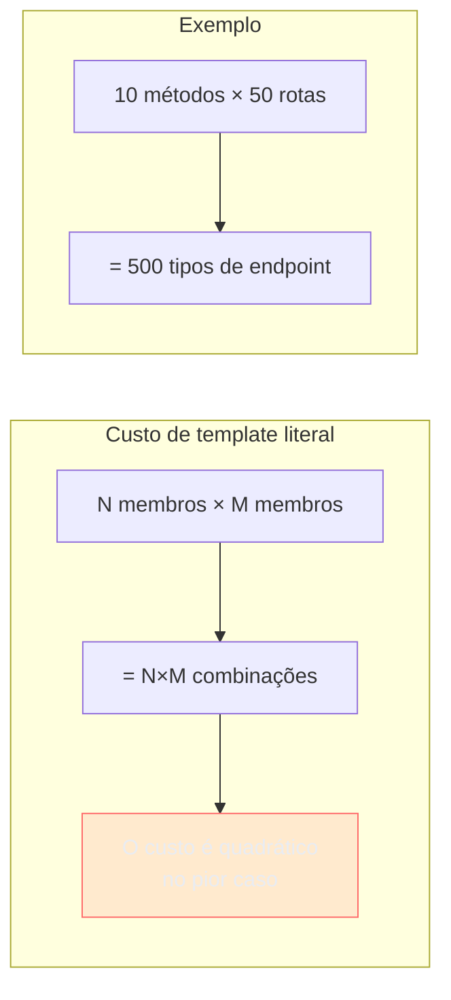
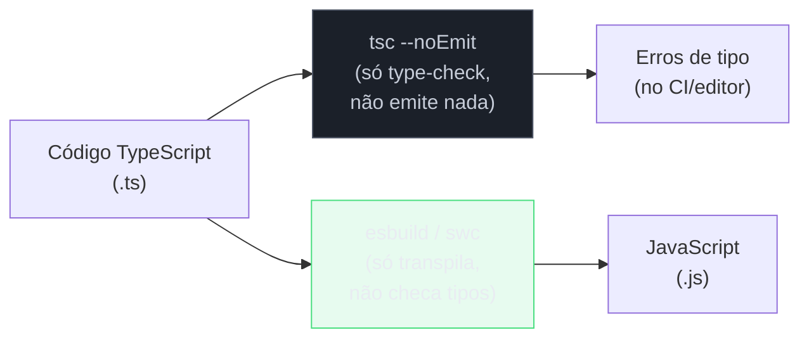

# TypeScript em escala: performance do compilador e project references

> [!abstract] TL;DR
> Em projetos pequenos, `tsc` é instantâneo. Em monorepos grandes, a checagem de tipos pode levar minutos — e a causa quase sempre é uma combinação de dois problemas: **o compilador precisa recalcular tudo do zero a cada rodada**, e **tipos complexos (condicionais recursivos, mapped types profundos, template literal combinatoriais) explodem o custo da inferência**. A solução tem duas frentes: `incremental: true` + `.tsbuildinfo` para guardar estado entre execuções; e **project references** para dividir o monorepo em unidades de compilação independentes com build topológico (`tsc -b`). Separar type-check de transpile — deixar o `tsc` apenas checar, e o `esbuild`/`swc` apenas transpilar — é o padrão que salva a DX em repos grandes.

---

## Por que o type-check fica lento?

Existe uma expectativa razoável de que adicionar tipos ao JavaScript deveria custar pouco: o TypeScript é um superconjunto, os tipos somem em runtime, então o "trabalho extra" seria só verificar. Na prática, projetos com dezenas de milhares de linhas de TypeScript podem ter checagens que levam 30 segundos, 1 minuto, às vezes mais.

Para entender por que, é útil ter uma imagem do que o compilador faz. Quando você roda `tsc`, ele não transpila seu código — ele age como um analisador estático que constrói um grafo de todos os arquivos `.ts`, resolve imports, infere tipos onde nenhuma anotação existe, e verifica se cada atribuição, chamada de função e acesso a propriedade é consistente com as regras do sistema de tipos. Esse grafo pode ter centenas de arquivos, e cada arquivo declara tipos que dependem de outros.

O custo cresce por três razões distintas:

**1. Ausência de cache entre execuções.** Por padrão, o `tsc` compila do zero toda vez. Você muda uma linha num arquivo, e ele relê o grafo inteiro, reinfere tipos, recalcula tudo. Em um projeto com 500 arquivos, mudar `foo.ts` não deveria forçar a re-análise de `bar.ts` se `bar.ts` não importa nada de `foo.ts` — mas sem mecanismo de cache, o compilador não sabe o que é seguro pular.

**2. Custo combinatorial de tipos complexos.** Conditional types, mapped types e template literal types são poderosos justamente porque operam em cima de outros tipos — mas essa composição tem custo quadrático ou exponencial no caso ruim. Uma union com 20 membros distribuída sobre um conditional type produz 20 avaliações paralelas; se cada ramo produz outra union, o espaço de tipos explode. As notas [[13 - Conditional types]] e [[17 - Template literal types]] mostram como esses tipos funcionam — aqui o ponto é que a flexibilidade vem com custo de compilação que é invisível em exemplos pequenos.

**3. Acoplamento total no monorepo.** Se todos os pacotes do monorepo estão numa pasta `src/` e o `tsconfig.json` na raiz cobre tudo, o TypeScript trata o projeto inteiro como uma unidade. Mudar o pacote `@company/logger` força a re-análise do pacote `@company/api` mesmo que `api` só re-exporte um tipo de `logger` que não mudou.



O custo real é que a experiência de desenvolvimento se degrada: o language server que alimenta o seu editor fica lento, o CI leva minutos em cada PR, e o watch mode vira uma tortura de espera.

---

## Medindo antes de otimizar: `--extendedDiagnostics` e `--generateTrace`

Antes de mudar configuração, você precisa saber onde está o tempo. O TypeScript oferece duas ferramentas de diagnóstico.

### `--extendedDiagnostics`

Passa a flag direto para o `tsc` e ele imprime estatísticas do que fez:

```bash
tsc --noEmit --extendedDiagnostics
```

A saída mostra algo como:

```
Files:            312
Lines of Library: 42,847
Lines of Definitions: 18,312
Lines of TypeScript: 95,441
Lines of JavaScript: 0
Lines of JSON: 0
Lines of Other: 0
I/O Read time:    0.24s
Parse time:       1.87s
ResolveModule time: 0.31s
ResolveTypeReference time: 0.12s
Program emit time: 0.00s
Bind time:        0.84s
Check time:       8.43s
printTime:        0.00s
Emit time:        0.00s
Total time:       11.81s
```

Os campos críticos são **Check time** (o type-checker em si) e **Parse time** (leitura e parsing dos arquivos). Se `Check time` domina, o problema é complexidade de tipos ou volume de código a checar. Se `Parse time` domina, o problema é IO ou número de arquivos sendo lidos desnecessariamente — geralmente porque `include` está muito amplo ou `node_modules` está sendo varrido.

### `--generateTrace`

Para diagnóstico mais profundo, gera um perfil que pode ser aberto no Chrome DevTools (ou no Perfview no Windows):

```bash
tsc --noEmit --generateTrace ./trace-output
```

Isso cria dois arquivos em `./trace-output/`:
- `trace.json` — o perfil de tempo detalhado (cada operação de type-check com timestamp e duração)
- `types.json` — o inventário de todos os tipos criados durante a compilação

Abra `trace.json` no Chrome em `chrome://tracing`. Você verá uma timeline de flamegraph onde é possível identificar qual tipo está custando mais: geralmente é um tipo recursivo, um mapped type sobre uma union grande, ou um `infer` dentro de um conditional type profundo.



> [!tip] `npx tsc-output-parser`
> O pacote `tsc-output-parser` (ou `@typescript/vscode-twoslash-queries`) pode estruturar a saída de `--extendedDiagnostics` em JSON, útil para rastrear regressões de performance entre commits no CI.

---

## `incremental: true` e o arquivo `.tsbuildinfo`

A primeira otimização que custa zero em flexibilidade: persistir o estado da compilação anterior.

Com `incremental: true` no `tsconfig.json`, o TypeScript salva um arquivo `.tsbuildinfo` depois de cada execução. Na próxima vez que você rodar `tsc`, ele lê esse arquivo, compara com o estado atual do disco (quais arquivos mudaram, quais hashes de tipo mudaram), e só reanalisa o que é necessário.

```jsonc
// tsconfig.json
{
  "compilerOptions": {
    "incremental": true,
    "tsBuildInfoFile": "./.tsbuildinfo", // opcional — padrão é junto ao outDir
    "outDir": "./dist",
    "strict": true
  }
}
```

O efeito prático é dramático em projetos médios. Uma checagem de 12 segundos pode cair para 1-2 segundos se apenas alguns arquivos mudaram. O `.tsbuildinfo` armazena:

- O grafo de dependências entre arquivos
- Os hashes dos arquivos de entrada
- O estado dos tipos inferidos de cada arquivo



> [!warning] `.tsbuildinfo` no `.gitignore`
> O arquivo `.tsbuildinfo` é um artefato de cache local — cada máquina e cada CI runner devem construir o próprio. Adicione ao `.gitignore`. Se você commitar o `.tsbuildinfo` e ele ficar desincronizado com os arquivos, o TypeScript pode pular verificações que deveria fazer.
> ```gitignore
> *.tsbuildinfo
> ```

O `incremental` funciona bem para projetos de um único pacote. Para monorepos com múltiplos pacotes interdependentes, o próximo passo são as project references.

---

## O problema do monorepo sem project references

Imagine um monorepo com esta estrutura:

```
packages/
  core/         ← tipos base, sem dependências internas
  utils/        ← importa de core
  api/          ← importa de core e utils
  frontend/     ← importa de api e utils
```

Sem project references, a configuração comum é um `tsconfig.json` na raiz que inclui tudo:

```jsonc
// tsconfig.json (raiz) — PADRÃO NÃO-ESCALÁVEL
{
  "compilerOptions": {
    "strict": true,
    "outDir": "./dist"
  },
  "include": [
    "packages/*/src/**/*.ts"
  ]
}
```

Esse setup tem problemas sérios:

1. **Sem isolamento.** O TypeScript vê todos os 4 pacotes como um único programa. Mudar qualquer coisa em qualquer pacote invalida a análise de tudo.

2. **Sem build topológico.** O compilador não sabe que `frontend` depende de `api`. Ele não pode paralelizar a compilação respeitando a ordem de dependências.

3. **Sem cache por pacote.** Mesmo com `incremental: true`, o `.tsbuildinfo` único representa o projeto inteiro — se um pacote muda, todo o cache potencialmente invalida.

4. **Language server lento.** O VS Code usa o TypeScript language service para completions e diagnósticos em tempo real. Com um projeto monolítico gigante, cada keystroke dispara análise sobre o grafo inteiro.



---

## Project references: dividir para conquistar

Project references, introduzidas no TypeScript 3.0, são a solução oficial para esse problema. A ideia é simples: cada pacote vira um **projeto TypeScript independente**, com seu próprio `tsconfig.json`. Os projetos declaram quais outros projetos eles dependem. O TypeScript constrói na ordem certa e cache o resultado de cada projeto separadamente.

### Configurando um projeto com `composite: true`

O projeto "leaf" (sem dependências internas) precisa de `composite: true`:

```jsonc
// packages/core/tsconfig.json
{
  "compilerOptions": {
    "strict": true,
    "declaration": true,        // obrigatório em composite
    "declarationMap": true,     // opcional mas recomendado: mapeia .d.ts → .ts
    "outDir": "./dist",
    "rootDir": "./src",
    "composite": true           // habilita project references
  },
  "include": ["src/**/*.ts"]
}
```

`composite: true` impõe três requisitos:
- `rootDir` deve ser especificado (ou inferível de forma não-ambígua)
- `declaration: true` é ativado automaticamente (outros projetos precisam das `.d.ts`)
- O `tsconfig.json` deve cobrir todos os arquivos de entrada do projeto

### Referenciando outros projetos

Um projeto que depende de `core` declara a referência:

```jsonc
// packages/utils/tsconfig.json
{
  "compilerOptions": {
    "strict": true,
    "declaration": true,
    "declarationMap": true,
    "outDir": "./dist",
    "rootDir": "./src",
    "composite": true
  },
  "references": [
    { "path": "../core" }  // aponta para a pasta que contém o tsconfig.json de core
  ],
  "include": ["src/**/*.ts"]
}
```

```jsonc
// packages/api/tsconfig.json
{
  "compilerOptions": {
    "strict": true,
    "declaration": true,
    "declarationMap": true,
    "outDir": "./dist",
    "rootDir": "./src",
    "composite": true
  },
  "references": [
    { "path": "../core" },
    { "path": "../utils" }
  ],
  "include": ["src/**/*.ts"]
}
```

### O `tsconfig.json` raiz como orquestrador

Na raiz do monorepo, um `tsconfig.json` de solução lista todos os projetos. Ele geralmente não tem `include` próprio — sua função é ser o ponto de entrada para `tsc -b`:

```jsonc
// tsconfig.json (raiz) — arquivo de solução
{
  "files": [],              // não inclui arquivos diretamente
  "references": [
    { "path": "./packages/core" },
    { "path": "./packages/utils" },
    { "path": "./packages/api" },
    { "path": "./packages/frontend" }
  ]
}
```



### Rodando com `tsc -b`

A flag `-b` (build mode) ativa a orquestração topológica:

```bash
# Constrói na ordem certa, usa cache por projeto
tsc -b

# Só verifica tipos (não emite)
tsc -b --noEmit

# Limpa os artefatos gerados
tsc -b --clean

# Modo watch: reconstrução incremental automática
tsc -b --watch

# Ver o que seria construído sem construir
tsc -b --dry
```

O `tsc -b` resolve o grafo de dependências, constrói cada projeto na ordem certa, e para cada projeto verifica se o cache (`.tsbuildinfo`) ainda é válido. Se `core` não mudou desde a última build, `tsc -b` pula `core` completamente e vai direto para os projetos que mudaram.



O ganho é assimétrico: quanto maior o projeto e quanto mais localizadas as mudanças, maior o speedup. Em projetos reais, build mode reduz tempos de 60+ segundos para 3-5 segundos em runs incrementais.

---

## O custo de tipos complexos: a combinatória que explode

As notas [[13 - Conditional types]] e [[17 - Template literal types]] mostram como escrever tipos poderosos. Aqui o ângulo é diferente: entender por que esses tipos custam mais e como manter o custo sob controle.

### Conditional types recursivos

Um conditional type que se chama recursivamente para "desembrulhar" um tipo aninhado parece inócuo em exemplos pequenos, mas o TypeScript tem um limite de recursão de tipos (atualmente 100 níveis) e o custo cresce com a profundidade:

```ts
// Achata um tipo aninhado arbitrariamente — parece útil, mas pode ser caro
type DeepReadonly<T> =
    T extends (infer U)[]
        ? DeepReadonlyArray<U>
        : T extends object
            ? DeepReadonlyObject<T>
            : T;

type DeepReadonlyArray<T> = ReadonlyArray<DeepReadonly<T>>;

type DeepReadonlyObject<T> = {
    readonly [K in keyof T]: DeepReadonly<T[K]>
};

// Para tipos rasos: custo insignificante
type A = DeepReadonly<{ x: number }>;  // rápido

// Para tipos profundos: custo cresce com a profundidade
type B = DeepReadonly<{
    a: { b: { c: { d: { e: string[] } } } }
}>;  // mais lento — 5 níveis de recursão
```

O problema não é que `DeepReadonly` seja mal escrito — é que recursão em tipos tem custo real. O TypeScript precisa expandir cada nível para verificar o tipo inteiro.

### Template literal types e unions grandes

Template literal types são especialmente caros quando aplicados a unions grandes, porque geram o produto cartesiano de todos os membros:

```ts
// 3 membros × 3 membros = 9 combinações → aceitável
type Method = "GET" | "POST" | "PUT";
type Route = "/users" | "/posts" | "/auth";
type Endpoint = `${Method} ${Route}`;
// Resultado: "GET /users" | "GET /posts" | "GET /auth" | "POST /users" | ...

// 20 membros × 20 membros = 400 combinações → começa a pesar
// 50 membros × 50 membros = 2500 combinações → problemático
// 100+ membros em cada lado → o compilador sofre
type BigUnion = "a" | "b" | /* ... 98 membros */ | "z2";
type BigEndpoints = `prefix-${BigUnion}-suffix`; // 100 tipos sendo gerados
```

O TypeScript impõe um limite de 100.000 tipos em unions geradas por template literal (erro `"Type instantiation is excessively deep and possibly infinite"`). Mas mesmo bem abaixo desse limite, o custo de compilação cresce de forma combinatorial.



### Mapped types sobre interfaces grandes

Mapped types que iteram sobre todos os keys de um objeto grande têm custo proporcional ao número de keys. O custo individual é baixo, mas multiplicado por vários mapped types compostos sobre o mesmo tipo:

```ts
// Barato isoladamente
type Partial<T> = { [K in keyof T]?: T[K] };

// Composição começa a custar mais
type DeepPartialReadonly<T> = {
    readonly [K in keyof T]?: T[K] extends object ? DeepPartialReadonly<T[K]> : T[K]
};

// Aplicado a uma interface com 100+ campos: o TypeScript precisa avaliar
// cada key, em cada nível de profundidade, para cada mapped type composto
```

### Padrões para manter tipos baratos

```ts
// ❌ Conditional recursivo sobre tipo desconhecido — pode explodir
type Flatten<T> = T extends Array<infer U> ? Flatten<U> : T;

// ✓ Limitar recursão explicitamente
type Flatten<T, Depth extends number[] = []> =
    Depth["length"] extends 5
        ? T
        : T extends Array<infer U>
            ? Flatten<U, [...Depth, 0]>
            : T;

// ❌ Union enorme gerada por template literal
type AllCombinations = `${HundredMembers}-${OtherHundred}`;  // 10.000 tipos

// ✓ Preferir strings mais simples ou validar em runtime com Zod
type Route = string;  // às vezes o pragmatismo vence o purismo de tipos

// ❌ Tipo utilitário aplicado repetidamente a tipos grandes
type A = DeepReadonly<GigantInterface>;
type B = DeepPartial<GigantInterface>;
type C = DeepRequired<GigantInterface>;

// ✓ Criar o tipo derivado uma vez e reutilizar
type GigantDerived = {
    readonly [K in keyof GigantInterface]+?: GigantInterface[K]
};
```

> [!info] O erro que guia a otimização
> `Type instantiation is excessively deep and possibly infinite` é o TypeScript dizendo que chegou ao limite de recursão de tipos (100 por default) ou que a instanciação está custando demais. Quando você vê esse erro, é sinal de que o tipo precisa ser simplificado ou a recursão precisa de um caso base mais agressivo.

---

## `skipLibCheck`: ignorar `.d.ts` de terceiros

Uma das otimizações com maior bang-for-buck:

```jsonc
{
  "compilerOptions": {
    "skipLibCheck": true
  }
}
```

Por padrão, o TypeScript verifica os tipos de todos os arquivos `.d.ts` no projeto — incluindo os de `node_modules`. Isso significa que incompatibilidades entre versões de `@types/node` e `@types/react`, por exemplo, produzem erros nos arquivos de definição de terceiros.

Com `skipLibCheck: true`, o TypeScript confia nos `.d.ts` de terceiros e só verifica os seus próprios arquivos de `.d.ts` gerados. O efeito em tempo de compilação pode ser substancial em projetos com muitas dependências. O trade-off é que erros reais em `.d.ts` de terceiros serão silenciados — mas na prática, você não vai corrigir tipos da `node_modules` de qualquer forma.

> [!info] `skipLibCheck` e o Language Server
> No contexto de DX, `skipLibCheck: true` também acelera o language server do editor, porque ele para de checar as definições de tipo de cada biblioteca importada quando você passa o mouse sobre um símbolo.

---

## `isolatedModules`: separar type-check de transpile

Esta flag muda a semântica do que é permitido escrever — e entender por quê é chave para arquiteturas de build modernas.

```jsonc
{
  "compilerOptions": {
    "isolatedModules": true
  }
}
```

Com `isolatedModules: true`, o TypeScript impõe que cada arquivo possa ser transpilado de forma segura **sem acesso ao grafo de tipos completo**. Isso habilita transpiladores como `esbuild` e `swc` (que processam arquivo por arquivo, sem construir o grafo de tipos) a emitir JavaScript correto sem erros silenciosos.

O problema que `isolatedModules` previne:

```ts
// ❌ Sem isolatedModules: isso compila mas gera problema com esbuild/swc
// O esbuild não sabe se "Status" é um tipo ou um valor. Em JS puro, um import
// que referencia apenas tipos precisa ser eliminado — mas se o esbuild não
// sabe que é tipo, pode gerar um import de algo que não existe em runtime.
import { Status } from "./types";

export { Status };  // Re-export — é um valor ou um tipo?
```

```ts
// ✓ Com isolatedModules: forçado a ser explícito
import type { Status } from "./types";  // deixa claro que é tipo
export type { Status };                 // re-export de tipo explícito
```

```ts
// ❌ const enum não funciona com isolatedModules
// (const enum é inlined pelo compilador TS, mas esbuild não sabe os valores)
const enum Direction { Up, Down, Left, Right }

// ✓ Alternativa: enum normal ou objeto as const
const Direction = { Up: 0, Down: 1, Left: 2, Right: 3 } as const;
type Direction = typeof Direction[keyof typeof Direction];
```

A nota [[21 - Modules - ESM, CJS e type-only imports]] aprofunda `import type` e `verbatimModuleSyntax`. Aqui o ponto é a arquitetura: com `isolatedModules: true`, você pode separar completamente as responsabilidades:



**`tsc` faz type-check.** Emite zero JavaScript. É o guardião da correção de tipos. **`esbuild`/`swc` transpila.** Faz zero type-checking. É o guardião da velocidade.

O speedup de transpilação é de 10x-100x: `esbuild` transpila um projeto de 500 arquivos em millisegundos, enquanto `tsc --emit` pode levar segundos ou dezenas de segundos. Em desenvolvimento local, você não precisa checar tipos a cada save — você roda `tsc --noEmit` no CI e no pre-commit. O `esbuild` serve o dev server em tempo real.

---

## Exemplo completo: estrutura de monorepo com project references

Aqui está um monorepo realista com 4 pacotes e a configuração completa de project references:

```
monorepo/
├── tsconfig.json              ← arquivo de solução (raiz)
├── tsconfig.base.json         ← opções compartilhadas
├── packages/
│   ├── core/
│   │   ├── src/
│   │   │   ├── index.ts
│   │   │   └── types.ts
│   │   ├── dist/              ← gerado: .js + .d.ts + .d.ts.map
│   │   └── tsconfig.json
│   ├── utils/
│   │   ├── src/
│   │   │   └── index.ts
│   │   ├── dist/
│   │   └── tsconfig.json
│   ├── api/
│   │   ├── src/
│   │   │   └── index.ts
│   │   ├── dist/
│   │   └── tsconfig.json
│   └── frontend/
│       ├── src/
│       │   └── index.ts
│       ├── dist/
│       └── tsconfig.json
└── package.json
```

```jsonc
// tsconfig.base.json — opções comuns para todos os pacotes
{
  "compilerOptions": {
    "strict": true,
    "target": "ES2022",
    "module": "NodeNext",
    "moduleResolution": "NodeNext",
    "declaration": true,
    "declarationMap": true,
    "sourceMap": true,
    "skipLibCheck": true,
    "isolatedModules": true,
    "incremental": true
  }
}
```

```jsonc
// tsconfig.json (raiz) — arquivo de solução, não inclui arquivos
{
  "files": [],
  "references": [
    { "path": "./packages/core" },
    { "path": "./packages/utils" },
    { "path": "./packages/api" },
    { "path": "./packages/frontend" }
  ]
}
```

```jsonc
// packages/core/tsconfig.json
{
  "extends": "../../tsconfig.base.json",
  "compilerOptions": {
    "composite": true,
    "outDir": "./dist",
    "rootDir": "./src",
    "tsBuildInfoFile": "./dist/.tsbuildinfo"
  },
  "include": ["src/**/*.ts"]
  // Sem "references": core não depende de nenhum pacote interno
}
```

```jsonc
// packages/utils/tsconfig.json
{
  "extends": "../../tsconfig.base.json",
  "compilerOptions": {
    "composite": true,
    "outDir": "./dist",
    "rootDir": "./src",
    "tsBuildInfoFile": "./dist/.tsbuildinfo"
  },
  "references": [
    { "path": "../core" }
  ],
  "include": ["src/**/*.ts"]
}
```

```jsonc
// packages/api/tsconfig.json
{
  "extends": "../../tsconfig.base.json",
  "compilerOptions": {
    "composite": true,
    "outDir": "./dist",
    "rootDir": "./src",
    "tsBuildInfoFile": "./dist/.tsbuildinfo"
  },
  "references": [
    { "path": "../core" },
    { "path": "../utils" }
  ],
  "include": ["src/**/*.ts"]
}
```

```jsonc
// packages/frontend/tsconfig.json
{
  "extends": "../../tsconfig.base.json",
  "compilerOptions": {
    "composite": true,
    "outDir": "./dist",
    "rootDir": "./src",
    "tsBuildInfoFile": "./dist/.tsbuildinfo"
  },
  "references": [
    { "path": "../api" },
    { "path": "../utils" }
  ],
  "include": ["src/**/*.ts"]
}
```

```jsonc
// package.json (raiz) — scripts usando tsc -b
{
  "scripts": {
    "typecheck": "tsc -b --noEmit",
    "build": "tsc -b",
    "build:clean": "tsc -b --clean && tsc -b",
    "watch": "tsc -b --watch"
  }
}
```

No `package.json` de cada pacote, o campo `main` aponta para `./dist/index.js` e `types` para `./dist/index.d.ts`. Quando `api` importa de `utils`, ele usa as `.d.ts` compiladas em `utils/dist/` — não recomplica o TypeScript de `utils`. Isso é o isolamento.

> [!warning] `paths` vs. project references
> Um padrão comum em monorepos é usar `paths` no `tsconfig.json` para mapear `@company/core` → `./packages/core/src`. Isso funciona para o language server, mas **não substitui project references** para build correto. Com `paths` apenas, o `tsc -b` não sabe sobre as dependências e não pode otimizar o build. Com project references, os `paths` continuam úteis para resolução de módulos — os dois são complementares.

---

## O papel do `paths` e `baseUrl` no ecosystem

Uma confusão frequente: `paths` no `tsconfig.json` serve para resolução de imports no editor e no type-checker — não é processado pelo Node.js nem pelo esbuild em runtime. Se você mapeia `@company/core` via `paths`, precisa de configuração equivalente no bundler:

```jsonc
// tsconfig.json — para o TypeScript resolver
{
  "compilerOptions": {
    "baseUrl": ".",
    "paths": {
      "@company/core": ["./packages/core/src/index.ts"],
      "@company/utils": ["./packages/utils/src/index.ts"]
    }
  }
}
```

```js
// esbuild.config.js — para o bundler resolver em build
import { build } from "esbuild";

build({
  entryPoints: ["packages/frontend/src/index.ts"],
  bundle: true,
  outdir: "packages/frontend/dist",
  plugins: [
    // plugin de alias para mapear @company/* → caminho físico
  ],
});
```

Em projetos com project references e `composite: true`, o padrão mais limpo é importar o pacote pela path de `dist/` (ou usar workspaces do npm/pnpm que fazem isso automaticamente via symlinks), em vez de usar `paths`. Assim o TypeScript usa as `.d.ts` compiladas — que é o que acontece em produção também.

---

## Como explicar em inglês

TypeScript's **compiler performance** becomes a real concern at scale. By default, `tsc` does a full analysis of every file on every run — there's no incremental cache and no isolation between packages. Adding `incremental: true` fixes the first problem: TypeScript writes a `.tsbuildinfo` file after each run and only re-analyses files that changed. This alone can cut check times by 5-10x in a typical mid-size project.

For monorepos, the solution is **project references**. Each package gets its own `tsconfig.json` with `composite: true`, which requires `declaration: true` (so other packages can read the compiled `.d.ts` files rather than re-compiling the source). A root solution `tsconfig.json` lists all packages and `tsc -b` (build mode) orchestrates the build in dependency order, skipping unchanged packages entirely.

The third axis is the **type-check vs. transpile split**: `tsc --noEmit` only checks types and emits nothing; `esbuild` or `swc` only transpile and check nothing. This works because `isolatedModules: true` ensures each file can be safely transpiled without full type context. The result is near-instant builds locally (esbuild transpiles in milliseconds) while type correctness is enforced by a separate `tsc --noEmit` step in CI.

Complex types — recursive conditionals, template literal unions, deeply composed mapped types — add real compilation cost because they require exponential or recursive type instantiation. The diagnostic tools are `--extendedDiagnostics` (where is the time going?) and `--generateTrace` (which specific type is expensive?).

### Vocabulário-chave

| Português | Inglês |
|---|---|
| referência de projeto | project reference |
| modo de build | build mode (`tsc -b`) |
| arquivo de informação de build | build info file (`.tsbuildinfo`) |
| compilação incremental | incremental compilation |
| grafo de dependências de tipos | type dependency graph |
| projeto composto | composite project |
| separar type-check de transpile | decouple type checking from transpilation |
| verificação de tipos sem emissão | type-only check / `--noEmit` |
| módulos isolados | isolated modules |
| custo de instanciação de tipos | type instantiation cost |
| diagnóstico estendido | extended diagnostics |
| rastreamento de compilação | compiler trace |
| arquivo de solução | solution file |
| ordem topológica de build | topological build order |
| pular checagem de libs | skip lib check (`skipLibCheck`) |

---

## Armadilhas comuns

> [!warning] Armadilha 1: commitar o `.tsbuildinfo`
> O `.tsbuildinfo` é cache local. Se você commitar e outro dev (ou o CI) receber um estado desincronizado com seus arquivos, o TypeScript pode pular verificações que deveria fazer — produzindo falsos negativos. Adicione `*.tsbuildinfo` ao `.gitignore`. Cada ambiente deve gerar o próprio cache.

> [!warning] Armadilha 2: esquecer de construir dependências antes de checar o pacote dependente
> Com project references, se você está desenvolvendo `frontend` e fez mudanças em `api`, precisa construir `api` antes de checar `frontend`. Caso contrário, `frontend` usa as `.d.ts` antigas de `api` e pode não ver os erros novos. `tsc -b` resolve isso automaticamente — mas se você rodar `tsc --noEmit` diretamente dentro da pasta `frontend/`, ele não vai subir para construir `api` primeiro.
> ```bash
> # ❌ Pode usar .d.ts desatualizadas de api
> cd packages/frontend && tsc --noEmit
>
> # ✓ Constrói dependências na ordem certa antes de checar
> tsc -b --noEmit  # a partir da raiz
> ```

> [!warning] Armadilha 3: `const enum` com `isolatedModules`
> `const enum` não funciona com `isolatedModules: true` porque o TypeScript inlina os valores em compile time — e transpiladores de arquivo único (esbuild, swc) não têm acesso a essa informação ao processar um arquivo que usa o enum. O TypeScript vai emitir um erro. A solução é usar `enum` normal (com emissão de objeto JS) ou `as const object pattern`.
> ```ts
> // ❌ Quebra com isolatedModules
> const enum Status { Active, Inactive }
>
> // ✓ Funciona
> const Status = { Active: 0, Inactive: 1 } as const;
> type Status = typeof Status[keyof typeof Status];
> ```

> [!warning] Armadilha 4: `paths` sem configuração equivalente no bundler
> `paths` no `tsconfig.json` só existe para o TypeScript e o language server. Em runtime (Node.js) ou no bundler (esbuild, webpack), os aliases não são automaticamente resolvidos. Se você usa `import { foo } from "@company/core"` e só tem `paths` configurado, o build vai falhar em runtime com "Cannot find module". Você precisa configurar aliases equivalentes no bundler ou usar workspaces de package manager que criam symlinks reais.

> [!warning] Armadilha 5: `skipLibCheck: true` mascarando conflitos de versão reais
> `skipLibCheck` pula a verificação de `.d.ts` de `node_modules`. Isso resolve o erro imediato, mas às vezes o conflito entre versões de `@types` indica um problema real — duas dependências precisando de versões incompatíveis da mesma lib. `skipLibCheck` é pragmaticamente correto na maioria dos casos, mas não é um substituto para resolver o conflito de versões quando ele importa.

> [!warning] Armadilha 6: tipos condicionais recursivos sem caso base
> Um tipo recursivo sem limite de profundidade vai causar `Type instantiation is excessively deep and possibly infinite`. O TypeScript tem um limite de 100 níveis de recursão por default. Se você precisa de recursão em tipos, adicione um acumulador de profundidade explícito e um caso base.
> ```ts
> // ❌ Pode explodir em tipos profundamente aninhados
> type DeepReadonly<T> = T extends object
>     ? { readonly [K in keyof T]: DeepReadonly<T[K]> }
>     : T;
>
> // ✓ Com limite de profundidade explícito
> type DeepReadonly<T, D extends 0[] = []> =
>     D["length"] extends 10
>         ? T
>         : T extends object
>             ? { readonly [K in keyof T]: DeepReadonly<T[K], [...D, 0]> }
>             : T;
> ```

---

## Veja também

- [[13 - Conditional types]] — o custo de tipos condicionais distributivos e recursivos; base para entender por que tipos complexos pesam na compilação
- [[17 - Template literal types]] — produto cartesiano de unions em template literals; a combinatória que gera custo quadrático
- [[20 - tsconfig e strict mode a fundo]] — as flags que afetam o comportamento do type-checker; contexto para `incremental`, `skipLibCheck`, `isolatedModules`
- [[21 - Modules - ESM, CJS e type-only imports]] — `import type` e `verbatimModuleSyntax`; a fundação de `isolatedModules` que habilita a separação tsc/esbuild
- [[03-Dominios/Tecnologia/Tooling e Build/index|Tooling e Build]] — bundlers, transpiladores (esbuild, swc, Vite), configuração de build em monorepos; aqui tratamos o ângulo dos tipos, lá está o build completo
