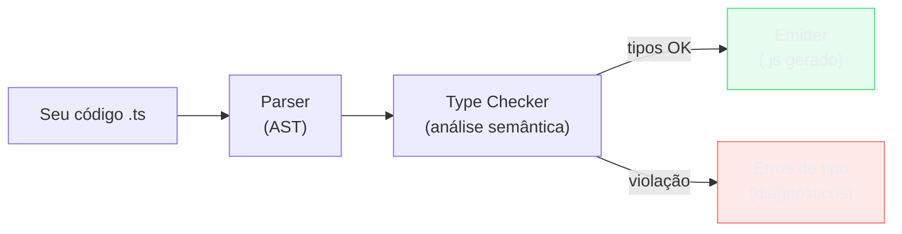
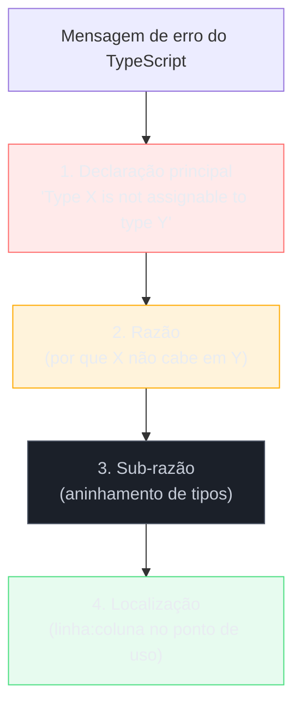
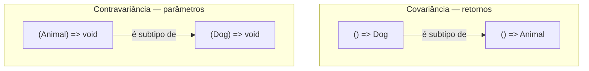
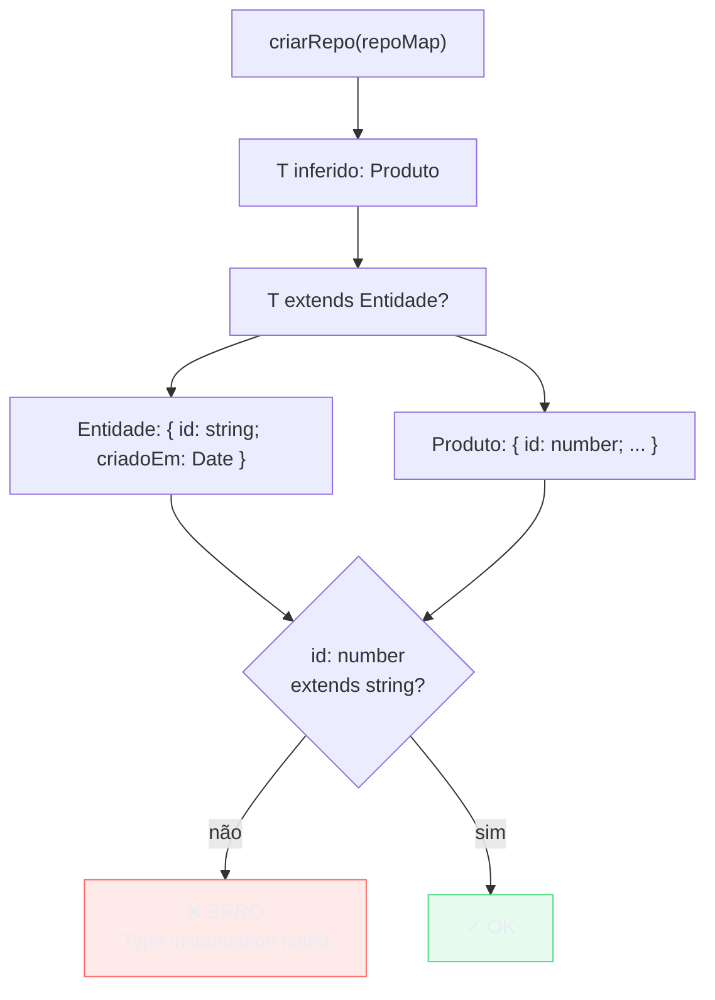

# Lendo o compilador: erros comuns e como decifrar mensagens

> [!abstract] TL;DR
> O compilador TypeScript não é um adversário — é um auditor que lê o contrato entre partes do seu sistema e te mostra onde o contrato foi quebrado. Mas as mensagens de erro têm sintaxe própria, e decifrá-las mal é a causa de horas perdidas. Este capítulo ensina a anatomia de uma mensagem de erro (onde está o "ponto de culpa" real num erro aninhado), os erros clássicos que todo sênior conhece de cor (`Type X is not assignable to type Y`, excess property, variância de callback, `this` perdido, widening inesperado, "Type instantiation is excessively deep"), e um toolkit de debugging de tipos que vai do simples `hover` até a técnica de bisseção com tipos intermediários. O objetivo não é memorizar mensagens — é entender o modelo mental para que, diante de qualquer erro, você saiba onde olhar.

---

## O compilador como leitor de contratos

Ao longo desta trilha você aprendeu que o TypeScript é um type-checker que some em runtime. Mas há outra metáfora útil: o compilador é um **leitor de contratos**. Cada anotação de tipo que você escreve — parâmetro, retorno, propriedade — é uma cláusula de contrato. Quando duas partes do código tentam se conectar e os contratos não batem, o compilador emite um erro.

Diferente de um interpretador que executa linha a linha, o TypeScript realiza análise estática: ele percorre a AST (Árvore Sintática Abstrata) do seu programa, infere tipos e verifica compatibilidades sem executar nada. A nota [[03-Dominios/Ciência/Compiladores e Linguagens/01 - O que é um compilador e o pipeline de tradução|O que é um compilador e o pipeline de tradução]] explica que a análise semântica — fase que checa tipos — acontece bem antes da geração de código. No TS, essa fase *é* o produto; não há geração de código de máquina com semântica tipada, só o processo de verificação.



A consequência prática: os erros do TypeScript são mensagens da fase de análise semântica, não de execução. Eles sempre descrevem uma *incompatibilidade entre o que o código promete e o que ele entrega*, vista do ponto de vista dos tipos.

---

## Anatomia de uma mensagem de erro

Antes de estudar erros específicos, é preciso saber como ler a estrutura de uma mensagem. Considere:

```ts
// ERRO real do compilador:
// Type '{ name: string; age: number; role: string; }' is not assignable to type 'User'.
//   Object literal may only specify known properties, and 'role' does not exist in type 'User'.
```

Toda mensagem de erro do TypeScript tem até três camadas:

1. **A declaração principal** — "Type X is not assignable to type Y". Essa é a *incompatibilidade raiz*: o que você tentou colocar (X) não cabe no que era esperado (Y).
2. **A razão** — indentada um nível, explica *por quê* a incompatibilidade existe. "Object literal may only specify known properties". Às vezes há múltiplos níveis de razão, cada um mais específico.
3. **A localização** — o número da linha e coluna onde o compilador detectou o problema. Importante: **a localização aponta para o ponto de uso, não necessariamente para a fonte do problema**.



### O ponto mais profundo — onde mora o erro real

Em erros de generics ou tipos aninhados, o texto da mensagem pode ter 5-8 linhas de indentação. A regra de ouro: **o erro real mora na sub-razão mais profunda**, a última linha indentada antes da localização. A declaração principal diz *o que* falhou; a sub-razão mais profunda diz *por que*.

```ts
function salvar<T extends { id: string }>(items: T[]): void { /* ... */ }

const pedidos = [
    { id: 1, produto: "teclado" },  // id é number, não string
];

salvar(pedidos);
// Argument of type '{ id: number; produto: string; }[]' is not assignable to
//   parameter of type '{ id: string; }[]'.
//   Type '{ id: number; produto: string; }' is not assignable to type '{ id: string; }'.
//     Types of property 'id' are incompatible.
//       Type 'number' is not assignable to type 'string'.
```

Lendo de baixo para cima: `number` não é `string` (sub-razão mais profunda) → em `id` → em `{ id: number; ... }` → no array. O erro raiz é `id: 1` (literal numérico), não o array.

---

## Os erros clássicos — e o que eles realmente significam

### 1. "Type X is not assignable to type Y"

É o erro mais frequente do TypeScript. Significa: você tentou atribuir ou passar um valor de tipo X onde o tipo Y era esperado, e X não é estruturalmente compatível com Y.

```ts
interface Produto {
    id: string;
    nome: string;
    preco: number;
}

function exibir(p: Produto): void {
    console.log(`${p.nome}: R$ ${p.preco}`);
}

const item = { id: 1, nome: "teclado", preco: 299 };
//            ^^^^^^ id é number

exibir(item);
// Argument of type '{ id: number; nome: string; preco: number; }'
//   is not assignable to parameter of type 'Produto'.
//   Types of property 'id' are incompatible.
//     Type 'number' is not assignable to type 'string'.
```

**O que perguntar ao ver esse erro:** "qual propriedade está diferente?" A sub-razão mais profunda sempre aponta para ela. Aqui: `id` é `number` mas `Produto` exige `string`.

### 2. Excess property checking — o check que só existe em literais

Quando você passa um objeto literal diretamente para uma função ou atribuição, o TypeScript ativa o **excess property check**: propriedades que não existem no tipo esperado são erro. Mas passando via variável, o check é desativado.

```ts
interface Config {
    host: string;
    port: number;
}

// Via literal — excess property check ativo
conectar({ host: "localhost", port: 5432, timeout: 3000 });
// Argument of type '{ host: string; port: number; timeout: number; }'
//   is not assignable to parameter of type 'Config'.
//   Object literal may only specify known properties,
//   and 'timeout' does not exist in type 'Config'.

// Via variável — sem o check
const opts = { host: "localhost", port: 5432, timeout: 3000 };
conectar(opts);  // OK — structural typing relaxado
```

Este comportamento vem de uma decisão de design do TypeScript (nota [[01 - O que é TypeScript - gradual, estrutural, apagado]] explica structural typing): o check extra em literais existe porque passar um objeto literal com propriedades desconhecidas é quase sempre um typo ou erro de API — enquanto passar uma variável pode ser acesso a um supertipo intencional.

A armadilha: você às vezes quer silenciar o excess property check (ex.: config parcial testável) e passa via variável. Funciona — mas você perdeu a proteção. A alternativa correta é usar `Partial<Config>` ou adicionar um index signature.

### 3. `undefined` em index access — o gato de Schrödinger

Sem `noUncheckedIndexedAccess`, acessar `array[i]` retorna `T`, não `T | undefined`. Com a flag ativada (o que você deve fazer), retorna `T | undefined`. Isso produz um erro clássico:

```ts
// tsconfig: "noUncheckedIndexedAccess": true

const nomes: string[] = ["Alice", "Bob"];

const primeiro = nomes[0];
//    ^^^^^^^
//    tipo: string | undefined (com noUncheckedIndexedAccess)

console.log(primeiro.toUpperCase());
// Error: Object is possibly 'undefined'.
```

O erro não é invenção do compilador. O array pode ter zero elementos — `nomes[0]` então é `undefined` em runtime. O fix correto é narrowing explícito:

```ts
const primeiro = nomes[0];
if (primeiro !== undefined) {
    console.log(primeiro.toUpperCase());  // OK
}

// Ou com nullish coalescing:
console.log((nomes[0] ?? "anônimo").toUpperCase());
```

A tentação é usar `!` (non-null assertion). Resista: `!` não adiciona nenhuma verificação em runtime — se o array estiver vazio, você tem `TypeError` em produção sem aviso.

### 4. Variância de callback — o erro contraintuitivo

Este é o erro que mais confunde devs que conhecem sistemas nominais como Java. A pergunta: se `Dog extends Animal`, posso passar `(d: Dog) => void` onde `(a: Animal) => void` é esperado?

Não. E o TypeScript vai reclamar com `strictFunctionTypes`.

```ts
class Animal { nome = ""; }
class Dog extends Animal { latir() { return "au"; } }

type Handler<T> = (t: T) => void;

const handleDog: Handler<Dog> = (d) => d.latir();

function processarAnimal(h: Handler<Animal>): void {
    h(new Animal());  // precisa aceitar qualquer Animal
}

processarAnimal(handleDog);
// Argument of type '(d: Dog) => void' is not assignable to
//   parameter of type '(t: Animal) => void'.
//   Types of parameters 'd' and 't' are incompatible.
//     Type 'Animal' is not assignable to type 'Dog'.
```

Por que? `processarAnimal` vai chamar `h` com um `Animal` genérico. Se você passar `handleDog`, ele vai tentar chamar `d.latir()` num `Animal` que não tem `latir`. O TypeScript protege exatamente esse cenário.

**Parâmetros de função são contravariantes**: `(Dog) => void` não é subtipo de `(Animal) => void`. O inverso vale: `(Animal) => void` *é* subtipo de `(Dog) => void` (aceita uma coisa mais geral, funciona onde o mais específico era esperado). Retornos são covariantes — segue a direção natural de herança.



### 5. `this` perdido — o contexto que some

Métodos de classe têm `this` implícito. Quando você extrai o método e o passa como callback, `this` se perde — e o TypeScript não avisa sem configuração extra.

```ts
class Contador {
    private total = 0;

    incrementar(): void {
        this.total++;                          // ← this aqui
    }

    valor(): number {
        return this.total;
    }
}

const c = new Contador();
const inc = c.incrementar;   // extrai o método

inc();  // this é undefined em strict mode — TypeError em runtime
// TS não erra aqui sem "noImplicitThis" ou anotação explícita de this
```

Com `strict: true`, `noImplicitThis` está ativo, mas só reclamará se o método usar `this` e for chamado num contexto sem `this` de forma detectável. Para garantir segurança, anote `this` explicitamente:

```ts
class Contador {
    private total = 0;

    incrementar(this: Contador): void {
        //       ^^^^^^^^^^^^^^ - parâmetro fake, não aparece na chamada
        this.total++;
    }
}

const c = new Contador();
const inc = c.incrementar;

inc();
// The 'this' context of type 'void' is not assignable to
//   method's 'this' of type 'Contador'.
```

Agora o compilador reclama. A solução limpa: arrow function no campo (captura `this` no construtor) em vez de método no prototype:

```ts
class Contador {
    private total = 0;
    readonly incrementar = (): void => { this.total++; };
    //       ^^^^^^^^^^^^^^^^^^^^^^^ — arrow: this léxico, sempre correto
}
```

### 6. Widening inesperado — quando o literal vira primitivo

O TypeScript tem um mecanismo de *widening*: literais inferidos em variáveis mutáveis são alargados para o primitivo. `"ativo"` vira `string`. Isso causa erros quando você esperava o literal:

```ts
const status = "ativo";        // tipo: "ativo" (const, não alarga)
let  statusMut = "ativo";      // tipo: string (let, alarga)

function definir(s: "ativo" | "inativo"): void { /* */ }

definir(status);     // OK — "ativo" literal
definir(statusMut);  // Argument of type 'string' is not assignable to
                     //   parameter of type '"ativo" | "inativo"'.
```

A cura é `as const` ou mudar `let` para `const`. Mais sutil: o widening ocorre em arrays de literais:

```ts
const perm = ["leitura", "escrita"];
//    tipo: string[] — não string literal union

type Permissao = "leitura" | "escrita" | "admin";

function autorizar(ps: Permissao[]): void { /* */ }

autorizar(perm);
// Argument of type 'string[]' is not assignable to
//   parameter of type 'Permissao[]'.
//   Type 'string' is not assignable to type 'Permissao'.

// Solução:
const permConst = ["leitura", "escrita"] as const;
//    tipo: readonly ["leitura", "escrita"]
```

### 7. Erro de inferência de generic — quando o TS infere `unknown`

Quando o TypeScript não consegue inferir o tipo de um generic a partir dos argumentos, ele cai em `unknown` (ou `{}` em versões antigas). O erro surge depois, ao usar o resultado:

```ts
function primeiro<T>(arr: T[]): T | undefined {
    return arr[0];
}

// Sem array, sem inferência
const x = primeiro([]);
//    tipo: unknown

x.toString();
// Object is of type 'unknown'.
```

Neste caso, `arr` é `[]` — array vazio, sem elementos para inferir `T`. O TypeScript cai em `unknown`. Fix: forneça o tipo explicitamente ou garanta que o site de chamada tenha contexto de tipo suficiente:

```ts
const x = primeiro<string>([]);   // T = string, x: string | undefined
```

Outro cenário: generic em interface sem uso:

```ts
interface Repositorio<T> {
    buscar(id: string): Promise<T>;
}

// Oops — não passou o tipo
const repo: Repositorio = { buscar: async () => ({}) };
//          ^^^^^^^^^^^
// Generic type 'Repositorio' requires 1 type argument(s).
```

### 8. "Type instantiation is excessively deep" — o limite do type-level

Este é o erro de generics recursivos ou mapeamentos muito profundos que excedem o limite do checker do TypeScript:

```ts
// Exemplo simplificado de tipo recursivo profundo demais
type Nested<T, Depth extends number = 10> =
    Depth extends 0 ? T : { value: T; next: Nested<T, /* Depth - 1 */> };

// Em condicionais realmente recursivas sem "subtração de nível"
// o TS emite:
// Type instantiation is excessively deep and possibly infinite.
```

Esse erro é um sinal de que o tipo foi além do que o checker suporta (limite interno de ~100 níveis de instanciamento). Não é um bug do seu código lógico — é uma limitação do type-level. Alternativas:

- Tornar o tipo menos profundo (reduzir recursão)
- Usar `infer` em vez de recursão explícita
- Aceitar um tipo mais simples (perder precisão)
- Usar `// @ts-expect-error` com justificativa documentada

A nota [[25 - TypeScript em escala - performance do compilador e project references]] discute quando isso impacta performance do compilador como um todo.

---

## Técnicas de debugging de tipos

Saber ler o erro é metade do trabalho. A outra metade é *debugar* o tipo que causou o erro. Aqui estão as ferramentas, em ordem de custo.

### Hover — a ferramenta zero

No VS Code, manter o cursor sobre qualquer expressão mostra o tipo inferido. É gratuito e imediato. Quando um erro aparece, hover sobre a expressão no ponto de uso e compara com o tipo esperado. Noventa por cento dos erros se resolvem nesse passo.

```ts
const resultado = calcular(dados);
//    ^^^^^^^
//    hover mostra: { valor: number; unidade: string } | null
//    você esperava: { valor: number; unidade: string }
//    → resultado pode ser null — o erro é nullability
```

### Tipos intermediários — isolar o problema

Quando o erro surge de uma expressão composta (chain de métodos, generic profundo), quebre em variáveis intermediárias. Isso força o TypeScript a mostrar o tipo em cada etapa.

```ts
// Erro opaco numa expressão encadeada:
const ids = dados.filter(d => d.ativo).map(d => d.id).join(",");
//          ^^^^^^^^^^^^^^^^^^^^^^^^^^
// Argument of type '...' is not assignable to ...

// Debug: quebre em etapas
const ativos  = dados.filter(d => d.ativo);
//    ^^^^^^^  hover: typeof d[] — mas qual campo falta?
const soIds   = ativos.map(d => d.id);
//    ^^^^^    hover: (string | undefined)[] — achei! id pode ser undefined
const joined  = soIds.join(",");
```

Cada quebra é um checkpoint de hover. O tipo errado aparece em algum passo.

### Helper `Debug<T>` — inspecionar tipos complexos

Tipos mapeados e condicionais profundos às vezes produzem um tipo cujo hover mostra `Mapped<...>` sem expandir. Para forçar a expansão, use o padrão:

```ts
// O helper padrão para expandir tipos opacos
type Debug<T> = { [K in keyof T]: T[K] };

// Exemplo: você quer ver o resultado expandido de um Utility Type
type UserPatch = Partial<Pick<User, "nome" | "email">>;
//   hover mostra: Partial<Pick<User, "nome" | "email">>
//   opaco — não ajuda

type UserPatchExpandido = Debug<UserPatch>;
//   hover mostra: { nome?: string; email?: string }
//   agora você vê o tipo real
```

Para tipos recursivos ou aninhados mais profundos, uma variante recursiva:

```ts
type DebugDeep<T> = T extends object
    ? { [K in keyof T]: DebugDeep<T[K]> }
    : T;
```

### `// @ts-expect-error` vs `// @ts-ignore` — e quando usar cada um

```ts
// @ts-ignore — silencia o próximo erro, seja ele qual for
// @ts-expect-error — silencia o próximo erro E falha se não houver erro
```

A diferença importa em testes e em código em evolução:

```ts
// Use @ts-expect-error quando você SABE que o próximo linha é erro
// e quer o teste falhar se o erro sumir (ex.: o TS melhorou e o erro foi corrigido)
// @ts-expect-error — id deveria ser string, não number
salvar({ id: 42, nome: "teclado" });

// Use @ts-ignore quando você quer silenciar um erro sem garantia alguma
// Casos legítimos: interop com lib sem tipos, código em migração gradual
// @ts-ignore
legacyLib.doSomething(config as any);
```

> [!warning] `@ts-ignore` acumula dívida silenciosa
> Cada `@ts-ignore` é um contrato quebrado: você está prometendo ao compilador que algo está certo sem verificação. Em código de produção, prefira `@ts-expect-error` (que ao menos você sabe que o erro existe) ou resolva o tipo corretamente. `@ts-ignore` sem comentário de justificativa é um code smell.

### Bisseção — dividir para conquistar

Quando um erro surge em código novo e você não sabe qual mudança o causou, use bisseção de tipos — o equivalente de `git bisect` mas em código TypeScript:

1. Crie um arquivo temporário `.ts` isolado
2. Reproduza o erro com o mínimo de código
3. Remova metade do código suspeito e veja se o erro persiste
4. Repita até isolar a causa mínima

```ts
// Arquivo temporário: debug-type.ts (nunca commitar)

// Tentativa 1: tipo completo — erro persiste
type Full = Mapeado<Condicional<BaseType, Extras>>;

// Tentativa 2: remover um nível
type Full2 = Mapeado<BaseType>;
// → erro some → o problema é Condicional<>, não Mapeado<>

// Tentativa 3: isolar Condicional
type Debug3 = Condicional<BaseType, Extras>;
// → tipo opaco — usar Debug<> para expandir
type Debug3Exp = Debug<Condicional<BaseType, Extras>>;
// → hover mostra o tipo — encontrei a incompatibilidade
```

---

## Exemplo trabalhado: decifrar um erro feio de generic passo a passo

Vamos passar por um cenário real: uma função genérica de repositório que parece correta mas produz um erro de 6 linhas.

```ts
interface Entidade {
    id: string;
    criadoEm: Date;
}

interface Repositorio<T extends Entidade> {
    salvar(item: T): Promise<T>;
    buscarPorId(id: string): Promise<T | null>;
}

// Implementação genérica
function criarRepo<T extends Entidade>(
    colecao: Map<string, T>
): Repositorio<T> {
    return {
        async salvar(item) {
            colecao.set(item.id, item);
            return item;
        },
        async buscarPorId(id) {
            return colecao.get(id) ?? null;
        },
    };
}

// Uso — mas com um objeto que tem id: number!
interface Produto {
    id: number;  // ← aqui está o bug
    nome: string;
    preco: number;
    criadoEm: Date;
}

const repoMap = new Map<string, Produto>();
const repoProduto = criarRepo(repoMap);
//                  ^^^^^^^^^
// Argument of type 'Map<string, Produto>' is not assignable to
//   parameter of type 'Map<string, Entidade>'.
//   Type 'Produto' is not assignable to type 'Entidade'.
//     Types of property 'id' are incompatible.
//       Type 'number' is not assignable to type 'string'.
```

**Lendo o erro de baixo para cima:**

- `Type 'number' is not assignable to type 'string'` — o problema raiz: campo `id`
- `Types of property 'id' are incompatible` — em qual propriedade: `id`
- `Type 'Produto' is not assignable to type 'Entidade'` — `Produto` não satisfaz `Entidade`
- `Argument of type 'Map<string, Produto>'...` — o argumento passado para `criarRepo`

A cadeia de raciocínio: `criarRepo` exige `T extends Entidade`. `Entidade` tem `id: string`. `Produto` tem `id: number`. `number` não é `string`. TypeScript detectou na instanciação de `T = Produto`.

**Fix:** `id: string` em `Produto`, ou — se `number` for intencional — criar uma interface base diferente:

```ts
interface EntidadeNumerica {
    id: number;
    criadoEm: Date;
}

function criarRepoNum<T extends EntidadeNumerica>(
    colecao: Map<string, T>
): Repositorio<T> { /* ... */ }
//             ^^^
// ERRO: Type 'Repositorio<T>' is not assignable to type 'Repositorio<T>'.
//   porque Repositorio<T> estende Entidade (id: string)
//   mas T agora estende EntidadeNumerica (id: number)
```

Este segundo erro revela que `Repositorio` foi projetado com a premissa de `id: string`. A solução correta é parametrizar a interface ou usar `id: string | number` — uma decisão de design, não um fix de tipo.



---

## Quando o erro é culpa sua vs. limitação do TypeScript

Nem todo erro indica código errado. Às vezes o TypeScript simplesmente não consegue inferir ou verificar o que você quer dizer — e ele fica conservador.

**Culpa sua (corrija o código ou o tipo):**
- `Type X is not assignable to type Y` em casos estruturais claros
- `Object is possibly undefined` quando você não checou nullability
- `Property does not exist` quando o nome está errado ou o tipo incompleto
- Excess property check em literais com propriedades não usadas
- `noUncheckedIndexedAccess` reclamando de acesso sem narrowing

**Limitação do TypeScript (use escape hatch com justificativa):**
- Tipos de bibliotecas mal tipadas onde o runtime é correto mas o tipo não acompanha
- Interop com JavaScript legado sem `.d.ts`
- Generics contravariadntes em situações que você sabe que são seguras mas o checker não consegue provar
- `Type instantiation is excessively deep` em tipos utilitários avançados
- Narrowing que não atravessa closures (o compilador é conservador por design — ver [[09 - Type narrowing e type guards]])

Para limitações legítimas, a hierarquia de escape hatches (em ordem de dano menor para maior):

```ts
// 1. Melhor: type assertion com tipo intermediário seguro
const val = (input as unknown as ValidType);

// 2. Aceitável: @ts-expect-error com comentário explicando por quê
// @ts-expect-error — lib XYZ retorna `any` mas sempre é ConfigType aqui
const config = lib.getConfig() as ConfigType;

// 3. Último recurso: any com commentário
const legacy = (libNaoTipada as any).fazerAlgo();
```

---

## Armadilhas comuns

**1. Ler apenas a primeira linha do erro e ignorar o aninhamento** — A primeira linha diz "o que" falhou; a última linha indentada diz "por que". Ler só a primeira produz uma solução errada: você ataca o sintoma (o argumento), não a causa (a propriedade incompatível).

**2. Usar `as any` para silenciar o erro sem entendê-lo** — `as any` é `// @ts-ignore` disfarçado. O erro de tipo que o compilador detectou existe por um motivo. Silenciar sem entender é defer debt — ele volta em runtime. A trilha documenta isso como "any vazou" em múltiplas notas.

**3. Confundir o ponto de reporte com o ponto de origem** — O compilador reporta o erro onde o contrato é violado (ponto de uso), não onde o problema foi criado (ponto de definição). Se `Produto.id` é `number`, o erro aparece em `criarRepo(repoMap)` — não em `interface Produto`. Procure a causa voltando na cadeia de tipos.

**4. `@ts-ignore` em vez de `@ts-expect-error`** — `@ts-ignore` é mudo: se o erro sumir (TS melhorou, você corrigiu), o comentário continua lá, silenciando nada. `@ts-expect-error` falha se não houver erro — é auto-documentado e auto-limpante.

**5. Não usar hover antes de buscar a causa** — O hover do IDE entrega o tipo real em milissegundos. Debugar sem olhar o tipo inferido é como depurar sem `console.log` — você está adivinhando. Sempre hover primeiro.

**6. Interpretar excess property check como "structural typing quebrado"** — O check extra em literais é *proposital*. Se você passou via variável para silenciar, você desativou uma proteção legítima. A solução é ajustar o tipo esperado (index signature ou união), não o site de chamada.

**7. Ignorar erros em `.d.ts` de terceiros** — `skipLibCheck: true` no tsconfig ignora erros em arquivos de declaração de bibliotecas. Isso é razoável para performance, mas significa que um tipo errado numa lib pode vazar para o seu código sem aviso. Quando suspeitar que o erro vem de uma lib, desative `skipLibCheck` temporariamente para confirmar.

**8. Generic inferindo `unknown` sem perceber** — `const x = primeiro([])` infere `unknown` em silêncio. Só explode quando você tenta usar `x`. Sempre forneça tipo explícito quando o contexto não é suficiente para inferência.

---

## Como explicar em inglês

Reading TypeScript error messages is a skill in itself — and one that separates juniors who fight the compiler from seniors who use it as a diagnostic tool.

Every TypeScript error has a layered structure. The first line states the incompatibility: "Type X is not assignable to type Y". Subsequent indented lines explain *why* — narrowing down through nested types until the root cause. The deepest indented line is the actual problem; the first line is just where the compiler noticed it.

The location the compiler points to is the *point of use*, not the *point of definition*. If a `Product` interface has `id: number` but the constraint says `id: string`, the error surfaces at the call site where you pass a `Product[]`, not at the interface definition. You have to trace back through the type chain to find the origin.

For debugging, the toolkit is: hover to inspect inferred types, intermediate variables to break apart chains, the `Debug<T> = { [K in keyof T]: T[K] }` helper to expand opaque mapped types, `@ts-expect-error` (not `@ts-ignore`) to document intentional suppressions, and bisection to isolate which part of a complex type causes the problem.

The most important mental model: TypeScript reports the contract violation, not the contract defect. Your job is to read the chain of reasons, find the deepest one, and decide whether to fix the code (most of the time) or acknowledge a compiler limitation (occasionally, with documented rationale).

### Vocabulário-chave

| Português | Inglês |
|---|---|
| mensagem de erro | error message / diagnostic |
| ponto de uso | call site / use site |
| ponto de definição | definition site |
| tipo incompatível | incompatible type |
| verificação de propriedade excedente | excess property check |
| alargamento de tipo | type widening |
| instanciação de tipo | type instantiation |
| erro de compilação | compile-time error / type error |
| silenciar erro | suppress an error |
| tipos intermediários | intermediate types |
| expandir tipo opaco | expand an opaque type |
| escape hatch | escape hatch |
| debugar tipos | debug types / type-level debugging |
| bisseção de tipos | type bisection |
| sub-razão mais profunda | deepest nested reason / root cause |

---

## Veja também

- [[09 - Type narrowing e type guards]] — narrowing que não atravessa closures; `!` não-null assertion; por que o compilador é conservador em closures
- [[11 - Generics - funções e constraints]] — `T extends U` como constraint; por que a inferência falha em arrays vazios; variância na prática
- [[25 - TypeScript em escala - performance do compilador e project references]] — quando "Type instantiation is excessively deep" impacta velocidade de checagem; estratégias de refactor de tipos pesados
- [[03-Dominios/Ciência/Compiladores e Linguagens/01 - O que é um compilador e o pipeline de tradução|O que é um compilador e o pipeline de tradução]] — a fase de análise semântica que o TypeScript implementa; diferença entre erro de compilação e erro de runtime
