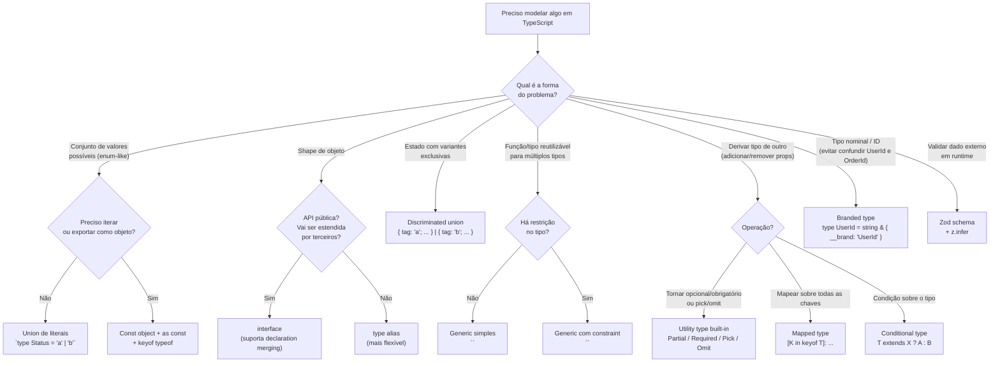
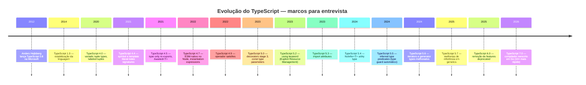

# TypeScript em entrevista

> [!abstract] TL;DR
> TypeScript é um sistema de tipos **estrutural**, **gradual** e **apagado em runtime** colado sobre o JavaScript. Essas três propriedades explicam quase toda decisão de design e toda armadilha. O senior não decora a sintaxe: ele entende por que o sistema funciona assim, sabe quando contornar com segurança e usa tipos como ferramenta de pensamento — não de burocracia.

Esta é a nota CAPSTONE da trilha. As 26 notas anteriores carregam o lastro: aqui a gente costura tudo em um mapa de decisão, um roteiro de entrevista e o vocabulário para conversar em inglês com precisão. Comece pela tese de [[01 - O que é TypeScript - gradual, estrutural, apagado|O que é TypeScript]] — a tríade "estrutural / gradual / apagado" é o fio que percorre todas as 27 notas.

---

## 1. A tese da trilha

TypeScript não é "JavaScript com tipos". É um sistema de tipos estrutural e gradual que vive inteiramente no mundo da compilação e some no runtime. Entender isso resolve quase todas as perguntas difíceis de entrevista.

**Estrutural** significa que o compilador compara formas, não nomes. Se dois tipos têm as mesmas propriedades, são compatíveis — não importa se você os chamou de `Duck` e `Bird`. Isso vem de [[01 - O que é TypeScript - gradual, estrutural, apagado|nota 01]] e contrasta com Java e C#, onde dois tipos com estrutura idêntica mas nomes diferentes são incompatíveis (tipagem nominal).

**Gradual** significa que você pode adicionar tipos incrementalmente. Um arquivo `.ts` sem anotações é TypeScript válido — o compilador infere o que consegue e aceita `any` implícito onde não consegue (com `strict: false`). Com `strict: true` e flags extras de [[20 - tsconfig e strict mode a fundo|nota 20]], a cobertura sobe para o nível que você quer.

**Apagado** significa que nenhum tipo existe em runtime. Toda declaração de `type`, `interface`, `as const`, e genérico some ao compilar. O que sobra é JavaScript puro. Isso cria a fronteira de [[23 - A fronteira type↔runtime - parse, don't validate|nota 23]]: tipos são sua promessa ao compilador; o compilador não pode verificar o que vem de fora (API, banco, formulário).

> [!note] O que o entrevistador está testando
> Ele não quer ver você recitar a tabela de utility types. Ele quer ver se você pensa em termos de: (a) o tipo certo pro problema, (b) o que acontece em runtime, (c) como o compilador chegou ao erro que você está vendo. Quem responde "eu coloco `any` pra parar de reclamar" vai direto ao fundo da pilha.

---

## 2. As perguntas clássicas — respostas afiadas

### `any` vs `unknown` vs `never`

As três são "tipos especiais" mas funcionam em direções opostas. Ver [[04 - any, unknown e never|nota 04]] para o lastro completo.

```ts
// any: desliga o sistema de tipos. Aceita qualquer coisa E pode ser atribuído a qualquer coisa.
let x: any = "hello";
x.naoExiste();          // compila. Nenhum erro. Silêncio até o crash.

// unknown: o "any seguro". Aceita qualquer coisa MAS exige narrowing antes de usar.
let y: unknown = "hello";
y.toUpperCase();        // ERRO — precisa verificar primeiro
if (typeof y === "string") {
  y.toUpperCase();      // OK — narrowed para string
}

// never: o tipo vazio. Nenhum valor habita never.
// Aparece em dois contextos: exaustividade e funções que nunca retornam.
function assertNever(x: never): never {
  throw new Error("Caso não tratado: " + JSON.stringify(x));
}
```

**Frase de entrevista:** "I replace `any` with `unknown` everywhere I don't know the type — `unknown` forces me to narrow before using, which is exactly the contract I want. `never` shows up when I close a discriminated union with an exhaustiveness check."

---

### `interface` vs `type`

Ambos definem formas. A diferença prática é pequena mas existe — ver [[06 - Objetos - interface vs type|nota 06]].

| Situação | `interface` | `type` |
|---|---|---|
| Shape de objeto para API pública | ✅ preferido | ✅ funciona |
| Union de literais | ❌ não suporta | ✅ único |
| Declaration merging | ✅ suporta | ❌ não suporta |
| Intersection / composição | `extends` | `&` |
| Mapped types, conditional types | ❌ | ✅ |
| Renomear primitivo (`type UserId = string`) | ❌ | ✅ |

**Regra na prática:** `interface` para shapes que outros vão estender (APIs públicas de lib); `type` para tudo que envolve união, interseção ou tipos calculados. Em código de aplicação, a diferença raramente importa — o que importa é ser consistente.

**Frase de entrevista:** "I default to `type` for most things — unions, utility compositions, branded types. I reach for `interface` when I need declaration merging, like augmenting third-party types."

---

### Structural typing — por que funciona assim

```ts
type Point2D = { x: number; y: number };
type Point3D = { x: number; y: number; z: number };

function print(p: Point2D) {
  console.log(p.x, p.y);
}

const p3: Point3D = { x: 1, y: 2, z: 3 };
print(p3);  // OK — Point3D tem pelo menos as propriedades de Point2D
```

`Point3D` é compatível com `Point2D` porque tem tudo que `Point2D` exige, e mais. Isso é **tipagem estrutural (duck typing)**: o compilador compara formas, não nomes. Atenção ao excess property checking: se você passar um literal de objeto diretamente (não via variável), o TS recusa propriedades extras — é uma verificação adicional para literais, não uma mudança no sistema.

---

### Como funciona o narrowing

Type narrowing é o compilador aprendendo o tipo real de uma variável analisando o fluxo de controle. Ver [[09 - Type narrowing e type guards|nota 09]] para o lastro completo.

```ts
function processar(valor: string | number | null) {
  if (valor === null) {
    return;                   // aqui: null
  }
  if (typeof valor === "string") {
    return valor.toUpperCase(); // aqui: string
  }
  return valor.toFixed(2);     // aqui: number
}
```

O compilador percorre o código como se fosse um grafo — cada `if`, `switch`, `return`, `throw` estreita o tipo possível. Mecanismos de narrowing:

- `typeof` — para primitivos
- `instanceof` — para classes
- `in` — para propriedades
- Propriedade discriminante — para discriminated unions (o mais poderoso)
- Custom type guards (`x is T`) — quando a verificação está em função separada
- Assertion functions (`asserts x is T`) — para lançar se a condição falhar

**Frase de entrevista:** "TypeScript's control flow analysis tracks what the type can be at each point in the code. A discriminant property — a literal field that differs across union members — is the most reliable narrowing signal because it's structural."

---

### Generics e constraints

Generics são o mecanismo de reutilização tipada. Ver [[11 - Generics - funções e constraints|nota 11]] e [[12 - Generics - defaults, classes e interfaces genéricas|nota 12]].

```ts
// Sem constraint: T pode ser qualquer coisa
function first<T>(arr: T[]): T | undefined {
  return arr[0];
}

// Com constraint: T deve ter .length
function maisLongo<T extends { length: number }>(a: T, b: T): T {
  return a.length >= b.length ? a : b;
}

// Constraint com keyof: garante que K é chave de T
function pegar<T, K extends keyof T>(obj: T, key: K): T[K] {
  return obj[key];
}
```

A constraint `T extends X` não significa herança — significa "T deve ser atribuível a X", ou seja, ter pelo menos as propriedades de X. Em entrevista, se pedirem para "criar uma função que funcione com qualquer objeto que tenha `id`", o padrão é `<T extends { id: string }>`.

---

### Discriminated unions e exhaustividade

O pattern central da trilha, descrito em [[08 - Discriminated unions e exhaustiveness|nota 08]].

```ts
type Estado =
  | { status: "idle" }
  | { status: "loading" }
  | { status: "success"; data: User }
  | { status: "error"; error: string };

function renderizar(estado: Estado): string {
  switch (estado.status) {
    case "idle":    return "Aguardando...";
    case "loading": return "Carregando...";
    case "success": return `Olá, ${estado.data.name}`;
    case "error":   return `Erro: ${estado.error}`;
    // Se adicionar um novo caso ao tipo e esquecer o switch,
    // o compilador avisa — desde que use o padrão abaixo:
    default: {
      const _exaustivo: never = estado;  // estado seria o novo caso não tratado
      throw new Error("Caso não tratado");
    }
  }
}
```

O discriminante (`status`) é a propriedade literal que identifica cada variante. Com ele, o compilador sabe exatamente qual variante está em cada branch e libera apenas as propriedades dela (`data` só existe no branch `success`).

---

### "Parse, don't validate"

O princípio de [[23 - A fronteira type↔runtime - parse, don't validate|nota 23]]: não apenas verifique se o dado é válido — transforme-o em um tipo que carrega a prova da validade.

```ts
// Errado: validar e confiar
function processarUsuário(dados: unknown) {
  if (!dados || typeof dados !== "object") throw new Error("inválido");
  // TypeScript ainda vê `dados` como `object`, não como User
  // e você não tem prova estrutural da validade
}

// Certo: parsear com Zod
import { z } from "zod";

const UsuárioSchema = z.object({
  id: z.number(),
  nome: z.string().min(1),
  email: z.string().email(),
});

type Usuário = z.infer<typeof UsuárioSchema>;  // tipo deriva do schema

function processarUsuário(dados: unknown): Usuário {
  return UsuárioSchema.parse(dados);  // lança se inválido; retorna Usuário tipado
}
```

O schema Zod é a **source of truth**: o tipo TypeScript é inferido dele, não declarado separadamente. Quando o schema muda, o tipo muda junto — sem dessincronização.

---

### Por que evitar `enum`

Coberto em profundidade em [[19 - Enums, const objects e modelagem de constantes|nota 19]].

```ts
// enum gera código JavaScript em runtime
enum Status { Ativo, Inativo }
// Compila para: var Status; (function(Status) { Status[Status["Ativo"] = 0] = "Ativo"; ... })(Status || (Status = {}));

// Prefira: union de literais — zero runtime overhead
type Status = "ativo" | "inativo";

// Ou: const object com as const — iterável + tree-shakeable
const Status = {
  Ativo: "ativo",
  Inativo: "inativo",
} as const;

type Status = typeof Status[keyof typeof Status];
// "ativo" | "inativo"
```

**Problemas do `enum`:** gera código em runtime (aumenta bundle), reverse mapping numérico confuso, não é tree-shakeable, `const enum` causa problemas com `isolatedModules` (esbuild, swc). A union de literais resolve tudo e ainda é mais ergonômica em switch.

---

## 3. Árvore de decisão — que ferramenta de tipo usar



---

## 4. Mapa de revisão da trilha — o que revisar antes de uma call

As 27 notas agrupadas por fase, com o peso relativo para entrevista. Notas com ⭐ são as que mais aparecem em perguntas.

```mermaid
flowchart TD
    subgraph Iniciado["🟢 Fase Iniciado — o modelo mental"]
        N01["01 O que é TypeScript ⭐\n(estrutural / gradual / apagado)"]
        N02["02 Primitivos e inferência"]
        N03["03 Arrays, tuplas e as const ⭐"]
        N04["04 any, unknown e never ⭐"]
        N05["05 strictNullChecks ⭐"]
        N06["06 interface vs type ⭐"]
        N07["07 Union e intersection"]
        N08["08 Discriminated unions ⭐"]
        N09["09 Type narrowing ⭐"]
        N10["10 Funções: overloads e contextual typing"]
    end

    subgraph Adepto["🟡 Fase Adepto — type-level programming"]
        N11["11 Generics: funções e constraints ⭐"]
        N12["12 Generics: defaults e classes"]
        N13["13 Conditional types ⭐"]
        N14["14 infer e extração"]
        N15["15 keyof, typeof e indexed access ⭐"]
        N16["16 Mapped types"]
        N17["17 Template literal types"]
        N18["18 Utility types ⭐"]
        N19["19 Enums e const objects ⭐"]
        N20["20 tsconfig e strict mode ⭐"]
    end

    subgraph Magus["🔴 Fase Magus — fronteiras e produção"]
        N21["21 Módulos: ESM, CJS, type-only"]
        N22["22 Declaration files e @types"]
        N23["23 Fronteira type↔runtime ⭐⭐"]
        N24["24 Type-driven design: branded, Result"]
        N25["25 TS em escala: project references"]
        N26["26 Lendo erros do compilador"]
        N27["27 ← você está aqui (capstone)"]
    end

    Cap["Entrevista:\nresponder com precisão + inglês técnico"]

    Iniciado --> Adepto --> Magus --> Cap

    N01 -.peso.-> Cap
    N04 -.peso.-> Cap
    N06 -.peso.-> Cap
    N08 -.peso.-> Cap
    N09 -.peso.-> Cap
    N11 -.peso.-> Cap
    N18 -.peso.-> Cap
    N23 -.peso.-> Cap
```



**Roteiro de revisão em véspera de call (30 min):**

1. [[01 - O que é TypeScript - gradual, estrutural, apagado|01]] — releia a tese. A tríade é o filtro de tudo.
2. [[04 - any, unknown e never|04]] — `any` vs `unknown` vs `never`. Pergunta garantida.
3. [[06 - Objetos - interface vs type|06]] — a diferença real e quando cada um.
4. [[08 - Discriminated unions e exhaustiveness|08]] — o pattern de estado mais importante.
5. [[09 - Type narrowing e type guards|09]] — como o compilador aprende o tipo.
6. [[11 - Generics - funções e constraints|11]] — constraints e inferência de type args.
7. [[18 - Utility types - e como reconstruí-los|18]] — saber reconstruir `Partial`/`Pick` do zero vale mais do que decorar a lista.
8. [[23 - A fronteira type↔runtime - parse, don't validate|23]] — "parse, don't validate" e Zod.
9. Esta nota — frases em inglês da seção 5.

---

## 5. Como explicar em inglês

Parágrafos-modelo para usar na entrevista. Primeira pessoa, filosofia técnica — postura, não relato de projeto.

> TypeScript, at its core, is a structural, gradual, and erased type system layered on top of JavaScript. Structural means the compiler compares shapes, not names — if two types have the same properties, they're compatible, regardless of what you called them. Gradual means you can adopt it incrementally, starting with loose inference and tightening with `strict` flags over time. And erased means types simply don't exist at runtime — every `type`, `interface`, and generic annotation disappears in the compiled output. That erasure is what creates the one fundamental constraint of TypeScript: you cannot rely on types to validate data that comes from outside the program. Types are a promise you make to the compiler; the compiler cannot verify a JSON blob from an API.

> My baseline is `strict: true` plus `noUncheckedIndexedAccess` and `exactOptionalPropertyTypes`. `noUncheckedIndexedAccess` means `arr[i]` has type `T | undefined` instead of just `T` — it forces me to think about bounds. `exactOptionalPropertyTypes` distinguishes between a missing property and an explicit `undefined`, which matters for patch-style APIs. Without those extra flags, `strict` alone leaves several real bug classes unchecked.

> I model state with discriminated unions rather than booleans and optional fields. A `LoadingState` with four variants — `idle`, `loading`, `success` with a `data` field, `error` with an `error` field — is far safer than `isLoading: boolean, data?: User, error?: string`. The union makes impossible states unrepresentable, and a switch with an exhaustiveness check at the `default` branch catches every new case I add to the type.

> For the boundary between compile-time and runtime, I follow "parse, don't validate." I use Zod schemas as the source of truth for any external data — API responses, environment variables, form submissions. The TypeScript type is inferred from the schema, so when the schema changes, the type changes automatically. This eliminates the drift between what the runtime sees and what my types claim.

> I avoid `any` as a policy. When I don't know a type, I use `unknown`, which forces narrowing before use. `as` type assertions are a last resort — they're "trust me" markers that bypass the checker entirely. And I avoid numeric `enum`s because they generate runtime code, have confusing reverse mappings, and are not tree-shakeable. A union of string literals or an `as const` object gives me the same ergonomics with zero overhead.

---

## 6. Vocabulário-chave PT→EN consolidado

| Português | English |
|---|---|
| tipagem estrutural | structural typing |
| tipagem nominal | nominal typing |
| tipagem gradual | gradual typing |
| apagamento de tipos | type erasure |
| estreitamento de tipo | type narrowing |
| guardas de tipo | type guards |
| tipo utilitário | utility type |
| tipo mapeado | mapped type |
| tipo condicional | conditional type |
| tipo literal de template | template literal type |
| união discriminada | discriminated union |
| discriminante | discriminant |
| verificação de exaustividade | exhaustiveness check |
| interseção | intersection |
| genérico | generic |
| restrição (de genérico) | constraint |
| inferência | inference |
| parâmetro de tipo | type parameter |
| argumento de tipo | type argument |
| asserção de tipo | type assertion |
| declaração de tipo | type declaration |
| arquivo de declaração | declaration file |
| fusão de declarações | declaration merging |
| módulo ambiente | ambient module |
| validação em runtime | runtime validation |
| tipo marcado / nominal manual | branded type |
| tipo apagado | erased type |
| ponto de entrada de dados externos | trust boundary |
| analisar para validar | parse, don't validate |
| modo strict | strict mode |
| acesso indexado | indexed access |
| tipo de retorno | return type |
| tipo de parâmetro | parameter type |
| tipo contextual | contextual type |
| sobrecarga de função | function overload |
| proteção de tipo personalizada | custom type guard |
| função de asserção | assertion function |
| tipo opcional | optional type |
| tipo readonly | readonly type |
| alias de tipo | type alias |
| enumeração | enum |
| type-only import | type-only import |
| project references | project references |

---

## 7. A evolução do TypeScript — contexto de senioridade

Saber a trajetória da linguagem mostra que você acompanha o ecossistema, não apenas usa o que estava disponível quando aprendeu.



**Marcos que valem mencionar em entrevista:**

**Template literal types (4.1, 2020)** — tipos construídos a partir de strings template. Abriu a porta para rotas tipadas, event names derivados, e toda uma classe de type-level programming que antes exigia gambiarras. Ver [[17 - Template literal types|nota 17]].

**Key remapping em mapped types (4.1)** — `[K in keyof T as NewKey<K>]`. Permite renomear chaves ao mapear, essencial para gerar getter/setter tipados. Ver [[16 - Mapped types e key remapping|nota 16]].

**`satisfies` operator (4.9, 2022)** — valida que um valor satisfaz um tipo sem perder o tipo literal. Resolve o problema de usar `as const` perdendo a checagem de forma:

```ts
type Palette = Record<string, [number, number, number] | string>;

// Com 'as': perde o tipo literal, ganha a checagem
const palette = { red: [255, 0, 0] } as Palette;

// Com 'satisfies': mantém o tipo literal E checa contra Palette
const palette2 = {
  red: [255, 0, 0],      // tipo: [number, number, number] — não number[]
  green: "#00ff00",       // tipo: string
} satisfies Palette;

palette2.red.at(0);       // OK — TS sabe que red é uma tupla
```

**`using` keyword (5.2, 2023)** — Explicit Resource Management (TC39 stage 4). Garante cleanup automático de recursos via `Symbol.dispose`:

```ts
class DBConnection {
  [Symbol.dispose]() { this.close(); }
}

function query() {
  using conn = new DBConnection();
  return conn.run("SELECT ...");
  // conn.close() chamado automaticamente ao sair do escopo
}
```

**Inferred type predicates (5.5, 2024)** — o compilador infere automaticamente `x is T` em funções de predicado simples, sem você precisar anotar. Antes: `function isString(x: unknown): x is string { return typeof x === 'string'; }`. Depois: a anotação `x is string` é inferida se a implementação for direta o suficiente.

**NoInfer\<T\> (5.4, 2024)** — bloqueia que um site de chamada influencie a inferência de um type parameter. Útil para funções que inferem `T` de um argumento mas têm outro que deve seguir (não influenciar) essa inferência.

**TypeScript 7.0 / "Corsa" (2026, previsto)** — o compilador foi reescrito em Go. A promessa é 10× mais rápido em projetos grandes. **Importante:** não há breaking changes na linguagem — `tsc --version` pode ser diferente, mas o TypeScript que você escreveu continua válido. O ganho é puramente operacional: `tsc --build` que hoje leva 30 segundos pode levar 3.

---

## 8. Red flags e green flags

O entrevistador observa sinais antes mesmo da resposta técnica. Esses são os mais visíveis.

### 🔴 Red flags — o que afasta vagas seniores

- **"Eu coloco `any` pra resolver rapidinho"** — sinaliza que você trata tipos como obstáculo, não ferramenta.
- **"Tipos em TS são como em Java"** — confundir tipagem estrutural com nominal. Mostra que o modelo mental está errado.
- **"Strict mode é suficiente"** — sem `noUncheckedIndexedAccess` e `exactOptionalPropertyTypes`, metade dos bugs silenciosos ficam de pé.
- **Não saber o que acontece em runtime** — "tipos garantem que o dado é correto" é falso. Tipos somem; o dado pode ser qualquer coisa.
- **Usar `as` para calar o compilador** — "type assertion" sem explicar por que é seguro ali mostra que você está contornando o sistema.
- **Confundir `interface` e `type` nas diferenças** — não saber que `interface` suporta declaration merging e `type` suporta unions.
- **Não ter resposta sobre `never`** — é o tipo mais revelador: quem entende `never` entende exaustividade, contradição de tipos e fluxo de controle.

### 🟢 Green flags — o que impressiona

- **Falar em tríade antes de qualquer detalhe** — "TS é estrutural, gradual e apagado. Essas três propriedades explicam tudo." Mostra visão de sistema.
- **Explicar por que `unknown` é melhor que `any`** — e demonstrar narrowing na hora.
- **Mencionar `parse, don't validate` com Zod** — mostra que você pensa na fronteira runtime, não só no compilador.
- **Usar discriminated unions espontaneamente** — quando pedirem pra modelar estado, desenhar uma union com discriminante sem precisar ser pedido.
- **Saber reconstruir utility types** — `Partial<T>` é `{ [K in keyof T]?: T[K] }`. Quem reconstruiu sabe o que a ferramenta faz.
- **Citar `satisfies` ou `NoInfer`** — mostra que você acompanha releases e usa a linguagem atual.
- **Falar sobre performance do compilador** — project references, `incremental`, por que `skipLibCheck` existe. Ver [[25 - TypeScript em escala - performance do compilador e project references|nota 25]].
- **Mencionar branded types para IDs de domínio** — "UserId e OrderId são ambos `string` mas não são intercambiáveis" mostra que você pensa em domain modeling. Ver [[24 - Type-driven design - branded types, Result e estados impossíveis|nota 24]].

---

## 9. Frases prontas para entrevista

Frases calibradas para soltar no momento certo, em inglês:

**Sobre a natureza do TS:**
- "TypeScript is structural, gradual, and erased. Those three properties explain almost every design decision and every footgun."
- "Types exist only at compile time. By runtime, they're gone — so types can't protect you from external data."
- "Structural typing means if two types have the same shape, they're compatible — regardless of name. That's the opposite of Java."

**Sobre `any` e `unknown`:**
- "`any` is a hole in the type system. `unknown` is the safe alternative — it forces you to narrow before you use."
- "I treat `as` assertions the same way I treat `!` — they're 'trust me' markers. I use them when I genuinely know more than the compiler, and I leave a comment explaining why."

**Sobre discriminated unions:**
- "Discriminated unions make impossible states unrepresentable. If loading and success can't both be true at the same time, don't model them as two booleans."
- "The default branch with `const _exhaustive: never = state` is my exhaustiveness check. Add a new union member and forget the switch — the compiler tells you."

**Sobre runtime e parse:**
- "Types are a compile-time promise. At runtime, I validate with Zod at every trust boundary — HTTP, env vars, third-party APIs."
- "Parse, don't validate. Instead of checking and trusting, I parse into a type that carries proof of its shape."

**Sobre generics:**
- "A constraint like `T extends { id: string }` means T must have at least an `id` property. It's not inheritance — it's structural compatibility."
- "I let TypeScript infer type arguments when possible. Explicit `<User>` syntax is for when inference fails or misleads."

**Sobre strict mode:**
- "`strict: true` is a floor, not a ceiling. I add `noUncheckedIndexedAccess` for index safety and `exactOptionalPropertyTypes` to distinguish missing from undefined."

**Sobre evolução:**
- "The `satisfies` operator in 4.9 was a game changer — you get the structural check without losing literal types."
- "TypeScript 7's compiler is being rewritten in Go for a 10× speedup. No language breaking changes — purely operational."

---

## 10. Armadilhas consolidadas

Cada uma vale uma frase e um link para a nota-dona.

- **`any` vaza pelo codebase** — uma função que retorna `any` infecta todos os callers; use `unknown` na entrada e seja explícito na saída. Ver [[04 - any, unknown e never|nota 04]].
- **`Object.keys` retorna `string[]`, não `keyof T`** — design intencional do TS (objetos podem ter mais chaves em runtime); use `(Object.keys(obj) as (keyof typeof obj)[])` ou `for...in`. Ver [[15 - keyof, typeof e indexed access types|nota 15]].
- **`JSON.parse` retorna `any`** — valide com Zod antes de usar. Ver [[23 - A fronteira type↔runtime - parse, don't validate|nota 23]].
- **`as const` esquecido em arrays** — `['a', 'b']` tem tipo `string[]`; `['a', 'b'] as const` tem tipo `readonly ['a', 'b']` e permite derivar `typeof arr[number]`. Ver [[03 - Arrays, tuplas e as const|nota 03]].
- **Excess property check bypassed via variável** — `fn({ x: 1, extra: 2 })` dá erro; `const obj = { x: 1, extra: 2 }; fn(obj)` não. O sistema é consistente com structural typing mas surpreende quem não sabe. Ver [[06 - Objetos - interface vs type|nota 06]].
- **`noUncheckedIndexedAccess` desligado** — `arr[999]` parece `string` mas é `undefined` em runtime. Com a flag: `arr[999]` é `string | undefined`, forçando verificação. Ver [[20 - tsconfig e strict mode a fundo|nota 20]].
- **`const enum` com bundlers modernos** — `const enum` é apagado pelo TS mas esbuild/swc não fazem esse trabalho; quebra em builds externos. Prefira `as const` object. Ver [[19 - Enums, const objects e modelagem de constantes|nota 19]].
- **Declaration merging esquecida para augmentação** — para estender tipos de terceiros (adicionar campo à `Window` ou `Session`), use `interface` em arquivo `.d.ts`. Ver [[22 - Declaration files (.d.ts) e o ecossistema de tipos|nota 22]].
- **`verbatimModuleSyntax` e type-only imports** — com a flag ativa, qualquer import que só traz tipos deve ser `import type`. Bundlers e runtimes agradecem. Ver [[21 - Modules - ESM, CJS e type-only imports|nota 21]].
- **Erros de tipo incompreensíveis em generics profundos** — quando o compilador diz "Type 'X' is not assignable to type 'Y'" e `X` e `Y` têm 10 linhas, o problema geralmente é constraint muito larga ou `infer` em posição inesperada. Ver [[26 - Lendo o compilador - erros comuns e como decifrar mensagens|nota 26]].

---

## Na prática (da minha experiência)

> **MedEspecialista — stack TypeScript padronizada:**
>
> **1. Strict mode + todas as flags extras:**
>
> ```json
> {
>     "strict": true,
>     "noUncheckedIndexedAccess": true,
>     "exactOptionalPropertyTypes": true,
>     "noImplicitReturns": true,
>     "noFallthroughCasesInSwitch": true,
>     "noUnusedLocals": true,
>     "noUnusedParameters": true
> }
> ```
>
> Sem esse conjunto, metade dos benefícios do TS ficam dormentes.
>
> **2. Zod para toda entrada externa:**
> - HTTP request bodies
> - Environment variables (`z.object({ DATABASE_URL: z.string().url() }).parse(process.env)`)
> - Respostas de APIs externas
> - localStorage/sessionStorage
>
> Zod schema é a source of truth — tipo é inferido de lá.
>
> **3. OpenAPI → tipos:**
> Backend (Spring Boot) gera OpenAPI via SpringDoc. Frontend consome com `openapi-typescript` que gera tipos. Quando o backend muda um campo, o TypeScript quebra no frontend — erro de compilação, não runtime. Esse loop economiza tempo enorme.
>
> **4. Result types em domain code:**
> Services retornam `Result<T, DomainError>` em vez de throwing. Força o caller a lidar com erros. Nos boundaries (controllers), converto para HTTP response.
>
> **5. Discriminated unions para state:**
> Componentes React com `LoadingState = { status: 'idle' } | { status: 'loading' } | { status: 'success'; data: T } | { status: 'error'; error: E }`. Switch exhaustivo no render.
>
> **6. Branded types para IDs:**
>
> ```typescript
> type Brand<K, T> = K & { readonly __brand: T };
> type UserId = Brand<string, 'UserId'>;
> type OrderId = Brand<string, 'OrderId'>;
> // UserId e OrderId não são intercambiáveis mesmo sendo ambos strings
> ```
>
> Evita trocar IDs no código — erro de compile-time.
>
> **7. `import type` sempre:**
> Imports de tipos com `import type` para garantir que são removidos do JS. Melhora tree shaking.
>
> **8. Path aliases (`@/*`):**
> Evita imports relativos horríveis. Configurado em tsconfig + Vite/Next/Jest.
>
> **Incidente memorável — `any` vazou:**
>
> Função helper antiga tinha tipo `function parse(json: string): any`. Esse `any` foi propagado por toda a aplicação. Um campo renomeado no backend quebrou em runtime — nenhum erro de compile. Refactor: substituí por `unknown` + Zod validation. Compilador encontrou dezenas de lugares onde o código assumia shape errado. Bugs escondidos descobertos por tipos.
>
> **Outro — `Object.keys` typing:**
>
> ```typescript
> const obj = { a: 1, b: 'str' };
> Object.keys(obj).forEach(key => {
>     console.log(obj[key]);  // TS reclama: key é string, não 'a' | 'b'
> });
> ```
>
> Solução: `(Object.keys(obj) as (keyof typeof obj)[])`. Ou usar `for (const key in obj)` que narra melhor.
>
> **A lição principal:** TypeScript é uma **ferramenta de pensamento**. Quando os tipos estão difíceis de expressar, é sinal de que o design está ruim — não de que TS está atrapalhando. Domine o sistema de tipos avançado (generics, conditionals, mapped types) e você modela domínios complexos com segurança enorme.

---

## Próximo passo

TypeScript como linguagem para aqui. A aplicação de TS em componentes React, hooks tipados, Context tipado, formulários e Server Components é o conteúdo de [[03-Dominios/Tecnologia/React/TypeScript com React/index|TypeScript com React]] — uma trilha de 15 notas separada, já completa.

Para a base da linguagem JavaScript que o TS pressupõe: [[03-Dominios/Tecnologia/JavaScript/index|JavaScript]].

---

## Veja também

- [[01 - O que é TypeScript - gradual, estrutural, apagado]] — a tese
- [[04 - any, unknown e never]] — os três tipos especiais
- [[06 - Objetos - interface vs type]] — a escolha recorrente
- [[08 - Discriminated unions e exhaustiveness]] — o pattern central
- [[09 - Type narrowing e type guards]] — como o compilador aprende
- [[11 - Generics - funções e constraints]] — reutilização tipada
- [[18 - Utility types - e como reconstruí-los]] — a caixa de ferramentas
- [[23 - A fronteira type↔runtime - parse, don't validate]] — o limite fundamental
- [[24 - Type-driven design - branded types, Result e estados impossíveis]] — design de domínio
- [[03-Dominios/Tecnologia/React/TypeScript com React/index|TypeScript com React]] — próximo passo
- [[03-Dominios/Tecnologia/JavaScript/index|JavaScript]] — a linguagem base

> [!info] Lastro
> Esta nota é um CAPSTONE: sintetiza as notas 01–26 da trilha TypeScript, que carregam o lastro técnico de cada afirmação. Os parágrafos em inglês da seção 5 são postura técnica genérica, NÃO relatos de projetos, clientes ou experiências específicas do autor. A seção de evolução (7) é baseada nos release notes públicos da Microsoft; TypeScript 7.0/Corsa é anúncio oficial da equipe do TS de 2025, com lançamento previsto para mid-2026.
