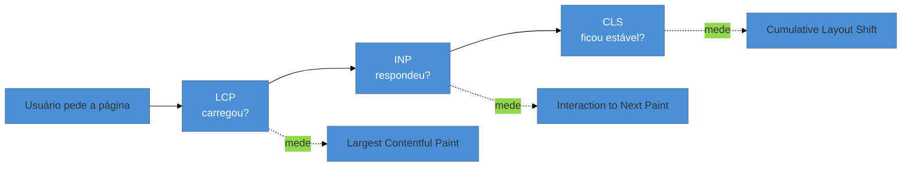

# Os três Core Web Vitals

> [!abstract] TL;DR
> Os Core Web Vitals são os três números que o Google usa para resumir a experiência de uma página: **LCP** (o conteúdo principal apareceu rápido?), **INP** (a página respondeu rápido aos cliques?) e **CLS** (o layout ficou estável ou pulou?). Cada um tem um limiar de "bom" — **LCP ≤ 2,5 s**, **INP ≤ 200 ms**, **CLS ≤ 0,1** — avaliado no **percentil 75** dos carregamentos reais. Eles mapeiam três momentos da experiência: *carregou → respondeu → ficou estável*. Dominar esses três é o vocabulário mínimo de qualquer conversa sobre performance moderna.

## O problema: "a página está lenta" não diz nada

Um gerente de produto chega e diz: "os usuários reclamam que o site está lento". O que você faz? "Lento" pode significar três coisas completamente diferentes, cada uma com causas e soluções distintas:

- A página **demora a mostrar** o conteúdo (o usuário olha uma tela em branco).
- A página **aparece rápido, mas não reage** — o usuário clica no botão e nada acontece por meio segundo.
- A página **carrega, mas pula** — o usuário vai clicar em "cancelar" e um banner empurra o layout, e ele clica em "comprar".

Sem um vocabulário preciso, "lento" é um balde onde cabe tudo e não se conserta nada. Foi para resolver isso que o Google, em 2020, destilou a experiência do usuário em três métricas mensuráveis, cada uma capturando **um** desses momentos. É o que permite sair de "está lento" para "o **INP** no mobile está em 480 ms, então o problema é responsividade, não carregamento".

## A tabela que você precisa decorar

Antes de destrinchar cada um, aqui está o mapa completo. Estes valores são a régua oficial do Google e você vai usá-los em toda auditoria:

| Métrica | Mede | 🟢 Bom | 🟡 A melhorar | 🔴 Ruim |
|---------|------|--------|---------------|---------|
| **LCP** — Largest Contentful Paint | Velocidade de carregamento | ≤ 2,5 s | 2,5 – 4,0 s | > 4,0 s |
| **INP** — Interaction to Next Paint | Responsividade | ≤ 200 ms | 200 – 500 ms | > 500 ms |
| **CLS** — Cumulative Layout Shift | Estabilidade visual | ≤ 0,1 | 0,1 – 0,25 | > 0,25 |

> [!info] Valores válidos em julho de 2026 — mas envelhecem
> O Google revisa esses limiares conforme o hardware e a web evoluem (o INP, por exemplo, só virou Core Web Vital em **12/03/2024**, substituindo o antigo FID). Sempre confirme os valores atuais em [web.dev/vitals](https://web.dev/articles/vitals) antes de cravá-los num relatório. A **forma** — três faixas: bom / a melhorar / ruim — é estável; os números podem mudar.

## LCP — o conteúdo principal apareceu?

**Largest Contentful Paint** mede quanto tempo leva até o **maior elemento de conteúdo visível** ser renderizado na viewport — normalmente a imagem de destaque (hero), um bloco de texto grande ou um vídeo. A ideia é aproximar a pergunta que o usuário realmente faz: *"a página já carregou o que eu vim ver?"*.

Por que o *maior* elemento? Porque ele é um bom proxy para "o conteúdo principal está pronto". Ninguém considera a página carregada quando só o cabeçalho apareceu; a percepção de "pronto" vem quando o conteúdo dominante — a manchete, a foto do produto — está visível.

O LCP bom é **≤ 2,5 segundos**. Acima de 4 segundos, é ruim. As causas típicas de LCP alto — servidor lento, recursos que bloqueiam a renderização, imagens pesadas — são o assunto do **Galho 2 (Performance de Carregamento)**. Aqui, o que importa é saber que **LCP = velocidade de aparecer**.

> [!question]- O LCP não é a mesma coisa que "página totalmente carregada"?
> Não. O evento `load` do browser espera *tudo* — todos os scripts, imagens abaixo da dobra, analytics. O LCP mede algo mais próximo da percepção humana: o momento em que o **conteúdo principal visível** apareceu. Uma página pode ter LCP de 1,5 s (o usuário já vê e lê o conteúdo) enquanto o `load` só dispara aos 6 s (carregando coisas que ninguém está esperando). Por isso as métricas antigas baseadas em `load` foram abandonadas — mediam a máquina, não a experiência.

## INP — a página respondeu ao meu clique?

**Interaction to Next Paint** mede a **responsividade**: quando o usuário interage (clique, toque, tecla), quanto tempo até a tela mostrar uma resposta visual (o "next paint"). Ele observa **todas** as interações da visita e reporta essencialmente a pior (com uma pequena tolerância), porque uma única trava dolorosa arruína a percepção de fluidez.

O mecanismo por trás é a **thread principal** do browser: JavaScript, layout e pintura disputam uma única fila. Se um script pesado está ocupando a thread quando você clica, o browser não consegue processar o clique nem pintar a resposta até o script liberar. O resultado é aquela sensação de "cliquei e a página congelou". O INP quantifica essa dor em milissegundos.

O INP bom é **≤ 200 ms** — o limiar da percepção humana de "instantâneo". Acima de 500 ms, é ruim. As causas profundas (long tasks, custo de JavaScript, hidratação) e as técnicas para atacá-las moram no **Galho 3 (Runtime & Rendering)**. Aqui, guarde: **INP = velocidade de reagir**.

> [!info] INP substituiu FID em 12/03/2024
> A métrica anterior de responsividade era o **FID (First Input Delay)**, que media só o atraso da **primeira** interação — e apenas o *delay* de entrada, não o tempo até a resposta aparecer. Era fácil demais de passar e não refletia a experiência real ao longo da sessão. O INP é mais honesto: olha *todas* as interações e mede até o *paint*. Se você encontrar material citando FID, saiba que está desatualizado.

## CLS — o layout ficou parado?

**Cumulative Layout Shift** mede a **estabilidade visual**: o quanto os elementos da página se movem sozinhos *depois* de já terem sido renderizados. É a métrica da frustração de "eu ia clicar aqui e a coisa pulou".

O caso clássico: você abre um artigo, começa a ler, e de repente um banner de anúncio ou uma imagem que faltava terminam de carregar acima do texto e **empurram tudo pra baixo**. Pior ainda em formulários e checkout, onde um deslocamento no momento errado faz o dedo acertar o botão errado.

O CLS é diferente dos outros dois: não é tempo, é um **número sem unidade** que combina o *quanto* da tela foi afetada (impact fraction) com a *distância* que os elementos se moveram (distance fraction). Quanto mais área pula e mais longe ela vai, maior o número. O CLS bom é **≤ 0,1**; acima de 0,25, é ruim.

As causas mais comuns têm remédios baratos e conhecidos: **reservar espaço** para imagens (com `width`/`height` ou `aspect-ratio`), para anúncios e para conteúdo injetado dinamicamente — assunto que se aprofunda no Galho 3 e que já é tocado em [[03-Dominios/Tecnologia/CSS/12 - Performance CSS|CSS 12]]. Aqui: **CLS = estabilidade do layout**.

## O detalhe que separa amador de profissional: o percentil 75

Há uma pegadinha que engana quase todo mundo no começo. Os Core Web Vitals **não são medidos pela média** nem pela mediana. Eles são avaliados no **percentil 75 (p75)** dos carregamentos reais, separados por tipo de dispositivo (mobile e desktop são medidos à parte).

Por que p75 e não a média? Porque a média **esconde a cauda que dói**. Imagine 100 carregamentos: 75 rápidos (1 s) e 25 horríveis (8 s). A média seria ~2,75 s — parece aceitável. Mas 1 em cada 4 usuários esperou 8 segundos. O p75 captura isso: ele pergunta "qual é a experiência dos meus **25% de usuários com pior sorte**?". Se ao menos 75% dos carregamentos são bons, o site é classificado como bom naquela métrica.

> [!warning] Otimizar a média é otimizar quem já está bem
> **O que acontece:** o time comemora um LCP médio de 2 s, mas os Core Web Vitals continuam "ruins" no relatório do Google.
> **Por quê:** a média é puxada pelos usuários rápidos (bom hardware, boa rede). O p75 mora na cauda — celulares modestos, redes ruins, cache frio —, e é *essa* a experiência que o Google avalia e que representa uma fatia grande do seu público real.
> **Como evitar:** sempre olhe percentis (p75, p95), nunca só a média. Priorize melhorar a cauda, não a mediana já saudável. A diferença entre lab e field (próxima nota) é justamente sobre capturar essa realidade.

**Os três Core Web Vitals em uma frase:** LCP mede se o conteúdo *carregou* rápido, INP se a página *respondeu* rápido e CLS se o layout ficou *estável* — cada um com um limiar de "bom", todos avaliados no percentil 75 dos usuários reais.

## Como explicar em inglês

> "There are three Core Web Vitals, and each captures a different moment of the experience. **LCP** — Largest Contentful Paint — measures loading: how long until the main content is visible, good under 2.5 seconds. **INP** — Interaction to Next Paint — measures responsiveness: how quickly the page reacts to a click or tap, good under 200 milliseconds. And **CLS** — Cumulative Layout Shift — measures visual stability: how much the layout jumps around, good under 0.1. The key nuance is that they're assessed at the **75th percentile** of real user loads, not the average — because the average hides the slow tail that actually hurts users."

| PT | EN |
|----|----|
| Maior elemento de conteúdo | Largest contentful element |
| Responsividade | Responsiveness |
| Estabilidade visual | Visual stability |
| Limiar / faixa | Threshold / band |
| Deslocamento de layout | Layout shift |
| Percentil 75 | 75th percentile (p75) |
| Reservar espaço | Reserve space |
| A cauda (dos piores casos) | The (long) tail |

## O que vem a seguir

Você já sabe *o que* medir e *quais* os limiares. Mas há uma armadilha logo à frente: o mesmo LCP pode dar 1,8 s numa ferramenta e 4,2 s em outra — sem que nenhuma esteja errada. A diferença é **de onde vem o dado**: um teste de laboratório controlado ou a medição dos seus usuários reais no mundo caótico. Entender essa distinção é o que impede você de otimizar para o número errado.

- [[03-Dominios/Tecnologia/Web Performance/Medição e Core Web Vitals/03 - Lab vs Field|03 — Lab vs Field]] — por que a mesma métrica diverge entre lab e campo, e quando confiar em cada um.
- [[03-Dominios/Tecnologia/Web Performance/Medição e Core Web Vitals/04 - Lighthouse e PageSpeed Insights|04 — Lighthouse e PageSpeed Insights]] — a ferramenta lab onde você vê esses três números pela primeira vez.

## Fontes

- **web.dev (Google)** — [*Web Vitals*](https://web.dev/articles/vitals) — a referência oficial das três métricas, seus limiares e definições.
- **web.dev (Google)** — [*How the Core Web Vitals metrics thresholds were defined*](https://web.dev/articles/defining-core-web-vitals-thresholds) — por que os limiares são esses e por que o percentil 75.
- **Google Search Central** — [*Understanding Core Web Vitals and Google search results*](https://developers.google.com/search/docs/appearance/core-web-vitals) — o papel dos CWV no ranqueamento e a avaliação por p75.
- **Google Search Central** — [*Introducing INP to Core Web Vitals*](https://developers.google.com/search/blog/2023/05/introducing-inp) — a substituição de FID por INP, efetiva em 12/03/2024.
