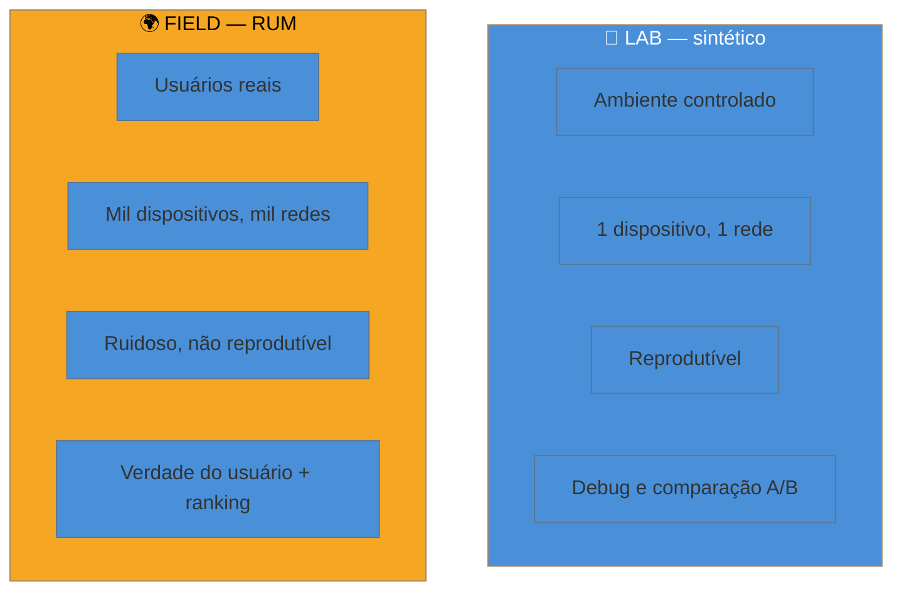

# Lab vs Field

> [!abstract] TL;DR
> Existem dois jeitos de medir performance, e eles quase nunca concordam. **Lab** (medição sintética) roda a página num ambiente controlado — mesmo dispositivo, mesma rede, sempre igual — e é ótimo para **depurar e comparar mudanças**. **Field** (dados de campo / RUM) coleta o que os **usuários reais** vivem, em toda a diversidade caótica de aparelhos e redes — e é o que o Google usa para ranquear. Eles divergem porque medem coisas diferentes: o lab é um laboratório estéril, o campo é a rua. Você precisa dos dois, e precisa saber quando confiar em cada um.

## O problema: dois números, nenhum errado

Você roda o Lighthouse na sua página e ele diz: LCP de 1,8 s, tudo verde. Feliz, você abre o relatório do Google Search Console e ele diz: LCP de 4,3 s, **ruim**, no percentil 75. Mesma página, mesmo dia. Qual está mentindo?

Nenhum. Eles estão medindo mundos diferentes. O Lighthouse mediu **uma** visita, na sua máquina (ou num servidor rápido), numa rede simulada. O Search Console agregou **milhares** de visitas de usuários reais — muitos num celular de R$ 900, numa 4G congestionada no ônibus, com o cache vazio. A sua régua de desenvolvedor não alcança a experiência da rua.

Confundir esses dois números é a causa nº 1 de times "otimizarem" performance e não verem o ranking melhorar. Entender a diferença é o que separa medir para *si mesmo* de medir para o *usuário*.

## Lab: o laboratório estéril

Medição de laboratório (também chamada **sintética**) executa a página num ambiente que você controla e que se repete idêntico a cada execução: um dispositivo específico, uma velocidade de rede simulada (throttling), sem extensões, cache limpo. Ferramentas típicas: **Lighthouse**, **WebPageTest**, o painel Performance do DevTools.

A grande virtude do lab é a **reprodutibilidade**. Como todas as variáveis estão fixas, se você muda uma coisa e o número muda, foi a sua mudança que causou — não o azar de uma rede ruim. Isso torna o lab a ferramenta certa para:

- **Depurar**: rodar, ver a cascata de recursos, achar o gargalo, corrigir, rodar de novo.
- **Comparar**: medir a página antes e depois de uma otimização e provar o ganho.
- **Prevenir regressão**: rodar no CI a cada commit (assunto do Galho 4).

Mas o lab tem um ponto cego fatal: **ele é uma única amostra de um mundo que você escolheu**. Você mediu um celular de gama média numa 4G simulada — e os seus usuários reais? Metade está no wifi de casa, um quarto numa 3G capenga, alguns num iPhone 15, outros num Android de 2019. O lab não sabe nada disso.

> [!question]- Se o lab é uma amostra só, por que não medir mais amostras no lab?
> Você pode variar as condições do lab (testar em 3 perfis de rede, 2 de dispositivo) e deve fazê-lo. Mas você nunca vai reproduzir a **cauda longa** da realidade: o usuário com 200 abas abertas, a extensão que injeta script, o antivírus que intercepta requisições, a operadora que faz proxy. A diversidade do mundo real é grande demais para simular. Por isso o lab **complementa** o campo, não o substitui. Um mede causas (por que está lento aqui?), o outro mede a verdade (está lento para quem?).

## Field: a verdade da rua

Medição de campo — conhecida como **RUM (Real User Monitoring)** — coleta métricas dos **usuários de verdade** enquanto eles usam o site, e envia esses dados para você agregar. Nada é simulado: é o LCP que o Sr. João viveu no celular dele, na rede dele, somado ao de milhares de outros.

O campo tem a virtude oposta à do lab: ele captura a **distribuição real** — toda a diversidade de aparelhos, redes e condições. É por isso que é o campo (e não o lab) que alimenta os Core Web Vitals que o Google usa para ranquear, avaliados no **percentil 75** dessa distribuição (ver [[03-Dominios/Tecnologia/Web Performance/Medição e Core Web Vitals/02 - Os três Core Web Vitals|nota 02]]).

Só que o campo tem o custo simétrico da sua virtude: ele é **ruidoso e não reprodutível**. Você vê que o INP piorou esta semana, mas o dado agregado não te diz *por quê* — foi um deploy? uma campanha que trouxe usuários com aparelhos piores? um script de terceiros novo? O campo aponta *que* há um problema e *para quem*, mas raramente *qual é a causa*. Para achar a causa, você volta ao lab.

Há duas fontes de dados de campo que você vai usar o tempo todo:

- **CrUX (Chrome UX Report)**: o Google coleta CWV de usuários reais do Chrome que optaram por compartilhar e publica isso agregado. É a fonte "pública" do seu campo — e é o que o ranking enxerga. (Detalhe na [[03-Dominios/Tecnologia/Web Performance/Medição e Core Web Vitals/05 - CrUX e dados de campo|nota 05]].)
- **RUM próprio**: você instrumenta seu site com a biblioteca `web-vitals` e coleta *seus* dados, com muito mais granularidade que o CrUX. (Detalhe na [[03-Dominios/Tecnologia/Web Performance/Medição e Core Web Vitals/06 - Instrumentando RUM|nota 06]].)

## Por que eles divergem — e o que fazer com isso

A divergência entre lab e campo não é um bug; é informação. O padrão mais comum é o **lab otimista** (números melhores que o campo), porque o ambiente de teste costuma ser mais rápido e mais previsível que a média dos usuários. Mas o inverso também acontece.

| Situação | O que significa |
|----------|-----------------|
| Lab bom, campo ruim | Seus usuários reais têm aparelhos/redes piores que seu teste. **Confie no campo.** Ajuste o perfil do lab para se aproximar do p75 real. |
| Lab ruim, campo bom | Seu teste é mais pessimista que a realidade (throttling agressivo demais), ou o gargalo do lab não afeta a maioria. Investigue, mas não entre em pânico. |
| Ambos ruins | Problema claro e reproduzível. **Melhor cenário para consertar** — o lab te dá a causa, o campo confirma o impacto. |
| Ambos bons | Ótimo, mas mantenha o RUM ligado: regressões aparecem primeiro no campo. |

> [!warning] Tratar o Lighthouse como nota de ranking
> **O que acontece:** o time persegue o "100 no Lighthouse" e acha que isso garante bom ranqueamento de performance. **Por quê:** o score do Lighthouse é **lab** — uma simulação. O Google ranqueia com **CrUX**, que é **campo**. Um pode ir a 100 enquanto o outro está vermelho, porque medem populações diferentes. **Como evitar:** use o Lighthouse para **depurar e comparar**, e o CrUX/RUM para saber se o usuário (e o ranking) melhorou de fato. Otimize olhando o campo; depure olhando o lab.

**Lab vs field em uma frase:** o lab mede uma simulação controlada — ótimo para achar a causa e comparar mudanças —, o campo mede usuários reais — a verdade que o negócio e o Google enxergam —, e você precisa dos dois porque um responde "por quê?" e o outro "para quem?".

## Como explicar em inglês

> "Performance is measured two ways, and they rarely agree. **Lab data** — synthetic testing with tools like Lighthouse — runs the page in a controlled environment: same device, same throttled network, fully reproducible. It's perfect for **debugging and comparing changes**. **Field data** — Real User Monitoring, or RUM — collects what actual users experience across all their devices and networks. It's noisy and not reproducible, but it's the truth, and it's what Google uses for ranking through the Chrome UX Report. The rule of thumb: **debug in the lab, but validate in the field**. If lab looks great and field looks bad, trust the field — your real users have slower devices than your test."

| PT | EN |
|----|----|
| Medição sintética / de laboratório | Synthetic / lab measurement |
| Dados de campo | Field data |
| Monitoramento de usuário real | Real User Monitoring (RUM) |
| Reprodutível | Reproducible |
| Limitação de rede (simulada) | Network throttling |
| Ruidoso | Noisy |
| Depurar no lab, validar no campo | Debug in the lab, validate in the field |

## O que vem a seguir

Você entendeu a divisão conceitual. Agora é hora de pôr a mão nas ferramentas concretas — e a porta de entrada de todo mundo no mundo lab é o **Lighthouse** e o **PageSpeed Insights**, que curiosamente mostram os dois lados (lab e campo) na mesma tela.

- [[03-Dominios/Tecnologia/Web Performance/Medição e Core Web Vitals/04 - Lighthouse e PageSpeed Insights|04 — Lighthouse e PageSpeed Insights]] — a ferramenta lab por excelência, e como ler o relatório sem cair nas armadilhas.
- [[03-Dominios/Tecnologia/Web Performance/Medição e Core Web Vitals/05 - CrUX e dados de campo|05 — CrUX e dados de campo]] — a fonte pública de dados de campo que alimenta o ranking.

## Fontes

- **web.dev (Google)** — [*Lab and field data*](https://web.dev/articles/lab-and-field-data-differences) — a explicação oficial da diferença e de quando usar cada tipo.
- **web.dev (Google)** — [*How to measure Core Web Vitals*](https://web.dev/articles/vitals-measurement-getting-started) — o mapa de ferramentas lab e field para cada métrica.
- **Chrome for Developers** — [*Chrome UX Report (CrUX)*](https://developer.chrome.com/docs/crux) — a fonte de dados de campo que o Google usa para o Page Experience.
