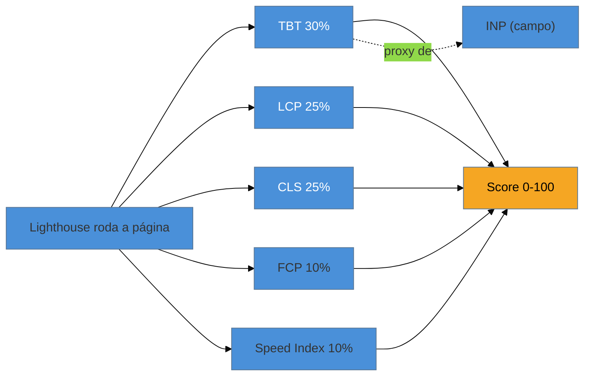

# Lighthouse e PageSpeed Insights

> [!abstract] TL;DR
> **Lighthouse** é o motor de auditoria de laboratório do Google — embutido no DevTools do Chrome — que carrega sua página em condições simuladas e cospe um **score de performance de 0 a 100**, além de diagnósticos acionáveis. **PageSpeed Insights (PSI)** é o site que roda o Lighthouse na nuvem *e* junta os dados de campo do CrUX na mesma tela. Duas armadilhas dominam o uso: (1) o **score é lab**, não o que o Google ranqueia; (2) o score usa **TBT** como proxy de responsividade, não o INP. Use a ferramenta para **depurar e comparar**, lendo os diagnósticos — não para colecionar o número 100.

## O problema: você tem os conceitos, falta a ferramenta

Nas notas anteriores você aprendeu *o que* medir (LCP, INP, CLS) e a diferença entre lab e campo. Mas onde você **vê** esses números pela primeira vez? Como transforma "preciso melhorar o LCP" em "o LCP está alto por causa *desta* imagem *neste* recurso"?

A resposta, para 90% dos desenvolvedores, é o **Lighthouse** — provavelmente a ferramenta de performance mais usada do mundo, porque já vem instalada no Chrome. Abrir o DevTools, clicar em "Lighthouse", "Analyze", e em 20 segundos você tem um relatório. O problema é que esse relatório é fácil de rodar e **fácil de ler errado** — e ler errado leva a otimizar a coisa errada.

## O que o Lighthouse faz

Quando você roda o Lighthouse, ele carrega sua página num ambiente **sintético e controlado**: um perfil de CPU e de rede simulados (por padrão, algo próximo de um celular de gama média numa 4G lenta), cache limpo, sem extensões. Ele mede a página desse carregamento e produz cinco métricas, que combina num único score de 0 a 100.

Aqui está o detalhe que quase ninguém sabe e que muda como você prioriza — **quanto cada métrica pesa no score** (Lighthouse 12, 2024):

| Métrica | Peso | O que é |
|---------|------|---------|
| **TBT** — Total Blocking Time | **30%** | Tempo total em que a thread principal ficou bloqueada (proxy de responsividade) |
| **LCP** — Largest Contentful Paint | **25%** | Quando o maior conteúdo apareceu |
| **CLS** — Cumulative Layout Shift | **25%** | Quanto o layout pulou |
| **FCP** — First Contentful Paint | 10% | Quando o *primeiro* pixel de conteúdo apareceu |
| **Speed Index** | 10% | Quão rápido o conteúdo é preenchido visualmente |

Três métricas — **TBT, LCP e CLS — respondem por 80% do score**. Se você quer mover o número, é nelas que você mexe. FCP e Speed Index são secundárias.

> [!question]- Por que TBT pesa mais que LCP, se a nota-âncora deu tanto destaque ao LCP?
> Porque o Lighthouse mede **responsividade**, mas não pode medir o INP diretamente — o INP precisa de **interações reais do usuário** (cliques, toques), e o Lighthouse só carrega a página, ninguém clica nela. Então ele usa o **TBT** como *proxy de laboratório* para o INP: quanto mais a thread principal fica bloqueada durante o carregamento, pior tende a ser a responsividade quando o usuário chegar. Guarde essa ponte: **no lab, você melhora o TBT para melhorar o INP do campo**. Isso é aprofundado no Galho 3.

## O que o PageSpeed Insights adiciona

O **PageSpeed Insights** (pagespeed.web.dev) é o Lighthouse rodando num servidor do Google — mas com um bônus decisivo: ele mostra, lado a lado, **os dois mundos**.

- No topo, os **Core Web Vitals de campo** (dados reais do **CrUX**, dos últimos 28 dias, no percentil 75). É a seção que diz se você **passa** na avaliação do Google. Vem com um selo verde/amarelo/vermelho por métrica.
- Embaixo, o **relatório de laboratório** (o Lighthouse), com o score e os diagnósticos.

Essa separação visual é a lição da [[03-Dominios/Tecnologia/Web Performance/Medição e Core Web Vitals/03 - Lab vs Field|nota 03]] materializada numa tela só. A parte de cima é a verdade do usuário e do ranking; a parte de baixo é a sua bancada de depuração.

> [!info] Frescor: versões e UI mudam rápido
> Os pesos do score mudam entre versões maiores do Lighthouse (o TBT nem sempre pesou 30%; versões antigas davam mais peso ao FCP). A UI do PSI e do DevTools também é redesenhada com frequência. Ao citar um peso ou um passo de menu num relatório, **grave a versão do Lighthouse** (aparece no rodapé do relatório) e confirme em [developer.chrome.com/docs/lighthouse](https://developer.chrome.com/docs/lighthouse/performance/performance-scoring). Este texto reflete o **Lighthouse 12 (2024)**.

## Como ler o relatório sem se enganar

O erro clássico é olhar só o número grande e colorido no topo. O valor real do Lighthouse está **abaixo**, em duas seções:

1. **Diagnostics / Opportunities** — a lista de problemas concretos e quanto tempo cada correção economizaria ("Elimine recursos que bloqueiam a renderização — economia estimada de 1,2 s", "Sirva imagens em formatos de próxima geração", "Reduza o JavaScript não utilizado"). É aqui que o relatório vira plano de ação.
2. **A trilha de causa** — cada oportunidade aponta o recurso específico (aquele `.js` de 400 KB, aquela imagem de 2 MB). Isso conecta a métrica ruim à causa concreta que você vai atacar nos Galhos 2 e 3.

> [!warning] Perseguir o 100 no Lighthouse
> **O que acontece:** o time investe semanas para tirar o score de 92 para 100 e comemora — mas o ranking e a conversão não mudam.
> **Por quê:** o score é **lab** (uma simulação) e comprime cinco métricas num número. Os últimos pontos costumam vir de micro-otimizações que **não afetam o p75 real** dos usuários. O Google ranqueia pelo **campo (CrUX)**, não pelo score.
> **Como evitar:** trate o score como um **termômetro de tendência**, não como meta. A meta é o campo verde no topo do PSI. Use os *diagnósticos* do Lighthouse para chegar lá; ignore a corrida pelos últimos pontos do score.

> [!warning] Rodar uma vez e confiar no número
> **O que acontece:** você roda o Lighthouse, dá 78, roda de novo, dá 91 — e não sabe em qual acreditar.
> **Por quê:** o lab é sensível a ruído da sua máquina (outras abas, CPU ocupada, rede momentânea). Uma única execução é uma amostra barulhenta.
> **Como evitar:** rode **3–5 vezes** e olhe a **mediana**, ou use o PSI (que roda num ambiente mais estável que seu laptop). Para comparações antes/depois, mantenha as condições idênticas.

**Lighthouse e PSI em uma frase:** o Lighthouse é sua bancada de depuração lab (score de 0–100 dominado por TBT, LCP e CLS, com o TBT servindo de proxy pro INP), e o PageSpeed Insights o embrulha com os dados de campo do CrUX — mas quem manda no ranking é o campo, não o score.

## Como explicar em inglês

> "Lighthouse is Google's lab auditing engine, built into Chrome DevTools. It loads your page under simulated conditions and gives a **0-to-100 performance score**, plus actionable diagnostics. The key thing to understand is the weighting: in Lighthouse 12, TBT is 30%, LCP and CLS are 25% each — so three metrics drive 80% of the score. And critically, Lighthouse can't measure INP directly because that needs real interactions, so it uses **Total Blocking Time as a lab proxy**. PageSpeed Insights runs Lighthouse in the cloud and pairs it with **field data from CrUX**, so you see both worlds on one screen. My rule: the score is for **debugging and comparison** — I chase the field data at the top, not the number 100."

| PT | EN |
|----|----|
| Auditoria de laboratório | Lab audit |
| Pontuação / nota | Score |
| Oportunidades / diagnósticos | Opportunities / diagnostics |
| Recurso que bloqueia a renderização | Render-blocking resource |
| Proxy de laboratório | Lab proxy |
| Tempo total de bloqueio | Total Blocking Time (TBT) |
| Termômetro de tendência | Trend gauge |

## O que vem a seguir

O PSI te deu uma amostra de campo (o CrUX) misturada ao lab. Mas de onde vem esse dado de campo, exatamente? Quem o coleta, com que frequência, e por que ele — e não o seu score — é o que decide o ranking? Essa é a próxima peça.

- [[03-Dominios/Tecnologia/Web Performance/Medição e Core Web Vitals/05 - CrUX e dados de campo|05 — CrUX e dados de campo]] — o Chrome UX Report por dentro: origem, latência de 28 dias e limites.
- [[03-Dominios/Tecnologia/Web Performance/Medição e Core Web Vitals/07 - Métricas de apoio|07 — Métricas de apoio]] — o que é TBT, FCP e Speed Index de fato, e como se ligam aos CWV.

## Fontes

- **Chrome for Developers** — [*Lighthouse performance scoring*](https://developer.chrome.com/docs/lighthouse/performance/performance-scoring) — a documentação oficial dos pesos do score e do cálculo.
- **web.dev (Google)** — [*Total Blocking Time*](https://web.dev/articles/tbt) — por que o TBT existe e como ele se relaciona com a responsividade (INP).
- **PageSpeed Insights** — [pagespeed.web.dev](https://pagespeed.web.dev/) — a ferramenta que combina Lighthouse (lab) e CrUX (field) na mesma análise.
