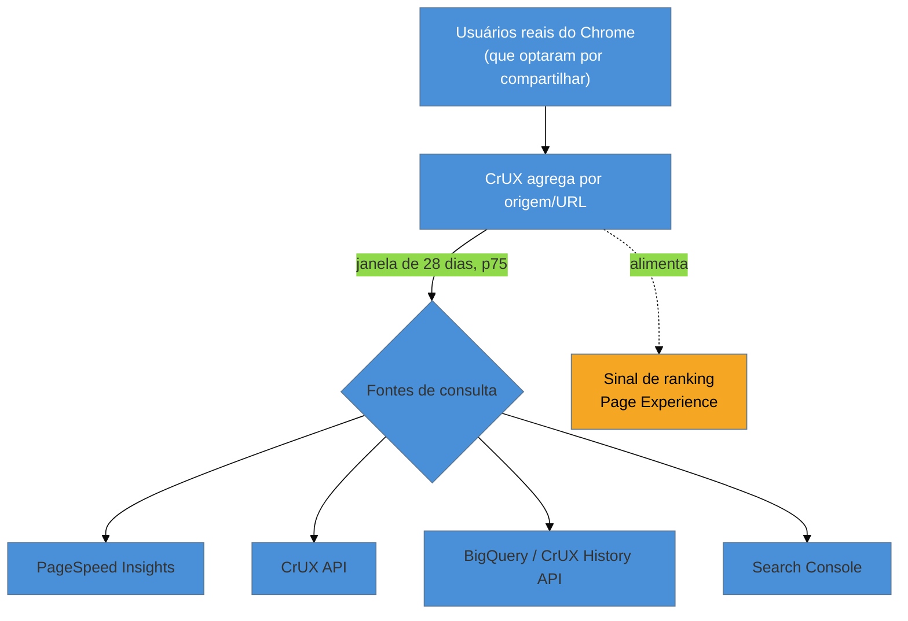

# CrUX e dados de campo

> [!abstract] TL;DR
> O **CrUX (Chrome UX Report)** é o dataset público do Google com os Core Web Vitals de **usuários reais do Chrome** que optaram por compartilhar dados de navegação. É a fonte de campo que o Google usa para o ranking de Page Experience — avaliada no **p75 de uma janela móvel de 28 dias**. Suas duas grandes limitações: só reporta origens com **tráfego suficiente** (sites pequenos ficam de fora) e tem **latência** (a janela de 28 dias reage devagar a melhorias). Você o consulta pelo PageSpeed Insights, pela CrUX API ou no BigQuery — e o usa para saber se **passou**, não para depurar.

## O problema: de onde vem o "campo" que o Google enxerga?

Na [[03-Dominios/Tecnologia/Web Performance/Medição e Core Web Vitals/04 - Lighthouse e PageSpeed Insights|nota 04]] você viu o PageSpeed mostrar, no topo, os Core Web Vitals "de campo" com um selo verde ou vermelho. Aquilo decide se você passa na avaliação de performance do Google. Mas quem coletou esse dado? Você não instrumentou nada. Como o Google sabe o LCP que os seus usuários viveram?

A resposta é o **CrUX**, e entendê-lo responde perguntas práticas urgentes: *por que meu site novo não tem dados de campo? por que otimizei ontem e o CrUX ainda está vermelho? o número que o Google vê é o mesmo que eu vejo no meu RUM?*

## O que é o CrUX

O **Chrome UX Report** é um programa do Google que coleta métricas de performance de **usuários reais do Chrome** — aqueles que ativaram a sincronização e concordaram em reportar estatísticas de uso — enquanto navegam por sites públicos. O Google agrega esses dados por **origem** (o domínio inteiro) e, quando há volume, por **URL específica**, e publica o resultado.

É o **RUM que o Google faz por você**, de graça — mas com o Chrome apenas, e com as regras dele. Três características definem como você deve usá-lo:

1. **Janela móvel de 28 dias.** O CwV que o PSI mostra é o agregado dos **últimos 28 dias**, no percentil 75. Não é o "agora"; é uma média corrida de quase um mês.
2. **Só Chrome, só origens públicas, só quem optou.** Safari, Firefox e usuários que não compartilham dados não entram. Intranets e páginas atrás de login também não.
3. **Precisa de tráfego suficiente.** Uma origem (ou URL) só aparece no CrUX se tiver visitantes bastante para o dado ser estatisticamente significativo e anônimo. Sites pequenos e páginas de cauda longa simplesmente **não têm dados de campo**.

## Como você consulta o CrUX

Há quatro portas de entrada, do mais simples ao mais poderoso:

| Ferramenta | O que dá | Quando usar |
|-----------|----------|-------------|
| **PageSpeed Insights** | CWV de campo de uma URL/origem, na hora | Checar rápido se uma página passa |
| **Search Console** (relatório Core Web Vitals) | Suas URLs agrupadas por status (bom/a melhorar/ruim) | Ver o site inteiro, achar grupos de páginas ruins |
| **CrUX API** | Dados de campo via requisição programática | Automatizar, montar dashboards |
| **CrUX no BigQuery** / **CrUX History API** | Histórico mensal, tendências longas, comparar com concorrentes | Análise profunda, evolução ao longo de meses |

Para o dia a dia, PSI e Search Console resolvem. O BigQuery entra quando você quer **tendência histórica** ou comparar sua origem com a de um concorrente (o CrUX é público — você pode consultar qualquer domínio com tráfego).

> [!question]- Se o CrUX é o que o Google usa, por que eu ainda precisaria do meu próprio RUM (nota 06)?
> Por três razões. **Granularidade:** o CrUX agrega por origem/URL e p75; o seu RUM pode segmentar por rota, país, tipo de dispositivo, versão de deploy, teste A/B. **Cobertura:** o CrUX só tem Chrome e só origens com tráfego; o seu RUM cobre Safari, Firefox e páginas novas ou de baixo volume. **Latência:** o CrUX tem a janela de 28 dias; o seu RUM te mostra o efeito de um deploy em horas. O CrUX diz se você **passou no exame do Google**; o seu RUM diz **por que e para quem**.

## As duas armadilhas que confundem todo mundo

> [!warning] Esperar o CrUX reagir imediatamente a uma otimização
> **O que acontece:** você faz um deploy que melhora muito o LCP, checa o PSI no dia seguinte e o campo continua vermelho. Pânico: "não funcionou?". **Por quê:** o CrUX é uma **janela móvel de 28 dias**. No dia seguinte ao deploy, só ~1/28 dos dados refletem a melhoria; os outros 27 dias ainda carregam a versão antiga. A métrica só "vira" verde depois de dias a semanas. **Como evitar:** para verificar o efeito **imediato** de uma mudança, use o **seu RUM** (reage em horas) ou o **lab** (reage na hora). Trate o CrUX como o **placar oficial que atualiza devagar**, não como feedback de deploy.

> [!warning] Concluir que "não tem problema" porque não há dados de campo
> **O que acontece:** o PSI mostra "dados de campo insuficientes" e o time relaxa, achando que está tudo bem. **Por quê:** ausência de dado **não é** ausência de problema — é ausência de **tráfego suficiente** no CrUX. Sites novos, páginas de baixo volume e origens pequenas simplesmente não aparecem, mesmo que estejam lentíssimos. **Como evitar:** quando não há CrUX, apoie-se no **lab** (Lighthouse) e no **seu RUM** para ter sinal. E lembre: mesmo sem aparecer no CrUX, a performance ainda afeta a conversão do usuário que está lá.

**CrUX em uma frase:** é o RUM público do Google — Core Web Vitals de usuários reais do Chrome, no p75 de uma janela de 28 dias — que decide o seu Page Experience, poderoso para saber se você *passou*, mas lento demais e incompleto demais para servir de feedback de deploy ou cobrir sites pequenos.

## Como explicar em inglês

> "CrUX — the Chrome User Experience Report — is Google's public dataset of Core Web Vitals from **real Chrome users** who opted into sharing usage data. It's the field data that powers Google's Page Experience ranking, assessed at the **75th percentile over a rolling 28-day window**. Two limits matter: it only covers **origins with enough traffic**, so small sites get 'no field data', and the 28-day window means it **reacts slowly** — after a fix, CrUX can stay red for weeks. So I use CrUX to know whether I **passed**, and my own RUM to know **why and how fast** a change moved the needle."

| PT | EN |
|----|----|
| Dados de campo | Field data |
| Janela móvel de 28 dias | Rolling 28-day window |
| Origem (domínio) | Origin |
| Tráfego suficiente | Sufficient traffic |
| Dados de campo insuficientes | Insufficient field data |
| Placar oficial | Official scoreboard |

## O que vem a seguir

O CrUX é ótimo, mas você já viu seus limites: 28 dias de latência, só Chrome, só sites grandes, e granularidade grossa. Para todo o resto — reagir rápido, cobrir todo mundo, segmentar por rota e deploy — você precisa coletar **os seus próprios** dados de campo. É o que a biblioteca `web-vitals` faz.

- [[03-Dominios/Tecnologia/Web Performance/Medição e Core Web Vitals/06 - Instrumentando RUM|06 — Instrumentando RUM]] — coletar seus CWV de usuários reais com a lib `web-vitals` e mandar pra analytics.
- [[03-Dominios/Tecnologia/Web Performance/Medição e Core Web Vitals/08 - Performance budgets e diagnóstico|08 — Performance budgets e diagnóstico]] — como transformar CrUX + RUM em metas e diagnóstico.

## Fontes

- **Chrome for Developers** — [*Chrome UX Report (CrUX)*](https://developer.chrome.com/docs/crux) — documentação oficial: origem dos dados, janela de 28 dias, elegibilidade por tráfego.
- **Chrome for Developers** — [*CrUX API*](https://developer.chrome.com/docs/crux/api) e [*CrUX History API*](https://developer.chrome.com/docs/crux/history-api) — consulta programática e histórico.
- **web.dev (Google)** — [*Google tools for measuring Core Web Vitals*](https://web.dev/articles/vitals-tools) — como PSI, Search Console e CrUX se encaixam.
