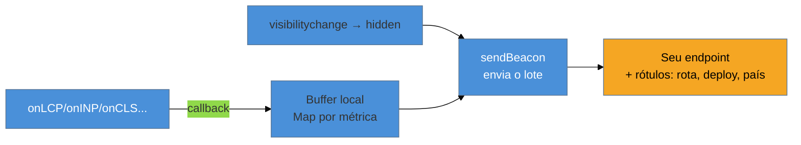

# Instrumentando RUM

> [!abstract] TL;DR
> Para ter dados de campo **seus** — mais rápidos e granulares que o CrUX —, você instrumenta o site com a biblioteca **`web-vitals`** (do próprio time do Chrome). Ela expõe `onLCP`, `onINP`, `onCLS`, `onFCP` e `onTTFB`: cada uma chama seu callback quando a métrica está pronta, com valor e `rating`. O truque que separa quem acerta de quem perde dados: as métricas (sobretudo INP e CLS) **só ficam finais quando a página está sendo fechada**, então você bufferiza e envia tudo de uma vez com `navigator.sendBeacon` no evento `visibilitychange` → `hidden`. Enviar cedo demais, ou usar `unload`, perde dados.

## O problema: o CrUX é lento e cego demais

Na [[03-Dominios/Tecnologia/Web Performance/Medição e Core Web Vitals/05 - CrUX e dados de campo|nota 05]] você viu os limites do CrUX: 28 dias de latência, só Chrome, só sites com tráfego, e granularidade de origem/URL. Isso é insuficiente para perguntas do dia a dia: *o meu último deploy melhorou o LCP? a rota de checkout está pior que a home? os usuários do Brasil sofrem mais que os da Europa? o teste A/B B degradou o INP?*

Para responder a isso você precisa coletar os Core Web Vitals **você mesmo**, dos seus usuários reais, com os rótulos que só você tem (rota, versão de deploy, país, experimento). Isso é montar o **seu RUM** — e o Google entrega a peça mais difícil de graça.

## A biblioteca `web-vitals`

`web-vitals` é a biblioteca oficial mantida pelo time do Chrome. Ela resolve a parte espinhosa — **medir cada CWV corretamente no browser**, com todas as sutilezas de timing — e deixa para você só a parte fácil: decidir o que fazer com o número. Versão atual em julho de 2026: **v5.x** (`npm install web-vitals`).

A API central são cinco funções, uma por métrica:

```js
import { onLCP, onINP, onCLS, onFCP, onTTFB } from 'web-vitals';

onLCP(console.log);
onINP(console.log);
onCLS(console.log);
```

Cada função recebe um callback que é chamado **quando a métrica fica pronta**, com um objeto assim:

```js
{
  name: 'LCP',
  value: 2380,            // o valor medido (ms para LCP/INP, unidade abstrata para CLS)
  rating: 'good',         // 'good' | 'needs-improvement' | 'poor' — já classificado pra você
  delta: 2380,            // quanto mudou desde o último report (pra CLS/INP que acumulam)
  id: 'v5-1720...',       // id único desta medição, pra deduplicar no servidor
  navigationType: 'navigate'
}
```

Repare que a lib **já te dá o `rating`** — ela conhece os limiares da [[03-Dominios/Tecnologia/Web Performance/Medição e Core Web Vitals/02 - Os três Core Web Vitals|nota 02]] e classifica sozinha. Você não precisa cravar `2500` no seu código (e nem deve — os limiares podem mudar).

## O erro que faz você perder metade dos dados

A intuição diz: "quando a métrica chegar no callback, mando pro servidor". Parece certo. Está errado — e é o erro nº 1 de quem instrumenta RUM pela primeira vez.

```js
// ❌ ERRADO — envia cada métrica assim que chega
import { onLCP, onINP, onCLS } from 'web-vitals';

function enviar(metric) {
  fetch('/analytics/vitals', {
    method: 'POST',
    body: JSON.stringify(metric),
  });
}

onLCP(enviar);
onINP(enviar);   // ⚠️ o INP quase nunca está "pronto" no meio da visita
onCLS(enviar);   // ⚠️ o CLS continua acumulando até a página fechar
```

Por que falha? Porque **INP e CLS são métricas de sessão inteira**. O INP é a pior interação de *toda* a visita — ele só tem o valor final quando o usuário para de interagir, ou seja, quando vai embora. O CLS acumula deslocamentos *até o último instante*. Se você envia no meio da visita, manda um valor **provisório e otimista**, e perde os deslocamentos e as interações que vieram depois. Além disso, um `fetch` disparado no fechamento da aba é frequentemente **cancelado** pelo browser.

A correção tem duas partes: **bufferizar** as métricas e **enviar tudo de uma vez quando a página fica oculta**, com uma API feita para sobreviver ao fechamento — `navigator.sendBeacon`.

```js
// ✅ CERTO — bufferiza e envia no visibilitychange → hidden
import { onLCP, onINP, onCLS, onFCP, onTTFB } from 'web-vitals';

const fila = new Map();

function guardar(metric) {
  fila.set(metric.name, metric);   // sobrescreve: só o valor mais recente/final importa
}

onLCP(guardar);
onINP(guardar);
onCLS(guardar);
onFCP(guardar);
onTTFB(guardar);

function despachar() {
  if (fila.size === 0) return;
  const corpo = JSON.stringify({
    rota: location.pathname,
    metrics: [...fila.values()],
  });
  // sendBeacon é assíncrono, não-bloqueante e sobrevive ao unload da página
  navigator.sendBeacon('/analytics/vitals', corpo);
  fila.clear();
}

// 'hidden' cobre fechar a aba, trocar de app no celular, navegar pra outra página
addEventListener('visibilitychange', () => {
  if (document.visibilityState === 'hidden') despachar();
});
```

> [!question]- Por que `visibilitychange` → `hidden` e não o evento `unload`?
> O evento `unload` (e o `beforeunload`) é **não-confiável no mobile**: quando o usuário troca de app ou o sistema mata a aba em segundo plano, o `unload` muitas vezes **não dispara**. O `visibilitychange` para `hidden` é o último momento garantido em que sua página ainda está viva — dispara ao minimizar, trocar de aba, trocar de app. É o gancho oficialmente recomendado para enviar telemetria. Usar `unload` é a razão silenciosa de muitos RUMs subcontarem sessões mobile.



## Attribution: do "está ruim" para "está ruim por causa disto"

A build padrão te diz *que* o LCP está em 4 s. A **build de attribution** te diz *qual elemento* é o culpado. Basta importar de `web-vitals/attribution`:

```js
import { onLCP } from 'web-vitals/attribution';

onLCP((metric) => {
  // metric.attribution.target → o seletor CSS do elemento LCP
  // metric.attribution.timeToFirstByte, resourceLoadDelay, elementRenderDelay...
  guardar({ ...metric, alvo: metric.attribution.target });
});
```

Isso é ouro para diagnóstico: em vez de "o LCP do mobile está ruim", seu dashboard mostra "o LCP do mobile está ruim **e o elemento é `img.hero-banner`**". Você acabou de pular direto para a causa — que é justamente o assunto dos Galhos 2 e 3.

> [!warning] Coletar sem rotular
> **O que acontece:** você junta milhões de métricas, mas só consegue dizer "o INP médio do site é X" — a mesma coisa que o CrUX já dava, só que com mais trabalho. **Por quê:** o valor do RUM próprio está nos **rótulos** (rota, versão de deploy, país, dispositivo, experimento). Sem eles, você não consegue segmentar nem achar o culpado. **Como evitar:** anexe dimensões ao enviar (`location.pathname`, um `BUILD_ID`, o país do CDN, o braço do A/B). É isso que transforma "estamos lentos" em "a rota `/checkout` no deploy `abc123` regrediu o INP no Android".

**Instrumentar RUM em uma frase:** a lib `web-vitals` mede cada CWV corretamente e já classifica o `rating`; você bufferiza os valores e despacha o lote com `sendBeacon` no `visibilitychange → hidden` (porque INP e CLS só ficam finais no fim da visita), rotulando cada envio para poder segmentar e diagnosticar.

## Como explicar em inglês

> "For field data that's faster and more granular than CrUX, I instrument the site with Google's **`web-vitals`** library. It exposes `onLCP`, `onINP`, `onCLS` — each fires a callback when the metric is ready, and it even gives me the `rating` classified against the current thresholds. The subtle part is *when* to send: INP and CLS aren't final until the user leaves, so I **buffer** the metrics and flush them all with `navigator.sendBeacon` on `visibilitychange` to `hidden` — never on `unload`, which is unreliable on mobile. And I always attach labels — route, deploy ID, country — so I can segment and pinpoint the culprit, especially with the attribution build."

| PT | EN |
|----|----|
| Instrumentar | To instrument |
| Bufferizar / enfileirar | To buffer / queue |
| Despachar o lote | Flush the batch |
| Evento de descarregamento | Unload event |
| Página oculta | Hidden page |
| Atribuição (do culpado) | Attribution |
| Rótulo / dimensão | Label / dimension |

## O que vem a seguir

Você já mede os três CWV, no lab e no campo. Mas quando um deles está ruim, os CWV sozinhos não te dizem *onde* dentro do carregamento a coisa emperrou. Para isso existem as **métricas de apoio** — TTFB, FCP, TBT, Speed Index — que decompõem o tempo em etapas e apontam o pedaço problemático.

- [[03-Dominios/Tecnologia/Web Performance/Medição e Core Web Vitals/07 - Métricas de apoio|07 — Métricas de apoio]] — TTFB, FCP, TBT, Speed Index e como se ligam aos Core Web Vitals.
- [[03-Dominios/Tecnologia/Web Performance/Medição e Core Web Vitals/08 - Performance budgets e diagnóstico|08 — Performance budgets e diagnóstico]] — usar tudo isso para definir metas e caçar a causa raiz.

## Fontes

- **GoogleChrome/web-vitals** — [repositório oficial no GitHub](https://github.com/GoogleChrome/web-vitals) — API, build de attribution e o padrão recomendado de envio.
- **web-vitals** — [pacote no npm](https://www.npmjs.com/package/web-vitals) — versão atual e instruções de instalação.
- **web.dev (Google)** — [*Best practices for measuring Web Vitals in the field*](https://web.dev/articles/vitals-field-measurement-best-practices) — por que bufferizar e usar `sendBeacon` no `visibilitychange`.
