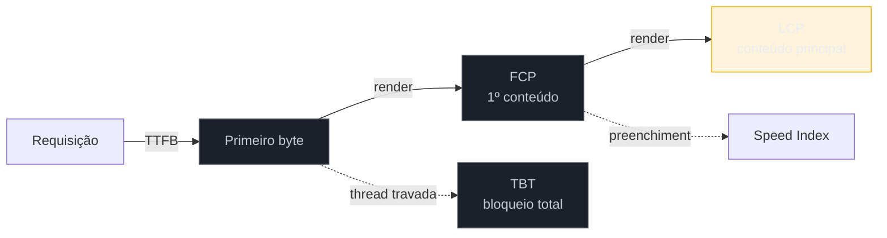

# Métricas de apoio

> [!abstract] TL;DR
> Os três Core Web Vitals dizem *se* a página está boa; as **métricas de apoio** dizem *onde* ela emperrou. **TTFB** (Time to First Byte) mede o servidor + a rede até o primeiro byte. **FCP** (First Contentful Paint) mede até o primeiro pixel de conteúdo. **TBT** (Total Blocking Time) mede quanto a thread principal ficou travada — é o proxy lab do INP. **Speed Index** mede a rapidez do preenchimento visual. Elas não são ranqueadas pelo Google, mas são **diagnósticas**: TTFB e FCP decompõem o LCP em etapas; TBT antecipa o INP. Sem elas, você sabe que o LCP está ruim, mas não se a culpa é do servidor, da rede ou do JavaScript.

## O problema: "o LCP está em 4 segundos" — e agora?

Você mediu, o LCP deu 4 s, está vermelho. Ótimo, mas essa informação sozinha não te diz **o que consertar**. O LCP de 4 s pode ser porque:

- o **servidor** demorou 2 s só para responder o primeiro byte (problema de backend/rede);
- ou o servidor foi rápido, mas um **script bloqueou** a renderização por 2 s (problema de JavaScript);
- ou tudo foi rápido, mas a **imagem hero** tinha 3 MB e demorou a baixar (problema de asset).

Três causas totalmente diferentes, três times diferentes, três soluções diferentes — e o LCP, sozinho, não distingue entre elas. As métricas de apoio existem justamente para **fatiar o tempo** e apontar qual etapa é a culpada. Elas são o instrumento de diagnóstico que transforma um CWV ruim em uma tarefa concreta.

## As quatro que importam

### TTFB — Time to First Byte

**TTFB** mede o tempo do início da navegação até o **primeiro byte** da resposta chegar ao browser. Ele engloba tudo que acontece *antes* do seu HTML começar a chegar: resolução de DNS, handshake de conexão, tempo de processamento do servidor, latência de rede, redirecionamentos.

É a **fundação** do LCP: se o TTFB é 2 s, o LCP **não tem como** ser bom, porque o browser nem recebeu o HTML ainda. Um TTFB alto aponta para o backend, o banco de dados, a CDN mal configurada ou redirecionamentos em cadeia. Referência informal de "bom": **≤ 800 ms**.

> [!question]- Se o TTFB é sobre o servidor, por que um dev de frontend deveria se importar?
> Porque o TTFB é a **primeira parcela** do orçamento do LCP, e você precisa saber se o seu LCP ruim é "culpa sua" (frontend) ou não. Se o TTFB come 2,5 s dos 4 s de LCP, nenhuma otimização de imagem ou de CSS que você fizer vai salvar a métrica — o problema está antes, no servidor ou na CDN. Diagnosticar isso evita semanas otimizando a camada errada. O TTFB é o divisor de águas entre "problema de entrega" e "problema de renderização".

### FCP — First Contentful Paint

**FCP** mede até o **primeiro** pedaço de conteúdo aparecer — qualquer texto, imagem ou SVG. É o momento em que o usuário sai da tela em branco e tem o primeiro sinal de que "algo está acontecendo".

O FCP fica **entre** o TTFB e o LCP. Se TTFB é bom mas FCP é ruim, o gargalo está entre receber o HTML e pintar o primeiro pixel — tipicamente **recursos que bloqueiam a renderização** (CSS e JS no `<head>` que o browser precisa processar antes de pintar). Referência de "bom": **≤ 1,8 s**. A relação TTFB → FCP → LCP forma uma cascata: cada uma herda o atraso da anterior.

### TBT — Total Blocking Time

**TBT** soma, entre o FCP e o momento em que a página fica interativa, todo o tempo em que a **thread principal ficou bloqueada** por tarefas longas (as que passam de 50 ms). É a métrica que mede o "peso" do seu JavaScript no carregamento.

Como você viu na [[03-Dominios/Tecnologia/Web Performance/Medição e Core Web Vitals/04 - Lighthouse e PageSpeed Insights|nota 04]], o TBT é o **proxy de laboratório do INP** — pesa 30% no score do Lighthouse justamente porque, no lab, ninguém clica na página, então não dá para medir INP de verdade. TBT alto no lab → INP provavelmente ruim no campo. As causas (long tasks, hidratação, scripts de terceiros) são o coração do Galho 3.

### Speed Index

**Speed Index** mede quão **rápido o conteúdo visível é preenchido** durante o carregamento — não um instante único, mas a *velocidade média* com que a tela se completa. Duas páginas podem ter o mesmo LCP, mas aquela que preenche a tela gradualmente e cedo "parece" mais rápida do que a que fica em branco e estoura tudo de uma vez no fim. É uma métrica de **percepção** de progresso.

## Como elas se ligam aos Core Web Vitals

A tabela mental que vale a pena guardar:

| Métrica de apoio | Decompõe / antecipa | O que um valor ruim aponta |
|------------------|---------------------|----------------------------|
| **TTFB** | Primeira parcela do **LCP** | Servidor, CDN, DNS, redirecionamentos |
| **FCP** | Etapa intermediária do **LCP** | Recursos que bloqueiam a renderização (CSS/JS no head) |
| **TBT** | Proxy lab do **INP** | JavaScript pesado, long tasks, hidratação |
| **Speed Index** | Percepção geral de carregamento | Ordem e progressividade da renderização |

> [!warning] Otimizar métricas de apoio como se fossem o objetivo
> **O que acontece:** o time reduz o TTFB de 900 ms para 400 ms e comemora, mas o LCP continua ruim. **Por quê:** as métricas de apoio são **diagnósticas**, não metas em si. Melhorar o TTFB só ajuda o LCP se o TTFB *era* o gargalo. Se a causa real era a imagem hero de 3 MB, cortar o TTFB pela metade quase não move o LCP. **Como evitar:** use as métricas de apoio para **localizar** o gargalo do CWV, ataque **essa** causa, e valide olhando o CWV (que é o que importa pro usuário e pro ranking) voltar ao verde.

**Métricas de apoio em uma frase:** TTFB, FCP, TBT e Speed Index não são ranqueadas, mas fatiam o carregamento em etapas — servidor, primeiro pixel, bloqueio de JS, preenchimento — para você descobrir *onde* um Core Web Vital emperrou e atacar a causa certa.

## Como explicar em inglês

> "The Core Web Vitals tell you *whether* a page is good; the supporting metrics tell you *where* it broke. **TTFB** — Time to First Byte — is server plus network latency, the foundation of LCP. **FCP** — First Contentful Paint — is the first pixel of content, sitting between TTFB and LCP. **TBT** — Total Blocking Time — measures how long the main thread was blocked, and it's the **lab proxy for INP**. And **Speed Index** captures how quickly the screen fills in. They aren't ranked by Google, but they're diagnostic: if LCP is bad, I look at TTFB and FCP to see whether it's a server problem or a rendering problem before I touch anything."

| PT | EN |
|----|----|
| Tempo até o primeiro byte | Time to First Byte (TTFB) |
| Primeiro conteúdo pintado | First Contentful Paint (FCP) |
| Tempo total de bloqueio | Total Blocking Time (TBT) |
| Índice de velocidade | Speed Index |
| Recurso que bloqueia a renderização | Render-blocking resource |
| Tarefa longa | Long task |
| Métrica diagnóstica | Diagnostic metric |

## O que vem a seguir

Você agora tem o arsenal completo: os três Core Web Vitals, a diferença lab/field, as ferramentas (Lighthouse, PSI, CrUX, RUM) e as métricas de apoio que apontam a causa. A peça final é **estratégica**: como transformar tudo isso em metas concretas (orçamentos de performance) e num método de diagnóstico que fecha o ciclo — e faz a ponte para *como* otimizar, nos próximos galhos.

- [[03-Dominios/Tecnologia/Web Performance/Medição e Core Web Vitals/08 - Performance budgets e diagnóstico|08 — Performance budgets e diagnóstico]] — orçamentos, priorização e o DevTools Performance panel; o capstone do galho.

## Fontes

- **web.dev (Google)** — [*Time to First Byte (TTFB)*](https://web.dev/articles/ttfb) — definição, o que engloba e como se liga ao LCP.
- **web.dev (Google)** — [*First Contentful Paint (FCP)*](https://web.dev/articles/fcp) e [*Total Blocking Time (TBT)*](https://web.dev/articles/tbt) — as métricas intermediárias e o proxy do INP.
- **web.dev (Google)** — [*Speed Index*](https://web.dev/articles/speed-index) — a métrica de percepção de preenchimento visual.
