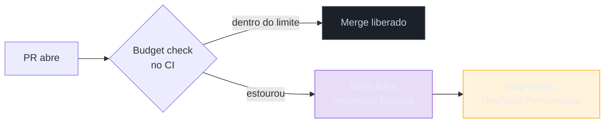

# Performance budgets e diagnóstico

> [!abstract] TL;DR
> Medir sem meta vira vigilância passiva. Um **performance budget** é um limite explícito — "o LCP não passa de 2,5 s", "o JS inicial não passa de 170 KB" — que transforma performance de opinião em regra objetiva, verificável e capaz de barrar uma regressão antes de ela chegar ao usuário. Há três tipos: **por métrica** (tempo de LCP/INP/CLS), **por quantidade** (KB, número de requisições) e **por regra** (score do Lighthouse). Quando um budget estoura, o **DevTools Performance panel** é o microscópio que mostra a cascata de rede e a thread principal para achar a causa. Este é o fecho do Galho 1 — e a ponte para *como* consertar, nos Galhos 2 (carregamento) e 3 (runtime).

## O problema: medir vira paisagem

Você instrumentou tudo — CrUX, RUM, Lighthouse no CI. Os dashboards são lindos. E mesmo assim, seis meses depois, o LCP degradou de 2,1 s para 3,4 s **sem ninguém perceber**. Como? Porque cada PR adicionou "só mais um scriptzinho", "só mais uma fonte", "só mais uma imagem" — cada um inofensivo, todos juntos fatais. Ninguém tomou a decisão de piorar; a performance **apodreceu por mil cortes**.

Métrica sem meta é paisagem: você olha e não age, porque não há uma linha que diga "isto é inaceitável". A peça que faltava não é mais medição — é um **compromisso quantitativo** que converta o número num portão: passou daqui, quebra o build. É isso o performance budget, e é o que fecha o ciclo de medição que este galho inteiro construiu.

## O que é um performance budget

Um **performance budget** é um limite que sua equipe se compromete a não ultrapassar. A palavra "orçamento" é literal: assim como um orçamento financeiro te obriga a escolher onde gastar, um orçamento de performance te obriga a escolher onde "gastar" bytes e milissegundos. Quer adicionar uma biblioteca de 80 KB? Então algo precisa sair, ou o budget estoura.

Ele muda a **política** do time de três formas:

- Torna performance **objetiva** — "está lento" vira "o LCP passou de 2,5 s", que não admite debate.
- Torna performance **preventiva** — o budget roda no CI e barra a regressão **antes** do merge, em vez de descobri-la no CrUX 28 dias depois.
- Torna performance **um trade-off explícito** — cada feature nova precisa caber no orçamento, forçando a conversa de custo na hora certa.

## Os três tipos de budget

Nem todo budget é igual. Combine os três para cobrir causa e efeito:

| Tipo | Exemplo | Mede | Força |
|------|---------|------|-------|
| **Por métrica** (milestone) | LCP ≤ 2,5 s · INP ≤ 200 ms · CLS ≤ 0,1 | O **efeito** no usuário | Alinhado ao que o Google ranqueia; é a meta final |
| **Por quantidade** | JS inicial ≤ 170 KB · imagens ≤ 500 KB · ≤ 50 requisições | A **causa** controlável | Acionável direto pelo dev; fácil de checar no bundle |
| **Por regra** | Score Lighthouse ≥ 90 · nenhum recurso render-blocking | Conformidade composta | Bom guarda-chuva, mas menos preciso (ver nota 04) |

> [!question]- Por que preciso de budget de quantidade se o de métrica já mede o que importa?
> Porque o budget de **métrica** te diz que algo quebrou, mas não é **acionável na hora do commit**. Um dev abrindo um PR não controla diretamente "o LCP" — mas controla diretamente "adicionei 90 KB de JS". O budget de **quantidade** (bytes, requisições) é um *early warning* que você verifica no próprio bundle, antes mesmo de rodar a página. A regra de bolso: budget de quantidade para **prevenir** (barato, imediato, no bundle), budget de métrica para **validar** (é o efeito real no usuário). Um sem o outro deixa um flanco aberto.

### De onde tirar os números

Um budget arbitrário é ignorado; um budget fundamentado é respeitado. Três âncoras:

1. **Os limiares dos Core Web Vitals** (nota 02) dão o teto das métricas: LCP 2,5 s, INP 200 ms, CLS 0,1. Não invente — o Google já definiu o "bom".
2. **O orçamento de quantidade** sai de um cálculo reverso: se você quer LCP ≤ 2,5 s numa 4G mediana (~1,6 Mbps efetivos), quantos KB cabem nesse tempo? Daí vem a regra de bolso dos **~170 KB de JS comprimido** para a rota inicial.
3. **A concorrência**: use o CrUX (que é público, nota 05) para medir os concorrentes e definir uma meta de "ser mais rápido que eles", não só de "passar no exame".

> [!warning] Definir o budget e nunca fazê-lo falhar
> **O que acontece:** o time escreve um `budget.json` bonito, mas o CI só *avisa* quando estoura — nunca *quebra* o build. Em três meses todo mundo ignora o aviso e a performance apodrece igual. **Por quê:** um budget que não bloqueia é uma sugestão, e sugestões perdem para prazos. Sem consequência, não há política. **Como evitar:** faça o budget **falhar o build** (ou bloquear o merge) quando estourar. A dor precisa ser sentida **antes** do merge — no Galho 4 você monta isso com Lighthouse CI. Um budget sem dente é teatro.

## Diagnóstico: o DevTools Performance panel

Quando um budget estoura — ou o CrUX fica vermelho — você precisa descer do "o quê" para o "onde". A ferramenta mais poderosa para isso é o **painel Performance do Chrome DevTools**, que grava um traço detalhado de tudo que aconteceu no carregamento e te dá duas visões decisivas:

- **A cascata de rede** — cada recurso como uma barra no tempo: quando começou, quanto esperou, quanto baixou. É onde você vê o TTFB alto (barra que demora a começar), a imagem hero gigante que atrasa o LCP, o recurso render-blocking que segura o FCP. As métricas de apoio da [[03-Dominios/Tecnologia/Web Performance/Medição e Core Web Vitals/07 - Métricas de apoio|nota 07]] ganham corpo visual aqui.
- **A trilha da thread principal** — o "flame chart" das tarefas de JavaScript. As **long tasks** (barras longas, marcadas com um triângulo vermelho) são exatamente o que infla o TBT e degrada o INP. É aqui que você vê *qual função* está travando a página.

O painel também marca os **eventos de métrica** (FCP, LCP, camadas de layout shift) na linha do tempo, então você lê a causa e o efeito na mesma tela: "o LCP às 3,2 s? porque *esta* imagem, nesta barra da cascata, só terminou de baixar aí".

> [!example] O método de diagnóstico em 4 passos
> 1. **Qual métrica?** Olhe o campo (CrUX/RUM): é LCP, INP ou CLS que está ruim? Cada um aponta uma família de causas.
> 2. **Para quem?** Segmente pelo p75, por dispositivo, por rota (é o valor do seu RUM, nota 06). "Ruim no mobile, na home."
> 3. **Onde no tempo?** Grave o Performance panel reproduzindo a condição ruim. Ache a etapa culpada na cascata (rede) ou na thread (JS).
> 4. **Ataque a causa, valide o efeito.** Corrija a causa concreta e confirme o CWV voltar ao verde no campo — não pare no lab.

## O que este galho te deu — e o que vem depois

Feche os olhos e revise o arco do Galho 1. Você começou entendendo **por que** performance importa (receita, retenção, ranking — nota 01). Aprendeu **o quê** medir (LCP, INP, CLS — nota 02) e **de onde** vem o dado (lab vs field — nota 03). Pegou as **ferramentas** (Lighthouse/PSI, CrUX, RUM — notas 04–06) e as **métricas de apoio** que apontam a causa (nota 07). E agora fechou com **metas e diagnóstico** — budgets que barram regressão e o método para caçar a causa raiz.

Você domina o ciclo de **medição**. Mas medir e diagnosticar revela *onde* está o problema — não *como* consertá-lo. E é exatamente aí que os próximos galhos entram:

**Performance budgets e diagnóstico em uma frase:** um budget converte a métrica num limite que barra a regressão antes do usuário, e o DevTools Performance panel é o microscópio que, quando o limite estoura, mostra na cascata de rede e na thread principal *qual recurso ou função* é a causa — fechando o ciclo de medição e abrindo o de otimização.

## O que vem a seguir

O diagnóstico apontou a causa; agora é hora de atacá-la. As duas grandes famílias de causa têm cada uma seu galho:

- **G2 — Performance de Carregamento** *(a construir)* — quando o diagnóstico aponta LCP/FCP/TTFB: critical rendering path, resource hints, imagens, fontes, compressão, cache/CDN. É o "carregar rápido" que o LCP mede. Já tangenciado em [[03-Dominios/Tecnologia/HTML/10 - Performance em HTML - resource hints e critical path|HTML 10]] e [[03-Dominios/Tecnologia/CSS/12 - Performance CSS|CSS 12]].
- **G3 — Performance de Runtime & Rendering** *(a construir)* — quando o diagnóstico aponta INP/TBT/CLS: main thread, long tasks, reflow/repaint, custo de JS e hidratação. É o "manter responsivo". Tangenciado em [[03-Dominios/Tecnologia/React/React core/17 - Performance no React|React core 17]] e [[03-Dominios/Tecnologia/Plataforma Web/Rendering Pipeline/index|Rendering Pipeline]].
- **G4 — Performance em Produção** *(a construir)* — onde o budget deste capstone vira **Lighthouse CI** de verdade, com monitoramento de regressão e cultura de performance. Liga a [[03-Dominios/Tecnologia/Web Performance/index|índice do domínio]] e a [[03-Dominios/Engenharia/Operação/index|Engenharia/Operação]].

## Fontes

- **web.dev (Google)** — [*Performance budgets 101*](https://web.dev/articles/performance-budgets-101) — os tipos de budget e como escolher os números.
- **web.dev (Google)** — [*Your first performance budget*](https://web.dev/articles/your-first-performance-budget) — o passo a passo de definir e aplicar um budget no CI.
- **Chrome for Developers** — [*Analyze runtime performance*](https://developer.chrome.com/docs/devtools/performance) — como usar o Performance panel: cascata, thread principal e long tasks.
- **Addy Osmani** — [*Start Performance Budgeting*](https://addyosmani.com/blog/performance-budgets/) — fundamentação do budget de ~170 KB de JS e do cálculo reverso a partir do tempo-alvo.
