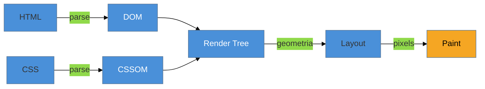

# O Critical Rendering Path

> [!abstract] TL;DR
> O **Critical Rendering Path (CRP)** é a sequência de passos que o browser executa para transformar HTML, CSS e JavaScript em pixels na tela: baixar o HTML → montar o **DOM** → baixar e montar o **CSSOM** → combinar os dois na **render tree** → calcular o **layout** → **pintar**. Cada passo depende do anterior, e alguns recursos **travam** a fila inteira. Entender o CRP é o pré-requisito de toda otimização de carregamento: você não acelera o LCP sem saber qual etapa do caminho está segurando o primeiro pixel.

## O problema: entre "baixei o HTML" e "vejo a página" há um abismo

Você abre o DevTools, vê que o HTML chegou em 300 ms — rápido. Mas a página só fica visível em 3 segundos. Para onde foram os outros 2,7 segundos? O HTML chegou; por que ainda estou olhando uma tela em branco?

A resposta é que **receber o HTML é só o começo**. Entre os bytes chegarem e os pixels aparecerem, o browser executa uma coreografia de vários passos — e otimizar carregamento é, no fundo, otimizar essa coreografia. Sem enxergá-la, você fica tentando adivinhar: será a imagem? o CSS? um script? O Critical Rendering Path é o mapa que transforma esse chute em diagnóstico.

> Este galho é sobre *carregar rápido*; o CRP é o terreno onde tudo acontece. A mecânica interna de cada passo (como o layout é calculado, o que é reflow) vive em [[03-Dominios/Tecnologia/Plataforma Web/Rendering Pipeline/index|Plataforma Web — Rendering Pipeline]]; aqui a ótica é *o que atrasa o primeiro pixel e o LCP*.

## Os seis passos, um por vez

**1. HTML → DOM.** O browser lê o HTML byte a byte e constrói o **DOM** (Document Object Model), a árvore de nós que representa a estrutura do documento. Ele faz isso **incrementalmente** — não precisa do HTML inteiro para começar. Mas há um porém decisivo: se ele encontra um `<script>` sem `async`/`defer`, ele **para** de construir o DOM até baixar e executar o script (assunto da próxima nota).

**2. CSS → CSSOM.** Em paralelo, o browser baixa o CSS e constrói o **CSSOM** (CSS Object Model), a árvore que diz qual regra de estilo se aplica a cada nó. Aqui mora uma verdade contraintuitiva: **o CSS bloqueia a renderização**. O browser não pinta *nada* até ter o CSSOM completo, porque pintar sem estilo produziria um "flash" de conteúdo não-estilizado e depois um reposicionamento brusco. Então ele espera.

**3. DOM + CSSOM → Render Tree.** O browser combina as duas árvores numa **render tree**: só os nós que serão *visíveis*, cada um com seus estilos computados. Nós com `display: none` ficam de fora (não ocupam espaço); nós dentro de `<head>` também. É a árvore do que efetivamente será desenhado.

**4. Layout (reflow).** Com a render tree pronta, o browser calcula a **geometria** de cada elemento — posição e tamanho exatos em pixels, dado o tamanho da viewport. É aqui que "50%" vira "640px". Esse passo também se chama *reflow*.

**5. Paint.** Finalmente, o browser preenche os pixels: texto, cores, imagens, bordas, sombras. Em páginas complexas, isso é dividido em **camadas** que depois são combinadas (compositing) — detalhe que importa para o Galho 3.

**6. (E repete.)** Qualquer mudança posterior — um script que altera o DOM, um estilo que muda — pode disparar layout e paint de novo. Otimizar isso *depois* do carregamento é assunto de runtime (Galho 3); aqui, o foco é fazer o **primeiro** ciclo terminar rápido.

> [!question]- Se o HTML é lido incrementalmente, por que a página não aparece aos pedaços quase instantaneamente?
> Porque dois recursos seguram a fila. O **CSS bloqueia o paint**: sem o CSSOM completo, o browser não pinta nada, mesmo com o DOM pronto. E o **JS síncrono bloqueia o parse do DOM**: ao encontrar um `<script>` comum, o browser congela a construção do DOM até o script rodar — e, pior, o script pode precisar do CSSOM, então às vezes espera o CSS também. O resultado é que um único arquivo CSS gordo no `<head>` ou um script mal posicionado pode transformar um HTML que chegou em 300 ms numa tela em branco de 3 segundos. É exatamente isso que a [[03-Dominios/Tecnologia/Web Performance/Performance de Carregamento/02 - Recursos que bloqueiam a renderização|nota 02]] ataca.

## Por que o CRP é a chave do LCP

Lembre da [[03-Dominios/Tecnologia/Web Performance/Medição e Core Web Vitals/02 - Os três Core Web Vitals|nota 02 do Galho 1]]: o **LCP** mede quando o maior conteúdo visível aparece. Esse "aparecer" é, literalmente, o passo 5 (paint) acontecendo para aquele elemento. Ou seja: **o LCP é o CRP chegando ao fim para o conteúdo principal**.

Isso dá a você um mapa de causas direto. Um LCP ruim é sempre uma dessas etapas emperrada:

| Onde emperrou no CRP | Sintoma | Onde a nota trata |
|----------------------|---------|-------------------|
| HTML demora a chegar | TTFB alto | Galho 1 (medir) → nota 07/08 (CDN, protocolo) |
| CSS bloqueia o paint | FCP alto | nota 02 (render-blocking) |
| JS trava o parse | FCP/LCP alto | nota 02 (async/defer) |
| Recurso do LCP baixa tarde | LCP alto, FCP ok | nota 03 (preload) + nota 04 (imagens) |

Repare como as métricas de apoio da [[03-Dominios/Tecnologia/Web Performance/Medição e Core Web Vitals/07 - Métricas de apoio|nota 07 do Galho 1]] são, na prática, "réguas" posicionadas em pontos do CRP: TTFB mede até o passo 1 começar, FCP mede o primeiro paint, LCP mede o paint do conteúdo principal. **Medir era saber *onde* no CRP a coisa parou; este galho é aprender a *destravar* cada ponto.**

> [!warning] Achar que "otimizar carregamento" é uma coisa só
> **O que acontece:** o time aplica uma dica genérica ("minifique o CSS") e o LCP não melhora. **Por quê:** carregamento não é um problema único — é uma cadeia de seis passos, e a dica só ajuda se o gargalo estiver naquele passo. Minificar CSS não resolve um TTFB alto nem uma imagem hero de 3 MB. **Como evitar:** sempre localize a etapa culpada no CRP **antes** de otimizar (com o Performance panel, nota 08 do Galho 1). Otimização certa no lugar errado é esforço jogado fora.

**O Critical Rendering Path em uma frase:** é a coreografia HTML→DOM, CSS→CSSOM, render tree → layout → paint que o browser executa para virar bytes em pixels — e como o LCP é o fim desse caminho para o conteúdo principal, toda otimização de carregamento é, no fundo, destravar um dos seus passos.

## Como explicar em inglês

> "The Critical Rendering Path is the sequence the browser runs to turn HTML, CSS, and JavaScript into pixels: parse HTML into the **DOM**, parse CSS into the **CSSOM**, combine them into the **render tree**, compute **layout**, then **paint**. The key insight is that CSS is **render-blocking** — the browser won't paint anything until the CSSOM is complete — and synchronous JavaScript is **parser-blocking**. So LCP is really the rendering path reaching the paint step for your main content. Before I optimize loading, I figure out *which step* is the bottleneck — otherwise I'm optimizing blind."

| PT | EN |
|----|----|
| Caminho crítico de renderização | Critical Rendering Path |
| Árvore de renderização | Render tree |
| Bloqueia a renderização | Render-blocking |
| Bloqueia o parser | Parser-blocking |
| Recálculo de layout | Layout / reflow |
| Pintura | Paint |

## O que vem a seguir

Você já sabe que dois tipos de recurso travam o caminho: o CSS (bloqueia o paint) e o JS síncrono (bloqueia o parse). O próximo passo é aprender a **desarmar** essas travas sem quebrar a página — a diferença entre `async` e `defer`, o que é critical CSS, e como adiar tudo que não é essencial para o primeiro paint.

- [[03-Dominios/Tecnologia/Web Performance/Performance de Carregamento/02 - Recursos que bloqueiam a renderização|02 — Recursos que bloqueiam a renderização]] — CSS e JS render-blocking, `async`/`defer`, critical CSS.
- [[03-Dominios/Tecnologia/Web Performance/Performance de Carregamento/03 - Resource hints e prioridade|03 — Resource hints e prioridade]] — dizer ao browser o que buscar antes e com que prioridade.

## Fontes

- **web.dev (Google)** — [*Critical rendering path*](https://web.dev/articles/critical-rendering-path) — a série oficial que descreve cada passo do caminho.
- **MDN Web Docs** — [*Critical rendering path*](https://developer.mozilla.org/en-US/docs/Web/Performance/Guides/Critical_rendering_path) — referência detalhada de DOM, CSSOM, render tree e layout.
- **web.dev (Google)** — [*Render-blocking resources*](https://web.dev/articles/render-blocking-resources) — por que CSS e JS travam o caminho.
