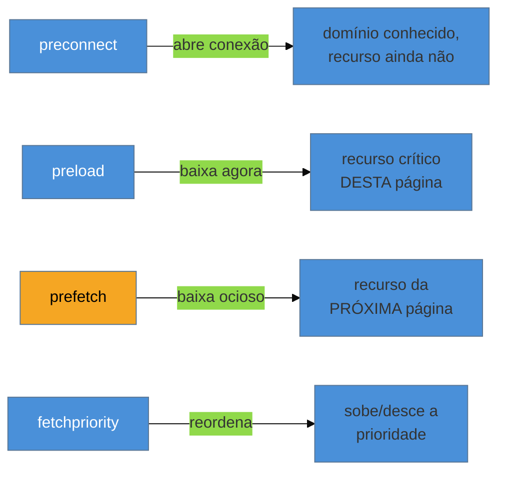

# Resource hints e prioridade

> [!abstract] TL;DR
> Depois de parar de atrapalhar o browser (nota 02), você pode **ajudá-lo** proativamente: **`preconnect`** abre a conexão com um domínio cedo, **`preload`** baixa um recurso crítico que o browser demoraria a descobrir (a fonte dentro do CSS, a imagem do LCP), **`prefetch`** busca em baixa prioridade algo da *próxima* navegação, e **`fetchpriority`** ajusta a prioridade de uma requisição para cima ou para baixo. O caso de maior impacto: marcar a imagem do LCP com `fetchpriority="high"` — nos testes do Google, isso sozinho levou o LCP de 2,6 s para 1,9 s (−27%).

## O problema: o browser descobre coisas tarde demais

O browser é esperto, mas não vidente. Ele descobre os recursos **conforme lê o HTML e o CSS** — e alguns recursos críticos só aparecem *fundo* nessa cadeia. A fonte que o seu texto usa? Está declarada num `@font-face` dentro de um arquivo CSS que o browser só baixa depois de ler o `<head>`. A imagem de fundo do hero? Está numa regra CSS, descoberta ainda mais tarde. A imagem do LCP carregada por um script? Pior ainda.

O resultado é a **cascata em escada**: o browser só pede o recurso B depois de baixar e processar o recurso A que o revela. Cada degrau custa uma ida e volta na rede. Os resource hints existem para **encurtar essa escada** — dizer ao browser "comece isto agora, não espere descobrir".

## Os quatro hints e quando usar cada um



### `preconnect` — abra a porta antes

Estabelecer uma conexão HTTPS custa caro: DNS + handshake TCP + handshake TLS, várias idas e voltas antes do primeiro byte útil. Se você **sabe o domínio** de onde virá um recurso importante (a API, o CDN de imagens, o provedor de fontes), o `preconnect` faz esse aperto de mãos **adiantado**, em paralelo ao resto:

```html
<link rel="preconnect" href="https://cdn.exemplo.com">
<link rel="dns-prefetch" href="https://cdn.exemplo.com"><!-- fallback: só o DNS -->
```

Use quando conhece a **origem** mas ainda não a URL exata. Não abuse: cada preconnect reserva recursos; 2–4 domínios críticos, não 20.

### `preload` — baixe o crítico escondido

O `preload` diz "baixe **este recurso desta página** com prioridade alta, agora, mesmo que você só fosse descobri-lo mais tarde". É a ferramenta para os recursos **tarde-descobertos e críticos**: a fonte dentro do CSS, a imagem do LCP, um CSS carregado por JS.

```html
<link rel="preload" href="/fonts/inter.woff2" as="font" type="font/woff2" crossorigin>
<link rel="preload" href="/hero.avif" as="image" fetchpriority="high">
```

O atributo `as` é obrigatório (diz ao browser o tipo, para priorizar e aplicar a política certa); fontes exigem `crossorigin` mesmo do mesmo domínio. **Cuidado:** preload é uma ordem de prioridade alta — pré-carregar demais rouba banda do que realmente importa.

### `prefetch` — adiante a próxima navegação

O `prefetch` é diferente: ele busca, em **baixa prioridade e no tempo ocioso**, um recurso que provavelmente será usado na **próxima** página (o JS da rota de checkout, a próxima página de um artigo paginado). Quando o usuário navegar, já está no cache.

```html
<link rel="prefetch" href="/checkout.js">
```

É uma aposta: se o usuário não for para lá, você gastou banda à toa. Use para navegações **prováveis**, não para tudo.

### `fetchpriority` — o ajuste fino

Nem todo recurso do mesmo tipo tem a mesma importância. O browser aplica prioridades padrão (CSS alto, imagens baixas até serem vistas), mas ele não sabe **qual** imagem é a do LCP. O atributo `fetchpriority` corrige isso:

```html
<!-- A imagem do LCP: suba pra máxima -->


<!-- Um carrossel abaixo da dobra: desça -->

```

> [!example] O combo que mais move o LCP
> A imagem do LCP sofre de um duplo problema: o browser a **descobre tarde** *e* a **prioriza baixo** (imagens começam em prioridade baixa até o layout provar que estão na viewport). O remédio é atacar os dois:
> 1. **Descoberta cedo:** coloque o `` cedo no HTML, ou use `preload`.
> 2. **Prioridade alta:** adicione `fetchpriority="high"` no `` (e no preload, se usar).
>
> Nos testes do próprio Google, só adicionar `fetchpriority="high"` à imagem do LCP levou o LCP de **2,6 s para 1,9 s — uma melhora de 27%**, sem tocar em mais nada.

## A tabela de decisão

| Hint | O que faz | Prioridade | Use para |
|------|-----------|-----------|----------|
| `dns-prefetch` | Só resolve o DNS | baixíssima | muitos domínios terceiros, barato |
| `preconnect` | DNS + TCP + TLS | — | 2–4 origens críticas conhecidas |
| `preload` | Baixa recurso desta página | alta | fonte no CSS, imagem-LCP, CSS via JS |
| `prefetch` | Baixa recurso da próxima página | baixa (ociosa) | navegação provável |
| `fetchpriority` | Reordena uma requisição | ajuste | subir a imagem-LCP, descer o secundário |

> [!warning] Preload em excesso ("preload de tudo")
> **O que acontece:** o time adiciona `preload` a dez recursos "para garantir", e o LCP *piora*. **Por quê:** preload é prioridade alta. Se tudo é alta prioridade, **nada** é — os preloads competem entre si e com o CSS/HTML críticos, roubando banda da imagem-LCP que de fato importa. Priorizar tudo é não priorizar. **Como evitar:** preload é cirúrgico. Pré-carregue **1–2 recursos** genuinamente críticos e tarde-descobertos (tipicamente a fonte da dobra e a imagem-LCP). Meça o antes/depois; se não melhorou, remova.

**Resource hints em uma frase:** eles encurtam a cascata de descoberta do browser — `preconnect` abre conexões cedo, `preload` baixa o crítico escondido, `prefetch` adianta a próxima página e `fetchpriority` reordena — sendo o combo "imagem-LCP descoberta cedo + `fetchpriority=high`" o de maior retorno.

## Como explicar em inglês

> "Resource hints let me proactively help the browser instead of just not blocking it. **`preconnect`** warms up the connection to a known origin — DNS, TCP, TLS — ahead of time. **`preload`** fetches a critical resource the browser would discover late, like a font declared in CSS or the LCP image. **`prefetch`** grabs something for the *next* navigation at idle priority. And **`fetchpriority`** tunes a request up or down. The highest-impact move is the LCP image: discover it early — in the HTML or via preload — and add `fetchpriority=\"high\"`. Google's own tests dropped LCP from 2.6 to 1.9 seconds with just that attribute."

| PT | EN |
|----|----|
| Dica de recurso | Resource hint |
| Aquecer a conexão | Warm up the connection |
| Pré-carregar | To preload |
| Descoberta tardia de recurso | Late resource discovery |
| Prioridade de busca | Fetch priority |
| Cascata em escada | Request waterfall |

## O que vem a seguir

Você já sabe orquestrar *quando* e *com que prioridade* os recursos chegam. Agora vamos ao recurso que quase sempre **é** o LCP e domina o peso da página: a imagem. Formatos modernos, imagens responsivas e o lazy loading certo (e o errado) valem, sozinhos, mais que qualquer outra otimização de carregamento.

- [[03-Dominios/Tecnologia/Web Performance/Performance de Carregamento/04 - Otimização de imagens|04 — Otimização de imagens]] — AVIF/WebP, `srcset`/`sizes`, lazy loading e a imagem-LCP.
- [[03-Dominios/Tecnologia/HTML/10 - Performance em HTML - resource hints e critical path|HTML 10]] — a sintaxe dos hints no HTML, como reforço.

## Fontes

- **web.dev (Google)** — [*Assist the browser with resource hints*](https://web.dev/learn/performance/resource-hints) — o guia oficial de `preconnect`/`preload`/`prefetch`.
- **web.dev (Google)** — [*Optimize resource loading with the Fetch Priority API*](https://web.dev/articles/fetch-priority) — `fetchpriority` e o ganho de 27% na imagem-LCP.
- **web.dev (Google)** — [*Optimize Largest Contentful Paint*](https://web.dev/articles/optimize-lcp) — a estratégia combinada de descoberta cedo + prioridade alta.
