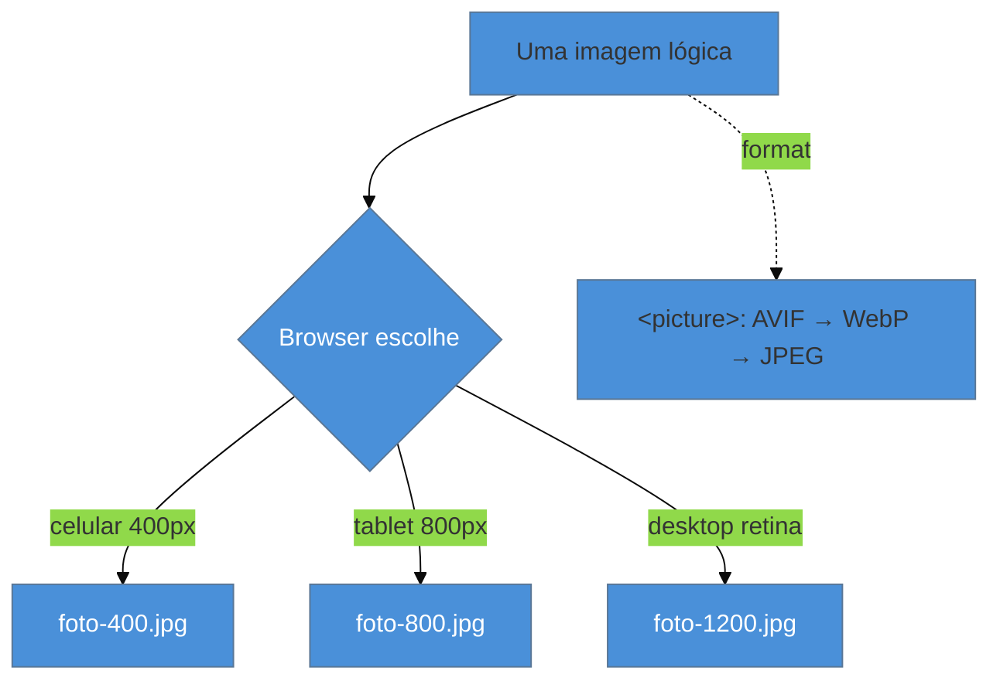

# Otimização de imagens

> [!abstract] TL;DR
> Imagens são mais da metade do peso da página média — logo, são a **maior alavanca isolada** de carregamento. Otimizá-las tem quatro frentes: **formato** (AVIF, ~50% menor que JPEG; WebP como fallback), **variantes responsivas** (`srcset`/`sizes` para servir o tamanho certo a cada tela), **sinais de prioridade** (`fetchpriority="high"` na imagem-LCP, `loading="lazy"` no resto) e **reserva de layout** (`width`/`height` sempre, para não gerar CLS). A regra que mais gente erra: **nunca dê `loading="lazy"` na imagem do LCP** — isso destrói a métrica que você quer melhorar.

## O problema: a página é feita de imagens

A página web média tem **mais de 50% do seu peso em imagens**. Isso significa que, para o LCP — que quase sempre *é* uma imagem (o hero, a foto do produto) —, nenhuma outra otimização se compara a acertar as imagens. Minificar JS economiza kilobytes; otimizar a imagem hero economiza **megabytes**.

E, no entanto, é a otimização mais negligenciada: sobe-se a foto de 4000×3000 pixels e 3 MB direto da câmera, o browser encolhe para 400 px na tela, mas baixou os 3 MB inteiros. O usuário no celular pagou por 10× os pixels que vê. Corrigir isso é dinheiro no chão esperando para ser recolhido.

## Frente 1: formato — AVIF, WebP, JPEG

Os formatos modernos comprimem muito melhor que o JPEG/PNG, com a mesma qualidade visual:

| Formato | Tamanho relativo | Suporte (início 2026) | Papel |
|---------|------------------|-----------------------|-------|
| **AVIF** | ~50% de um JPEG | ~94% dos browsers | primeira escolha |
| **WebP** | ~65–75% de um JPEG | ~97% dos browsers | fallback do AVIF |
| **JPEG** | referência (100%) | universal | fallback final |

Na prática: 100 fotos que somam **130 MB em JPEG** viram ~60 MB em WebP e ~**36 MB em AVIF**. Como nem todo browser suporta AVIF, você oferece uma cascata de fallback com `<picture>`, e o browser escolhe o primeiro que entende:

```html
<picture>
  <source srcset="/hero.avif" type="image/avif">
  <source srcset="/hero.webp" type="image/webp">
  
</picture>
```

### Frente 2: variantes responsivas — `srcset` e `sizes`

Servir uma imagem de 1600 px para um celular de 400 px de largura é desperdício. O `srcset` oferece **várias larguras** e o `sizes` diz ao browser quanto espaço a imagem ocupará — daí ele escolhe a menor que serve, considerando também a densidade de pixels da tela:

```html

```

O `srcset` com descritores `w` lista as larguras reais dos arquivos; o `sizes` descreve o layout (aqui: tela cheia no mobile, metade no desktop). Boa prática: **pelo menos 3 larguras** para imagens de conteúdo (400/800/1200), mais uma extra (1600/2000) para heroes de largura total.



### Frente 3: prioridade — lazy no lugar certo

O atributo `loading="lazy"` (nativo, sem JS) adia o download de imagens **abaixo da dobra** até o usuário chegar perto delas. Ótimo para uma galeria longa — mas mortal se aplicado à imagem errada.

> [!warning] Lazy-load na imagem do LCP
> **O que acontece:** o dev coloca `loading="lazy"` em *todas* as imagens "para ser consistente", incluindo o hero — e o LCP piora feio. **Por quê:** `loading="lazy"` faz o browser **adiar** e **despriorizar** a imagem até confirmar que ela está na viewport. Para a imagem do LCP (que está no topo, é o que o usuário espera ver), isso adiciona um atraso justamente onde você não pode ter nenhum. Você atrasou de propósito a métrica que quer melhorar. **Como evitar:** a imagem-LCP recebe `loading="eager"` (ou nada, que já é eager) **+** `fetchpriority="high"`. Só imagens abaixo da dobra levam `loading="lazy"`.

O par de regras, então:

- **Imagem do LCP** (hero, acima da dobra): `fetchpriority="high"`, **sem** lazy. Descoberta cedo (ver [[03-Dominios/Tecnologia/Web Performance/Performance de Carregamento/03 - Resource hints e prioridade|nota 03]]).
- **Imagens abaixo da dobra**: `loading="lazy"`, prioridade normal ou baixa.

### Frente 4: reserva de layout — `width` e `height` sempre

Toda `` deve declarar `width` e `height` (ou `aspect-ratio` no CSS). Sem isso, o browser não sabe quanto espaço reservar, renderiza a página, e **pula** quando a imagem chega — gerando **CLS** (o Core Web Vital de estabilidade, ver [[03-Dominios/Tecnologia/Web Performance/Medição e Core Web Vitals/02 - Os três Core Web Vitals|Galho 1 nota 02]]). Declarar as dimensões deixa o browser reservar o retângulo antes, e a imagem preenche sem empurrar nada.

> [!question]- Se eu já uso `srcset` com vários tamanhos, qual `width`/`height` eu declaro?
> Você declara **um** par `width`/`height` que reflita a **proporção** (aspect ratio) intrínseca da imagem — por exemplo `width="1200" height="675"` para 16:9. O browser usa isso apenas para calcular a *proporção* e reservar o espaço; o tamanho real exibido vem do CSS e do `sizes`. Como todas as variantes do `srcset` têm a mesma proporção, um par só resolve o CLS para todas. O erro é omitir por achar que "com srcset não dá" — dá, e é obrigatório.

## O impacto combinado

Aplicar as quatro frentes juntas — AVIF com fallback, `srcset` responsivo, prioridade correta e dimensões declaradas — tipicamente reduz **40–60% da banda de imagem** e melhora o **LCP em 1–3 segundos**. É, de longe, o melhor retorno de qualquer trabalho de carregamento.

**Otimização de imagens em uma frase:** sirva o formato mais leve que o browser aceita (AVIF→WebP→JPEG via `<picture>`), no tamanho certo para cada tela (`srcset`/`sizes`), com a imagem-LCP em `fetchpriority="high"` e sem lazy, o resto em `loading="lazy"`, e `width`/`height` em todas para não gerar CLS.

## Como explicar em inglês

> "Images are over half the weight of the average page, so they're the biggest single loading lever. I optimize on four fronts: **format** — AVIF, about 50% smaller than JPEG, with WebP and JPEG fallbacks via `<picture>`; **responsive variants** — `srcset` and `sizes` so the browser picks the right size per screen; **priority** — `fetchpriority=\"high\"` on the LCP image and `loading=\"lazy\"` on everything below the fold, but **never lazy-load the LCP image**, that kills the metric; and **layout reservation** — always set `width` and `height` so images don't cause layout shift."

| PT | EN |
|----|----|
| Imagem responsiva | Responsive image |
| Carregamento preguiçoso | Lazy loading |
| Acima / abaixo da dobra | Above / below the fold |
| Proporção | Aspect ratio |
| Reservar espaço de layout | Reserve layout space |
| Imagem do LCP | LCP image |

## O que vem a seguir

Imagens resolvidas, sobra o outro recurso que trava o texto e é campeão de erros sutis: as **fontes web**. Uma fonte mal carregada esconde o texto (FOIT) ou o faz pular (FOUT), e ambos machucam LCP e CLS. As técnicas — `font-display`, preload, subsetting — merecem nota própria.

- [[03-Dominios/Tecnologia/Web Performance/Performance de Carregamento/05 - Fontes web|05 — Fontes web]] — FOIT/FOUT, `font-display`, preload e subsetting.
- [[03-Dominios/Tecnologia/CSS/12 - Performance CSS|CSS 12 — Performance CSS]] — o custo de renderização, como reforço.

## Fontes

- **MDN Blog** — [*Fix your website's Largest Contentful Paint by optimizing image loading*](https://developer.mozilla.org/en-US/blog/fix-image-lcp/) — a receita completa da imagem-LCP.
- **web.dev (Google)** — [*Browser-level image lazy loading*](https://web.dev/articles/browser-level-image-lazy-loading) — `loading="lazy"` nativo e por que não usá-lo no LCP.
- **web.dev (Google)** — [*Serve responsive images*](https://web.dev/articles/serve-responsive-images) — `srcset`/`sizes` e a escolha do browser.
