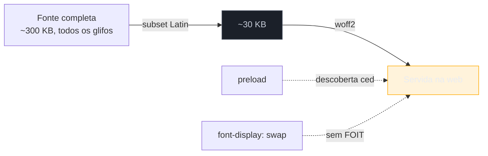

# Fontes web

> [!abstract] TL;DR
> Fontes customizadas são bonitas e traiçoeiras: enquanto a fonte não chega, o browser ou **esconde o texto** (FOIT — tela sem letras) ou **mostra numa fonte de sistema e troca depois** (FOUT — texto que pula). As armas: **`font-display: swap`** (mostra já com fallback, evita texto invisível), **`preload`** da fonte crítica (`woff2`), **subsetting** (embarcar só os caracteres usados), **self-hosting** (evita a conexão extra do Google Fonts) e **`size-adjust`/métricas de fallback** para casar a fonte de sistema com a final e matar o CLS da troca. Objetivo: texto visível cedo, sem pulo.

## O problema: a fonte que some com o seu texto

Você aplica uma fonte linda via `@font-face`. Em uma conexão rápida, tudo perfeito. Numa 3G, o usuário encara **três segundos de tela sem texto nenhum** — só imagens e caixas vazias onde deveriam estar as palavras — até a fonte baixar. Ou, na configuração oposta, o texto aparece rápido numa fonte de sistema e, quando a customizada chega, **tudo salta e se reposiciona**, empurrando o conteúdo que a pessoa estava lendo.

Esses dois vilões têm nome: **FOIT** (Flash of Invisible Text) e **FOUT** (Flash of Unstyled Text). Ambos machucam métricas — FOIT atrasa o LCP (se o maior elemento é texto) e piora a percepção; FOUT gera **CLS** quando a troca de fonte muda a largura/altura do texto. Otimizar fontes é escolher conscientemente entre esses males e minimizá-los.

## Frente 1: `font-display` — quem manda no comportamento da troca

A propriedade `font-display` (dentro do `@font-face`) diz ao browser o que fazer no intervalo entre "a fonte ainda não chegou" e "chegou":

```css
@font-face {
  font-family: "Inter";
  src: url("/fonts/inter.woff2") format("woff2");
  font-display: swap;   /* mostra fallback já, troca quando a fonte chega */
}
```

| Valor | Comportamento | Efeito |
|-------|---------------|--------|
| `auto` | decisão do browser (geralmente = `block`) | imprevisível |
| `block` | esconde o texto por ~3s (FOIT), depois mostra | texto invisível; ruim pro LCP |
| **`swap`** | mostra o fallback **na hora**, troca ao chegar | sem FOIT, mas há FOUT (pulo) |
| `fallback` | ~100 ms de bloqueio, depois fallback; se a fonte demorar, desiste | meio-termo |
| `optional` | ~100 ms de bloqueio; se não chegar, **nunca troca** | zero CLS; a fonte pode não aparecer nesta visita |

`swap` é o padrão pragmático para a maioria (texto sempre visível), mas troca FOIT por FOUT. `optional` é o campeão de estabilidade — nunca gera pulo — ao custo de, em conexões ruins, o usuário ver a fonte de fallback a visita inteira (a fonte real fica em cache para a próxima).

## Frente 2: `preload` da fonte crítica

Lembra do problema de **descoberta tardia** da [[03-Dominios/Tecnologia/Web Performance/Performance de Carregamento/03 - Resource hints e prioridade|nota 03]]? A fonte é o exemplo clássico: ela está declarada num `@font-face` dentro do CSS, que o browser só baixa depois de ler o `<head>`. Ou seja, a fonte só começa a baixar bem tarde na cascata. O `preload` corta esse atraso para a fonte da **primeira dobra**:

```html
<link rel="preload" href="/fonts/inter.woff2" as="font" type="font/woff2" crossorigin>
```

O `crossorigin` é obrigatório mesmo no mesmo domínio (fontes são buscadas em modo anônimo). Preload **só a fonte crítica** (a do texto acima da dobra) — pré-carregar cinco pesos rouba banda da imagem-LCP.

## Frente 3: subsetting e o formato `woff2`

Uma fonte completa carrega centenas de glifos — alfabetos cirílico, grego, símbolos — que seu site em português nunca usa. **Subsetting** gera uma versão só com os caracteres necessários (por exemplo, Latin básico), cortando o arquivo pela metade ou mais. E o formato deve ser **`woff2`**, o mais comprimido e universalmente suportado hoje — não sirva `ttf`/`otf` crus na web.



## Frente 4: self-host vs Google Fonts

Usar o Google Fonts pelo `<link>` parece cômodo, mas adiciona uma **conexão a um terceiro** (`fonts.googleapis.com` + `fonts.gstatic.com`) — DNS, TCP, TLS extras no caminho crítico (e, desde a mudança de política de cache do Chrome, sem o antigo benefício de cache compartilhado entre sites). **Self-hosting** — servir o `woff2` do seu próprio domínio — elimina essa conexão e te dá controle de `preload` e `font-display`. Se insistir no Google Fonts, ao menos faça `preconnect` para o `gstatic`.

## Frente 5: casar as métricas para matar o CLS

O FOUT gera CLS porque a fonte de fallback e a final têm **larguras e alturas diferentes** — quando troca, o texto se redistribui. A solução moderna é ajustar a fonte de **fallback** para ela ocupar o mesmo espaço da final, de modo que a troca seja invisível em termos de layout:

```css
@font-face {
  font-family: "Inter-fallback";
  src: local("Arial");
  size-adjust: 107%;        /* estica o Arial pra casar a largura da Inter */
  ascent-override: 90%;
  descent-override: 22%;
}
```

Com as métricas casadas, o `swap` deixa de pular: o usuário vê o texto cedo (fallback) e a troca não move nada. Frameworks como o `next/font` fazem esse cálculo automaticamente.

> [!warning] `font-display: block` (ou `auto`) em texto crítico
> **O que acontece:** o título principal fica invisível por até 3 segundos numa conexão lenta, e se esse título é o elemento LCP, o LCP dispara. **Por quê:** `block` (e `auto`, que na maioria dos browsers vira `block`) esconde o texto esperando a fonte. Texto invisível não conta como "pintado" — o LCP espera. **Como evitar:** use `swap` (texto sempre visível) ou `optional` (visível e sem CLS), e reserve `block` para ícones-fonte onde o fallback seria sem sentido.

> [!question]- `swap` resolve o FOIT mas causa FOUT. `optional` não pula. Por que não usar sempre `optional`?
> Porque `optional` pode fazer a sua fonte de marca **nunca aparecer** numa visita com rede ruim — o usuário vê o fallback a página toda. Para a identidade visual da marca, isso pode ser inaceitável. A escolha é um trade-off: `optional` prioriza **estabilidade** (zero CLS, LCP ótimo); `swap` prioriza **fidelidade** (a fonte certa aparece, ao custo de um possível pulo). Casar as métricas de fallback (frente 5) é o que te deixa usar `swap` *sem* o pulo — o melhor dos dois mundos, e por isso é a técnica que fecha o assunto.

**Fontes web em uma frase:** escolha `font-display: swap` (ou `optional`) para nunca esconder o texto, faça `preload` da fonte crítica em `woff2` subsetado e self-hosted, e case as métricas da fonte de fallback para que a troca não gere CLS.

## Como explicar em inglês

> "Custom fonts cause two problems while they load: **FOIT** — invisible text — and **FOUT** — a flash of fallback text that then jumps. I control it with `font-display`: `swap` shows the fallback immediately so text is never invisible, and `optional` avoids the layout shift entirely. I `preload` the critical `woff2` font because it's declared inside CSS and discovered late, I **subset** it to only the characters I use, and I **self-host** to avoid a third-party connection. To kill the CLS from the swap, I adjust the fallback font's metrics with `size-adjust` so it occupies the same space as the real font."

| PT | EN |
|----|----|
| Texto invisível | Flash of Invisible Text (FOIT) |
| Texto sem estilo (que pula) | Flash of Unstyled Text (FOUT) |
| Subconjunto de caracteres | Subset |
| Auto-hospedar | Self-host |
| Ajuste de métricas | Metrics override |
| Fonte variável | Variable font |

## O que vem a seguir

Imagens e fontes são os assets pesados; mas todo recurso de texto — HTML, CSS, JS — ainda viaja pela rede como bytes, e comprimir bem esses bytes é uma vitória transversal e barata. Vamos ao que acontece na camada de entrega: compressão e minificação.

- [[03-Dominios/Tecnologia/Web Performance/Performance de Carregamento/06 - Compressão e minificação|06 — Compressão e minificação]] — Brotli/gzip e o custo real dos bytes de texto.
- [[03-Dominios/Tecnologia/Web Performance/Performance de Carregamento/07 - Cache e CDN|07 — Cache e CDN]] — não baixar de novo o que já se tem.

## Fontes

- **web.dev (Google)** — [*Best practices for fonts*](https://web.dev/articles/font-best-practices) — `font-display`, preload, subsetting e self-host.
- **web.dev (Google)** — [*Prevent layout shifts and flashes of invisible text (FOIT)*](https://web.dev/articles/preload-optional-fonts) — evitar FOIT/FOUT e casar métricas.
- **MDN Web Docs** — [*`font-display`*](https://developer.mozilla.org/en-US/docs/Web/CSS/@font-face/font-display) — semântica exata de cada valor.
