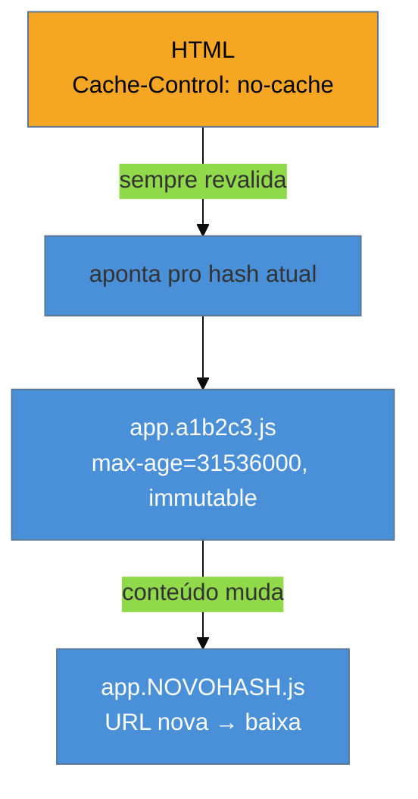

# Cache e CDN

> [!abstract] TL;DR
> A requisição mais rápida é a que **não acontece**. O cache HTTP, via `Cache-Control`, permite ao browser reusar um recurso sem ir à rede. O padrão vencedor é o **hash no nome do arquivo** (`app.a1b2c3.js`): assets com hash ganham cache "eterno" (`max-age=31536000, immutable`), e quando o conteúdo muda, o hash muda, gerando uma URL nova — invalidação automática, sem truque. O HTML, que aponta para esses hashes, recebe `no-cache` (revalida sempre). A **CDN** complementa guardando cópias em servidores perto do usuário, cortando a latência de distância. Juntos, transformam a segunda visita e a navegação interna em quase instantâneas.

## O problema: baixar de novo o que não mudou

Um usuário visita seu site, baixa 800 KB de JS/CSS/imagens. Navega para outra página: baixa **os mesmos** 800 KB. Volta amanhã: de novo os mesmos 800 KB. Nada disso mudou — mas sem instruções de cache, o browser não sabe que pode reusar, e repaga a rede toda vez.

Cada byte re-baixado é tempo e banda desperdiçados, e infla LCP/FCP em visitas que deveriam ser instantâneas. O cache resolve isso — mas é famoso por ser difícil ("uma das duas coisas difíceis em computação"), porque o medo de servir uma versão velha faz muita gente desligar o cache e jogar a performance fora por precaução. A chave é uma estratégia que torne a invalidação **automática e segura**.

## `Cache-Control`: as instruções de reuso

O servidor anexa a cada resposta um cabeçalho `Cache-Control` que diz ao browser (e às CDNs) se, por quanto tempo e como o recurso pode ser reusado:

| Diretiva | Significado |
|----------|-------------|
| `max-age=N` | reusar sem ir à rede por N segundos |
| `no-cache` | pode guardar, mas **revalidar** com o servidor antes de usar |
| `no-store` | não guardar nada (dados sensíveis) |
| `immutable` | este recurso **nunca** muda; nem revalide dentro do `max-age` |
| `s-maxage=N` | `max-age` específico para caches compartilhados (CDN) |
| `stale-while-revalidate=N` | sirva o velho na hora e revalide em background |

Quando o `max-age` expira mas o recurso talvez ainda sirva, entram as **requisições condicionais**: o browser guarda um `ETag` (impressão digital do conteúdo) ou `Last-Modified`, e na revalidação pergunta "mudou?". Se não mudou, o servidor responde **304 Not Modified** — sem corpo, quase instantâneo. Economiza banda, mas ainda custa uma ida à rede.

## O padrão vencedor: hash no nome do arquivo

Como ter cache "eterno" (zero rede) **e** poder atualizar quando o código muda? A resposta é o padrão que todo bundler moderno usa: **colocar um hash do conteúdo no nome do arquivo**.

```
app.a1b2c3.js      ← hash do conteúdo atual
estilo.9f8e7d.css
```

A mágica: se o conteúdo muda, o hash muda, e portanto a **URL muda**. Uma URL nova nunca está em cache — o browser baixa a versão nova automaticamente. E a URL antiga, que estava com cache eterno, simplesmente deixa de ser referenciada. Isso permite a combinação perfeita:



- **Assets com hash** (`app.a1b2c3.js`): `Cache-Control: public, max-age=31536000, immutable` — cache de 1 ano, nunca revalida. É seguro porque a URL só existe para *aquele* conteúdo.
- **HTML** (`index.html`): `Cache-Control: no-cache` — sempre revalida, porque é ele que carrega a lista de hashes atuais. Um HTML pequeno revalidado garante que o usuário sempre descubra os assets novos.

Assim a segunda visita baixa só o HTML (minúsculo) e, se nada mudou, reusa tudo do cache — carregamento quase instantâneo. Se algo mudou, só o arquivo alterado (com hash novo) é re-baixado; o resto continua em cache.

## CDN: aproximar os bytes do usuário

Mesmo com cache perfeito, a **primeira** visita e o HTML dinâmico ainda cruzam a rede — e se o seu servidor está em São Paulo e o usuário em Tóquio, cada ida e volta custa a latência da distância física (a velocidade da luz é um limite real). A **CDN (Content Delivery Network)** resolve isso guardando cópias dos seus assets em **servidores de borda (edge)** espalhados pelo mundo. O usuário em Tóquio baixa do nó de Tóquio, não de São Paulo.

A CDN ataca duas coisas de uma vez:

- **Latência**: menos distância = menor RTT = menor TTFB (a métrica de apoio da [[03-Dominios/Tecnologia/Web Performance/Medição e Core Web Vitals/07 - Métricas de apoio|Galho 1 nota 07]]).
- **Escala/offload**: a borda absorve o tráfego de assets estáticos, poupando o seu servidor de origem.

CDNs modernas fazem mais — comprimem (nota 06), servem AVIF/WebP sob demanda, terminam TLS na borda e cada vez mais rodam lógica no edge. O `s-maxage` te dá controle separado de por quanto tempo a **CDN** guarda, independente do browser.

> [!warning] Cache eterno em arquivo sem hash
> **O que acontece:** o time põe `max-age=31536000` no `main.js` (sem hash no nome). Faz um deploy com correção crítica, e usuários continuam com a versão bugada por dias. **Por quê:** a URL não mudou, e o browser foi instruído a não revalidar por um ano. Ele reusa a versão velha em cache sem nem perguntar. Você se pintou num canto. **Como evitar:** cache eterno (`immutable`) **só** para URLs com hash de conteúdo. Qualquer arquivo com nome estável (sem hash) precisa de `no-cache` ou um `max-age` curto. A regra: **URL imutável ↔ conteúdo imutável**.

> [!question]- Se a CDN guarda meu conteúdo, como forço uma atualização urgente?
> Duas formas. Se você usa o padrão de **hash no nome**, não precisa forçar nada: o deploy gera URLs novas, e a CDN busca da origem automaticamente na primeira vez que alguém pede a URL nova. Para conteúdo sem hash (como o HTML ou uma imagem de nome fixo), você usa a **purga/invalidação** da CDN — um comando que apaga a cópia em cache em todos os nós, forçando-os a rebuscar da origem. O `stale-while-revalidate` ajuda no meio-termo: serve o velho instantaneamente enquanto busca o novo em background, então o usuário nunca espera.

**Cache e CDN em uma frase:** dê cache eterno e imutável a assets com hash no nome (a URL só muda quando o conteúdo muda, invalidando sozinha), mantenha o HTML em `no-cache` para ele sempre apontar aos hashes atuais, e use uma CDN para servir tudo isso de um servidor perto do usuário — cortando latência e transformando visitas repetidas em quase instantâneas.

## Como explicar em inglês

> "The fastest request is the one that never happens. I control caching with `Cache-Control`, and the winning pattern is **content hashing in filenames** — `app.a1b2c3.js`. Hashed assets get `max-age=31536000, immutable` — cached for a year, never revalidated — because when the content changes, the hash changes, so it's a new URL that isn't cached yet. Invalidation is automatic. The HTML gets `no-cache` so it always revalidates and points to the current hashes. And a **CDN** stores copies at edge servers near users, cutting latency and TTFB. The one rule: immutable caching only for URLs whose content can't change."

| PT | EN |
|----|----|
| Requisição condicional | Conditional request |
| Impressão digital do conteúdo | ETag / content hash |
| Invalidação de cache | Cache invalidation / purge |
| Servidor de borda | Edge server |
| Rede de distribuição de conteúdo | Content Delivery Network (CDN) |
| Servir obsoleto enquanto revalida | Stale-while-revalidate |

## O que vem a seguir

Você já tem os assets leves, comprimidos e cacheados perto do usuário. Falta a camada mais baixa: o **protocolo** por onde tudo isso trafega. HTTP/2 e HTTP/3 mudam como as requisições viajam — e o capstone junta tudo numa estratégia de carregamento coerente.

- [[03-Dominios/Tecnologia/Web Performance/Performance de Carregamento/08 - HTTP moderno e estratégia de carregamento|08 — HTTP moderno e estratégia de carregamento]] — HTTP/2, HTTP/3, Early Hints e a orquestração final.
- [[03-Dominios/Ciência/Redes e Protocolos/index|Redes e Protocolos]] — os fundamentos de HTTP/TCP/cache conceitual, como base.
- [[03-Dominios/Tecnologia/Plataforma Web/Storage/index|Plataforma Web — Storage]] — Cache API e cache do lado do cliente via Service Worker.

## Fontes

- **web.dev (Google)** — [*HTTP caching*](https://web.dev/articles/http-cache) — `Cache-Control`, ETag e o padrão de hash + immutable.
- **MDN Web Docs** — [*Cache-Control*](https://developer.mozilla.org/en-US/docs/Web/HTTP/Headers/Cache-Control) — referência de todas as diretivas.
- **web.dev (Google)** — [*Content delivery networks (CDNs)*](https://web.dev/articles/content-delivery-networks) — como a borda reduz latência e escala assets.
