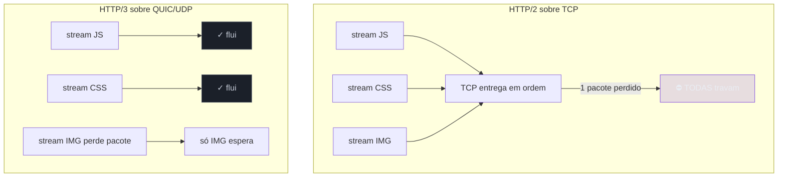
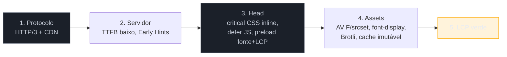

# HTTP moderno e estratégia de carregamento

> [!abstract] TL;DR
> A camada de protocolo é a fundação do carregamento. **HTTP/2** trouxe multiplexing (muitas requisições numa conexão) mas herdou o *head-of-line blocking* do TCP: um pacote perdido trava todas as streams. **HTTP/3**, sobre **QUIC/UDP**, resolve isso — cada stream sofre perda de pacote de forma independente — e já roda em todos os browsers e servidores modernos (~21–39% do tráfego em 2026). **103 Early Hints** deixa o servidor mandar `preload`/`preconnect` durante o "tempo de pensar" da resposta. Este é o capstone do galho: junta CRP, render-blocking, hints, imagens, fontes, compressão e cache numa **estratégia de carregamento** coerente — e faz a ponte pro Galho 3.

## O problema: otimizei tudo, e a rede ainda importa

Você minificou, comprimiu, cacheou, otimizou imagens e fontes. Ainda assim, numa rede móvel com perda de pacotes, o carregamento engasga. Por quê? Porque abaixo de todas as suas otimizações há um **protocolo de transporte**, e a geração dele que você usa determina quanto do seu esforço realmente chega rápido ao usuário. Entender HTTP/2 vs HTTP/3 é entender o piso sobre o qual tudo o mais é construído.

## HTTP/2: multiplexing, mas com um calcanhar

O HTTP/1.1 tinha um limite doloroso: **uma requisição por conexão de cada vez**. Os browsers contornavam abrindo ~6 conexões paralelas por domínio, o que levava a truques feios como "domain sharding" (espalhar assets por vários subdomínios para abrir mais conexões).

O **HTTP/2** resolveu isso com **multiplexing**: muitas requisições e respostas viajam **intercaladas numa única conexão**, cada uma numa "stream". Fim do domain sharding, fim do limite de 6. Foi um salto enorme.

Mas o HTTP/2 roda sobre **TCP**, e aí mora seu calcanhar: o **head-of-line blocking no nível de transporte**. O TCP entrega bytes *em ordem*. Se um pacote se perde, o TCP segura **todos** os pacotes seguintes até retransmitir o perdido — mesmo que pertençam a streams diferentes. Ou seja: a perda de um pacote da imagem trava também o JS e o CSS que vinham na mesma conexão. O multiplexing do HTTP/2 é uma ilusão de paralelismo que uma única perda de pacote quebra.

## HTTP/3: QUIC resolve na raiz

O **HTTP/3** troca o transporte: em vez de TCP, roda sobre **QUIC**, um protocolo construído sobre **UDP**. A jogada genial é que o QUIC entende de **streams no próprio nível de transporte** — cada stream lida com perda de pacote de forma **independente**. A perda de um pacote da imagem afeta só a imagem; o JS e o CSS continuam fluindo.



Outros ganhos do QUIC: **handshake mais rápido** (combina o setup de conexão e TLS; 0-RTT em reconexões) e **migração de conexão** (você troca de Wi-Fi para 4G sem derrubar a conexão — o celular no bolso agradece).

Em 2026, HTTP/3 é maduro e onipresente: todos os browsers principais o suportam, servidores como Nginx (1.25+), Caddy (padrão) e as grandes CDNs o servem, e ele responde por **~21–39% do tráfego** (a faixa varia por metodologia e região — cresce mais rápido onde a rede é pior, exatamente onde o ganho é maior, como Brasil e Índia). Na prática, você o **habilita no servidor/CDN** e o browser negocia sozinho; é ganho quase de graça.

> [!question]- Se HTTP/2 já resolveu o paralelismo, por que ainda otimizo o *número* de requisições?
> Porque nem tudo é sobre concorrência. Cada requisição ainda carrega overhead (cabeçalhos, embora o HTTP/2 os comprima) e disputa prioridade e banda. Com HTTP/2 e HTTP/3 você não precisa mais dos truques *hacks* do HTTP/1.1 (sharding, spriting agressivo, concatenar tudo num arquivo gigante) — na verdade, **concatenar demais atrapalha o cache** (mudar um byte invalida o bundle inteiro; ver [[03-Dominios/Tecnologia/Web Performance/Performance de Carregamento/07 - Cache e CDN|nota 07]]). O equilíbrio moderno é *code-splitting* em pedaços cacheáveis, não um monólito nem mil arquivinhos. O protocolo mudou a estratégia ótima.

## 103 Early Hints: usar o "tempo de pensar" do servidor

Quando o servidor recebe um pedido de página, ele leva um tempo para montar a resposta (consultar o banco, renderizar o HTML). Nesse intervalo, o browser fica **ocioso**, esperando. O **103 Early Hints** aproveita esse tempo: o servidor manda, *antes* da resposta final, um status `103` com `preload`/`preconnect` dos recursos que ele já sabe que a página vai precisar. O browser começa a buscar a fonte, o CSS e a imagem-LCP enquanto o servidor ainda "pensa".

```
HTTP/1.1 103 Early Hints
Link: </estilo.css>; rel=preload; as=style
Link: </hero.avif>; rel=preload; as=image; fetchpriority=high

HTTP/1.1 200 OK   ← a resposta real chega depois
```

Em 2026 é suportado em todos os browsers principais (Chrome/Edge preload+preconnect, Firefox idem, Safari só preconnect) — mas **só sobre HTTP/2 e HTTP/3**, e só para navegações. É mais um motivo para estar no protocolo moderno.

## A síntese: a estratégia de carregamento

Este galho te deu peças; a maestria é orquestrá-las. Uma estratégia de carregamento coerente, na ordem do Critical Rendering Path:



1. **Fundação:** sirva por **HTTP/3** de uma **CDN** perto do usuário. TTFB baixo, streams independentes.
2. **Tempo do servidor:** TTFB enxuto; use **Early Hints** para adiantar o crítico durante o "think time".
3. **O `<head>`:** **critical CSS inline**, JS com **`defer`**, **`preload`** da fonte da dobra e da **imagem-LCP** com `fetchpriority="high"` (notas 02–03).
4. **Os assets:** imagens **AVIF/WebP responsivas** e a LCP sem lazy (nota 04); fontes **`font-display: swap`** subsetadas (nota 05); texto **Brotli** (nota 06); tudo com **cache imutável por hash** (nota 07).
5. **O resultado:** o LCP que o Galho 1 ensinou a medir, agora no verde.

> [!warning] Aplicar técnicas soltas sem medir o gargalo
> **O que acontece:** o time aplica *todas* as técnicas deste galho de uma vez, gasta semanas, e o LCP melhora pouco. **Por quê:** carregamento tem **um** gargalo dominante por vez (o TTFB alto, *ou* a imagem gigante, *ou* o JS render-blocking). Otimizar as outras camadas enquanto o gargalo real continua lá dá ganho marginal. **Como evitar:** volte sempre ao ciclo do Galho 1 — **meça, ache o gargalo (Performance panel), ataque-o, valide no campo.** A estratégia acima é o cardápio; o diagnóstico diz qual prato pedir primeiro.

**HTTP moderno e estratégia de carregamento em uma frase:** rode sobre HTTP/3 (QUIC elimina o head-of-line blocking do TCP) de uma CDN, use Early Hints para o tempo de pensar do servidor, e orquestre critical CSS, defer, preload da imagem-LCP, assets modernos e cache imutável na ordem do Critical Rendering Path — sempre guiado pelo diagnóstico, não pela lista de técnicas.

## Como explicar em inglês

> "The protocol is the foundation of loading. **HTTP/2** brought multiplexing but inherited TCP's head-of-line blocking — one lost packet stalls every stream. **HTTP/3**, over QUIC on UDP, fixes it: each stream handles packet loss independently, plus faster handshakes and connection migration. It's mature everywhere in 2026, so I enable it on the CDN and it's a near-free win. **103 Early Hints** lets the server send preload/preconnect during its think time. But the real skill is strategy: I orchestrate all the loading techniques in Critical-Rendering-Path order — protocol, server, head, assets — and I always let the diagnosis pick the dominant bottleneck instead of applying everything blindly."

| PT | EN |
|----|----|
| Multiplexação | Multiplexing |
| Bloqueio de cabeça de fila | Head-of-line blocking |
| Camada de transporte | Transport layer |
| Migração de conexão | Connection migration |
| Tempo de processamento do servidor | Server think time |
| Estratégia de carregamento | Loading strategy |

## O que vem a seguir

Você domina o **carregar** — levar os bytes certos à tela o mais rápido possível (LCP). Mas assim que a página carrega, começa uma segunda batalha: mantê-la **responsiva** enquanto o usuário interage. JavaScript pesado, long tasks e reflows travam a thread principal e degradam o INP e o CLS — que nenhuma otimização de carregamento resolve. Esse é o próximo galho.

- **G3 — Performance de Runtime & Rendering** *(a construir)* — main thread, long tasks, INP a fundo, reflow/repaint, custo de JS e hidratação. Ataca o INP e o CLS. Tangencia [[03-Dominios/Tecnologia/React/React core/17 - Performance no React|React core 17]] e [[03-Dominios/Tecnologia/Plataforma Web/Rendering Pipeline/index|Rendering Pipeline]].
- [[03-Dominios/Tecnologia/Web Performance/index|Índice do domínio Web Performance]] — o mapa dos 4 galhos.

## Fontes

- **web.dev / Chrome for Developers** — [*Faster page loads using Early Hints*](https://developer.chrome.com/docs/web-platform/early-hints) — o 103 e o uso do server think time.
- **ma.ttias.be** — [*QUIC and HTTP/3 in 2026*](https://ma.ttias.be/quic-http3-in-2026/) — estado de adoção e maturidade do HTTP/3.
- **MDN Web Docs** — [*103 Early Hints*](https://developer.mozilla.org/en-US/docs/Web/HTTP/Reference/Status/103) — suporte por browser e restrição a HTTP/2-3.
- **Wikipedia** — [*HTTP/3*](https://en.wikipedia.org/wiki/HTTP/3) — QUIC, transporte sobre UDP e o fim do HoL blocking do TCP.
