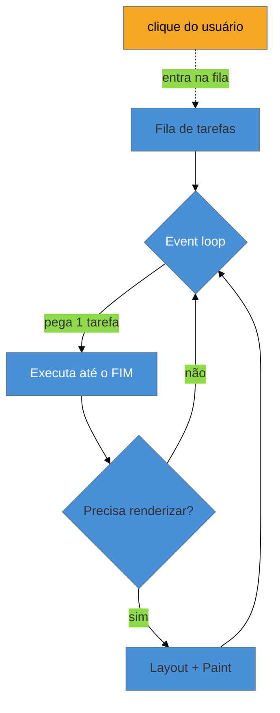

# A thread principal e o event loop

> [!abstract] TL;DR
> O browser roda quase tudo — executar JavaScript, calcular layout, pintar, processar cliques — numa **única thread**: a *main thread*. Ela pega uma tarefa por vez de uma fila e a roda até o fim antes de olhar a próxima (run-to-completion). A consequência que governa toda a responsividade: enquanto um pedaço de JavaScript roda, **nada mais acontece** — o clique do usuário fica esperando, a animação congela, a página parece travada. Entender que a thread principal é um recurso único e disputado é a base de tudo neste galho: otimizar runtime é, no fundo, **não segurar a main thread**.

## O problema: a página "travou" — mas o computador não

O usuário clica num botão e... nada. Um segundo depois, a interface reage de repente. O computador dele não está lento — tem 8 núcleos ociosos. Então por que a página congelou?

Porque o browser fez todo o trabalho daquela página numa **thread só**, e naquele instante ela estava ocupada rodando um pedaço de JavaScript (filtrar uma lista grande, processar uma resposta de API). Os outros 7 núcleos não ajudam: o modelo de execução da web é fundamentalmente **single-threaded** para o que toca a página. Esse é o fato central que explica *todo* problema de responsividade — e o INP, o Core Web Vital que o mede.

## Uma thread, uma fila, uma tarefa por vez

A **main thread** é onde o browser executa a maior parte do trabalho de uma página:

- executar o **JavaScript** do seu app;
- calcular o **layout** (onde cada elemento fica);
- **pintar** os pixels;
- processar **eventos** de entrada (clique, toque, tecla, scroll).

Tudo isso disputa a **mesma** thread. E o modelo de agendamento é o **event loop**: existe uma fila de tarefas, e o loop pega **uma** tarefa, executa-a **até o fim** (isso se chama *run-to-completion*), e só então volta para pegar a próxima. Não há preempção: uma tarefa não é interrompida no meio para dar vez a outra.

Repare onde o clique do usuário entra: **na mesma fila**. Se uma tarefa longa de JavaScript está rodando, o clique fica esperando atrás dela — não há como "furar a fila". É exatamente aí que nasce a lentidão percebida.

> [!question]- Se JavaScript é single-threaded, o que fazem `async`/`await`, Promises e `setTimeout`?
> Eles **não criam threads**. Eles apenas *agendam* trabalho para tarefas (ou microtasks) futuras na **mesma** thread. Um `await` não roda em paralelo — ele pausa a função e devolve a thread ao event loop, que continua com outras tarefas; quando a operação assíncrona (rede, timer) termina, a continuação é *enfileirada* para rodar depois, na main thread de novo. A concorrência da web é **cooperativa e intercalada numa thread**, não paralela. O paralelismo de verdade só existe com **Web Workers** (nota 08), que rodam em *outra* thread — e por isso não podem tocar o DOM. A mecânica de event loop/microtasks como recurso da linguagem vive em [[03-Dominios/Tecnologia/JavaScript/index|JavaScript]] e [[03-Dominios/Tecnologia/Plataforma Web/Eventos/index|Plataforma Web/Eventos]]; aqui a ótica é o custo em performance.

## Por que isso governa a responsividade

Como o browser só pode processar o clique e pintar a resposta **entre** tarefas (nunca durante uma), o tamanho das suas tarefas de JavaScript determina a rapidez com que a página reage. Uma tarefa de 300 ms significa que, se o clique chegar logo no início dela, o usuário espera até 300 ms só para o browser *começar* a lidar com o clique.

Isso conecta diretamente aos conceitos do Galho 1:

- O **INP** ([[03-Dominios/Tecnologia/Web Performance/Medição e Core Web Vitals/02 - Os três Core Web Vitals|G1 nota 02]]) mede exatamente esse atraso: do clique até a próxima pintura. Uma main thread ocupada = INP alto.
- O **TBT** ([[03-Dominios/Tecnologia/Web Performance/Medição e Core Web Vitals/07 - Métricas de apoio|G1 nota 07]]) soma o tempo em que a thread ficou bloqueada durante o carregamento — o proxy lab do INP.

Então toda a estratégia deste galho decorre de uma única meta: **manter a main thread livre**. Ou você faz menos trabalho (tarefas menores, menos JavaScript), ou faz o trabalho em outro lugar (Workers), ou o faz na hora certa (ceder a thread, adiar o não-urgente). Cada nota seguinte é uma variação dessa ideia.

> [!warning] Achar que "o computador é rápido, então JS pesado não importa"
> **O que acontece:** o dev testa num desktop potente, a interação parece instantânea, e ele conclui que a tarefa de 200 ms "não é problema". **Por quê:** a main thread é **uma só** independentemente do número de núcleos, e o celular mediano do usuário tem uma CPU muito mais lenta — a mesma tarefa que leva 200 ms no seu desktop pode levar 800 ms no aparelho dele. Núcleos sobrando não aceleram uma thread única. **Como evitar:** meça sempre com **CPU throttling** (o DevTools simula 4×/6× mais lento) e olhe o INP de **campo** no p75 (ver Galho 1). A responsividade se prova no aparelho fraco, não no seu.

**A thread principal em uma frase:** o browser executa JavaScript, layout, paint e eventos numa única thread que roda uma tarefa por vez até o fim, então qualquer JavaScript que a segure trava a interação inteira — e otimizar runtime é, na essência, manter essa thread livre.

## Como explicar em inglês

> "The browser runs almost everything — JavaScript, layout, paint, and input handling — on a **single main thread**, and it processes one task at a time, run-to-completion. So while a chunk of JavaScript is executing, nothing else can happen: the user's click waits in the same queue behind it. That's the root of every responsiveness problem, and it's exactly what INP measures. Extra CPU cores don't help, because the main thread is one thread. So optimizing runtime performance really comes down to one goal: **don't hold the main thread** — do less work, do it elsewhere in a Worker, or do it at the right time."

| PT | EN |
|----|----|
| Thread principal | Main thread |
| Fila de tarefas | Task queue |
| Executar até o fim | Run-to-completion |
| Travar / bloquear a thread | Block the thread |
| Cede a thread | Yield the thread |
| Preempção | Preemption |

## O que vem a seguir

Se o problema é segurar a thread, o primeiro passo é conhecer o vilão concreto: as **long tasks** — as tarefas de JavaScript longas o bastante para atrapalhar. Vamos ver o que as gera, como medi-las, e por que o *custo* do JavaScript vai muito além do tempo de download.

- [[03-Dominios/Tecnologia/Web Performance/Performance de Runtime e Rendering/02 - Long tasks e o custo do JavaScript|02 — Long tasks e o custo do JavaScript]] — tarefas > 50 ms e o preço de parse/compile/execute.
- [[03-Dominios/Tecnologia/Web Performance/Performance de Runtime e Rendering/03 - INP a fundo|03 — INP a fundo]] — as três fases de uma interação e como ceder a thread.

## Fontes

- **web.dev (Google)** — [*Optimize long tasks*](https://web.dev/articles/optimize-long-tasks) — a main thread, o modelo de tarefas e por que segurá-la trava a interação.
- **MDN Web Docs** — [*The event loop*](https://developer.mozilla.org/en-US/docs/Web/JavaScript/Event_loop) — run-to-completion e o modelo de concorrência da web.
- **web.dev (Google)** — [*Interaction to Next Paint (INP)*](https://web.dev/articles/inp) — como a ocupação da main thread vira INP.
