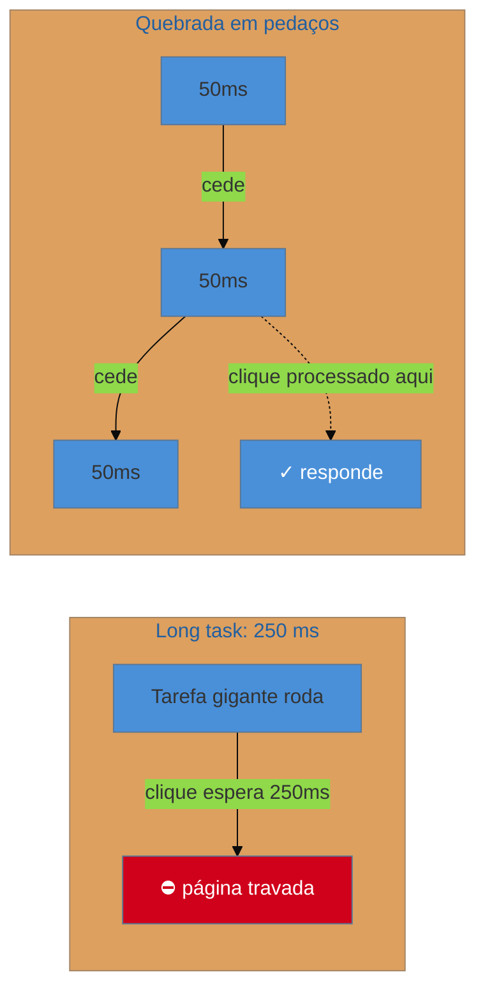

# Long tasks e o custo do JavaScript

> [!abstract] TL;DR
> Uma **long task** é qualquer trabalho que ocupa a main thread por mais de **50 ms** sem devolvê-la. Durante ela, a página não responde a nada. O JavaScript é o principal gerador de long tasks — e o seu custo vai muito além do download: cada arquivo `.js` ainda precisa ser **parseado, compilado e executado**, e essas etapas rodam na main thread. Por isso "só" 300 KB de JS podem custar mais em responsividade que 3 MB de imagem: a imagem é decodificada fora da thread; o JS trava a thread. Medir long tasks (Long Tasks API, painel Performance) e reduzir/quebrar o JavaScript é o coração da otimização de INP.

## O problema: por que 300 KB de JS doem mais que 3 MB de imagem

Uma intuição comum é medir peso: "a imagem tem 3 MB, o JavaScript só 300 KB — a imagem é o problema". Para a responsividade (INP), é o contrário. A imagem grande atrasa o *carregamento* (LCP), mas é decodificada em threads auxiliares e não trava a interação. Os 300 KB de JavaScript, porém, precisam ser **processados pela main thread** — e enquanto isso, a página congela.

O "custo do JavaScript" é mal compreendido porque a parte cara é **invisível no tamanho do arquivo**. Baixar é só o começo; o trabalho pesado vem depois, na thread que também precisa responder ao usuário. Entender esse custo é o que faz você tratar JavaScript como o recurso mais caro da página — não pelo peso, mas pelo lugar onde ele roda.

## O que é uma long task

O browser define uma **long task** como qualquer tarefa que segura a main thread por **mais de 50 ms**. Por que 50 ms? Porque acima disso o usuário começa a perceber a falta de resposta — o limiar do "instantâneo" percebido. Enquanto uma long task roda (run-to-completion, ver [[03-Dominios/Tecnologia/Web Performance/Performance de Runtime e Rendering/01 - A thread principal e o event loop|nota 01]]), qualquer clique fica na fila esperando.

A régua-chave: entre 0–200 ms de INP é "bom"; long tasks são o que empurra o INP para cima. Você as vê no **painel Performance** do DevTools (barras longas com um triângulo vermelho no canto) e as mede programaticamente com a **Long Tasks API** (`PerformanceObserver` com `entryType: "longtask"`).

## As quatro fases do custo do JavaScript

Quando você inclui um script, o custo se decompõe em quatro etapas — e três delas rodam na main thread:

| Fase | O que é | Onde roda |
|------|---------|-----------|
| **Download** | baixar os bytes da rede | rede (não trava a thread) |
| **Parse** | ler o texto e transformar em estrutura | main thread |
| **Compile** | compilar para bytecode/código de máquina | main thread |
| **Execute** | rodar o código | main thread |

O download é o único que você resolve com as técnicas do Galho 2 (compressão, cache). As outras três — parse, compile, execute — são **CPU na main thread**, e escalam com a *quantidade* de JavaScript e com a *lentidão do aparelho*. Num celular modesto, parsear e compilar um megabyte de JS pode levar segundos, mesmo que o download tenha sido rápido.

> [!question]- Se o problema é o custo de CPU, minificar (que reduz bytes) ajuda no parse/compile?
> Ajuda um pouco, mas não é a alavanca principal. Minificar reduz **bytes** (download) e, como o arquivo fica menor, o parse tem menos texto para ler — ganho modesto. Mas compile e execute dependem da **quantidade de código real**, não de espaços em branco: minificar não remove uma biblioteca inteira que você não usa. A alavanca de verdade contra o custo de CPU é **enviar menos JavaScript** — tree-shaking, code-splitting, remover dependências pesadas (território de [[03-Dominios/Tecnologia/Tooling e Build/17 - Otimização de bundle|Tooling 17]]) — e **quebrar** o trabalho que sobra em tarefas menores (nota 03). "Menos JS" vence "JS menor".

## As três estratégias contra long tasks

Decorrem direto da meta "não segurar a main thread" da nota 01:

1. **Faça menos.** Menos JavaScript = menos parse/compile/execute. Remova bibliotecas pesadas, use code-splitting para carregar só o necessário da rota, prefira soluções nativas. É a vitória mais duradoura.
2. **Quebre o que sobra.** Uma tarefa de 250 ms vira cinco de 50 ms que **cedem a thread** entre si, deixando o browser processar cliques nos intervalos. Como fazer isso (yield, `scheduler.yield`) é a nota 03.
3. **Mova para fora.** Trabalho pesado e independente do DOM (parsear um CSV grande, cálculos) pode ir para um **Web Worker**, em outra thread, liberando a main. É a nota 08.

> [!warning] Scripts de terceiros como long tasks invisíveis
> **O que acontece:** o INP está ruim, mas o JavaScript da sua aplicação parece enxuto — o culpado não aparece no seu código.
> **Por quê:** tags de analytics, chat, testes A/B, anúncios e widgets de terceiros executam na **sua** main thread e frequentemente geram long tasks que você não escreveu nem controla. Um único script de terceiros mal-comportado pode dominar o INP.
> **Como evitar:** audite os terceiros no painel Performance (atribuição por script), carregue-os com `async`/`defer` ou sob demanda, e considere isolar os mais pesados. O que você não controla ainda conta no seu INP.

**Long tasks e o custo do JavaScript em uma frase:** long tasks (>50 ms na main thread) são o que trava a interação, e o JavaScript as gera porque seu custo real é parse+compile+execute na main thread — não o download —, então o remédio é enviar menos JS, quebrar o que sobra e mover o pesado para Workers.

## Como explicar em inglês

> "A **long task** is anything that holds the main thread for more than 50 milliseconds — during it, the page can't respond. JavaScript is the main culprit, and its cost is misunderstood: beyond download, every script has to be **parsed, compiled, and executed**, and those run on the main thread. That's why 300 KB of JS can hurt responsiveness more than a 3 MB image — the image decodes off-thread, the JS blocks the thread. And it's worse on mid-range phones with slower CPUs. So I fight long tasks three ways: ship less JavaScript, break up what's left so it yields, and move heavy DOM-independent work to a Web Worker."

| PT | EN |
|----|----|
| Tarefa longa | Long task |
| Custo do JavaScript | JavaScript cost |
| Análise / compilação / execução | Parse / compile / execute |
| Quebrar a tarefa | Break up the task |
| Script de terceiros | Third-party script |
| Fora da thread | Off-thread |

## O que vem a seguir

Você sabe o que são long tasks e por que o JavaScript as gera. A estratégia nº 2 — quebrar o trabalho e ceder a thread — merece detalhe próprio, e é onde o INP se destrincha em suas três fases: o atraso antes de processar, o processamento em si, e a pintura da resposta.

- [[03-Dominios/Tecnologia/Web Performance/Performance de Runtime e Rendering/03 - INP a fundo|03 — INP a fundo]] — input delay, processing, presentation delay; `scheduler.yield` e ceder a thread.
- [[03-Dominios/Tecnologia/Web Performance/Performance de Runtime e Rendering/08 - Offload, Web Workers e o custo da hidratação|08 — Offload e Web Workers]] — mover trabalho pesado para outra thread.

## Fontes

- **web.dev (Google)** — [*Optimize long tasks*](https://web.dev/articles/optimize-long-tasks) — a definição de 50 ms e as estratégias de quebra.
- **web.dev (Google)** — [*The cost of JavaScript*](https://web.dev/articles/bootup-time) (Addy Osmani) — parse/compile/execute e o impacto em aparelhos modestos.
- **MDN Web Docs** — [*Long Tasks API / PerformanceLongTaskTiming*](https://developer.mozilla.org/en-US/docs/Web/API/PerformanceLongTaskTiming) — como medir long tasks.
