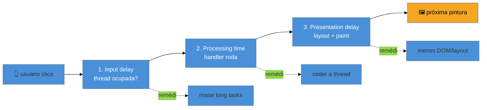

# INP a fundo

> [!abstract] TL;DR
> Uma interação, do clique à pintura, tem **três fases**: **input delay** (a thread estava ocupada e o handler esperou para começar), **processing time** (o seu código do handler rodando) e **presentation delay** (o browser calculando layout e pintando a resposta). O INP é a duração total da pior interação. Cada fase tem um remédio: input delay → não ter long tasks bloqueando (nota 02); processing → **ceder a thread** com `await scheduler.yield()` no meio de trabalho pesado; presentation → menos DOM e menos layout na resposta. A meta é INP ≤ 200 ms no p75.

## O problema: "o clique demora" — mas onde, exatamente?

Você mede o INP e ele está em 400 ms — ruim. Mas "400 ms de INP" é um sintoma, não um diagnóstico. Onde foram esses 400 ms? O usuário esperou o browser *começar* a lidar com o clique? O seu código do handler é lento? Ou o handler foi rápido, mas a atualização que ele disparou fez o browser recalcular a página inteira antes de pintar?

Sem quebrar a interação em fases, você otimiza no escuro — mexe no código do handler quando o problema era o browser estar ocupado *antes* dele. Decompor o INP em suas três fases é o que transforma "está lento" em "a fase X é a culpada, e o remédio dela é Y".

## As três fases de uma interação



### Fase 1: Input delay

É o tempo entre o usuário interagir e o **handler começar** a rodar. Se a main thread estava ocupada com outra tarefa (uma long task, hidratação de framework, um script de terceiros), o clique fica na fila esperando essa tarefa terminar — porque o browser roda uma tarefa por vez (ver [[03-Dominios/Tecnologia/Web Performance/Performance de Runtime e Rendering/01 - A thread principal e o event loop|nota 01]]). **É a causa nº 1 de INP alto**, e o mais frustrante: o atraso não tem nada a ver com o seu handler — a thread só estava ocupada.

**Remédio:** eliminar long tasks (nota 02). Um input delay alto quase sempre aponta para trabalho que não deveria estar rodando naquele momento — hidratação, inicialização de analytics, um `map` gigante.

### Fase 2: Processing time

É o tempo do **seu código do handler** executando — o `onClick` que filtra a lista, valida o form, atualiza o estado. Se esse trabalho é pesado, ele próprio vira uma long task e segura a thread até terminar, adiando a pintura da resposta.

**Remédio:** faça menos no handler síncrono, e **ceda a thread** no meio do trabalho pesado. Ceder significa devolver a thread ao browser periodicamente, para ele pintar e processar o que estiver pendente, e depois continuar. A API moderna é `scheduler.yield()`:

```js
async function processarItens(itens) {
  for (const [i, item] of itens.entries()) {
    fazerTrabalhoPesado(item);
    // a cada N itens, cede a thread pro browser respirar
    if (i % 50 === 0) {
      await scheduler.yield();
    }
  }
}
```

`await scheduler.yield()` pausa a função ali, devolve a thread ao browser (que pode pintar e responder a outros inputs) e agenda a **continuação** para logo em seguida, com prioridade. É mais ergonômico que os truques antigos (`setTimeout(0)`, `await new Promise(r => setTimeout(r))`), que também cedem mas não priorizam a continuação.

> [!info] `scheduler.yield()` é Chromium-only (julho/2026) — use com fallback
> `scheduler.yield()` ainda está só em browsers Chromium. Faça **feature detection** e caia para um yield alternativo (ou use o `scheduler-polyfill`): em browsers sem suporte, você ainda cede a thread (a página fica responsiva), só perde a *priorização* da continuação. Confirme o suporte atual em [MDN: Scheduler.yield](https://developer.mozilla.org/en-US/docs/Web/API/Scheduler/yield) antes de depender dele sem fallback.
> ```js
> async function cede() {
>   if ('scheduler' in globalThis && 'yield' in scheduler) return scheduler.yield();
>   return new Promise(r => setTimeout(r, 0)); // fallback
> }
> ```

### Fase 3: Presentation delay

É o tempo entre o handler terminar e o browser **efetivamente pintar** a mudança — o layout e o paint da resposta visual. Se o handler alterou o DOM de forma que force um recálculo caro (uma árvore enorme, um reflow pesado), essa fase incha. Estudos apontam que a apresentação pode responder por ~40% do tempo total de INP.

**Remédio:** minimizar o trabalho de rendering na resposta — DOM menor, evitar reflows caros (notas 04 e 05), atualizar só o que mudou. Adiar trabalho **não-visual** para depois da pintura (`requestIdleCallback`) também ajuda: pinte a resposta primeiro, faça o resto depois.

> [!warning] Otimizar o handler quando o problema é o input delay
> **O que acontece:** o dev reescreve e enxuga o código do `onClick`, mas o INP mal melhora. **Por quê:** se a maior parte dos 400 ms era **input delay** (a thread ocupada *antes* do handler), otimizar o handler não toca a causa. O usuário esperou a thread liberar, não o seu código rodar. **Como evitar:** meça as três fases (o painel Performance e a atribuição do RUM mostram a divisão) **antes** de otimizar. Input delay dominante → cace long tasks de terceiros/hidratação; processing dominante → ceda a thread; presentation dominante → reduza o trabalho de rendering.

**INP a fundo em uma frase:** toda interação tem input delay (thread ocupada antes do handler), processing time (seu handler rodando) e presentation delay (layout+paint da resposta), e você diagnostica qual fase domina para aplicar o remédio certo — matar long tasks, ceder a thread com `scheduler.yield()`, ou reduzir o trabalho de rendering.

## Como explicar em inglês

> "An interaction has three phases. **Input delay** — the main thread was busy, so the handler had to wait to even start; this is the most common cause of bad INP, and it's often third-party scripts or hydration, not your handler. **Processing time** — your event handler running; if it's heavy, I break it up and yield the thread with `await scheduler.yield()`, so the browser can paint and stay responsive, then continue with priority. **Presentation delay** — the browser computing layout and painting the response, which I shrink by keeping the DOM small and avoiding costly reflows. The key is measuring which phase dominates before optimizing."

| PT | EN |
|----|----|
| Atraso de entrada | Input delay |
| Tempo de processamento | Processing time |
| Atraso de apresentação | Presentation delay |
| Ceder a thread | Yield to the main thread |
| Continuação (da função) | Continuation |
| Detecção de recurso | Feature detection |

## O que vem a seguir

A fase de apresentação — e boa parte do custo de runtime — depende de quanto **layout** o browser precisa recalcular. Para atacá-la, você precisa entender o pipeline de rendering em runtime: quando o layout recalcula (reflow), quando só repinta, e por que algumas mudanças de estilo são muito mais caras que outras.

- [[03-Dominios/Tecnologia/Web Performance/Performance de Runtime e Rendering/04 - Reflow, repaint e o custo do layout|04 — Reflow, repaint e o custo do layout]] — o pipeline layout → paint → composite em runtime.
- [[03-Dominios/Tecnologia/Web Performance/Performance de Runtime e Rendering/02 - Long tasks e o custo do JavaScript|02 — Long tasks]] — a origem do input delay, como reforço.

## Fontes

- **web.dev (Google)** — [*Optimize Interaction to Next Paint*](https://web.dev/articles/optimize-inp) — as três fases e os remédios de cada uma.
- **Chrome for Developers** — [*Use `scheduler.yield()` to break up long tasks*](https://developer.chrome.com/blog/use-scheduler-yield) — a API, a continuação priorizada e o fallback.
- **MDN Web Docs** — [*Scheduler: yield() method*](https://developer.mozilla.org/en-US/docs/Web/API/Scheduler/yield) — suporte por browser e semântica.
