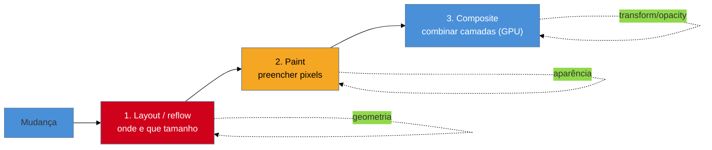

# Reflow, repaint e o custo do layout

> [!abstract] TL;DR
> Quando algo muda na página, o browser refaz parte do pipeline de rendering — e o custo depende de *quanto* ele precisa refazer. Mudar geometria (largura, posição, fonte) dispara **reflow** (recalcular o layout de tudo que é afetado) + repaint + composite — caro. Mudar só aparência (cor, sombra) dispara **repaint** sem reflow — mais barato. E mudar apenas `transform`/`opacity` pode ir direto pro **composite**, pulando layout e paint — baratíssimo, feito na GPU. A regra de ouro da animação e da atualização em runtime: **prefira propriedades que só compõem**; evite as que forçam reflow.

## O problema: duas animações, uma trava e a outra não

Você anima um card deslizando pela tela. Versão A usa `left: 0 → 300px`; roda a 20 fps, aos trancos. Versão B usa `transform: translateX(300px)`; roda lisinha a 60 fps. Mesma distância, mesmo tempo, resultado visual idêntico — e uma trava, a outra não. Por quê?

Porque as duas percorrem **caminhos diferentes** no pipeline de rendering. A versão A força o browser a recalcular o layout a cada quadro; a B é resolvida diretamente na GPU. Entender esse pipeline — e qual propriedade dispara qual etapa — é o que separa animações e atualizações fluidas das que engasgam. É o custo invisível por trás do presentation delay (INP) e da suavidade percebida.

## O pipeline de rendering em runtime

Toda vez que a página muda, o browser pode precisar refazer até três etapas, nesta ordem:

- **Layout (reflow):** calcular a **geometria** — posição e tamanho de cada elemento afetado. É a etapa mais cara, porque mudar um elemento pode empurrar muitos outros (mudar a largura de um container reposiciona todos os filhos). Dispara também paint e composite depois.
- **Paint:** preencher os **pixels** — cores, texto, bordas, sombras. Não recalcula geometria, mas repinta as áreas afetadas.
- **Composite:** combinar as **camadas** já pintadas na imagem final. Feito na GPU, é a etapa mais barata.

A chave: **quanto mais cedo no pipeline sua mudança entra, mais cara ela é**, porque tudo que vem depois também roda. Uma mudança de layout paga layout + paint + composite; uma de composite paga só composite.

## Qual propriedade dispara o quê

Este é o mapa que vale ouro na prática:

| Você muda... | Dispara | Custo | Exemplos |
|--------------|---------|-------|----------|
| **Geometria** | layout → paint → composite | 🔴 alto | `width`, `height`, `top`, `left`, `margin`, `padding`, `font-size` |
| **Aparência** | paint → composite | 🟡 médio | `color`, `background`, `box-shadow`, `border-radius`, `visibility` |
| **Transform / opacidade** | só composite | 🟢 baixo | `transform`, `opacity` |

É por isso que a versão B da animação (`transform`) voa: ela pula layout e paint e vai direto pro composite, na GPU. A versão A (`left`) força reflow a cada quadro. **Para animar posição, use `transform: translate()`; para animar aparecimento, use `opacity`** — nunca `left`/`top`/`width`/`height` numa animação.

> [!question]- Se `transform` é tão melhor, por que `left`/`top` existem para posicionar?
> Porque eles servem a propósitos diferentes. `left`/`top` (com `position`) definem o layout **estático** de um elemento — onde ele fica no fluxo do documento, calculado uma vez. `transform` aplica um deslocamento **visual** por cima, sem mexer no layout que os outros elementos enxergam. Para *posicionar* algo no design, `left`/`top` estão certos (o custo do reflow único é irrelevante). O problema é **animar** ou **atualizar em alta frequência** com eles — aí cada quadro paga um reflow. Regra: layout estático com propriedades de layout; movimento/animação com `transform`/`opacity`.

## O pipeline conecta com o INP

A fase de **presentation delay** do INP (ver [[03-Dominios/Tecnologia/Web Performance/Performance de Runtime e Rendering/03 - INP a fundo|nota 03]]) é literalmente este pipeline rodando após o handler. Se a resposta ao clique muda geometria de muitos elementos, o browser paga um reflow caro antes de pintar — e o INP incha. Responder a uma interação com uma mudança que só compõe (mostrar/esconder com `opacity`, mover com `transform`) pinta a resposta quase instantaneamente.

E há um agravante de runtime que merece nota própria: se o seu JavaScript **lê** propriedades geométricas logo depois de **escrever** no DOM, ele pode forçar o browser a fazer reflows síncronos repetidos no meio de um loop — o *layout thrashing*, tema da próxima nota.

> [!warning] Animar `width`/`height`/`top`/`left`
> **O que acontece:** uma animação ou transição usando `width`, `height`, `top` ou `left` engasga, especialmente no mobile.
> **Por quê:** cada quadro da animação dispara um **reflow** (layout) da subárvore afetada — 60 vezes por segundo, se der conta. Em telas complexas ou aparelhos fracos, não dá: os quadros caem e a animação treme.
> **Como evitar:** anime com `transform` (para mover/escalar/rotacionar) e `opacity` (para aparecer/sumir). Se precisar de um efeito de tamanho, use `transform: scale()` em vez de `width`/`height`. A dica canônica: "anime apenas `transform` e `opacity`".

**Reflow, repaint e composite em uma frase:** mudanças de geometria custam caro porque disparam layout → paint → composite, mudanças de aparência custam médio (paint → composite), e `transform`/`opacity` custam pouco (só composite, na GPU) — então para animar e responder rápido, prefira as propriedades que só compõem.

## Como explicar em inglês

> "When something changes, the browser may redo up to three stages: **layout** (reflow) — recomputing geometry, the most expensive; **paint** — filling pixels; and **composite** — combining layers on the GPU, the cheapest. The rule is: the earlier in the pipeline your change enters, the more it costs. Changing geometry — `width`, `top`, `left` — triggers a full reflow. Changing appearance — `color`, `box-shadow` — triggers paint. But `transform` and `opacity` can skip straight to compositing. That's why I animate movement with `transform` and fades with `opacity`, never `left`/`top`/`width` — those force a reflow every frame and the animation stutters."

| PT | EN |
|----|----|
| Recálculo de layout | Reflow / layout |
| Repintura | Repaint |
| Composição | Compositing |
| Geometria | Geometry |
| Pipeline de renderização | Rendering pipeline |
| Só compõe | Composite-only |

## O que vem a seguir

Saber que reflow é caro leva à pergunta: como o meu JavaScript pode *acidentalmente* disparar dezenas de reflows síncronos num único frame? É o **layout thrashing** — um dos bugs de performance mais comuns e mais fáceis de introduzir sem perceber, com uma correção elegante.

- [[03-Dominios/Tecnologia/Web Performance/Performance de Runtime e Rendering/05 - Layout thrashing|05 — Layout thrashing]] — ler e escrever o DOM em loop, e como agrupar leituras e escritas.
- [[03-Dominios/Tecnologia/Web Performance/Performance de Runtime e Rendering/06 - Compositing e animações na GPU|06 — Compositing e animações na GPU]] — camadas, `will-change` e a GPU a fundo.
- [[03-Dominios/Tecnologia/Plataforma Web/Rendering Pipeline/index|Rendering Pipeline]] — o pipeline por dentro, como reforço.

## Fontes

- **web.dev (Google)** — [*Stick to compositor-only properties and manage layer count*](https://web.dev/articles/stick-to-compositor-only-properties-and-manage-layer-count) — o custo por etapa e a regra `transform`/`opacity`.
- **web.dev (Google)** — [*Avoid large, complex layouts and layout thrashing*](https://web.dev/articles/avoid-large-complex-layouts-and-layout-thrashing) — o custo do reflow.
- **CSS Triggers** — [csstriggers.com](https://csstriggers.com/) — qual propriedade dispara layout, paint ou composite.
