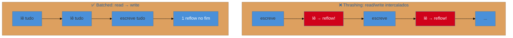

# Layout thrashing

> [!abstract] TL;DR
> **Layout thrashing** é forçar o browser a recalcular o layout (reflow) várias vezes seguidas no mesmo frame, ao **intercalar leituras e escritas** de propriedades geométricas do DOM num loop. O browser normalmente adia (batch) o reflow para o fim do frame — mas quando você *lê* uma propriedade como `offsetHeight` logo depois de *escrever* no DOM, ele é obrigado a recalcular **na hora** (forced synchronous layout) para te dar o valor correto. Num loop, isso vira dezenas de reflows síncronos. A correção é elegante: **agrupe todas as leituras primeiro, depois todas as escritas**.

## O problema: o loop que parece inocente e trava a página

Você escreve um loop que ajusta a altura de cada item de uma lista com base na largura dele. Cinquenta itens, código limpo, nada de "pesado" à vista. E mesmo assim a interface engasga por 200 ms. O profiler mostra uma parede de reflows — dezenas deles, um atrás do outro, no mesmo frame.

O culpado não é a *quantidade* de trabalho; é a **ordem** em que você lê e escreve o DOM. Esse é o layout thrashing: um antipadrão sorrateiro porque o código parece razoável e só se revela no profiler. Entendê-lo é entender como o browser tenta te ajudar — e como quebrar essa ajuda sem querer.

## Como o browser tenta ser esperto (e como você atrapalha)

O browser sabe que reflow é caro (ver [[03-Dominios/Tecnologia/Web Performance/Performance de Runtime e Rendering/04 - Reflow, repaint e o custo do layout|nota 04]]). Então ele **adia** o reflow: quando você escreve no DOM (muda uma classe, um estilo), ele não recalcula na hora — marca o layout como "sujo" e junta todas as mudanças para recalcular **uma vez só**, no fim do frame. Isso se chama *batching*, e é o que mantém a maioria das páginas rápidas.

O problema aparece quando você **lê** uma propriedade que *depende* do layout — `offsetHeight`, `offsetWidth`, `getBoundingClientRect()`, `scrollTop`, `getComputedStyle()` — **depois** de ter escrito. O browser não pode te dar um valor desatualizado: ele é forçado a **recalcular o layout imediatamente**, ali, síncrono, para responder à sua leitura. Isso é o **forced synchronous layout**. Uma vez, tudo bem. Num loop que alterna escreve-lê-escreve-lê, você força um reflow a cada iteração.



## O código com falha e a correção

O antipadrão clássico — ler `offsetWidth` e escrever `style.height` na mesma iteração:

```js
// ❌ THRASHING: cada iteração lê (força reflow) depois escreve
const itens = document.querySelectorAll('.item');
for (const item of itens) {
  const largura = item.offsetWidth;      // LÊ → força reflow síncrono
  item.style.height = largura + 'px';    // ESCREVE → suja o layout de novo
}
// N itens = N reflows síncronos
```

A cada volta: a escrita anterior sujou o layout, e a leitura de `offsetWidth` obriga o browser a recalcular tudo para responder. A correção não muda *o que* o código faz — só **separa as fases**: leia tudo primeiro (o layout é recalculado no máximo uma vez para servir todas as leituras), depois escreva tudo (que só será reflowado uma vez, no fim do frame):

```js
// ✅ BATCHED: agrupa leituras, depois escritas
const itens = document.querySelectorAll('.item');

// Fase 1: LER tudo (usa o layout atual, sem sujar)
const larguras = [...itens].map(item => item.offsetWidth);

// Fase 2: ESCREVER tudo (suja uma vez; reflow único no fim do frame)
itens.forEach((item, i) => {
  item.style.height = larguras[i] + 'px';
});
```

De N reflows para 1. Mesmo resultado, ordem diferente. Bibliotecas como **FastDOM** automatizam esse agrupamento (enfileiram leituras e escritas em fases separadas), e frameworks reativos que fazem batch de atualizações do DOM reduzem naturalmente o risco — mas o padrão manual acima resolve na raiz.

> [!question]- Como eu descubro que tenho layout thrashing, se o código "parece" normal?
> No **painel Performance** do DevTools, ele aparece como blocos roxos de "Layout" repetidos dentro de uma mesma tarefa, muitas vezes marcados com um aviso de **"Forced reflow"** (o Chrome sinaliza forced synchronous layout explicitamente). Se você vê vários reflows numa mesma função, ou o aviso "Forced reflow is a likely performance bottleneck", é thrashing. A pista no código é sempre a mesma: uma **leitura de propriedade geométrica dentro de um loop que também escreve no DOM**. Procure por `offsetWidth`/`getBoundingClientRect`/`scrollTop` em loops.

> [!warning] `getBoundingClientRect()` dentro de um loop de escrita
> **O que acontece:** um loop que posiciona elementos chamando `getBoundingClientRect()` a cada item fica lento de forma inexplicável.
> **Por quê:** `getBoundingClientRect()` (como `offsetTop`, `scrollHeight`, `getComputedStyle`) força o layout a estar atualizado — logo, força reflow síncrono se houve escrita antes. Num loop de escrita, é um reflow por item.
> **Como evitar:** colete todas as medições **antes** do loop de escrita (fase de leitura), guarde em variáveis, e só então aplique as mudanças. Nunca meça e mude o DOM alternadamente.

**Layout thrashing em uma frase:** intercalar leituras de propriedades geométricas com escritas no DOM força o browser a recalcular o layout a cada iteração (forced synchronous layout), e a cura é separar em fases — ler tudo primeiro, escrever tudo depois — trocando N reflows por um só.

## Como explicar em inglês

> "Layout thrashing is forcing the browser to recompute layout many times in one frame by **interleaving DOM reads and writes** in a loop. Normally the browser batches reflows to the end of the frame — but when you read a geometric property like `offsetHeight` right after writing to the DOM, it's forced to recalculate synchronously to give you a correct value. That's forced synchronous layout, and in a loop it's one reflow per iteration. The fix is elegant: **batch all your reads first, then all your writes** — same result, N reflows become one. In DevTools it shows up as repeated Layout blocks with a 'Forced reflow' warning."

| PT | EN |
|----|----|
| Layout thrashing | Layout thrashing |
| Reflow síncrono forçado | Forced synchronous layout |
| Agrupar (em lote) | To batch |
| Ler / escrever o DOM | Read / write the DOM |
| Propriedade geométrica | Geometric property |
| Sujar o layout | Invalidate / dirty the layout |

## O que vem a seguir

Você já sabe evitar reflows acidentais. A outra metade da fluidez em runtime é usar bem a **GPU**: promover elementos a camadas de composição para que animações e scroll rodem fora da main thread. Mas isso tem custo e armadilhas próprias — quando ajuda e quando atrapalha.

- [[03-Dominios/Tecnologia/Web Performance/Performance de Runtime e Rendering/06 - Compositing e animações na GPU|06 — Compositing e animações na GPU]] — camadas, `will-change`, e o custo de exagerar.
- [[03-Dominios/Tecnologia/Web Performance/Performance de Runtime e Rendering/07 - CLS em runtime|07 — CLS em runtime]] — deslocamentos que a interação dispara.

## Fontes

- **web.dev (Google)** — [*Avoid large, complex layouts and layout thrashing*](https://web.dev/articles/avoid-large-complex-layouts-and-layout-thrashing) — o mecanismo e o padrão read-then-write.
- **Google Web Fundamentals / Paul Irish** — [*What forces layout / reflow*](https://gist.github.com/paulirish/5d52fb081b3570c81e3a) — a lista de propriedades que forçam reflow síncrono.
- **FastDOM** — [github.com/wilsonpage/fastdom](https://github.com/wilsonpage/fastdom) — biblioteca que agrupa leituras e escritas do DOM.
