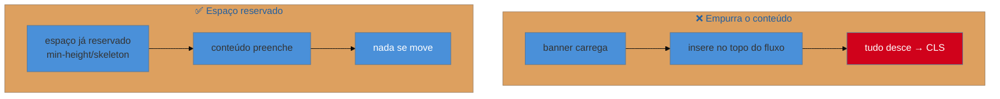

# CLS em runtime

> [!abstract] TL;DR
> O CLS não termina quando a página carrega — ele acumula durante **toda a visita**. Os deslocamentos de *runtime* vêm de conteúdo que aparece ou muda **depois** que o usuário já está lendo: banners de cookie/promo injetados, anúncios que carregam, seções que expandem, conteúdo trocado por fetch, mensagens de erro que empurram o formulário. Os remédios: **reservar espaço** antes (`min-height`, placeholders/skeletons), **inserir conteúdo novo fora do fluxo** ou acima do que o usuário vê, animar com `transform` em vez de mudar layout, e aproveitar o **bfcache**. Fronteira: dimensões de imagem/fonte são do Galho 2; aqui é o shift que a interação e o tempo disparam.

## O problema: o botão que foge no último instante

O usuário vai clicar em "Recusar cookies". No milissegundo do clique, um banner de promoção termina de carregar acima do conteúdo, empurra tudo pra baixo, e o dedo acerta "Aceitar todos". Ou: a pessoa lê um artigo, um anúncio carrega no meio do texto e joga o parágrafo para longe. Ou: ela clica em "Adicionar ao carrinho" e um aviso de estoque aparece, deslocando o botão bem quando ela clica de novo.

Esses são deslocamentos de **runtime** — e são especialmente danosos porque acontecem quando o usuário **já está interagindo**, transformando estabilidade ruim em cliques errados e frustração real. O Galho 2 resolveu o CLS de *carregamento* (imagens e fontes sem dimensão); aqui atacamos o CLS que o tempo e a interação disparam, que é onde mora a maior parte da frustração.

## De onde vêm os shifts de runtime

Todos têm a mesma raiz: **algo entra no fluxo do layout e empurra o que já estava lá**. As fontes mais comuns:

| Fonte | Exemplo |
|-------|---------|
| **Conteúdo injetado no topo** | banner de cookies, aviso de promoção, barra de notificação |
| **Anúncios / embeds** | slot de ad que carrega e "abre" espaço; iframe de vídeo/tweet |
| **Conteúdo assíncrono** | resultado de fetch que substitui um placeholder de tamanho diferente |
| **Expansão por interação** | acordeão, "ler mais", validação de formulário que insere mensagem |
| **Fontes/imagens tardias** | (majoritariamente Galho 2, mas reaparecem se carregadas via JS) |



## Os quatro remédios

**1. Reserve o espaço antes.** Se você sabe que algo vai chegar (um ad, um resultado de fetch, um banner), reserve o espaço dele **desde o início** com `min-height` ou um contêiner de tamanho fixo. Um **skeleton** (placeholder cinza no formato do conteúdo) faz isso e ainda melhora a percepção. Quando o conteúdo real chega, ele **preenche** o espaço em vez de criá-lo.

```css
.slot-anuncio { min-height: 250px; } /* reserva a altura do ad antes de ele carregar */
```

**2. Insira fora do fluxo ou não-empurrando.** Conteúdo que aparece por interação (toasts, banners, tooltips) deve usar `position: fixed`/`absolute` ou overlays — assim ele **flutua por cima** sem empurrar o layout. Um banner de cookies fixo no rodapé não desloca nada; o mesmo banner injetado no topo do fluxo desloca a página inteira.

**3. Anime com `transform`, não com layout.** Para expandir um acordeão ou revelar conteúdo, animar `height` empurra tudo abaixo a cada frame (reflow + CLS). Prefira `transform`/`opacity` (ver [[03-Dominios/Tecnologia/Web Performance/Performance de Runtime e Rendering/04 - Reflow, repaint e o custo do layout|nota 04]]) ou reserve o espaço final antecipadamente. Deslocamentos causados por **interação do usuário** têm uma janela de tolerância (~500 ms) em que não contam para o CLS — então uma expansão *imediata* após o clique é "perdoada", mas um shift **espontâneo** (sem interação) sempre conta.

**4. Aproveite o bfcache.** O **back/forward cache** guarda a página inteira em memória ao navegar para frente/trás, restaurando-a instantaneamente e **sem re-layout** — zero CLS na volta. Você o preserva evitando o que o invalida (por exemplo, o header `Cache-Control: no-store` e listeners `unload`; prefira `pagehide`/`visibilitychange`, ver [[03-Dominios/Tecnologia/Web Performance/Medição e Core Web Vitals/06 - Instrumentando RUM|G1 nota 06]]).

> [!question]- Se o deslocamento acontece logo após o clique do usuário, ele conta como CLS?
> Depende da janela de tempo. O CLS **desconta** os deslocamentos que ocorrem dentro de ~500 ms **após uma interação do usuário** — a lógica é que, se você clicou em "ler mais" e o conteúdo expandiu, esse movimento é *esperado* e não é uma surpresa ruim. Mas cuidado: (a) só interações genuínas abrem essa janela — conteúdo que carrega sozinho (um ad, um fetch em background) **sempre** conta, mesmo que por coincidência caia perto de um clique; (b) a janela é curta — uma resposta lenta que desloca 600 ms depois já conta. Então "o usuário clicou" não é licença para deslocar à vontade; é uma tolerância estreita para respostas *imediatas e esperadas*.

> [!warning] Injetar banner/ad no topo do fluxo do documento
> **O que acontece:** um banner de consentimento, promoção ou anúncio é inserido no início do `<body>` via JS depois do carregamento, e todo o conteúdo abaixo salta para baixo — CLS alto, e o pior: bem quando o usuário começou a interagir.
> **Por quê:** inserir um elemento no fluxo normal reposiciona tudo que vem depois. Como isso ocorre sem interação (o banner decide aparecer sozinho), conta integralmente para o CLS.
> **Como evitar:** reserve o espaço do banner desde o HTML inicial, **ou** exiba-o como overlay fixo/sticky que flutua por cima sem empurrar. Nunca injete no topo do fluxo algo que empurra conteúdo já visível.

**CLS em runtime em uma frase:** deslocamentos que acontecem depois do carregamento — banners injetados, ads, expansões, conteúdo assíncrono — machucam mais porque pegam o usuário interagindo, e você os previne reservando espaço antes, inserindo conteúdo como overlay fora do fluxo, animando com `transform`, e preservando o bfcache.

## Como explicar em inglês

> "CLS accumulates over the whole visit, not just during load. Runtime shifts come from content that appears *after* the user is already reading — injected cookie or promo banners, ads loading in, sections expanding, async content swapping a placeholder. They're worse because they hit mid-interaction and cause misclicks. I prevent them four ways: **reserve space** ahead with `min-height` or skeletons, **insert new content as an overlay** outside the flow instead of pushing the page, **animate with `transform`** instead of layout, and **preserve the bfcache** for instant, shift-free back/forward. Note there's a ~500ms grace window after a genuine user interaction — but content that loads on its own always counts."

| PT | EN |
|----|----|
| Deslocamento de layout | Layout shift |
| Estabilidade visual | Visual stability |
| Reservar espaço | Reserve space |
| Esqueleto (placeholder) | Skeleton |
| Fora do fluxo | Out of flow |
| Cache de avançar/voltar | Back/forward cache (bfcache) |
| Janela de tolerância | Grace window |

## O que vem a seguir

Você percorreu as causas de runtime uma a uma: thread principal, long tasks, INP, reflow, thrashing, compositing e CLS. O capstone junta a estratégia mais radical de todas — **tirar trabalho da main thread** com Web Workers — e enfrenta o elefante moderno na sala: o custo do JavaScript de framework, a hidratação, e as arquiteturas (islands, RSC) que nasceram para domá-lo.

- [[03-Dominios/Tecnologia/Web Performance/Performance de Runtime e Rendering/08 - Offload, Web Workers e o custo da hidratação|08 — Offload, Web Workers e o custo da hidratação]] — o capstone do galho; ponte pro Galho 4.

## Fontes

- **web.dev (Google)** — [*Optimize Cumulative Layout Shift*](https://web.dev/articles/optimize-cls) — fontes de shift e a janela de interação de 500 ms.
- **web.dev (Google)** — [*Back/forward cache (bfcache)*](https://web.dev/articles/bfcache) — como preservar o cache e evitar re-layout na navegação.
- **web.dev (Google)** — [*Debug layout shifts*](https://web.dev/articles/debug-layout-shifts) — achar a origem de cada deslocamento no DevTools.
