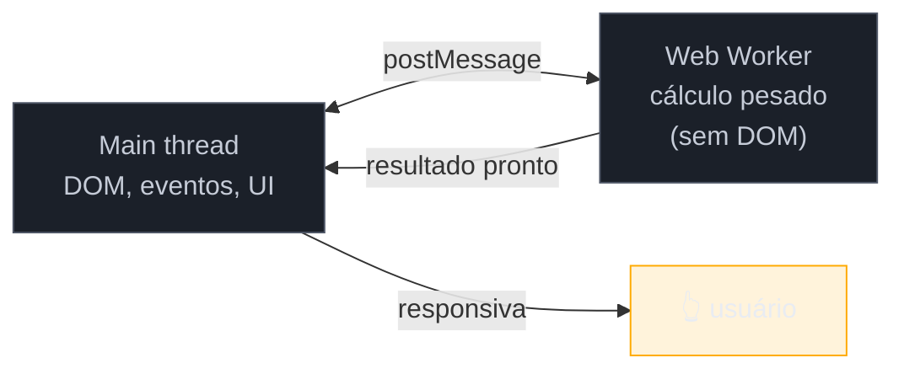
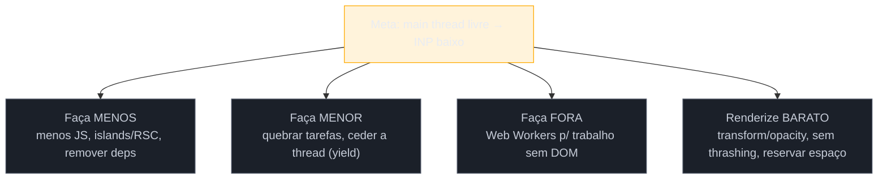

# Offload, Web Workers e o custo da hidratação

> [!abstract] TL;DR
> A estratégia mais radical contra o INP é **não rodar o trabalho na main thread**. **Web Workers** executam JavaScript em outra thread — perfeitos para trabalho pesado e independente do DOM (parsing, cálculo, processamento de dados). E o maior consumidor de main thread nos apps modernos é a **hidratação**: o framework baixa o JS de *toda* a página e reanexa a interatividade ao HTML no cliente, mesmo em partes que nunca serão interativas. As arquiteturas que atacam isso — **islands** (hidratação parcial/seletiva) e **React Server Components** (componentes que rodam só no servidor, zero JS no cliente) — reduzem o JavaScript enviado à raiz. Este é o capstone: menos JS, fora da main thread, hidratando só o necessário.

## O problema: você otimizou tudo e a página ainda "acorda" devagar

Você quebrou long tasks, cedeu a thread, evitou reflows. Mesmo assim, logo após o carregamento, a página fica **irresponsiva por um ou dois segundos** — os cliques não funcionam, embora o conteúdo já esteja visível. O que está roubando a thread nesse intervalo?

Na maioria dos apps modernos, a resposta é **hidratação**: o framework está ocupado, logo após pintar o HTML, baixando e executando o JavaScript de *toda* a página para torná-la interativa. Enquanto isso, a main thread está tomada e o INP dispara. Este capstone enfrenta os dois maiores consumidores de main thread — trabalho pesado que poderia estar em outra thread, e JavaScript de framework que talvez nem precisasse existir — e amarra a estratégia de runtime do galho inteiro.

## Offload: Web Workers, a segunda thread

Como vimos na [[03-Dominios/Tecnologia/Web Performance/Performance de Runtime e Rendering/01 - A thread principal e o event loop|nota 01]], a web é single-threaded *para o que toca a página*. Os **Web Workers** são a exceção: eles rodam JavaScript numa **thread separada**, em paralelo de verdade à main thread. O preço dessa liberdade: um Worker **não pode tocar o DOM** — ele vive isolado, e conversa com a main thread por mensagens.



```js
// main thread
const worker = new Worker('/processador.js');
worker.postMessage({ dados: umArrayGigante });
worker.onmessage = (e) => atualizarUI(e.data.resultado); // volta pronto, sem ter travado

// processador.js (outra thread)
onmessage = (e) => {
  const resultado = processarPesado(e.data.dados); // não travou a main thread
  postMessage({ resultado });
};
```

O Worker é ideal para trabalho **pesado e independente do DOM**: parsear um CSV/JSON enorme, cálculos, criptografia, processamento de imagem, filtragem de grandes conjuntos. Detalhes de tipos de worker (Shared, Service) vivem em [[03-Dominios/Tecnologia/Plataforma Web/Workers/index|Plataforma Web — Workers]]; aqui a ótica é: **o que não precisa do DOM sai da main thread**. (Ferramentas como o Partytown chegam a rodar scripts de terceiros num worker, tirando o peso deles da thread principal — ver [[03-Dominios/Tecnologia/Web Performance/Performance de Runtime e Rendering/02 - Long tasks e o custo do JavaScript|nota 02]].)

## O custo da hidratação

Aplicações modernas costumam usar **SSR** (renderizar o HTML no servidor) para o conteúdo aparecer rápido — ótimo para o LCP. Mas esse HTML é "morto": os botões não fazem nada até o JavaScript chegar. A **hidratação** é o processo pelo qual o framework, no cliente, baixa o JS, reconstrói a árvore de componentes e **reanexa os event listeners** ao HTML existente, tornando-o interativo.

O problema: a hidratação tradicional é **tudo ou nada**. O framework baixa e executa o JavaScript de *todos* os componentes — inclusive o rodapé, o cabeçalho estático, o texto do artigo — mesmo que 90% da página nunca vá reagir a um clique. É trabalho de main thread puro, logo depois do carregamento, exatamente na janela em que o usuário tenta interagir. Daí o "acordar devagar": alto **input delay** (ver [[03-Dominios/Tecnologia/Web Performance/Performance de Runtime e Rendering/03 - INP a fundo|nota 03]]) causado pela própria hidratação.

## As arquiteturas que domam a hidratação

Duas abordagens modernas atacam a raiz — enviar menos JavaScript para hidratar:

| Abordagem | Ideia | Efeito |
|-----------|-------|--------|
| **Islands** (hidratação parcial/seletiva) | a página é HTML estático com "ilhas" interativas isoladas; só as ilhas hidratam | zero JS para o conteúdo estático; ilhas hidratam progressiva e independentemente |
| **React Server Components (RSC)** | componentes marcados como server rodam **só no servidor** e enviam **zero JS** ao cliente; só componentes client hidratam | árvore unificada, mas o JS do cliente encolhe para o que é de fato interativo |

Ambas fazem a **mesma pergunta certa**: *quais componentes realmente precisam de JavaScript no cliente?* Islands (popularizada pelo Astro) trata cada ilha como um widget autônomo; RSC mantém uma árvore única em que partes simplesmente não têm código de cliente. O resultado prático é o mesmo: **menos JavaScript hidratando** = menos trabalho de main thread = melhor INP. Frameworks island-first chegam a pontuar 90+ no Lighthouse "sem fazer nada de esperto", porque quase não há trabalho de main thread para o browser. A mecânica de renderização/hidratação em React vive em [[03-Dominios/Tecnologia/React/React core/17 - Performance no React|React core 17]]; aqui a ótica é o custo de main thread.

> [!question]- Então SSR "prejudica" a performance por causa da hidratação?
> Não — SSR ajuda o **LCP** (o conteúdo aparece cedo, sem esperar o JS). O que prejudica o INP é a **hidratação tudo-ou-nada** que muitos setups de SSR trazem por padrão: você pagou para renderizar no servidor *e* paga de novo para hidratar tudo no cliente. A resposta certa não é abandonar o SSR, é **hidratar menos** — islands/RSC te dão o benefício do LCP do SSR sem o imposto de INP de hidratar a página inteira. É por isso que essas arquiteturas existem: separar "apareceu rápido" de "ficou interativo caro".

> [!warning] Mandar tudo para um Web Worker "porque é outra thread"
> **O que acontece:** o dev move lógica de UI para um Worker esperando acelerar, e a página fica mais complexa e às vezes mais lenta. **Por quê:** Workers não podem tocar o DOM, e a comunicação por `postMessage` **serializa** os dados (custa CPU e memória copiar objetos grandes de uma thread para outra). Para trabalho leve, ou que precisa do DOM, o overhead da mensagem supera o ganho. **Como evitar:** use Workers para trabalho **pesado, duradouro e independente do DOM** (o critério "vale a viagem"). Para o resto, quebrar a tarefa e ceder a thread (nota 03) resolve com menos complexidade.

## A síntese: a estratégia de runtime

O galho inteiro decorre de uma meta — **manter a main thread livre para responder** — e cada nota foi uma tática:



- **Menos:** envie menos JavaScript — hidratação parcial (islands), RSC, remover bibliotecas (notas 02, 08).
- **Menor:** quebre o trabalho que sobra e ceda a thread (`scheduler.yield`, notas 02–03).
- **Fora:** mova o pesado sem-DOM para Workers (esta nota).
- **Barato:** responda e anime com `transform`/`opacity`, sem layout thrashing, reservando espaço contra CLS (notas 04–07).

**Offload, Workers e hidratação em uma frase:** tire da main thread o que pode — trabalho pesado sem DOM vai para Web Workers, e o JavaScript de framework encolhe com hidratação parcial (islands) ou React Server Components — porque a raiz do INP é a main thread ocupada, e a hidratação tudo-ou-nada é seu maior consumidor.

## Como explicar em inglês

> "The most radical INP fix is not running work on the main thread at all. **Web Workers** run JavaScript on a separate thread — great for heavy, DOM-independent work like parsing or computation, though they can't touch the DOM and communicate via messages. And the biggest main-thread consumer in modern apps is **hydration**: the framework ships JS for the whole page and reattaches interactivity even to parts that never become interactive. **Islands** — partial hydration — and **React Server Components** attack that by shipping far less client JS. They both ask the same question: which components actually need client-side JavaScript? Less hydration means a freer main thread and better INP."

| PT | EN |
|----|----|
| Descarregar trabalho | Offload work |
| Hidratação | Hydration |
| Hidratação parcial / seletiva | Partial / selective hydration |
| Arquitetura de ilhas | Islands architecture |
| Componentes de servidor | Server Components |
| Serializar (mensagem) | Serialize |

## O que vem a seguir

Você fechou os três galhos técnicos: sabe **medir** (G1), **carregar rápido** (G2) e **manter responsivo** (G3). Mas performance conquistada apodrece: sem vigilância, cada deploy adiciona "só mais um script", e seis meses depois você está de volta ao vermelho. O galho final é sobre **sustentar** — transformar performance de um esforço pontual num sistema que se mantém: budgets no CI, monitoramento de regressão e cultura de equipe.

- **G4 — Performance em Produção** *(a construir)* — Lighthouse CI, RUM/monitoramento, detecção de regressão, DevTools em profundidade, cultura de performance. Liga a [[03-Dominios/Engenharia/Operação/index|Engenharia/Operação]] e ao [[03-Dominios/Tecnologia/Web Performance/index|índice do domínio]].

## Fontes

- **patterns.dev** — [*Islands Architecture*](https://www.patterns.dev/vanilla/islands-architecture/) — hidratação parcial e o modelo de ilhas.
- **Astro Docs** — [*Islands architecture*](https://docs.astro.build/en/concepts/islands/) — hidratação seletiva na prática e as diretivas `client:*`.
- **LogRocket** — [*Server Components vs. Islands Architecture*](https://blog.logrocket.com/server-components-vs-islands-architecture/) — como RSC e islands reduzem o JS de cliente.
- **web.dev / MDN** — [*Web Workers*](https://developer.mozilla.org/en-US/docs/Web/API/Web_Workers_API/Using_web_workers) — rodar trabalho fora da main thread.
