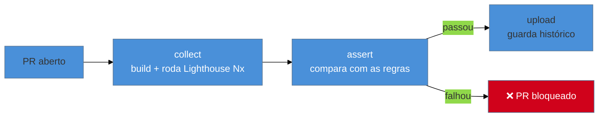

# Do lab ao CI: Lighthouse CI

> [!abstract] TL;DR
> Rodar o Lighthouse à mão pega problemas *depois* que já entraram. O **Lighthouse CI (LHCI)** move essa auditoria para dentro do **pipeline**: a cada pull request, ele carrega a build, roda o Lighthouse algumas vezes, e compara o resultado com regras (`assertions`) — reprovando o PR se a performance caiu. É a diferença entre *descobrir* uma regressão em produção e *impedi-la* de ser mergeada. O fluxo típico: `lhci autorun` (collect → assert → upload) num GitHub Action, com um `lighthouserc` definindo os limites. Transforma performance de "alguém lembra de checar" em portão automático.

## O problema: a auditoria manual sempre chega tarde

No Galho 1 você aprendeu a rodar o Lighthouse ([[03-Dominios/Tecnologia/Web Performance/Medição e Core Web Vitals/04 - Lighthouse e PageSpeed Insights|G1 nota 04]]) e a definir budgets ([[03-Dominios/Tecnologia/Web Performance/Medição e Core Web Vitals/08 - Performance budgets e diagnóstico|G1 nota 08]]). Mas uma auditoria manual tem um furo fatal: ela depende de **alguém lembrar de rodá-la**, e sempre acontece *depois* que o código já foi escrito, revisado e, muitas vezes, mergeado. Quando você descobre que o LCP piorou, a regressão já está na `main` — e rastrear qual dos vinte PRs da semana a causou é um pesadelo.

O problema real não é medir; é medir **no momento certo**. E o momento certo é **antes do merge**, automaticamente, em cada mudança. Isso é exatamente o que o CI já faz por testes e lint — e o Lighthouse CI estende para performance.

## O que é o Lighthouse CI

O **Lighthouse CI (LHCI)** é a ferramenta oficial do Google para rodar o Lighthouse dentro de um pipeline de integração contínua. Ele orquestra três etapas, resumidas no comando `lhci autorun`:



- **collect:** sobe a aplicação (uma build de produção ou um servidor estático) e roda o Lighthouse **várias vezes** na(s) URL(s) escolhida(s). Rodar N vezes e pegar a mediana combate o ruído do lab (lembre de [[03-Dominios/Tecnologia/Web Performance/Medição e Core Web Vitals/03 - Lab vs Field|G1 nota 03]]: uma execução só é uma amostra barulhenta).
- **assert:** compara os resultados com um conjunto de **regras** e retorna código de erro se alguma falhar — é o que faz o PR passar ou não.
- **upload:** guarda os relatórios (num servidor LHCI, no Temporary Public Storage, ou num artefato) para você ver a **tendência** ao longo do tempo e comparar PRs.

## Configuração mínima

Duas peças: um arquivo de config e um passo no CI. O `lighthouserc.js` (ou `.json`) define o que rodar e o que exigir:

```js
// lighthouserc.js
module.exports = {
  ci: {
    collect: {
      staticDistDir: './dist',   // ou startServerCommand para um app dinâmico
      url: ['http://localhost/', 'http://localhost/produto'],
      numberOfRuns: 3,           // mediana de 3 execuções
    },
    assert: {
      assertions: {
        'categories:performance': ['error', { minScore: 0.9 }],
        'largest-contentful-paint': ['error', { maxNumericValue: 2500 }],
        'total-blocking-time': ['warn', { maxNumericValue: 200 }],
        'cumulative-layout-shift': ['error', { maxNumericValue: 0.1 }],
      },
    },
    upload: { target: 'temporary-public-storage' },
  },
};
```

E o passo no pipeline (exemplo GitHub Actions):

```yaml
- name: Lighthouse CI
  run: |
    npm install -g @lhci/cli
    lhci autorun
```

Repare que os limites do `assert` são os mesmos Core Web Vitals do Galho 1 (LCP ≤ 2500 ms, CLS ≤ 0,1), agora como **contrato executável**. Cada assertion tem um nível: `error` (falha o build) ou `warn` (só avisa).

> [!question]- LHCI mede no lab. Não aprendemos que o Google ranqueia pelo campo (CrUX)?
> Sim, e essa distinção continua valendo. O LHCI é **lab** — ele não substitui o RUM/CrUX (que medem o usuário real, ver notas 03–04 deste galho). O papel dele é **prevenção**: um teste reproduzível que roda antes do merge para pegar regressões *na origem*, quando ainda são baratas de corrigir. O lab é perfeito para isso justamente por ser controlado e comparável entre PRs. A divisão de trabalho: **LHCI previne no CI (lab); RUM confirma em produção (campo).** Você precisa dos dois — um barra a regressão, o outro mede a realidade.

> [!warning] Rodar LHCI uma vez por PR e confiar no número absoluto
> **O que acontece:** o build falha aleatoriamente ("flaky") ou passa uma regressão real, porque o score oscilou entre execuções. **Por quê:** o lab é ruidoso — uma única execução varia com a carga da máquina de CI. Um número absoluto de uma corrida não é confiável. **Como evitar:** use `numberOfRuns: 3` (ou mais) e a mediana; rode num ambiente de CI estável; e, quando possível, prefira assertions **relativas** (comparar com a base da `main`) a limites absolutos, que dão margem ao ruído do runner.

**Lighthouse CI em uma frase:** ele roda o Lighthouse automaticamente em cada PR (collect → assert → upload), comparando o resultado com regras que falham o build quando a performance regride — movendo a auditoria do "depois, se alguém lembrar" para "antes do merge, sempre".

## Como explicar em inglês

> "Manual audits always catch problems too late — after the regression is already merged. **Lighthouse CI** moves the audit into the pipeline: on every pull request it builds the app, runs Lighthouse a few times, and checks the results against `assertions` — failing the PR if performance dropped. The flow is `lhci autorun`: collect, assert, upload. I run it three times and take the median to beat lab noise, and I assert on the same Core Web Vitals thresholds — LCP under 2.5s, CLS under 0.1. It's lab data, so it doesn't replace RUM — LHCI **prevents** regressions in CI, RUM **confirms** reality in the field. You need both."

| PT | EN |
|----|----|
| Integração contínua | Continuous integration (CI) |
| Pipeline | Pipeline |
| Regra / asserção | Assertion |
| Falhar o build | Fail the build |
| Instável (teste) | Flaky |
| Portão / gate | Gate |

## O que vem a seguir

O LHCI já reprova PRs por métricas de performance. Mas há um tipo de budget que é ainda mais barato e imediato de checar — o **tamanho do bundle** — e vale a pena entender como combinar budgets de quantidade e de métrica num gate coerente que realmente segura a regressão.

- [[03-Dominios/Tecnologia/Web Performance/Performance em Produção/02 - Budgets no pipeline|02 — Budgets no pipeline]] — bundle size + performance budgets como gate que falha o build.
- [[03-Dominios/Tecnologia/Web Performance/Performance em Produção/03 - RUM em produção|03 — RUM em produção]] — o outro lado: medir o usuário real continuamente.

## Fontes

- **GoogleChrome/lighthouse-ci** — [repositório e docs oficiais](https://github.com/GoogleChrome/lighthouse-ci) — `lhci autorun`, configuração e assertions.
- **web.dev (Google)** — [*Performance monitoring with Lighthouse CI*](https://web.dev/articles/lighthouse-ci) — o fluxo collect/assert/upload no pipeline.
- **web.dev (Google)** — [*Using bundlesize / budgets in CI*](https://web.dev/articles/incorporate-performance-budgets-into-your-build-tools) — budgets automatizados no build.
