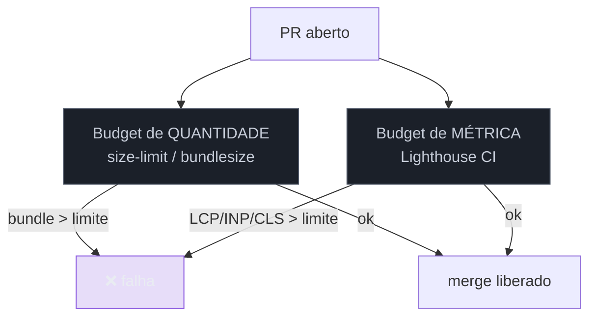

# Budgets no pipeline

> [!abstract] TL;DR
> No Galho 1 o budget era um conceito; aqui ele vira um **gate executável**. Dois tipos se combinam no pipeline: o **budget de quantidade** — tamanho do bundle, checado por ferramentas como `size-limit`/`bundlesize` direto no build, barato e imediato — e o **budget de métrica** — LCP/INP/CLS, checado pelo Lighthouse CI. A regra que separa teatro de proteção: o budget precisa **falhar o build** quando estoura. Um budget que só avisa é ignorado em semanas. Budget de quantidade previne cedo (no bundle); budget de métrica valida o efeito (na página); juntos, seguram a regressão antes do merge.

## O problema: o budget que ninguém respeita

Você definiu budgets ( [[03-Dominios/Tecnologia/Web Performance/Medição e Core Web Vitals/08 - Performance budgets e diagnóstico|G1 nota 08]]) e até configurou o Lighthouse CI (nota 01). Mas seis meses depois o bundle dobrou de tamanho e o LCP regrediu. O que falhou?

Quase sempre, uma de duas coisas: ou o budget **só avisava** (nunca quebrou o build, então virou ruído que todos ignoram), ou ele existia só como **métrica** — e um dev adicionou uma biblioteca de 200 KB num PR que, individualmente, não estourou o limite de LCP no CI, mas somou-se a dez outros até a regressão ficar grande demais. O budget conceitual não protege; o budget **operacionalizado no pipeline, com dente**, protege. Esta nota é sobre transformar a intenção em portão.

## Os dois budgets que se complementam



### Budget de quantidade: o early warning barato

O budget de quantidade limita **bytes** — o tamanho do JavaScript/CSS que você entrega. É o mais barato de checar porque não precisa rodar a página: ferramentas como **`size-limit`** ou **`bundlesize`** medem o bundle direto no build, em segundos.

```json
// package.json com size-limit
{
  "size-limit": [
    { "path": "dist/main.*.js", "limit": "170 KB" },
    { "path": "dist/*.css", "limit": "50 KB" }
  ],
  "scripts": { "size": "size-limit" }
}
```

A grande vantagem: ele é **acionável na hora do commit**. O dev que abre o PR não controla diretamente "o LCP", mas controla diretamente "eu adicionei 90 KB". Um budget de bytes falha imediatamente, com uma mensagem clara ("main.js: 240 KB > 170 KB"), apontando o PR culpado antes de qualquer coisa rodar. O número de referência (~170 KB de JS para a rota inicial) vem do cálculo reverso da G1 nota 08.

### Budget de métrica: o que o usuário sente

O budget de métrica limita **LCP, INP, CLS** (e afins) e é checado pelo **Lighthouse CI** (nota 01) via `assertions`, ou por um `budget.json` de performance. Ele é o que mais se aproxima da experiência real, mas é mais caro (precisa carregar a página) e mais ruidoso (o lab varia). Serve para **validar o efeito**: mesmo com o bundle dentro do limite, uma imagem hero gigante ou um render-blocking pode estourar o LCP — e só o budget de métrica pega isso.

A combinação é a chave: **quantidade previne cedo e barato; métrica valida o efeito real**. Um sem o outro deixa um flanco aberto — bundle pequeno mas LCP ruim, ou LCP ok num PR que sozinho não estoura mas contribui para o inchaço.

## A regra inegociável: o budget precisa ter dente

> [!warning] Budget que só avisa (`warn`), nunca falha (`error`)
> **O que acontece:** o pipeline mostra um aviso amarelo quando o budget estoura, mas o merge é liberado. Em poucas semanas, todos ignoram o aviso e a performance apodrece igual a antes. **Por quê:** um budget sem consequência é uma sugestão, e sugestões perdem para prazos. Sem bloqueio, não há política — só decoração. **Como evitar:** configure o gate para **falhar o build / bloquear o merge** (`error`, não `warn`) quando o budget de linha de base estourar. A dor precisa ser sentida **antes** do merge. Reserve `warn` para métricas secundárias ou em rodagem, nunca para o limite que importa.

> [!question]- Limites absolutos ou relativos à base?
> Os dois têm lugar. **Absoluto** ("main.js ≤ 170 KB", "LCP ≤ 2500 ms") é um teto de qualidade claro e fácil de comunicar — bom para o budget de quantidade. **Relativo** ("não pode piorar mais de 5% em relação à `main`") pega a *regressão gradual* que um teto absoluto generoso deixaria passar, e é mais robusto ao ruído do lab nas métricas. Na prática: use **absoluto para bytes** (o dev entende "cabe ou não cabe") e considere **relativo para métricas** (compara o PR com a base, absorvendo a variação do runner). O importante é que *algum* dos dois falhe o build.

> [!warning] Só budget de quantidade, sem budget de métrica (ou vice-versa)
> **O que acontece:** o time trava o tamanho do bundle, mas o LCP piora mesmo assim — ou vigia só o LCP e o bundle incha silenciosamente. **Por quê:** bytes e experiência não são a mesma coisa. Uma imagem hero enorme não aparece no budget de JS; um bundle no limite pode ainda gerar LCP ruim por render-blocking. E uma métrica saudável num PR pode esconder bytes acumulando para o inchaço futuro. **Como evitar:** rode **os dois** no pipeline. Quantidade como early warning barato, métrica como validação do efeito. É a mesma lição da G1 nota 08, agora como configuração de CI.

**Budgets no pipeline em uma frase:** operacionalize o budget como gate que falha o build — quantidade (bundle size via size-limit, barato e imediato) para prevenir cedo, e métrica (LCP/INP/CLS via Lighthouse CI) para validar o efeito real — porque um budget sem dente é decoração que a performance ignora até apodrecer.

## Como explicar em inglês

> "In production, a budget has to be an executable gate, not a concept. I combine two kinds. A **quantity budget** — bundle size, checked by `size-limit` right in the build — is cheap, instant, and actionable at commit time: the dev controls 'I added 90 KB', not 'the LCP'. And a **metric budget** — LCP, INP, CLS via Lighthouse CI — validates the real effect, catching things a byte budget misses, like a huge hero image. The non-negotiable rule: the budget must **fail the build** when it's exceeded. A budget that only warns gets ignored within weeks. Quantity prevents early; metric validates; both together stop regressions before merge."

| PT | EN |
|----|----|
| Orçamento de quantidade | Quantity budget |
| Orçamento de métrica | Metric budget |
| Tamanho do bundle | Bundle size |
| Aviso prévio | Early warning |
| Limite absoluto / relativo | Absolute / relative threshold |
| Ter dente (falhar de verdade) | To have teeth |

## O que vem a seguir

CI e budgets protegem contra regressões **antes** do merge — no lab. Mas o lab nunca é a verdade completa (Galho 1). Para saber o que os usuários reais vivem em produção, você precisa do outro pilar: coletar dados de campo continuamente. É o RUM em produção.

- [[03-Dominios/Tecnologia/Web Performance/Performance em Produção/03 - RUM em produção|03 — RUM em produção]] — o pipeline de dados de campo: coletar, transportar, guardar, visualizar.
- [[03-Dominios/Tecnologia/Web Performance/Performance em Produção/01 - Do lab ao CI - Lighthouse CI|01 — Lighthouse CI]] — onde os budgets de métrica rodam, como base.

## Fontes

- **size-limit** — [github.com/ai/size-limit](https://github.com/ai/size-limit) — budget de tamanho de bundle no CI, com falha do build.
- **web.dev (Google)** — [*Incorporate performance budgets into your build tools*](https://web.dev/articles/incorporate-performance-budgets-into-your-build-tools) — budgets de quantidade e métrica automatizados.
- **GoogleChrome/lighthouse-ci** — [*budgets.json / assertions*](https://github.com/GoogleChrome/lighthouse-ci/blob/main/docs/configuration.md) — configurar o gate de métrica.
