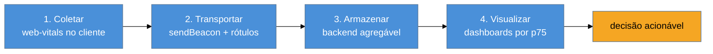

# RUM em produção

> [!abstract] TL;DR
> Um RUM de produção é um **pipeline de dados**, não só um script. Quatro estágios: **coletar** (a lib `web-vitals` no cliente, recap do Galho 1), **transportar** (`sendBeacon` no `visibilitychange`, com rótulos: rota, deploy, país, dispositivo), **armazenar** (um backend que aguente volume e permita agregar por percentil) e **visualizar** (dashboards por p75, segmentados). A grande decisão é **provider vs. próprio**: um SaaS (SpeedCurve, DebugBear, Sentry, Vercel/Cloudflare Analytics) entrega tudo pronto; o próprio dá controle e custo variável. Sem os rótulos certos, você só reobtém o que o CrUX já dá de graça.

## O problema: o CI protege o lab, não a realidade

O Lighthouse CI (notas 01–02) barra regressões **antes** do merge, mas mede o **lab**. Ele não sabe nada do celular de gama baixa do seu usuário no interior, numa 3G congestionada. Para saber o que as pessoas *de verdade* vivem — e se o seu último deploy melhorou ou piorou para elas — você precisa medir em produção, continuamente. Isso é o **RUM (Real User Monitoring)**, que o Galho 1 introduziu como conceito ([[03-Dominios/Tecnologia/Web Performance/Medição e Core Web Vitals/06 - Instrumentando RUM|G1 nota 06]]).

Mas "instrumentar com `web-vitals`" é só o primeiro dos quatro passos. Um RUM que serve em produção é um **pipeline**: coletar não adianta se você não transporta com contexto, armazena de forma agregável e visualiza de forma acionável. Esta nota é sobre montar esse pipeline inteiro — e sobre a decisão de construí-lo ou comprá-lo.

## Os quatro estágios do pipeline



**1. Coletar.** A biblioteca `web-vitals` mede LCP/INP/CLS/TTFB/FCP no cliente e já classifica o `rating` (recap da G1 nota 06). A build de **attribution** ainda te dá o culpado (o seletor do elemento LCP), ouro para diagnóstico.

**2. Transportar.** Aqui mora o que separa um RUM útil de um inútil: **os rótulos**. Você bufferiza as métricas e envia o lote com `navigator.sendBeacon` no `visibilitychange → hidden` (nunca `unload` — ver G1 nota 06), anexando as **dimensões** que só você tem:

```js
navigator.sendBeacon('/rum', JSON.stringify({
  metrics: [...fila.values()],
  rota: location.pathname,
  deploy: window.__BUILD_ID__,   // qual release
  pais: navigator.language,       // ou via header do CDN
  conexao: navigator.connection?.effectiveType, // 4g / 3g
}));
```

**3. Armazenar.** As métricas chegam ao seu backend e precisam ir para um armazenamento que (a) aguente o **volume** (um site movimentado gera milhões de eventos) e (b) permita **agregar por percentil** — porque o que importa é o p75, não a média (G1 nota 02). Bancos de série temporal ou colunares (ClickHouse, BigQuery, um time-series DB) são escolhas comuns; um banco relacional comum sofre no volume.

**4. Visualizar.** Dashboards que mostram **p75 por métrica, segmentado** — por rota, por país, por tipo de dispositivo, por versão de deploy. É a segmentação que transforma "o INP está ruim" em "o INP está ruim na rota `/checkout`, no Android, no deploy de ontem" — o começo de uma correção.

## Provider vs. próprio: a decisão

Você não precisa construir os quatro estágios. A escolha central:

| | RUM de provider (SaaS) | RUM próprio |
|-|------------------------|-------------|
| **Setup** | minutos (um script) | dias/semanas (backend + storage + dashboards) |
| **Custo** | assinatura previsível | infra + manutenção variável |
| **Controle** | limitado ao que o produto oferece | total (rótulos, retenção, integrações) |
| **Volume** | incluso no plano | você dimensiona (e paga) |
| **Exemplos** | SpeedCurve, DebugBear, Sentry, Vercel/Cloudflare Analytics, New Relic | `web-vitals` → seu endpoint → ClickHouse/BigQuery → Grafana |

A regra prática: **comece com um provider**. Para a maioria dos times, o custo de construir e manter um pipeline de RUM não se paga — um SaaS entrega coleta, storage e dashboards prontos, e você foca em *agir* sobre os dados. Migrar para RUM próprio faz sentido quando o volume torna o SaaS caro, quando você precisa de rótulos/retenção que o produto não oferece, ou quando já tem uma stack de observabilidade onde encaixar.

> [!question]- Se eu tenho RUM próprio, ainda preciso do CrUX?
> São complementares, com papéis distintos. O **CrUX** (G1 nota 05) é o dado que o **Google usa para ranquear** — é o "placar oficial", ainda que lento (28 dias) e só Chrome. O seu **RUM** é mais rápido (reage a um deploy em horas), mais granular (segmenta por rota/deploy/país) e cobre todos os browsers. Use o RUM para **operar** (detectar regressão, diagnosticar, decidir); use o CrUX para saber se você **passa no exame de SEO**. Um RUM próprio não substitui o CrUX no papel de sinal de ranking, nem o CrUX substitui o RUM no papel de ferramenta operacional.

> [!warning] Coletar RUM sem rótulos de deploy e segmento
> **O que acontece:** você tem milhões de eventos, mas só consegue dizer "o INP do site é X" — exatamente o que o CrUX já dava, com muito mais trabalho. **Por quê:** o valor do RUM próprio está na **granularidade**. Sem rótulos (`deploy`, `rota`, `país`, `conexão`), você não consegue correlacionar uma piora com um release nem isolar a rota culpada — que é todo o ponto de ter RUM próprio. **Como evitar:** anexe as dimensões desde o primeiro dia, sobretudo o **ID do deploy** (permite comparar release a release, base da próxima nota) e a **rota**. Rótulo esquecido é dado perdido — não dá pra rotular o passado.

**RUM em produção em uma frase:** é um pipeline de quatro estágios — coletar (`web-vitals`), transportar (`sendBeacon` com rótulos de rota/deploy/país), armazenar (backend agregável por p75) e visualizar (dashboards segmentados) — e para a maioria dos times começar com um provider SaaS entrega tudo isso pronto, deixando você focar em agir sobre os dados.

## Como explicar em inglês

> "A production RUM is a data pipeline, not just a script. Four stages: **collect** with the `web-vitals` library, **transport** via `sendBeacon` on `visibilitychange` — with labels like route, deploy ID, and country, which is what makes it more than CrUX — **store** in a backend that handles volume and aggregates by percentile, and **visualize** as p75 dashboards segmented by route and device. The big decision is buy vs. build: a SaaS like SpeedCurve or DebugBear gives you all four out of the box, while rolling your own gives control at a variable cost. I usually start with a provider — building a RUM pipeline rarely pays off until volume or custom needs demand it."

| PT | EN |
|----|----|
| Monitoramento de usuário real | Real User Monitoring (RUM) |
| Pipeline de dados | Data pipeline |
| Rótulo / dimensão | Label / dimension |
| Agregar por percentil | Aggregate by percentile |
| Comprar vs. construir | Buy vs. build |
| ID de deploy | Deploy ID |

## O que vem a seguir

Com RUM coletando dados rotulados por deploy, você tem a matéria-prima para a pergunta que mais importa em produção: *este release piorou a performance para os usuários?* Responder a isso de forma automática — e alertar quando a resposta é "sim" — é a detecção de regressão.

- [[03-Dominios/Tecnologia/Web Performance/Performance em Produção/04 - Detecção de regressão e alertas|04 — Detecção de regressão e alertas]] — comparar releases, alertar quando o p75 piora.
- [[03-Dominios/Tecnologia/Web Performance/Performance em Produção/05 - Monitoramento sintético contínuo|05 — Monitoramento sintético contínuo]] — o lab contínuo, complementar ao RUM.

## Fontes

- **web.dev (Google)** — [*Best practices for measuring Web Vitals in the field*](https://web.dev/articles/vitals-field-measurement-best-practices) — coleta e transporte de RUM.
- **GoogleChrome/web-vitals** — [repositório](https://github.com/GoogleChrome/web-vitals) — a lib de coleta e a build de attribution.
- **web.dev (Google)** — [*Get started measuring Web Vitals in the field / RUM providers*](https://web.dev/articles/vitals-measurement-getting-started) — panorama de RUM de provider vs. próprio.
