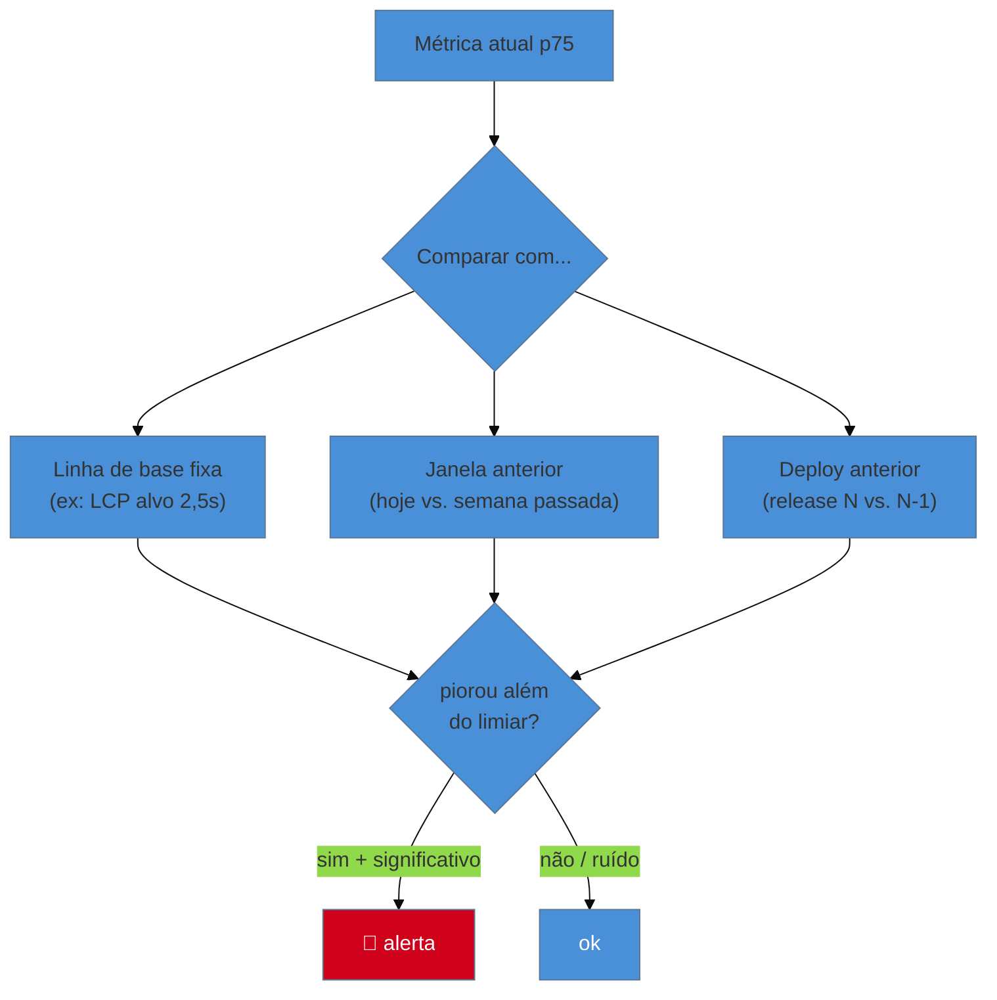

# Detecção de regressão e alertas

> [!abstract] TL;DR
> Ter dashboards não basta — ninguém fica olhando gráfico o dia todo. A detecção de regressão **compara automaticamente** o desempenho ao longo do tempo (release a release, ou contra uma linha de base) e **alerta** quando o p75 de uma métrica piora além de um limiar. O desafio central é separar **sinal de ruído**: o RUM oscila naturalmente, então alertar em qualquer variação gera fadiga de alarme. As táticas: comparar percentis (não médias), exigir significância (janela de tempo/volume mínimo), correlacionar a piora com o **deploy** (via o rótulo da nota 03), e definir um **limiar de ação** — quanto de piora justifica acordar alguém.

## O problema: a regressão que ninguém viu a tempo

Você montou o RUM (nota 03). Os dashboards estão lindos. E mesmo assim, na terça, o INP da rota de checkout degradou 40% depois de um deploy — e o time só descobriu na sexta, quando as reclamações chegaram ao suporte. Os dados estavam lá o tempo todo; ninguém estava olhando.

Esse é o limite do dashboard: ele é **passivo**. Depende de um humano abrir, olhar o gráfico certo, no dia certo, e notar a mudança. Em produção, você precisa do oposto — um sistema **ativo** que vigia por você e grita quando algo piora. Mas gritar demais é tão inútil quanto não gritar: um alerta que dispara toda hora é silenciado em uma semana. O problema real é **detectar regressão de verdade sem afogar o time em falsos alarmes**.

## Comparar contra o quê

Detectar regressão é sempre comparar dois estados. As estratégias comuns:

- **Contra uma linha de base fixa:** alerta se o p75 cruza um limiar absoluto (LCP > 2,5 s). Simples, mas não pega uma piora *dentro* do verde (de 1,2 s para 2,3 s continua "bom", mas dobrou).
- **Contra uma janela anterior:** compara hoje com a semana/mês passado. Pega tendências graduais, mas é sensível à sazonalidade (fim de semana tem público diferente).
- **Contra o deploy anterior:** compara release N com N-1, usando o **rótulo de deploy** (nota 03). É o mais acionável — liga a regressão diretamente à mudança que a causou.

O ideal combina: um teto absoluto (não deixar sair do verde) **e** uma comparação por deploy (pegar a regressão na origem).

## O inimigo: ruído e fadiga de alarme

O RUM é intrinsecamente **ruidoso** — o p75 varia com a mistura de dispositivos, redes e horários, mesmo sem nenhuma mudança no código. Se você alerta a cada oscilação, o time recebe dez alarmes falsos por dia, aprende a ignorá-los, e some com o alarme *real* no meio do ruído. Isso é **fadiga de alarme**, e mata um sistema de monitoramento tão certo quanto não ter monitoramento.

As defesas:

- **Compare percentis, não médias.** A média oscila mais e esconde a cauda; o p75 é mais estável e é o que importa (G1 nota 02).
- **Exija significância.** Só alerte com **volume mínimo** de amostras e sobre uma **janela de tempo** — não sobre cinco visitas nos últimos dois minutos.
- **Defina um limiar de ação.** Uma piora de 3% no p75 provavelmente é ruído; 20% provavelmente é real. Calibre o gatilho para o tamanho de piora que **justifica alguém agir** — não qualquer movimento.
- **Roteie por severidade.** Uma regressão pequena vira um item no board; uma grande, uma notificação imediata. Nem tudo é urgência.

> [!question]- Regressão pega no CI (Lighthouse CI) ou em produção (RUM)?
> Nos dois, em camadas — é defesa em profundidade. O **Lighthouse CI** (notas 01–02) pega regressões **antes do merge**, no lab, de forma reproduzível: barato e preventivo, mas cego para o mundo real. O **RUM** pega o que passou pelo CI e só se manifesta em produção — um dispositivo específico, uma região, uma interação que o lab não exercitou, um script de terceiros que mudou do lado deles. O CI é o portão na entrada; o monitoramento de RUM é o alarme dentro de casa. Uma regressão que o CI não pegou (porque o lab não a reproduz) é exatamente o caso de uso do alerta de RUM.

> [!warning] Alertar em qualquer variação da métrica
> **O que acontece:** o time configura alerta para "qualquer piora do LCP", recebe dezenas de disparos por dia, e em uma semana criou uma regra de e-mail para arquivá-los. Quando vem a regressão real, ninguém vê.
> **Por quê:** o RUM oscila naturalmente; alertar sem limiar de significância transforma o sinal em ruído constante — a clássica fadiga de alarme.
> **Como evitar:** alerte só sobre pioras **significativas** (limiar de ação calibrado, volume/janela mínimos) e **acionáveis** (correlacionadas a um deploy ou segmento). Menos alertas, cada um confiável, é infinitamente melhor que muitos ignorados.

**Detecção de regressão em uma frase:** compare automaticamente o p75 (não a média) contra uma linha de base e o deploy anterior, alerte só sobre pioras significativas e acionáveis para evitar fadiga de alarme, e trate CI (previne no lab) e RUM (alerta em produção) como camadas complementares.

## Como explicar em inglês

> "Dashboards are passive — nobody watches them all day. Regression detection **compares automatically** over time and **alerts** when a metric's p75 degrades past a threshold. The core challenge is signal vs. noise: RUM naturally fluctuates, so alerting on every wiggle causes alert fatigue and the real regression gets ignored. So I compare percentiles not averages, require statistical significance with a minimum volume and time window, correlate the drop with the **deploy** via labels, and set an **action threshold** — how much degradation actually warrants waking someone. And it's layered: Lighthouse CI catches regressions in the lab before merge; RUM alerts catch what only shows up in production."

| PT | EN |
|----|----|
| Detecção de regressão | Regression detection |
| Linha de base | Baseline |
| Fadiga de alarme | Alert fatigue |
| Sinal vs. ruído | Signal vs. noise |
| Limiar de ação | Action threshold |
| Significância (estatística) | Statistical significance |

## O que vem a seguir

O RUM alerta sobre o que já aconteceu com usuários reais. Mas há valor em pegar problemas **antes** de qualquer usuário — rodando o lab continuamente, em horários agendados, contra produção. É o monitoramento sintético, que complementa o RUM cobrindo o que o campo não vê.

- [[03-Dominios/Tecnologia/Web Performance/Performance em Produção/05 - Monitoramento sintético contínuo|05 — Monitoramento sintético contínuo]] — checagens agendadas e ferramentas de monitoramento.
- [[03-Dominios/Tecnologia/Web Performance/Performance em Produção/06 - Diagnóstico avançado no DevTools|06 — Diagnóstico avançado no DevTools]] — quando o alerta dispara, achar a causa.

## Fontes

- **web.dev (Google)** — [*Monitor performance and detect regressions*](https://web.dev/articles/vitals-measurement-getting-started) — comparar ao longo do tempo e por deploy.
- **SpeedCurve** — [*Performance monitoring and alerting*](https://www.speedcurve.com/features/performance-monitoring/) — detecção de regressão e roteamento de alertas na prática.
- **Google SRE Book** — [*Monitoring distributed systems / alerting*](https://sre.google/sre-book/monitoring-distributed-systems/) — princípios de sinal vs. ruído e fadiga de alarme.
