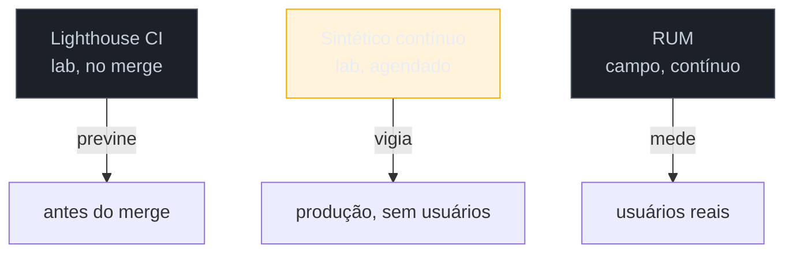

# Monitoramento sintético contínuo

> [!abstract] TL;DR
> O CI mede no merge; o RUM mede o usuário real. Entre os dois há uma terceira vigia: o **monitoramento sintético contínuo** — rodar o lab (Lighthouse/WebPageTest) em **horários agendados** contra produção, sempre nas mesmas condições. Sua força é a **reprodutibilidade**: como o ambiente é fixo, uma variação aponta uma mudança real (um deploy, um script de terceiros que mudou), sem o ruído do RUM. Cobre o que o RUM não vê (páginas de baixo tráfego, ambientes sem usuários ainda) e pega problemas **antes** de afetar gente. Ferramentas: WebPageTest, DebugBear, SpeedCurve, Checkly. Complementa — não substitui — o RUM.

## O problema: os pontos cegos do CI e do RUM

Você tem CI (previne no merge) e RUM (mede usuários reais). Parece completo — mas há brechas entre os dois:

- Uma **página de baixo tráfego** (uma landing de campanha, uma rota de admin) quase não gera dados de RUM, então uma regressão nela fica invisível no campo.
- Uma **mudança em produção que não passou pelo seu CI** — um script de terceiros que o fornecedor atualizou, uma config de CDN, um teste A/B — degrada a performance sem nenhum PR seu para o CI pegar.
- Você quer saber que algo quebrou **antes** de milhares de usuários sofrerem — o RUM, por definição, só te avisa *depois* que eles já viveram o problema.

O monitoramento sintético preenche essas brechas: um lab que roda **sozinho, continuamente, contra produção**, funcionando como uma sentinela reproduzível.

## Sintético contínuo vs. as outras duas vigias

As três formam uma linha de defesa completa:

| Vigia | Quando | Ambiente | Pega |
|-------|--------|----------|------|
| **Lighthouse CI** | a cada PR | lab | regressão na origem, antes do merge |
| **Sintético contínuo** | agendado (cron) | lab, contra produção | mudanças externas, páginas sem tráfego, antes dos usuários |
| **RUM** | sempre | campo (usuários) | a realidade, incluindo o que o lab não reproduz |

O sintético contínuo é, essencialmente, o mesmo lab do Galho 1 ([[03-Dominios/Tecnologia/Web Performance/Medição e Core Web Vitals/04 - Lighthouse e PageSpeed Insights|G1 nota 04]]), mas rodando **repetidamente e agendado** contra o ambiente de produção, guardando o histórico para detectar tendências.

## A força: reprodutibilidade

O RUM é a verdade, mas é ruidoso (nota 04) — o p75 balança com a mistura de dispositivos e redes. O sintético é o oposto: **ambiente fixo** (mesmo dispositivo simulado, mesma rede, mesma localização), então quando o número muda, **a página mudou** — não a sorte da amostra. Isso o torna ideal para:

- **Isolar o efeito de mudanças externas:** o número saltou entre duas rodadas sem deploy seu? Um terceiro mudou.
- **Testar fluxos, não só páginas:** ferramentas sintéticas roteirizam jornadas (login → busca → checkout), medindo performance em passos que o RUM agrega mal.
- **Comparar com concorrentes:** rode o sintético contra o site do concorrente (é público) e acompanhe a diferença ao longo do tempo.

As ferramentas comuns: **WebPageTest** (o mais detalhado, com filmstrip e waterfall), **DebugBear** e **SpeedCurve** (monitoramento sintético + RUM num produto), **Checkly** (checagens sintéticas com Playwright). Muitas combinam sintético e RUM, dando as duas óticas no mesmo dashboard.

> [!question]- Se o sintético é reproduzível e "limpo", por que não confiar só nele e largar o RUM?
> Porque reprodutível **não é** representativo. O sintético mede *uma* condição que **você escolheu** — um dispositivo, uma rede, uma localização. Seus usuários reais são uma distribuição enorme e caótica que nenhuma configuração sintética reproduz (G1 nota 03). O sintético te diz "nesta condição controlada, mudou X"; só o RUM te diz "para os meus usuários de verdade, no p75, a experiência é Y". Confiar só no sintético é o mesmo erro de otimizar o lab e ignorar o campo. Eles respondem perguntas diferentes: o sintético é ótimo para **detectar e isolar** mudanças; o RUM é insubstituível para **medir a realidade**.

> [!warning] Rodar sintético numa condição irreal e tirar conclusões de campo
> **O que acontece:** o monitoramento sintético roda num data center rápido, com desktop e banda alta, mostra tudo verde — e o time conclui que a performance está ótima, enquanto o RUM mobile está vermelho. **Por quê:** um sintético mal-configurado (sem throttling de CPU/rede, perfil desktop) mede um cenário otimista que não representa ninguém. "Verde no sintético" não é "verde para o usuário". **Como evitar:** configure o sintético para se aproximar do seu **p75 real** — perfil mobile de gama média, CPU e rede com throttling, localização representativa do seu público. E sempre cruze com o RUM: o sintético detecta *mudança*, o RUM confirma o *impacto*.

**Monitoramento sintético contínuo em uma frase:** é o lab rodando agendado contra produção, cuja reprodutibilidade permite isolar mudanças (deploys, terceiros) e cobrir páginas sem tráfego antes de os usuários sofrerem — a terceira vigia entre o CI (no merge) e o RUM (campo), que complementa mas nunca substitui o dado de usuário real.

## Como explicar em inglês

> "Between CI at merge and RUM in the field, there's a third watchdog: **continuous synthetic monitoring** — running the lab, like WebPageTest or Lighthouse, on a schedule against production, always under the same conditions. Its strength is reproducibility: because the environment is fixed, a change in the number means a real change — a deploy, a third-party script — without RUM's noise. It covers what RUM misses: low-traffic pages, and problems *before* real users hit them. But it's not representative — it measures one condition I chose, so it detects and isolates changes, while RUM measures reality. I use both, and I configure the synthetic to match my real p75, not a fast data-center desktop."

| PT | EN |
|----|----|
| Monitoramento sintético | Synthetic monitoring |
| Checagem agendada | Scheduled check |
| Reprodutível | Reproducible |
| Representativo | Representative |
| Jornada / fluxo | User journey / flow |
| Sentinela / vigia | Watchdog |

## O que vem a seguir

CI, sintético e RUM juntos te dizem **que** e **quando** algo regrediu. Falta o **onde** e o **por quê** — a perícia. Quando um alerta dispara, você abre o microscópio: o painel Performance do DevTools, a fundo, para achar a função, o recurso ou o reflow culpado.

- [[03-Dominios/Tecnologia/Web Performance/Performance em Produção/06 - Diagnóstico avançado no DevTools|06 — Diagnóstico avançado no DevTools]] — ler o flame chart e caçar a causa raiz.
- [[03-Dominios/Tecnologia/Web Performance/Performance em Produção/04 - Detecção de regressão e alertas|04 — Detecção de regressão]] — o alerta que aciona o diagnóstico, como base.

## Fontes

- **WebPageTest** — [webpagetest.org](https://www.webpagetest.org/) — teste sintético detalhado (waterfall, filmstrip) e monitoramento agendado.
- **web.dev (Google)** — [*Synthetic vs. real user monitoring*](https://web.dev/articles/lab-and-field-data-differences) — os papéis complementares de lab contínuo e RUM.
- **Checkly / SpeedCurve / DebugBear** — docs de **synthetic monitoring** — checagens agendadas, roteirização de jornadas e alertas.
