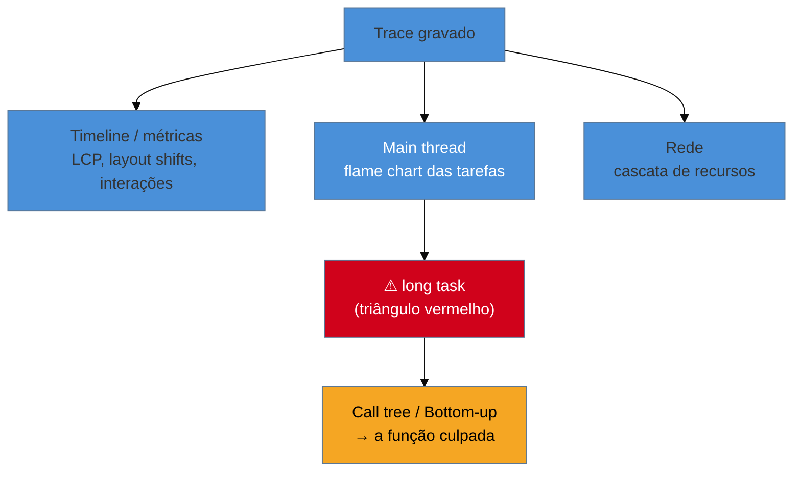

# Diagnóstico avançado no DevTools

> [!abstract] TL;DR
> Quando um alerta dispara, o **painel Performance** do DevTools é o microscópio que mostra *onde* o tempo foi. Você **grava** um trace da interação/carregamento e lê três coisas: a **trilha da main thread** (o flame chart das tarefas — long tasks aparecem com um triângulo vermelho), os **marcadores de métrica** (LCP, layout shifts na timeline) e a **cascata de rede**. Com throttling de CPU/rede, você reproduz a condição do usuário ruim. A regra de leitura: vá da métrica ruim → ao marcador na timeline → à tarefa/recurso culpado → à função (via call tree / bottom-up). O painel **Performance Insights** resume os achados acionáveis.

## O problema: o alerta diz "o quê", não "onde"

As três vigias do galho — CI, sintético, RUM — te dizem *que* o INP da rota de checkout regrediu 40%. Mas nenhuma te diz **qual função**, **qual recurso**, **qual linha** causou. Entre "o INP está ruim" e "esta função de 300 ms no `onClick` é a culpada" há um abismo, e atravessá-lo é **perícia** — a habilidade de gravar e ler um trace de performance.

O Galho 1 introduziu o painel Performance como uma das ferramentas de diagnóstico ([[03-Dominios/Tecnologia/Web Performance/Medição e Core Web Vitals/08 - Performance budgets e diagnóstico|G1 nota 08]]). Aqui vamos a fundo: como gravar a condição certa, o que cada trilha do trace significa, e o método para ir do sintoma à causa raiz sem se perder no mar de barras coloridas.

## Gravar a condição certa

Um trace só é útil se reproduzir o problema **do usuário**, não da sua máquina. Antes de gravar:

- **Throttling de CPU:** o painel simula um aparelho 4×/6× mais lento. Sem isso, você mede o seu desktop, não o celular do usuário (lembre da armadilha da [[03-Dominios/Tecnologia/Web Performance/Performance de Runtime e Rendering/01 - A thread principal e o event loop|G3 nota 01]]).
- **Throttling de rede:** simule 4G/3G para carregamento.
- **Grave só o necessário:** para INP, comece a gravar, faça *a interação*, pare. Para LCP, grave o carregamento (com cache limpo). Traces curtos e focados são muito mais fáceis de ler.

## As trilhas que importam

- **Trilha da main thread (flame chart):** o coração do diagnóstico de runtime. Cada barra é uma tarefa; barras aninhadas são a pilha de chamadas. **Long tasks** (>50 ms) aparecem marcadas com um **triângulo/canto vermelho**, e o Chrome sinaliza **"Forced reflow"** quando detecta layout thrashing (G3 nota 05). É onde você vê a função que segura a thread.
- **Marcadores de métrica na timeline:** o painel marca **LCP**, **FCP** e cada **layout shift** na linha do tempo. Você clica no marcador de LCP e ele mostra *qual elemento* foi o LCP e *quando* pintou — ligando a métrica à causa.
- **Cascata de rede:** cada recurso como barra — quando começou, esperou, baixou. Aqui você vê o TTFB alto, a imagem-LCP que baixou tarde, o render-blocking (Galho 2).

Para descer da tarefa à função, use as abas **Call Tree** (de cima para baixo: onde o tempo foi gasto por chamada) e **Bottom-Up** (agrega por função: qual função *no total* consumiu mais tempo, mesmo chamada de vários lugares). Bottom-Up é ouro para achar "aquela função que aparece em todo lugar".

## O método: do sintoma à causa

A perícia tem um roteiro repetível, o mesmo do método de diagnóstico da G1 nota 08, agora no detalhe do trace:

1. **Qual métrica?** O alerta/RUM diz: LCP, INP ou CLS.
2. **Reproduza** a condição ruim (throttling + a interação/carregamento) e grave.
3. **Vá ao marcador** daquela métrica na timeline.
4. **Siga até a causa:**
   - LCP ruim → marcador de LCP → é rede (cascata: recurso baixou tarde) ou render (thread ocupada antes do paint)?
   - INP ruim → a interação na timeline → qual fase (input delay = thread ocupada antes; processing = seu handler; presentation = layout/paint)? (G3 nota 03) → a tarefa no flame chart → a função no Bottom-Up.
   - CLS ruim → marcador de layout shift → qual elemento se moveu e por quê (G3 nota 07).
5. **Ataque a causa, valide** no campo (RUM) — não pare no lab.

> [!info] Use o Performance Insights / dicas automáticas
> As versões recentes do DevTools trazem um painel de **insights** que analisa o trace e lista achados acionáveis ("render-blocking request", "LCP request discovery", "forced reflow", "layout shift culprit") já ligados ao recurso/elemento. É um ótimo atalho antes do mergulho manual. A UI do DevTools muda com frequência — o nome e o layout do painel podem variar entre versões do Chrome; confirme em [developer.chrome.com/docs/devtools/performance](https://developer.chrome.com/docs/devtools/performance).

> [!warning] Diagnosticar sem throttling
> **O que acontece:** você grava no seu desktop potente, o trace fica todo verde e curto, e você não consegue reproduzir o INP ruim que o RUM aponta. **Por quê:** sem throttling de CPU/rede, o trace mede a *sua* máquina, não a do usuário no p75. A long task que dura 300 ms num celular mediano dura 60 ms no seu desktop e nem aparece como problema. **Como evitar:** **sempre** aplique CPU throttling (4×–6×) e rede lenta antes de gravar um diagnóstico de campo. O objetivo é reproduzir a dor do usuário, não confirmar que a sua máquina é rápida.

**Diagnóstico avançado em uma frase:** grave um trace na condição do usuário (com throttling), leia a trilha da main thread (long tasks/forced reflow no flame chart), os marcadores de métrica (LCP/shifts) e a cascata de rede, e vá do sintoma ao culpado pelo call tree / bottom-up — deixando o painel de insights adiantar os achados acionáveis.

## Como explicar em inglês

> "When an alert fires, the DevTools **Performance panel** is the microscope. I record a trace of the interaction or load — always with **CPU and network throttling** so it reflects the user's device, not mine — and read three tracks: the **main thread flame chart**, where long tasks show a red triangle and forced reflows are flagged; the **metric markers** on the timeline for LCP and layout shifts; and the **network waterfall**. Then I go symptom to cause: from the bad metric's marker, to the task or resource, to the function via the Bottom-Up view. The Performance Insights panel surfaces actionable findings automatically as a head start."

| PT | EN |
|----|----|
| Gravar um trace | Record a trace |
| Gráfico de chamas | Flame chart |
| Limitação de CPU/rede | CPU/network throttling |
| Árvore de chamadas | Call tree |
| Visão de baixo para cima | Bottom-up view |
| Causa raiz | Root cause |

## O que vem a seguir

Você domina o ciclo técnico completo — medir, otimizar, prevenir regressão, diagnosticar. Mas nada disso sobrevive sem **prioridade organizacional**. Antes de vender a cultura (nota 08), você precisa da munição: o **business case** que traduz milissegundos em dinheiro e convence quem decide a investir em performance.

- [[03-Dominios/Tecnologia/Web Performance/Performance em Produção/07 - O business case da performance|07 — O business case da performance]] — ligar métrica a receita e priorizar.
- [[03-Dominios/Tecnologia/Web Performance/Performance em Produção/08 - Cultura de performance|08 — Cultura de performance]] — sustentar ao longo do tempo.

## Fontes

- **Chrome for Developers** — [*Analyze runtime performance*](https://developer.chrome.com/docs/devtools/performance) — gravar e ler o trace: main thread, marcadores, cascata.
- **Chrome for Developers** — [*Performance features reference*](https://developer.chrome.com/docs/devtools/performance/reference) — call tree, bottom-up e throttling.
- **Chrome for Developers** — [*Performance insights*](https://developer.chrome.com/docs/devtools/performance/insights) — achados acionáveis automáticos.
