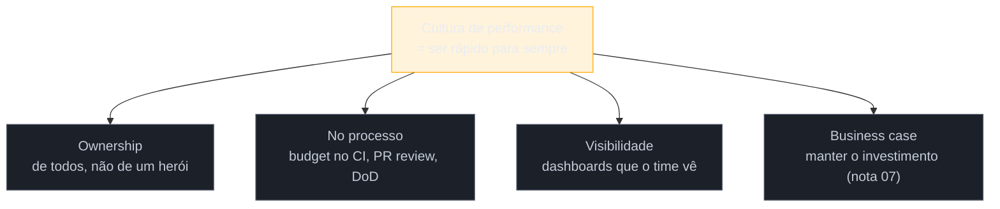

# Cultura de performance

> [!abstract] TL;DR
> Ferramentas medem, budgets barram, alertas avisam — mas nada disso sustenta performance se ela for "problema de uma pessoa". Performance apodrece por mil cortes: cada PR adiciona um pouco, e sem **cultura** — performance como responsabilidade compartilhada, tratada como requisito não-funcional de primeira classe — o site volta ao vermelho em meses. Os pilares: **ownership** distribuído (todos os devs, não um "herói de performance"), performance **no processo** (budgets no CI, revisão de PR, definition of done), **visibilidade** (dashboards que o time inteiro vê), e **o business case** (nota 07) para manter o investimento. Este é o capstone do domínio: a diferença entre otimizar uma vez e ser rápido para sempre.

## O problema: a performance que sempre volta a apodrecer

Uma equipe faz um "sprint de performance", tira o LCP de 4 s para 2 s, comemora. Seis meses depois, está em 3,5 s de novo. Ninguém decidiu piorar; cada PR só adicionou "mais um script", "mais uma fonte", "mais uma dependência" — a **morte por mil cortes**. O trabalho técnico foi excelente e evaporou, porque o que faltava não era técnica: era um **sistema social** que mantivesse o ganho.

Este é o capstone do domínio inteiro porque amarra uma verdade incômoda: você pode dominar medição (G1), carregamento (G2), runtime (G3) e todas as ferramentas de produção deste galho, e ainda assim **perder** — se performance for tratada como um projeto pontual em vez de uma propriedade contínua do produto. Cultura é o que transforma "fomos rápidos uma vez" em "somos rápidos".

## Por que apodrece: o mecanismo social

A degradação gradual tem uma causa estrutural, não de má-fé:

- **Cada mudança é localmente razoável.** O dev que adiciona uma biblioteca de 80 KB está resolvendo o problema dele; ninguém vê o *acumulado*.
- **O custo é difuso, o benefício é concreto.** A feature nova é visível e celebrada; os 80 KB são invisíveis até somarem com outros cinquenta.
- **Ninguém é dono do todo.** Se performance é "do time de infra" ou "daquele dev que gosta disso", os outros não se sentem responsáveis — e o herói solitário não escala nem sobrevive a uma saída.

A cultura ataca exatamente esse mecanismo: torna o custo **visível**, o ownership **compartilhado**, e a prevenção **parte do processo** em vez de um ato de heroísmo.

## Os quatro pilares

**1. Ownership compartilhado.** Performance é responsabilidade de **todo dev**, como qualidade e segurança — não de um especialista isolado. O especialista vira *facilitador* (ferramentas, guias, educação), não o único que se importa. Um "herói de performance" é um ponto único de falha: quando ele sai de férias ou da empresa, a performance despenca.

**2. No processo, não na boa vontade.** A prevenção precisa estar embutida onde o trabalho acontece:
- **Budget no CI** que falha o build (notas 01–02) — a barreira automática.
- **Performance na revisão de PR** — "isso adiciona quanto ao bundle?" como pergunta padrão.
- **Definition of Done** que inclui performance — uma feature não está "pronta" se estourou o budget.

**3. Visibilidade.** Dashboards de RUM (nota 03) e sintético (nota 05) **visíveis para o time inteiro**, não escondidos numa aba que só uma pessoa abre. O que é medido e visto é gerenciado; o que é invisível apodrece. Alguns times colocam o p75 num monitor da sala ou num canal de chat.

**4. O business case sustentado.** Como vimos na [[03-Dominios/Tecnologia/Web Performance/Performance em Produção/07 - O business case da performance|nota 07]], performance compete por recursos. Manter a cultura viva exige **relembrar continuamente o valor** — ligar cada ganho a um número de negócio, para que o investimento não seja cortado no próximo aperto de prazo.

> [!question]- Cultura não é coisa de gestão? O que um dev sozinho pode fazer?
> Muito — cultura se constrói de baixo para cima também. Um único dev pode: adicionar o budget no CI (o gate protege o time todo automaticamente); fazer a pergunta "quanto isso pesa?" nas revisões de PR (normaliza o hábito); tornar um dashboard visível e compartilhá-lo quando algo melhora; e traduzir um ganho em número de negócio numa retro. Você não precisa de um título para começar a mudar o processo — precisa de **um gate automatizado e um hábito repetido**. A cultura é a soma desses pequenos atos institucionalizados, não um decreto. Frequentemente o "herói" vira facilitador exatamente assim: automatizando o cuidado para que ele não dependa mais de heroísmo.

> [!warning] Depender de heroísmo e sprints pontuais
> **O que acontece:** o time faz um "mutirão de performance" a cada seis meses, ganha muito, e assiste tudo apodrecer no intervalo, num ciclo eterno de sobe-e-desce. **Por quê:** sprint pontual conserta o *estado*, não o *processo*. Sem gate automático e ownership distribuído, a entropia volta a agir no dia seguinte — cada PR reintroduz peso. **Como evitar:** troque heroísmo por **sistema**. Um budget no CI que falha o build previne mais regressão que dez sprints de mutirão, porque age em *cada* PR, para sempre, sem ninguém precisar lembrar. Automatize o cuidado.

## O domínio inteiro, em uma imagem

Este é o fim da trilha Web Performance. O arco completo:

- **Medir** (G1): você não otimiza o que não mede — CWV, lab vs. field, RUM, budgets, diagnóstico.
- **Carregar** (G2): o LCP — critical path, render-blocking, hints, imagens, fontes, compressão, cache, HTTP moderno.
- **Responder** (G3): o INP e o CLS de runtime — thread principal, long tasks, reflow, compositing, offload, hidratação.
- **Sustentar** (G4): manter tudo — CI, budgets com dente, RUM, regressão, diagnóstico, business case, e a cultura que fecha o ciclo e o realimenta.

O ciclo não tem fim: sustentar realimenta o medir, e a roda gira. Performance não é um destino que você alcança; é uma prática que você mantém.

**Cultura de performance em uma frase:** ferramentas e budgets só sustentam performance quando viram cultura — ownership compartilhado, prevenção embutida no processo (CI, PR, DoD), visibilidade para todo o time e um business case vivo —, porque performance apodrece por mil cortes e a cura não é heroísmo pontual, é um sistema que cuida sozinho, para sempre.

## Como explicar em inglês

> "Tools measure, budgets block, alerts warn — but none of it sustains performance if it's one person's job. Performance rots by a thousand cuts: every PR adds a little, and without **culture** it's back in the red within months. The pillars: **shared ownership** — every dev, not a lone performance hero who's a single point of failure; performance **in the process** — a CI budget that fails the build, a 'how much does this add?' question in PR review, performance in the definition of done; **visibility** — dashboards the whole team sees; and a living **business case** to keep the investment funded. The lesson of the whole domain: performance isn't a destination you reach, it's a practice you maintain — automate the caring so it doesn't depend on heroics."

| PT | EN |
|----|----|
| Cultura de performance | Performance culture |
| Responsabilidade compartilhada | Shared ownership |
| Requisito não-funcional | Non-functional requirement |
| Morte por mil cortes | Death by a thousand cuts |
| Definição de pronto | Definition of Done (DoD) |
| Automatizar o cuidado | Automate the caring |

## O que vem a seguir

Você chegou ao fim do domínio Web Performance — do medir ao sustentar. Daqui, os caminhos naturais:

- [[03-Dominios/Tecnologia/Web Performance/index|Índice do domínio Web Performance]] — o mapa completo dos 4 galhos.
- [[03-Dominios/Engenharia/Operação/index|Engenharia — Operação (DevOps/SRE)]] — onde a cultura de performance encontra a disciplina de operação, CI/CD e observabilidade.
- [[03-Dominios/Tecnologia/Web Performance/Performance de Carregamento/08 - HTTP moderno e estratégia de carregamento|G2 nota 08]] e [[03-Dominios/Tecnologia/Web Performance/Performance de Runtime e Rendering/08 - Offload, Web Workers e o custo da hidratação|G3 nota 08]] — as sínteses técnicas que esta cultura mantém vivas.

## Fontes

- **Lara Hogan** — [*Designing for Performance* — cap. sobre cultura](https://designingforperformance.com/) — performance como responsabilidade de equipe e como institucionalizá-la.
- **web.dev (Google)** — [*Build a performance culture*](https://web.dev/articles/value-of-speed) — visibilidade, budgets e o business case como pilares culturais.
- **Addy Osmani** — [*Performance budgets and culture*](https://addyosmani.com/blog/performance-budgets/) — o budget como ferramenta cultural, não só técnica.
