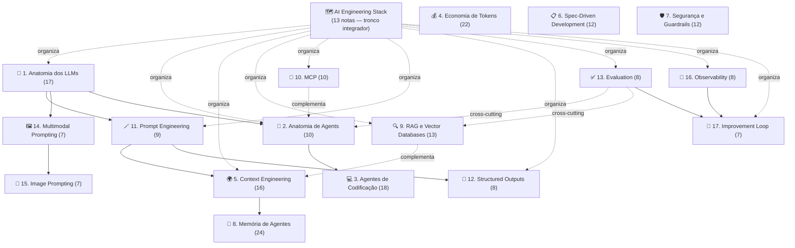

# Tapar Lacunas IA — Implementation Plan

> **For agentic workers:** REQUIRED SUB-SKILL: Use `superpowers:subagent-driven-development` (recommended) ou `superpowers:executing-plans` pra implementar task-by-task. Steps usam checkbox (`- [ ]`) syntax pra tracking.

**Goal:** Tapar as 10 lacunas no domínio `03-Dominios/Tecnologia/IA/` identificadas a partir do artigo "Become an AI Engineer" (@hooeem, X/Twitter), criando 7 trilhas novas + 1 nota avulsa + atualizações em notas existentes — cerca de **70 notas + 8 índices** mais atualização do índice-raiz e do dicionário.

**Architecture:** Cada trilha segue o padrão `tronco/galhos` do vault: pasta com `index.md` (MOC) + notas atômicas `NN - Título.md` em ordem sequencial, blocos temáticos no MOC, frontmatter padrão (`type: concept|moc`, `progress`, `status`, `publish`, tags). Wikilinks internos por nome curto (`[[NN - Título]]`), cross-trilha por path (`[[03-Dominios/Tecnologia/IA/Pasta|alias]]`). Sem subpastas de "fases" (Iniciado/Adepto/Magus) — trilhas novas seguem o padrão **plano** das trilhas existentes (Anatomia dos LLMs, Context Engineering, RAG, etc.).

**Tech Stack:** Markdown CommonMark + Obsidian Flavored Markdown · Quartz v4 publish (frontmatter `publish: true` torna público) · skill `verificar-wikilinks` pra auditoria final · skill `obsidian-markdown` pra formato Obsidian (callouts, embeds).

**Convenções inegociáveis do vault** (reaproveitar em toda nota nova):

- Numeração de notas: `NN - Título.md` com NN em 2 dígitos. Hífen-longo (`—`) só dentro do título quando subtítulo.
- Frontmatter de nota: `title`, `created`, `updated`, `type: concept`, `status: seedling`, `progress: in_progress`, `tags`, `publish: true`, `aliases` (opcional).
- Frontmatter de MOC (`index.md`): `title`, `type: moc`, `publish: true`, `tags`, `created`, `updated`, `aliases`.
- Primeira seção da nota é sempre `> [!abstract] TL;DR` com 3-5 frases. Padrão observado em todas as notas maduras (`Anatomia dos LLMs/02 - Tokens e tokenização`).
- MOC tem 4 seções fixas mínimas: introdução em parágrafo único, `> [!info] Pré-requisitos`, `## Comece por aqui` (blocos), `## Rotas alternativas` (perfis), `## Leituras recomendadas` (tabela), `## Veja também`, `## Todas as notas` (dataview).
- Datas: `created: 2026-05-28`, `updated: 2026-05-28` (atualizar `updated` em qualquer edição posterior).
- Glossário: termo novo importante vai em `Dicionário de IA.md` e a nota referencia com `[[Dicionário de IA#Termo|alias]]`.
- Nunca inventar dados sobre o usuário, projetos ou clientes (memória `feedback_no_fabrication`).
- Nada que referencie conteúdo do repo apocrypha (memória `feedback_public_apocrypha_separation`).
- `index.md` do IA raiz é load-bearing — Quartz quebra sem ele (memória `feedback_quartz_index`).

**Ordem de execução recomendada** (respeita dependências de cross-links):

1. **AI Engineering Stack** primeiro (tronco arquitetural — fornece a tabela periódica que outras trilhas linkam)
2. **Prompt Engineering** (artefato canônico Karpathy + base pra outras trilhas)
3. **Structured Outputs** (linkada por Prompt Engineering e Anatomia dos LLMs)
4. **Evaluation** (atualiza 3 notas existentes; é cross-cutting)
5. **Workflow vs Agent** (nota avulsa rápida)
6. **Multimodal Prompting**
7. **Image Prompting**
8. **Observability**
9. **Improvement Loop** (depende de Evaluation e Observability)
10. **Atualizar Dicionário de IA**
11. **Atualizar index.md raiz do IA** (último — só atualizar quando todas trilhas existirem)
12. **Cross-links das 3 notas Evaluation existentes**
13. **Verificação final** (`/verificar-wikilinks 03-Dominios/IA`)

Cada trilha = 1 commit no padrão `feat(ia): adicionar trilha <nome>`. Nota avulsa = commit próprio. Atualizações finais = commit próprio.

---

## Task 1 — Trilha: AI Engineering Stack

**Por que primeiro:** É o "atlas" que mapeia as 11 camadas do artigo (#18) contra todas as trilhas existentes. Funciona como nota-tronco integradora — todas as outras trilhas novas vão linkar pra cá. Tapa **lacuna #7**.

**Files:**
- Create: `03-Dominios/Tecnologia/IA/AI Engineering Stack/index.md`
- Create: `03-Dominios/Tecnologia/IA/AI Engineering Stack/01 - As 11 camadas — visão geral.md`
- Create: `03-Dominios/Tecnologia/IA/AI Engineering Stack/02 - Purpose Layer — o que o sistema é.md`
- Create: `03-Dominios/Tecnologia/IA/AI Engineering Stack/03 - Prompt Layer.md`
- Create: `03-Dominios/Tecnologia/IA/AI Engineering Stack/04 - Context Layer.md`
- Create: `03-Dominios/Tecnologia/IA/AI Engineering Stack/05 - Output Layer.md`
- Create: `03-Dominios/Tecnologia/IA/AI Engineering Stack/06 - Retrieval Layer.md`
- Create: `03-Dominios/Tecnologia/IA/AI Engineering Stack/07 - Tool Layer.md`
- Create: `03-Dominios/Tecnologia/IA/AI Engineering Stack/08 - Workflow vs Agent Layer.md`
- Create: `03-Dominios/Tecnologia/IA/AI Engineering Stack/09 - Evaluation Layer.md`
- Create: `03-Dominios/Tecnologia/IA/AI Engineering Stack/10 - Guardrail Layer.md`
- Create: `03-Dominios/Tecnologia/IA/AI Engineering Stack/11 - Logging Layer.md`
- Create: `03-Dominios/Tecnologia/IA/AI Engineering Stack/12 - Improvement Layer.md`
- Create: `03-Dominios/Tecnologia/IA/AI Engineering Stack/13 - Setup completo — do zero ao sistema de produção.md`

**Filosofia das notas desta trilha:** cada nota de camada (02-12) é **fina** (1-2 páginas). Cada uma responde 3 perguntas:
1. O que essa camada é, e qual problema resolve?
2. Quais são as decisões-chave dela?
3. Onde no Codex você aprende a fazer isso direito? (linka trilha existente)

A nota 13 é a **receita end-to-end** — um sistema exemplo passando pelas 11 camadas. A nota 01 é o panorama com diagrama mermaid das 11 camadas.

- [ ] **Step 1: Criar pasta e index.md**

```yaml
---
title: "AI Engineering Stack"
type: moc
publish: true
tags:
  - ai-engineering-stack
  - ia
  - moc
  - arquitetura
created: 2026-05-28
updated: 2026-05-28
aliases:
  - AI Engineer Stack
  - Stack de Engenharia de IA
  - As 11 camadas
---
```

Estrutura do MOC: parágrafo de abertura (a "tabela periódica" que organiza todo o domínio IA), `> [!info] Pré-requisitos` (recomendado ter lido `Anatomia dos LLMs` e `Anatomia de Agents`), `## Comece por aqui` com 3 blocos (Bloco 1 — Visão geral [nota 01], Bloco 2 — As 11 camadas [02-12], Bloco 3 — Aplicação [13]), `## Rotas alternativas` (Rota Praticante / Rota Arquiteto / Rota Líder), `## Leituras recomendadas` (Anthropic Building Effective Agents, OpenAI Cookbook, Chip Huyen AI Engineering), `## Veja também` (linka **todas** as outras trilhas IA — esta é o tronco), `## Todas as notas` (dataview).

- [ ] **Step 2: Nota 01 — As 11 camadas — visão geral**

Conteúdo obrigatório: TL;DR de 3 frases (LLMs em produção têm 11 camadas; isolá-las dá controle e manutenção; este é o mapa). Diagrama mermaid das 11 camadas com setas mostrando fluxo (Purpose → Prompt+Context+Tool → Output → Eval/Guardrail loop → Logging → Improvement). Tabela `Camada × Pergunta-chave × Trilha do Codex`. Seção "Por que 11 e não 5?" justificando granularidade. Fontes: artigo @hooeem (#18), Anthropic *Building Effective Agents*.

- [ ] **Step 3: Notas 02-12 — uma por camada**

Cada uma com:
- `> [!abstract] TL;DR` de 2-3 frases.
- `## O problema que essa camada resolve` (1 parágrafo + exemplo de sistema sem ela).
- `## Decisões-chave` (3-5 bullets: o que você decide nessa camada).
- `## Templates plug-and-play` (copiar do artigo do @hooeem que dá template explícito por camada — **citar fonte**).
- `## Onde aprender a fundo no Codex` (linka trilha relevante).
- `## Armadilhas comuns` (2-4 bullets).
- `## Veja também` (links pra camadas adjacentes).

Mapping camada → trilha existente/nova:

| Camada | Trilha primária do Codex |
|--------|--------------------------|
| 02 Purpose | `[[Spec-Driven Development]]` (Fase Specify) |
| 03 Prompt | `[[Prompt Engineering]]` (trilha nova — Task 2) |
| 04 Context | `[[Context Engineering]]` |
| 05 Output | `[[Structured Outputs]]` (trilha nova — Task 3) |
| 06 Retrieval | `[[RAG e Vector Databases]]` |
| 07 Tool | `[[MCP]]` + `[[Anatomia de Agents\|03 - Tool design]]` |
| 08 Workflow vs Agent | `[[Anatomia de Agents\|10 - Workflow vs Agent]]` (nota nova — Task 10) |
| 09 Evaluation | `[[Evaluation]]` (trilha nova — Task 4) |
| 10 Guardrail | `[[Segurança e Guardrails]]` |
| 11 Logging | `[[Observability]]` (trilha nova — Task 8) |
| 12 Improvement | `[[Improvement Loop]]` (trilha nova — Task 9) |

- [ ] **Step 4: Nota 13 — Setup completo**

Caminhada por sistema exemplo (escolha um caso genérico tipo "AI newsletter agent" — não inventar nada sobre o usuário). Cada um dos 11 passos do artigo (#18 Steps 1-11) vira uma subseção mostrando o template preenchido. Fecha com checklist de verificação ("já preenchi as 11 camadas?").

- [ ] **Step 5: Verificar wikilinks da trilha**

```bash
# Skill verificar-wikilinks na pasta nova
```
Esperado: 0 wikilinks quebrados (notas das outras trilhas novas ainda não existem — wikilinks são forward-references aceitáveis, skill informa mas não bloqueia).

- [ ] **Step 6: Commit**

```bash
git add "03-Dominios/Tecnologia/IA/AI Engineering Stack"
git commit -m "feat(ia): adicionar trilha AI Engineering Stack — as 11 camadas

Tronco integrador que mapeia as 11 camadas de sistemas de IA contra
trilhas existentes do Codex. Tapa lacuna #7 (atlas arquitetural)
identificada na análise do artigo Become an AI Engineer (@hooeem)."
```

---

## Task 2 — Trilha: Prompt Engineering

**Por que segundo:** Tapa **lacunas #1 e #10**. O Codex pulou direto pra Context Engineering, deixando órfã a camada de craft do prompt. Esta trilha inclui o mega-prompt do Karpathy como artefato canônico.

**Files:**
- Create: `03-Dominios/Tecnologia/IA/Prompt Engineering/index.md`
- Create: `03-Dominios/Tecnologia/IA/Prompt Engineering/01 - Por que prompt engineering ainda importa.md`
- Create: `03-Dominios/Tecnologia/IA/Prompt Engineering/02 - Especificidade — a primeira disciplina.md`
- Create: `03-Dominios/Tecnologia/IA/Prompt Engineering/03 - Roles e personas — escolhendo o juízo do modelo.md`
- Create: `03-Dominios/Tecnologia/IA/Prompt Engineering/04 - O mega-prompt do Karpathy — anatomia da anti-sycophancy.md`
- Create: `03-Dominios/Tecnologia/IA/Prompt Engineering/05 - Few-shot examples — exemplos como contrato.md`
- Create: `03-Dominios/Tecnologia/IA/Prompt Engineering/06 - Constraints declarativas — boundaries como engenharia.md`
- Create: `03-Dominios/Tecnologia/IA/Prompt Engineering/07 - Iteration patterns — keep, change, do-not.md`
- Create: `03-Dominios/Tecnologia/IA/Prompt Engineering/08 - Reasoning models — audit trail, não chain-of-thought.md`
- Create: `03-Dominios/Tecnologia/IA/Prompt Engineering/09 - Anti-patterns e tells de IA — o que evitar.md`

- [ ] **Step 1: Criar index.md**

```yaml
---
title: "Prompt Engineering"
type: moc
publish: true
tags:
  - prompt-engineering
  - ia
  - moc
created: 2026-05-28
updated: 2026-05-28
aliases:
  - Engenharia de Prompts
---
```

Estrutura: introdução que **reconhece a tensão** (prompt engineering "morreu" como tese pop, mas o craft do prompt segue sendo a interface; Context Engineering é o superset, não o substituto). `> [!info] Pré-requisitos` (Anatomia dos LLMs/01-03). Posicionar relação com `[[Context Engineering]]` explicitamente: "Prompt Engineering é a camada **dentro** do Prompt Layer do `[[AI Engineering Stack]]`". Blocos: Bloco 1 — Fundamentos (01, 02), Bloco 2 — Técnicas Centrais (03, 04, 05), Bloco 3 — Controle Fino (06, 07, 08), Bloco 4 — Cultura (09). Leituras: artigo @hooeem caps 2-8, *The Prompt Report* (Schulhoff 2024), OpenAI Prompt Engineering Guide, Anthropic Prompt Engineering docs.

- [ ] **Step 2: Nota 01 — Por que prompt engineering ainda importa**

Conteúdo: TL;DR. Seção `## A tese "prompt engineering morreu"` (origens, por que pegou). Seção `## O que de fato morreu` (prompt como bala-de-prata, prompt sem contexto, prompt como ritual mágico). Seção `## O que segue vivo` (prompt como interface, prompt como contrato, prompt como camada). Seção `## Onde mora dentro do AI Engineering Stack` (linka `[[AI Engineering Stack/03 - Prompt Layer]]`). Fonte: artigo @hooeem cap #1.

- [ ] **Step 3: Nota 02 — Especificidade**

Conteúdo: TL;DR. Antes/depois clássico ("Make this better" vs prompt completo). Tabela de **perguntas-guia** (Quem é o leitor? Qual o output? Qual restrição de tamanho? Qual o tom?). Template plug-and-play. Armadilhas: confundir especificidade com verbosidade. Fonte: artigo cap #2.

- [ ] **Step 4: Nota 03 — Roles e personas**

Conteúdo: TL;DR. Por que roles funcionam (steering via prior do treino). Template `Act as a [role] / You are allowed to / You are not allowed to / Use this standard / If information is missing`. Armadilhas: role-prompt como cargo culto, persona sem standards. Linka pra próxima nota (04 — Karpathy). Fonte: artigo cap #3.

- [ ] **Step 5: Nota 04 — O mega-prompt do Karpathy**

Nota canônica importante. Conteúdo: TL;DR explicando o que é (system prompt anti-sycophancy de Karpathy). `## O prompt na íntegra` (code block com o texto completo — citar fonte). `## Anatomia — cláusula por cláusula` com tabela `Cláusula × O que previne × Quando matar` (ex: "Never praise my questions" → previne sycophancy → manter sempre; "Your answers can be provocative" → desbloqueia honestidade → suavizar pra contextos formais). `## Quando usar` e `## Quando não usar` (perigos em contextos onde refutação imediata machuca produtividade). `## Variantes` (suavizada, hardcore). Fonte: artigo cap #3/5, gist Karpathy se referenciável.

- [ ] **Step 6: Nota 05 — Few-shot examples**

Conteúdo: TL;DR. Por que exemplos batem instruções abstratas. **Princípios anti-poison**: exemplos consistentes, exemplos não-contradizem instruções, número certo de exemplos (regra prática 3-5). Template "Use the examples below to learn the style pattern / Pattern to preserve / Do not copy the wording". Linka `[[Context Engineering/15 - Técnicas de prompting]]` mas aprofunda especificamente few-shot. Fonte: artigo cap #4.

- [ ] **Step 7: Nota 06 — Constraints declarativas**

Conteúdo: TL;DR. Constraints como guardrails dentro do prompt. Lista de 8 dimensões (Style, Scope, Evidence, Authority, Safety, Output, Time, Quality). Template `Constraints: / Do not: / If you cannot comply:`. Diferença vs Guardrails de sistema (linka `[[Segurança e Guardrails]]`). Fonte: artigo cap #8.

- [ ] **Step 8: Nota 07 — Iteration patterns**

Conteúdo: TL;DR. Anti-padrão "try again, make it better". Template `Keep: / Change: / Do not:`. Quando iterar vs quando refazer do zero. Armadilha: iteração infinita por baixa especificidade no primeiro prompt. Fonte: artigo cap #7.

- [ ] **Step 9: Nota 08 — Reasoning models — audit trail**

Conteúdo: TL;DR. **A diferença-chave**: em reasoning models (o3, R1, Gemini Thinking), "think step-by-step" virou ruído — o raciocínio interno já acontece. Pedir o quê: "final answer + key reasoning checkpoints + assumptions + uncertainties + how to verify". Linka `[[Anatomia dos LLMs/13 - Reasoning models e chain-of-thought]]` mas foca em **como prompter**. Tabela `Modelo × Pedido recomendado × Pedido a evitar`. Fonte: artigo cap #5.

- [ ] **Step 10: Nota 09 — Anti-patterns e tells de IA**

Nota culturalmente importante. Conteúdo: TL;DR. `## Frases bandeira-vermelha` (lista completa do artigo: "In today's fast-paced world", "It's important to note", "It's not X, it's Y", em-dashes excessivos, motivational closings). `## Por que essas frases denunciam IA` (probabilidade de treino, falta de especificidade). `## Como bloquear via constraints` (template `Avoid: ...`). `## Quando esses padrões são OK` (contextos onde estrutura genérica funciona). Fonte: artigo cap #8.

- [ ] **Step 11: Verificar wikilinks da trilha**

- [ ] **Step 12: Commit**

```bash
git add "03-Dominios/Tecnologia/IA/Prompt Engineering"
git commit -m "feat(ia): adicionar trilha Prompt Engineering

Tapa lacunas #1 (prompt engineering como disciplina autônoma) e #10
(mega-prompt do Karpathy como artefato canônico). 9 notas + index
cobrindo especificidade, roles, few-shot, constraints, iteration,
reasoning models e anti-patterns."
```

---

## Task 3 — Trilha: Structured Outputs

**Por que terceiro:** Tapa **lacuna #2**. Tópico que existe espalhado em `Anatomia dos LLMs/09` mas sem tratamento como disciplina. Linkada pelo `AI Engineering Stack/05 - Output Layer`.

**Files:**
- Create: `03-Dominios/Tecnologia/IA/Structured Outputs/index.md`
- Create: `03-Dominios/Tecnologia/IA/Structured Outputs/01 - O problema do output não estruturado.md`
- Create: `03-Dominios/Tecnologia/IA/Structured Outputs/02 - JSON Schema como contrato.md`
- Create: `03-Dominios/Tecnologia/IA/Structured Outputs/03 - Function calling como mecanismo de output.md`
- Create: `03-Dominios/Tecnologia/IA/Structured Outputs/04 - OpenAI Structured Outputs — strict mode.md`
- Create: `03-Dominios/Tecnologia/IA/Structured Outputs/05 - Anthropic tool use para forçar formato.md`
- Create: `03-Dominios/Tecnologia/IA/Structured Outputs/06 - Gemini structured output.md`
- Create: `03-Dominios/Tecnologia/IA/Structured Outputs/07 - Validação e retry — Pydantic, Zod.md`
- Create: `03-Dominios/Tecnologia/IA/Structured Outputs/08 - Streaming de structured outputs.md`

- [ ] **Step 1: index.md**

```yaml
---
title: "Structured Outputs"
type: moc
publish: true
tags:
  - structured-outputs
  - ia
  - moc
created: 2026-05-28
updated: 2026-05-28
aliases:
  - Saídas Estruturadas
  - JSON mode
---
```

Introdução: "LLMs são funções estocásticas com saída não tipada — structured outputs é como você recria contrato de tipo na borda" (eco do `index.md` do IA raiz). Pré-requisitos: `[[Anatomia dos LLMs/09 - APIs de LLM]]`. Blocos: Bloco 1 — Fundamentos (01-02), Bloco 2 — Mecanismos (03-06: function calling e por provider), Bloco 3 — Robustez (07-08). Leituras: OpenAI Structured Outputs docs, Anthropic Tool use docs, Gemini API docs, *Patterns for LLM Systems* (Eugene Yan).

- [ ] **Step 2: Nota 01 — O problema do output não estruturado**

Conteúdo: TL;DR. Cenário real: "pedi JSON, veio markdown com ```` ```json ```` em volta, campo faltando". Por que pedir JSON via prompt não basta. Custo de parsers defensivos. Quando o problema é crítico (pipelines, agents, integrações). Fonte: artigo cap #6.

- [ ] **Step 3: Nota 02 — JSON Schema como contrato**

Conteúdo: TL;DR. JSON Schema 101 (types, required, enum, additionalProperties). Exemplo do artigo (answer/confidence/assumptions/risks/next_steps) — incluir o schema completo do artigo. Padrões: enum pra confiança, array pra listas, required pra campos críticos. Quando schema é overkill (drafts livres, brainstorming).

- [ ] **Step 4: Nota 03 — Function calling como mecanismo de output**

Conteúdo: TL;DR. **A virada conceitual**: function calling não é só pra agents — é o mecanismo mais confiável de impor formato. Por que: o modelo é treinado pra preencher tool_use com schema válido. Como pedir só uma "função" que é na verdade o seu output. Trade-off: latência extra vs garantia. Linka `[[MCP]]` e `[[Anatomia de Agents/02 - O loop ReAct e native tool use]]`.

- [ ] **Step 5: Notas 04-06 — Por provider**

Mesma estrutura nas três:
- `## O mecanismo` (como o provider oferece structured output)
- `## Sintaxe` (exemplo curl/SDK)
- `## Limitações` (campos não suportados, custo, latência)
- `## Modelos compatíveis` (em 2026)

OpenAI: `response_format: { type: "json_schema", strict: true }` + função `parse()`. Anthropic: `tool_choice` forçando uma tool + JSON Schema dentro da definição. Gemini: `response_mime_type: "application/json"` + `response_schema`.

- [ ] **Step 6: Nota 07 — Validação e retry**

Conteúdo: TL;DR. Por que validar mesmo com structured outputs (provider garante shape, não semântica). Exemplos com Pydantic (Python) e Zod (TypeScript). Padrão retry-with-feedback: passar o erro de validação de volta pro modelo. Backoff exponencial. Quando desistir (max retries). Linka `[[Segurança e Guardrails/01 - Código gerado por IA é untrusted]]`.

- [ ] **Step 7: Nota 08 — Streaming de structured outputs**

Conteúdo: TL;DR. O problema: JSON parcial não é parseável. Soluções: stream de tool_use blocks (Anthropic), partial JSON parser (jsonrepair, partial-json), enviar campos conforme completam. Quando streaming faz sentido em structured (UX em UIs longas) e quando não (pipelines de back-end).

- [ ] **Step 8: Verificar wikilinks**

- [ ] **Step 9: Commit**

```bash
git add "03-Dominios/Tecnologia/IA/Structured Outputs"
git commit -m "feat(ia): adicionar trilha Structured Outputs

8 notas + index sobre JSON Schema, function calling como output shape,
implementações por provider (OpenAI/Anthropic/Gemini), validação com
Pydantic/Zod e streaming. Tapa lacuna #2."
```

---

## Task 4 — Trilha: Evaluation

**Por que quarto:** Tapa **lacuna #3**. Consolida tema fragmentado em 3 notas existentes (Anatomia de Agents/09, Anatomia dos LLMs/17, RAG/09). Esta trilha vira a "casa mestre" — as 3 notas existentes serão atualizadas em Task 13 pra linkar pra cá.

**Files:**
- Create: `03-Dominios/Tecnologia/IA/Evaluation/index.md`
- Create: `03-Dominios/Tecnologia/IA/Evaluation/01 - Eval-driven development — a disciplina.md`
- Create: `03-Dominios/Tecnologia/IA/Evaluation/02 - Golden datasets — como construir.md`
- Create: `03-Dominios/Tecnologia/IA/Evaluation/03 - Scoring rubrics e critérios.md`
- Create: `03-Dominios/Tecnologia/IA/Evaluation/04 - LLM-as-judge — quando e como.md`
- Create: `03-Dominios/Tecnologia/IA/Evaluation/05 - Regression testing em LLMs.md`
- Create: `03-Dominios/Tecnologia/IA/Evaluation/06 - Frameworks 2026 — Promptfoo, Braintrust, Langfuse, Patronus, Phoenix.md`
- Create: `03-Dominios/Tecnologia/IA/Evaluation/07 - Eval em CI-CD.md`
- Create: `03-Dominios/Tecnologia/IA/Evaluation/08 - Eval por contexto — LLM, RAG, agent, prompt.md`

- [ ] **Step 1: index.md**

```yaml
---
title: "Evaluation"
type: moc
publish: true
tags:
  - evaluation
  - ia
  - moc
created: 2026-05-28
updated: 2026-05-28
aliases:
  - Evals
  - Avaliação de LLMs
  - LLM Evaluation
---
```

Introdução: "Sem evals, você está fazendo desenvolvimento por vibes — disciplina obrigatória pra LLM em produção". Pré-requisitos: `[[Anatomia dos LLMs]]`. Blocos: Bloco 1 — Mentalidade (01), Bloco 2 — Construção (02-04), Bloco 3 — Operação (05-07), Bloco 4 — Especialização (08). `## Veja também` linka `[[Anatomia de Agents/09 - Evaluation de agents]]`, `[[Anatomia dos LLMs/17 - Evaluation de LLMs em produção]]`, `[[RAG e Vector Databases/09 - Evaluation de RAG]]`.

- [ ] **Step 2: Notas 01-08**

Esqueleto por nota (lista resumida — o executor abre cada uma com TL;DR + 4-6 seções):

- **01:** A virada Eval-Driven Development. Analogia com TDD. Princípio "evals first, prompts second". Quando aplicar (qualquer sistema repetível). Quando dispensar (one-off, brainstorming).
- **02:** Como construir golden dataset (representatividade, edge cases, anti-test, tamanho mínimo prático ~30, anotação humana). Versionar dataset. Quando expandir.
- **03:** Rubric design. Critérios objetivos (formato, presença de campos) vs subjetivos (acurácia, utilidade). Escalas 1-5 vs binárias. Inter-rater agreement.
- **04:** LLM-as-judge — quando funciona, vieses conhecidos (positional, verbosity, self-preference), técnicas (chain-of-thought judging, pairwise comparison). Linka `[[Dicionário de IA#LLM-as-judge]]` (verbete novo).
- **05:** Regression test — capturar regressões entre versões de prompt/modelo. Padrão snapshot + diff semântico.
- **06:** Tabela comparativa Promptfoo (CLI), Braintrust (cloud, observabilidade), Langfuse Evals (open-source), Patronus (production guardrails), Arize Phoenix (open-source, OTel). Quando escolher cada.
- **07:** CI/CD — eval gates, threshold de regressão, custo de eval em PR, sampling.
- **08:** Diferenças quando o que você avalia é (a) um prompt isolado, (b) um pipeline RAG, (c) um agent multi-step, (d) um LLM base. Tabela com métricas-chave por tipo. Esta nota referencia as 3 notas existentes como "deep-dive por contexto".

- [ ] **Step 3: Verificar wikilinks**

- [ ] **Step 4: Commit**

```bash
git add "03-Dominios/Tecnologia/IA/Evaluation"
git commit -m "feat(ia): adicionar trilha Evaluation

8 notas + index consolidando eval como disciplina contínua: golden
datasets, rubrics, LLM-as-judge, regression, frameworks 2026, CI/CD.
Tapa lacuna #3. Notas existentes em Anatomia/RAG serão cross-linkadas
em commit subsequente."
```

---

## Task 5 — Nota nova: Workflow vs Agent

**Por que aqui:** Tapa **lacuna #4**. Vai em `Anatomia de Agents/` como nota 10 (após `09 - Evaluation de agents`). Decisão arquitetural crisp do framework Anthropic.

**Files:**
- Create: `03-Dominios/Tecnologia/IA/Anatomia de Agents/10 - Workflow vs Agent — quando usar cada um.md`
- Modify: `03-Dominios/Tecnologia/IA/Anatomia de Agents/index.md` (adicionar a nota nos blocos)

- [ ] **Step 1: Criar a nota 10**

```yaml
---
title: "Workflow vs Agent — quando usar cada um"
created: 2026-05-28
updated: 2026-05-28
type: concept
status: seedling
progress: in_progress
tags:
  - anatomia-agents
  - ia
  - agents
  - workflows
publish: true
aliases:
  - Workflow vs Agent
---
```

Conteúdo obrigatório:
- `> [!abstract] TL;DR` (Use workflow quando o caminho é previsível; use agent quando o caminho precisa ser descoberto dinamicamente. Não construa agent por default.)
- `## A distinção da Anthropic` (cita *Building Effective Agents*).
- `## Quando workflow é melhor` (passos conhecidos, ferramentas fixas, baixo risco, prioridade em confiabilidade).
- `## Quando agent é melhor` (passos desconhecidos, ferramenta dinâmica, busca aberta, planning iterativo necessário).
- `## A árvore de decisão` (diagrama mermaid).
- `## Templates pseudo-code` (workflow e agent loop — copiar do artigo @hooeem cap #18 Step 7).
- `## Custos e riscos` (agents queimam mais tokens, são mais difíceis de testar, tendem a loop infinito).
- `## Veja também` — `[[05 - Planning]]`, `[[08 - Patterns comuns de agents]]`, `[[AI Engineering Stack/08 - Workflow vs Agent Layer]]`.

Fontes: artigo @hooeem cap #13, Anthropic *Building Effective Agents*.

- [ ] **Step 2: Atualizar index.md de Anatomia de Agents**

Adicionar a nota nos blocos do MOC (provavelmente em "Bloco 4 — Produção" ou criar novo "Bloco 5 — Decisão arquitetural"). Atualizar `updated: 2026-05-28`.

- [ ] **Step 3: Verificar wikilinks**

- [ ] **Step 4: Commit**

```bash
git add "03-Dominios/Tecnologia/IA/Anatomia de Agents/10 - Workflow vs Agent — quando usar cada um.md" "03-Dominios/Tecnologia/IA/Anatomia de Agents/index.md"
git commit -m "feat(ia): adicionar nota Workflow vs Agent em Anatomia de Agents

Tapa lacuna #4. Framework Anthropic Building Effective Agents para
decisão arquitetural crisp entre workflow (caminho previsível) e
agent (descoberta dinâmica)."
```

---

## Task 6 — Trilha: Multimodal Prompting

**Por que aqui:** Tapa **lacuna #5**. Zero notas hoje sobre dar screenshots/PDFs/áudio como input.

**Files:**
- Create: `03-Dominios/Tecnologia/IA/Multimodal Prompting/index.md`
- Create: `03-Dominios/Tecnologia/IA/Multimodal Prompting/01 - O salto multimodal — por que isso importa.md`
- Create: `03-Dominios/Tecnologia/IA/Multimodal Prompting/02 - Imagens como input — screenshots, charts, mockups.md`
- Create: `03-Dominios/Tecnologia/IA/Multimodal Prompting/03 - PDFs e documentos — extração e análise.md`
- Create: `03-Dominios/Tecnologia/IA/Multimodal Prompting/04 - Áudio e vídeo — Whisper, Gemini Live, Sora-class.md`
- Create: `03-Dominios/Tecnologia/IA/Multimodal Prompting/05 - Tabelas e spreadsheets como input estruturado.md`
- Create: `03-Dominios/Tecnologia/IA/Multimodal Prompting/06 - Como dizer ao modelo o tipo de leitura.md`
- Create: `03-Dominios/Tecnologia/IA/Multimodal Prompting/07 - Limites e armadilhas multimodais.md`

- [ ] **Step 1: index.md**

```yaml
---
title: "Multimodal Prompting"
type: moc
publish: true
tags:
  - multimodal
  - prompt-engineering
  - ia
  - moc
created: 2026-05-28
updated: 2026-05-28
aliases:
  - Multimodal
  - Vision Prompting
---
```

Introdução: "Em 2026, modelos de fronteira já são multimodais nativos — o gargalo é o engenheiro ainda dar só texto. Esta trilha cobre como fornecer imagens, PDFs, áudio, vídeo e dados estruturados e como **dirigir o tipo de leitura** que o modelo faz". Pré-requisitos: `[[Anatomia dos LLMs/05 - Panorama de modelos 2026]]`. Blocos: Bloco 1 — Por quê (01), Bloco 2 — Por modalidade (02-05), Bloco 3 — Técnica e controle (06), Bloco 4 — Limites (07).

- [ ] **Step 2: Notas 01-07**

- **01:** TL;DR + por que modelos multimodais nativos batem pipelines OCR/Whisper+texto. Casos onde multimodal destrava (UI screenshots, layouts, planilhas com gráficos, debugging visual).
- **02:** Imagens — tipos de tarefa (descrição, extração, comparação, debugging UI). Resolução vs custo. Tokens-por-imagem por provider (em 2026: Claude tile-based, OpenAI low/high detail, Gemini variável). Templates por tarefa.
- **03:** PDFs — entrega direta vs OCR vs page-by-page. Claude/Gemini suportam PDF nativo; OpenAI exige conversão. Limites de páginas. Quando reranking de páginas via PageIndex (linka `[[RAG e Vector Databases/13]]`).
- **04:** Áudio — Whisper como transcrição barata, Gemini Live pra real-time, modelos vídeo (Gemini, Sora-class). Casos: análise de reunião, podcast summary, code walk-through em vídeo. Limites de duração.
- **05:** Tabelas/CSV — quando passar como texto, quando passar como imagem (gráficos), quando dar via tool. Padrão Pandas/Polars + describe.
- **06:** A técnica chave — "tell the model what kind of reading to perform". Templates: "Analyze this UI screenshot for accessibility issues" vs "Describe this UI". Diferença prática.
- **07:** Limites — alucinação visual, OCR ruim em handwriting, leitura de cores ruim, custo crescente, latência. Quando voltar pra pipeline tradicional.

Fonte: artigo @hooeem cap #17.

- [ ] **Step 3: Verificar wikilinks**

- [ ] **Step 4: Commit**

```bash
git add "03-Dominios/Tecnologia/IA/Multimodal Prompting"
git commit -m "feat(ia): adicionar trilha Multimodal Prompting

7 notas + index sobre input de imagens, PDFs, áudio/vídeo, tabelas e
como dirigir o tipo de leitura do modelo. Tapa lacuna #5."
```

---

## Task 7 — Trilha: Image Prompting

**Por que aqui:** Tapa **lacuna #6**. Framework "deliverable-first" é generalizável e útil pra qualquer engenheiro produzindo material visual.

**Files:**
- Create: `03-Dominios/Tecnologia/IA/Image Prompting/index.md`
- Create: `03-Dominios/Tecnologia/IA/Image Prompting/01 - Image prompting como engenharia.md`
- Create: `03-Dominios/Tecnologia/IA/Image Prompting/02 - Deliverable-first, não scene-first.md`
- Create: `03-Dominios/Tecnologia/IA/Image Prompting/03 - Modelos de imagem 2026 — DALL-E, Imagen, Midjourney, FLUX, SD.md`
- Create: `03-Dominios/Tecnologia/IA/Image Prompting/04 - Anatomia de um prompt visual — canvas, composição, estilo.md`
- Create: `03-Dominios/Tecnologia/IA/Image Prompting/05 - Templates por entregável — poster, infográfico, mockup, thumbnail.md`
- Create: `03-Dominios/Tecnologia/IA/Image Prompting/06 - Iteração visual — controlled changes.md`
- Create: `03-Dominios/Tecnologia/IA/Image Prompting/07 - Geração de diagramas e ilustrações técnicas.md`

- [ ] **Step 1: index.md**

```yaml
---
title: "Image Prompting"
type: moc
publish: true
tags:
  - image-prompting
  - prompt-engineering
  - ia
  - moc
created: 2026-05-28
updated: 2026-05-28
aliases:
  - Geração de Imagens
  - Image Generation
---
```

Introdução: posicionar como **disciplina de engenharia, não arte** — útil pra engenheiros gerando posters, mockups, infográficos, diagramas. Pré-requisitos: nenhum. Blocos: Bloco 1 — Mentalidade (01-02), Bloco 2 — Ferramentas (03), Bloco 3 — Técnica (04-06), Bloco 4 — Casos técnicos (07).

- [ ] **Step 2: Notas 01-07**

- **01:** Por que tratar como engenharia. Casos onde engenheiro gera imagem (diagrama de arquitetura, mockup pra discussão, hero image pra README, thumbnail pra blog).
- **02:** A virada conceitual do artigo: descrever o **deliverable** (poster, infográfico, slide, thumbnail) — não a cena. Template do artigo (Goal/Deliverable/Canvas/Audience/Subject/Composition/Style/Text/Constraints/Iteration).
- **03:** Tabela comparativa em 2026: DALL-E (OpenAI), Imagen (Google), Midjourney, FLUX, Stable Diffusion XL, Ideogram (texto em imagens). Forças, fraquezas, preço, controle, modo edição.
- **04:** Os elementos: canvas (aspect ratio, resolução), composição (rule of thirds, hierarchy), estilo (texture, mood, typography), texto (palavras exatas, posição). Como descrever cada.
- **05:** Templates específicos. Um por entregável: poster, infográfico, carousel slide, thumbnail YouTube, mockup mobile, hero image. Cada um com prompt completo + exemplo.
- **06:** Iteração — uma mudança controlada por vez. Padrão "Keep: layout, composition / Change: color palette to ocean blues / Do not: change typography". Reference images, inpainting, controlnet básico.
- **07:** Geração técnica — diagramas (limites de modelos atuais com texto), ilustrações de conceito, ícones, anti-padrões (texto bagunçado, mãos erradas).

Fonte: artigo @hooeem cap #16.

- [ ] **Step 3: Verificar wikilinks**

- [ ] **Step 4: Commit**

```bash
git add "03-Dominios/Tecnologia/IA/Image Prompting"
git commit -m "feat(ia): adicionar trilha Image Prompting

7 notas + index sobre image prompting deliverable-first, modelos 2026,
templates por entregável e iteração visual. Tapa lacuna #6."
```

---

## Task 8 — Trilha: Observability

**Por que aqui:** Tapa **lacuna #8**. `Economia de Tokens/04` toca observability só pelo ângulo custo — falta o ângulo de tracing/debugging/versioning.

**Files:**
- Create: `03-Dominios/Tecnologia/IA/Observability/index.md`
- Create: `03-Dominios/Tecnologia/IA/Observability/01 - Por que LLMs precisam de observabilidade.md`
- Create: `03-Dominios/Tecnologia/IA/Observability/02 - Anatomia de um trace LLM.md`
- Create: `03-Dominios/Tecnologia/IA/Observability/03 - Langfuse — open-source standard.md`
- Create: `03-Dominios/Tecnologia/IA/Observability/04 - Helicone, Phoenix, OpenLLMetry — alternativas.md`
- Create: `03-Dominios/Tecnologia/IA/Observability/05 - Versionamento de prompts.md`
- Create: `03-Dominios/Tecnologia/IA/Observability/06 - Session replay e debugging.md`
- Create: `03-Dominios/Tecnologia/IA/Observability/07 - Métricas que importam — latência, custo, qualidade.md`
- Create: `03-Dominios/Tecnologia/IA/Observability/08 - Privacy e PII em logs.md`

- [ ] **Step 1: index.md**

```yaml
---
title: "Observability"
type: moc
publish: true
tags:
  - observability
  - ia
  - moc
created: 2026-05-28
updated: 2026-05-28
aliases:
  - Observabilidade de LLMs
  - LLM Observability
  - Tracing
---
```

Introdução: "Sem observability, debugar LLM em produção é arqueologia — você sabe que algo quebrou ontem mas não sabe o quê". Pré-requisitos: `[[Economia de Tokens/04 - Monitoramento]]` (referencia o ângulo custo, complementa pelo ângulo qualidade/debug). Blocos: Bloco 1 — Por quê (01), Bloco 2 — O dado (02), Bloco 3 — Ferramentas (03-04), Bloco 4 — Práticas (05-07), Bloco 5 — Compliance (08).

- [ ] **Step 2: Notas 01-08**

- **01:** Por que LLM-specific (vs APM tradicional). O que falta: input/output tokens, prompt version, tool calls, latência por step. Diferença vs métricas de produto.
- **02:** Trace anatomia — session → trace → spans (LLM call, tool call, retrieval). OpenTelemetry semconv pra GenAI. Hierarquia em multi-step agents.
- **03:** Langfuse como referência open-source. Stack (self-host vs cloud). SDKs (Python, JS). Integração com LangChain, LlamaIndex, vanilla SDKs. Recursos: prompts versionados, datasets, evals built-in.
- **04:** Alternativas — Helicone (proxy-based, drop-in), Arize Phoenix (open-source + cloud, ML-native), OpenLLMetry (puro OTel + collectors). Tabela com trade-offs.
- **05:** Prompt como artefato versionado — semver para prompts (major = breaking, minor = melhoria, patch = typo). Dev/staging/prod. PromptLayer, Langfuse Prompts. Rollback.
- **06:** Session replay — reproduzir bug. Captura de input, prompt version, output, intermediate steps. Quando logar tudo vs sample.
- **07:** Métricas — latência P50/P95/P99, custo por request, custo por usuário, qualidade (via eval scores), error rate. Dashboards essenciais.
- **08:** Privacy — PII em prompt/output. Redação automática (Presidio, dlp). Retention policies. EU AI Act + GDPR. Linka `[[Segurança e Guardrails/11 - Governance as architecture]]`.

- [ ] **Step 3: Verificar wikilinks**

- [ ] **Step 4: Commit**

```bash
git add "03-Dominios/Tecnologia/IA/Observability"
git commit -m "feat(ia): adicionar trilha Observability

8 notas + index sobre tracing LLM, Langfuse/Helicone/Phoenix, prompt
versioning, session replay, métricas e PII. Tapa lacuna #8."
```

---

## Task 9 — Trilha: Improvement Loop

**Por que aqui:** Tapa **lacuna #9**. Depende conceitualmente de Evaluation e Observability — por isso vem depois.

**Files:**
- Create: `03-Dominios/Tecnologia/IA/Improvement Loop/index.md`
- Create: `03-Dominios/Tecnologia/IA/Improvement Loop/01 - O ciclo eval → diff → ship.md`
- Create: `03-Dominios/Tecnologia/IA/Improvement Loop/02 - A-B testing de prompts.md`
- Create: `03-Dominios/Tecnologia/IA/Improvement Loop/03 - Prompt versioning — semver para prompts.md`
- Create: `03-Dominios/Tecnologia/IA/Improvement Loop/04 - Champion-challenger em produção.md`
- Create: `03-Dominios/Tecnologia/IA/Improvement Loop/05 - Auto-prompt optimization — DSPy e além.md`
- Create: `03-Dominios/Tecnologia/IA/Improvement Loop/06 - Capturando feedback do usuário como sinal.md`
- Create: `03-Dominios/Tecnologia/IA/Improvement Loop/07 - Eval gates em CI — quando bloquear merge.md`

- [ ] **Step 1: index.md**

```yaml
---
title: "Improvement Loop"
type: moc
publish: true
tags:
  - improvement-loop
  - ia
  - moc
created: 2026-05-28
updated: 2026-05-28
aliases:
  - Ciclo de Melhoria
  - Prompt Improvement
---
```

Introdução: "One-shot prompt é tabu — sistemas de IA em produção melhoram em loop: eval mostra regressão, diff mostra o quê mudar, ship valida". Pré-requisitos: `[[Evaluation]]` + `[[Observability]]`. Blocos: Bloco 1 — Ciclo (01), Bloco 2 — Mecânica (02-04), Bloco 3 — Automação (05), Bloco 4 — Sinais (06), Bloco 5 — CI (07).

- [ ] **Step 2: Notas 01-07**

- **01:** O ciclo — observability mostra problema → eval mede magnitude → hipótese de prompt change → A/B test → champion-challenger → ship. Por que "improvement layer" no AI Engineering Stack.
- **02:** A/B testing — controle vs tratamento, métrica primária (eval score, user feedback, business metric), tamanho de amostra mínimo, Bayes vs frequentista pra LLMs (variância alta). Ferramentas (Statsig, GrowthBook, custom).
- **03:** Semver — major (breaking output format), minor (improved quality), patch (typo). Tag, registry, rollback. Linka `[[Observability/05]]`.
- **04:** Champion-challenger — tráfego 90/10, métricas-gate, promote/rollback automático. Anti-padrão "challenger eterno". Quando substituir é seguro.
- **05:** Auto-prompt — DSPy (Stanford, programmatic prompt opt), Automatic Prompt Engineer, OPRO. Quando vale (pipelines com eval forte) vs quando manual ganha.
- **06:** Feedback como sinal — thumbs up/down, taxa de re-prompt, abandono, edição manual. Pesos diferentes. Quando combinar com eval automático.
- **07:** Eval gates em CI — threshold de regressão (% queda em eval score que bloqueia merge), custo de rodar eval em PR, sampling estratégico, golden subset.

Fonte: artigo @hooeem caps #11, #18 Step 11.

- [ ] **Step 3: Verificar wikilinks**

- [ ] **Step 4: Commit**

```bash
git add "03-Dominios/Tecnologia/IA/Improvement Loop"
git commit -m "feat(ia): adicionar trilha Improvement Loop

7 notas + index sobre ciclo eval→diff→ship, A/B testing, semver de
prompts, champion-challenger, DSPy, feedback como sinal, eval gates.
Tapa lacuna #9."
```

---

## Task 10 — Atualizar Dicionário de IA

**Files:**
- Modify: `03-Dominios/Tecnologia/IA/Dicionário de IA.md`

Adicionar verbetes em ordem alfabética nas seções existentes. Verbetes obrigatórios:

| Verbete | Por que adicionar |
|---------|-------------------|
| A/B test de prompts | usado em Improvement Loop |
| Audit trail (reasoning) | usado em Prompt Engineering/08 |
| Champion-challenger | usado em Improvement Loop/04 |
| Deliverable-first prompting | usado em Image Prompting/02 |
| DSPy | usado em Improvement Loop/05 |
| Eval-driven development | usado em Evaluation/01 |
| Eval gate | usado em Evaluation/07 e Improvement Loop/07 |
| Golden dataset | usado em Evaluation/02 |
| JSON Schema | usado em Structured Outputs/02 |
| Langfuse | usado em Observability/03 |
| LLM-as-judge | usado em Evaluation/04 |
| LLM observability | usado em Observability |
| Multimodal | usado em Multimodal Prompting |
| Prompt versioning | usado em Improvement Loop/03 |
| Scoring rubric | usado em Evaluation/03 |
| Strict mode (Structured Outputs) | usado em Structured Outputs/04 |
| Sycophancy | usado em Prompt Engineering/04 |
| Tells de IA | usado em Prompt Engineering/09 |
| Trace (LLM) | usado em Observability/02 |

- [ ] **Step 1: Ler Dicionário de IA atual pra entender estrutura de seções**

- [ ] **Step 2: Usar skill `verbete` ou edição direta — adicionar cada verbete na seção alfabética correta**

Usar skill `verbete` se possível (`/verbete <termo>: <definição>`) — ela localiza o glossário pelo frontmatter `type: glossary` e insere ordenado. Caso a skill não cubra batch, fazer Edit manual.

- [ ] **Step 3: Atualizar `updated:` no frontmatter do Dicionário**

- [ ] **Step 4: Verificar wikilinks**

- [ ] **Step 5: Commit**

```bash
git add "03-Dominios/Tecnologia/IA/Dicionário de IA.md"
git commit -m "docs(ia): adicionar 19 verbetes ao Dicionário de IA

Verbetes novos referenciados pelas trilhas Prompt Engineering,
Structured Outputs, Evaluation, Multimodal, Image Prompting,
Observability e Improvement Loop."
```

---

## Task 11 — Atualizar index.md raiz do IA

**Files:**
- Modify: `03-Dominios/Tecnologia/IA/index.md`

Mudanças obrigatórias:

1. **Frontmatter:** `updated: 2026-05-28`. Manter `progresso: andamento` (será migrado em outro PR).
2. **Parágrafo de abertura:** mudar "**10 trilhas atomizadas**" → "**17 trilhas atomizadas + 1 trilha tronco (AI Engineering Stack)**".
3. **Mermaid diagram (linhas 130-154):** adicionar M11-M17 + M_stack. Sugestão de layout (a executora pode ajustar):



4. **Seção "Os 10 módulos" → "As 17 trilhas + tronco":** adicionar entradas pras 7 novas trilhas + AI Engineering Stack, no padrão das existentes (tagline, descrição em 1 parágrafo, "Quando ler").

Ordem sugerida das novas: 
- Tronco AI Engineering Stack (no topo, antes de "Núcleo da formação")
- Prompt Engineering (entre Anatomia dos LLMs e Anatomia de Agents — pré-requisito de prompt vem antes de agent)
- Structured Outputs (junto com Anatomia dos LLMs como complementar)
- Multimodal Prompting (idem)
- Evaluation (após Anatomia de Agents — cross-cutting)
- Observability (no bloco "Especializadas paralelas")
- Improvement Loop (idem, após Observability)
- Image Prompting (no bloco "Especializadas paralelas", ou seção "Trilhas auxiliares")

5. **Sendas transversais:** atualizar cada senda pra incluir notas relevantes das trilhas novas. Mínimo:
   - Senda Praticante: + `[[Prompt Engineering/02 - Especificidade]]`, `[[Prompt Engineering/07 - Iteration patterns]]`, `[[Structured Outputs/03 - Function calling]]`
   - Senda Arquiteto: + `[[AI Engineering Stack/13 - Setup completo]]`, `[[Evaluation/01]]`, `[[Observability/02]]`, `[[Improvement Loop/01]]`
   - Senda Líder Técnico: + `[[Evaluation/06]]`, `[[Observability/07]]`, `[[Improvement Loop/04]]`
   - Senda Open Source: + `[[Observability/03]]` (Langfuse), `[[Evaluation/06]]` (Promptfoo, Phoenix)

6. **Glossário cross-trilha (tabela linhas 374-396):** adicionar 6-8 linhas pros verbetes mais reusados: Structured Outputs, JSON Schema, LLM-as-judge, Eval-driven, Prompt versioning, AI Engineering Stack.

7. **Bibliografia mestra (linhas 397-426):** adicionar:
   - *@hooeem — Become an AI Engineer (X thread, mai 2026)* (Trilhas 11, 12, 14, 15, 17)
   - *Karpathy — anti-sycophancy system prompt* (Trilha 11)
   - *Anthropic — Building Effective Agents* (já existe — adicionar Trilha 10 que vai mencionar)
   - *Eugene Yan — Patterns for LLM Systems* (Trilhas 9, 12, 13)

8. **"Como começar — heurística rápida" (mermaid linhas 316-326):** adicionar 1-2 ramos pras novas trilhas (ex: "Preciso de output confiável em JSON → Structured Outputs").

9. **Como medir progresso (tabela):** ajustar marcos: "Engenheiro de IA" → "Acabou Trilhas 1-5 + Stack"; "Mestre" → "Acabou as 17 trilhas + Stack". Ajuste textual de "Acabou as 10 trilhas" → "Acabou as 17 trilhas".

10. **"Áreas de aplicação" (tabela):** adicionar linhas:
    - **Visão / análise de UI** → `[[Multimodal Prompting]]`
    - **Geração visual** → `[[Image Prompting]]`
    - **Produção robusta** → `[[Evaluation]]` + `[[Observability]]` + `[[Improvement Loop]]`

11. **Veja também (final):** adicionar todas as trilhas novas + AI Engineering Stack.

- [ ] **Step 1: Aplicar todas as mudanças acima via Edit**

Cuidado com indentação YAML do frontmatter (apenas atualizar `updated:`).

- [ ] **Step 2: Verificar mermaid renderiza (visualizar no Obsidian se possível, ou validar sintaxe via codeblock)**

- [ ] **Step 3: Rodar `/verificar-wikilinks` na pasta IA**

- [ ] **Step 4: Commit**

```bash
git add "03-Dominios/Tecnologia/IA/index.md"
git commit -m "feat(ia): atualizar index raiz para 17 trilhas + tronco

Inclui AI Engineering Stack como tronco integrador e 7 trilhas novas
(Prompt Engineering, Structured Outputs, Evaluation, Multimodal,
Image Prompting, Observability, Improvement Loop). Atualiza mermaid,
sendas transversais, glossário cross-trilha e bibliografia mestra."
```

---

## Task 12 — Cross-links das 3 notas de Evaluation existentes

**Files:**
- Modify: `03-Dominios/Tecnologia/IA/Anatomia de Agents/09 - Evaluation de agents.md`
- Modify: `03-Dominios/Tecnologia/IA/Anatomia dos LLMs/17 - Evaluation de LLMs em produção.md`
- Modify: `03-Dominios/Tecnologia/IA/RAG e Vector Databases/09 - Evaluation de RAG.md`

Em cada uma, adicionar callout no topo (depois do TL;DR) e link na seção `## Veja também`.

- [ ] **Step 1: Ler cada uma das 3 notas**

- [ ] **Step 2: Adicionar callout pós-TL;DR em cada uma**

Padrão a inserir (adaptando "agents", "LLM em produção", "RAG"):

```markdown
> [!info] Trilha mestre
> Esta nota é o deep-dive de evaluation **no contexto de [agents | LLMs em produção | RAG]**. Pra disciplina geral de evaluation (golden datasets, rubrics, LLM-as-judge, frameworks 2026, eval em CI), veja a trilha [[Evaluation]].
```

- [ ] **Step 3: Adicionar `[[Evaluation]]` na seção `## Veja também` de cada**

- [ ] **Step 4: Atualizar `updated:` nas 3 notas**

- [ ] **Step 5: Verificar wikilinks**

- [ ] **Step 6: Commit**

```bash
git add "03-Dominios/Tecnologia/IA/Anatomia de Agents/09 - Evaluation de agents.md" "03-Dominios/Tecnologia/IA/Anatomia dos LLMs/17 - Evaluation de LLMs em produção.md" "03-Dominios/Tecnologia/IA/RAG e Vector Databases/09 - Evaluation de RAG.md"
git commit -m "docs(ia): cross-linkar 3 notas Evaluation com trilha mestre

Cada nota agora aponta pra trilha [[Evaluation]] como casa mestre do
tema, mantendo seu próprio deep-dive contextual (agents, LLM em
produção, RAG)."
```

---

## Task 13 — Verificação final

- [ ] **Step 1: Rodar `/verificar-wikilinks 03-Dominios/IA`**

Esperado: 0 wikilinks quebrados. Se quebrados aparecerem, são bugs de digitação no plano — corrigir antes de fechar.

- [ ] **Step 2: Validar frontmatter em todas as notas novas**

```bash
# Validar que todas as notas têm os campos obrigatórios
find "/home/josenaldo/repos/personal/codex-technomanticus/03-Dominios/Tecnologia/IA" -name "*.md" -newer "/home/josenaldo/repos/personal/codex-technomanticus/docs/superpowers/plans/2026-05-28-tapar-lacunas-ia.md" -exec grep -L "^title:" {} \;
```
Esperado: vazio.

- [ ] **Step 3: Conferir contagem de notas por trilha**

```bash
for d in "AI Engineering Stack" "Prompt Engineering" "Structured Outputs" "Evaluation" "Multimodal Prompting" "Image Prompting" "Observability" "Improvement Loop"; do
  count=$(ls "/home/josenaldo/repos/personal/codex-technomanticus/03-Dominios/Tecnologia/IA/$d/" 2>/dev/null | grep -c "\.md$")
  echo "$d: $count arquivos"
done
```
Esperado: AI Engineering Stack=14, Prompt Engineering=10, Structured Outputs=9, Evaluation=9, Multimodal=8, Image Prompting=8, Observability=9, Improvement Loop=8. (Inclui `index.md`.)

- [ ] **Step 4: Conferir dataview em cada index.md**

Abrir Obsidian (se disponível) e validar que `dataview LIST FROM "..."` lista todas as notas da pasta.

- [ ] **Step 5: Conferir que `index.md` raiz não tem regressão**

Renderizar mermaid mentalmente — todos os 17 nós aparecem? Todas as setas fazem sentido? Sendas mencionam notas que existem?

- [ ] **Step 6: Status final**

Não criar commit final — esta task é validação. Se tudo OK, marcar Task #14 como completed e reportar ao usuário.

---

## Self-Review

Lendo o plano contra as 10 lacunas originais:

| Lacuna | Tarefa que tapa | Coberta? |
|--------|-----------------|----------|
| #1 Prompt Engineering como disciplina | Task 2 (trilha de 9 notas) | ✅ |
| #2 Structured Outputs | Task 3 (trilha de 8 notas) | ✅ |
| #3 Evaluation fragmentada | Task 4 (trilha de 8 notas) + Task 12 (cross-link) | ✅ |
| #4 Workflow vs Agent | Task 5 (nota nova em Anatomia de Agents) | ✅ |
| #5 Multimodal prompting | Task 6 (trilha de 7 notas) | ✅ |
| #6 Image prompting | Task 7 (trilha de 7 notas) | ✅ |
| #7 AI Engineering Stack | Task 1 (trilha de 13 notas — tronco) | ✅ |
| #8 Observability além de custo | Task 8 (trilha de 8 notas) | ✅ |
| #9 Improvement Loop | Task 9 (trilha de 7 notas) | ✅ |
| #10 Mega-prompt Karpathy | Task 2 nota 04 (dentro de Prompt Engineering) | ✅ |

Verificação de consistência cruzada:
- AI Engineering Stack nota 03 referencia `[[Prompt Engineering]]` ✅ (Task 2 cria)
- AI Engineering Stack nota 05 referencia `[[Structured Outputs]]` ✅ (Task 3 cria)
- AI Engineering Stack nota 08 referencia `[[Anatomia de Agents/10 - Workflow vs Agent]]` ✅ (Task 5 cria)
- AI Engineering Stack nota 09 referencia `[[Evaluation]]` ✅ (Task 4 cria)
- AI Engineering Stack nota 11 referencia `[[Observability]]` ✅ (Task 8 cria)
- AI Engineering Stack nota 12 referencia `[[Improvement Loop]]` ✅ (Task 9 cria)
- Improvement Loop depende conceitualmente de Evaluation e Observability — Tasks 4 e 8 vêm antes ✅
- Index raiz só atualiza no final (Task 11) — depois das trilhas existirem ✅
- Cross-links de Evaluation só rodam após Task 4 ✅

Riscos conhecidos:
- **Volume de trabalho:** ~70 notas. Não dá em 1 sessão. Tasks são independentes o suficiente pra rodar em sessões separadas com commits intermediários — cada Task é 1 commit.
- **Drift de informação 2026:** modelos, preços e ferramentas citados (DSPy, Langfuse, etc.) mudam rápido. Cada nota nova nasce com `updated: 2026-05-28` — revisar periodicamente.
- **Wikilinks cross-trilha como forward-references:** se uma trilha referencia outra que ainda não existe, `/verificar-wikilinks` vai sinalizar. Ordem de execução resolve isso — seguir Tasks 1→2→3→4→5→6→7→8→9.
- **Tamanho do `index.md` raiz:** já é grande; com 7 trilhas a mais pode passar de 600 linhas. Aceitável (é a landing page do domínio), mas se virar problema, considerar split em "Os módulos" como nota separada.

---

## Execution Handoff

**Plano completo, salvo em `docs/superpowers/plans/2026-05-28-tapar-lacunas-ia.md`.** Duas formas de executar:

**1. Subagent-Driven (recomendado)** — eu dispacho um subagent fresh por Task, revisamos entre uma e outra, iteração rápida sem encher o contexto da sessão principal. Cada subagent recebe Task isolada com paths e fontes; eu reviso e sigo. Bom pra esse volume (10 Tasks grandes).

**2. Inline** — executo as Tasks aqui mesmo, com checkpoints de revisão entre Task 4 e Task 5 (meio do caminho), e Task 9 e Task 10 (antes das atualizações finais). Mais lento, contexto pesado, mas você acompanha cada decisão.

Qual prefere?
